# AVR ISA / Programming

## The Chip
The AVR Industry Standard Architecture (AVR ISA) is governed by the AVR Instruction set and includes:

1. Load-Store memory access architecture
	+ This means all calculations are done on registers, not memory directly. 
	+ Memory is used to **load** to registers or **store** the registers contents. 
2. Two-Stage instruction pipelining
	+ This just means that the processor is designed to split up each instruction into multiple steps
	allowing for the processor to run multiple instructions in parallel. This increases speed as the processor
	can start another instruction before finishing the first as some parts of the new instruction use pieces of the 
	processor not currently active in the previous instructions computation. 
3. Internal Memory
4. lots of on-chip peripherals (hardware add-ons)

## General Registers
The AVR chipset has 32 8-bit registers that are extremely quick to access and work with.
We split these up into two groups, the 0-15 registers (`r0-r15`) and 16-31 (`r16-r31`)
This is because some instructions will only be able to function when working with
registers of the second higher number groups. This is because most instructions only have 16 bits to work with so for a command like `ldi` you have
```
1110 kkkk aaaa kkkk
```
`1110` indicates the command, `aaaa` is the return register and `kkkk kkkk` is the immediate value to load into the register. 
do note that in memory this line is stored little endian style as
```
aaaa kkkk 1110 kkkk
```
meaning that if our immediate value can be represented as ffffssss then ldi r16, 1 is 
```
00000001 11100000
0000 | 0001 | 1110 | 0000
aaaa | ssss | opco | ffff
```
by the same logic ldi r20, 6 is
```
01000110 11100000
0100 | 0110 | 1110 | 0000
aaaa | ssss | opco | ffff
```
in a exam though it's safe to write down the binary as `1110 kkkk aaaa kkkk` because that's what's given in the data sheet ignoring the specifics of how the data is stored in memory. Do note though that you have  the LSB on the right within a byte and then use little endian when dealing with bytes. That is to say that the MSB comes first as seen by how the opcodes are stored. 
Anyway as there are only 4 bits to store the return register, it can only return  to a maximum of 16 different registers. Hence why it only works on the second group of registers.


The following register pairs are commonly used as address indexs
* X - r27:r26
* Y - r29:r28
* Z - r31:r30

Note: Data that is loaded is often loaded into `r0`.

## IO Registers

64 + 416 8 bit registers are used in input and output instructions. Mainly for storing data/instructions and control signal bits (to interact with hardware).

Some instructions will only work with IO registers and not general purpose registers. For example `in Rd, port` will only work with an IO register 0-63 and `lds Rd, port` will only work for io registers 64-415.
(covered in more detail in the IO register section)

The **Status Register** in AVR is a special IO register contains information about the most recent arithmetic instruction. 
flags allow us to extract different information about it. SREG is updated after any ALU operations by hardware. it is a 8 bit section of memory and contains 8 signal bits (in the order 7-6-5-4-3-2-1-0)

| Bit | Flag | What it does                                                  |
| --- | ---- | ------------------------------------------------------------- |
|  7  |  I   | global interrupt enable, used to enable and disable interrupts |
|  6  |  T   | Bit Copy Storage, the bit copy instruction bld (Bit load) and bst (bit store) use the T-bit as a source or destination for the operated bit. If a bit needs to be put somewhere or read in, it is done so from here.|
| 5   |  H   | half carry flag indicates a half carry (carry from bit 4) has occurred in some math|
| 4   |  S   | Exclusive OR between the Negative flag (N) and the Two's complement overflow Flag (V). tells you the sign of the resultant number taking into account if overflow has occurred. i.e what the sign SHOULD BE |
| 3   |  V   | two's complement overflow flag triggers when overflow happens during two's complement arithmetic.|
| 2   |  N   | the negative flag is the most significant bit of the result, i.e is this number negative or not.|
| 1   |  Z   | Z indicates a zero result in some logic or arithmetic operation.|
| 0   |  C   | Carry Flag, its meaning depends on the operation, for example for addition it is the carry from the most significant bit, for subtraction it indicates if the result is negative ( for x-y C is 1 when y > x)|

## AVR Address Spaces

There are 3 address spaces:

**Data Memory Space**

This includes the registers and also System Ram (SRAM).
Note the highest point in this memory is called RAMEND. 

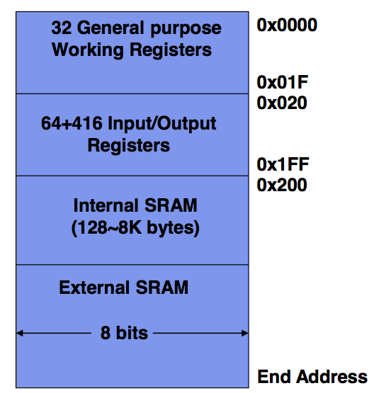

**Program Memory Space**

This includes 16 bit flash memory which is read only. Here the 
instructions are stored. it's non-volatile, which means at sudden power
cuts the data in this is retained. 

If you know what you are doing you _CAN_ access these through lpm and spm. 

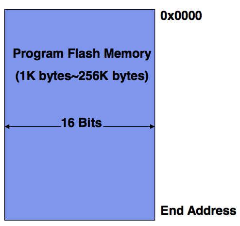

**EEPROM Memory Space**

8-bit EEPROM memory is sued to store large data sets permanently. 
not covered in this course. (but can be loaded and set to)

##AVR Instruction Format
most instructions are 1 word long, although a select few are 2 words long 
such as lds (load from data space) which reads 1 byte from SRAM and thus needs to be able to 
take in larger addresses (0 - 65535)

example of a 16 bit command is add `0001 01rd dddd rrrr`
the last 6 bits (read from right to left) are the op code, the r is the register to read in from 
and the d is the destination. they each take up their own nibble (4 bits) but because we need 32 possible values
we chuck in the last 2 bits on the remaining 2 bits. hence the weird 01rd. the reason this happens is because they want to keep the destination near the middle so it matches somewhat the ldi encoding hence the r has to split. 

example of a 32 bit command is jmp `1001 010k kkkk 110k kkkk kkkk kkkk kkkk` jump will look at the k ADDRESS and jump to that place. often we use labels to refer to some address and use that here (discussed more in addressing) so we don't have to memoruse long ass addresses. note k can be 0 to 4 megabytes which is the theoretical maximum address but realistically we use values much more close to the lower end. 

PC is program counter. jmp sets it to k. PC <-- k. this is slow and takes 3 clock cycles. 

so there are also commands like `breq k` which is branch if equal. takes a address to jump to, but can only jump 64 up or 64 down from the current PC. as this takes up 7 bits we can fit the whole isntruction into 1 word. it will check the last comparison done and if it was true, it will branch else do nothing and progress the commands. 
Remember the Z flag, it is set if the result of the last command was 0. Because comparisons just subtract two numbers, if a comparison or really subtraction results in 0, Z will be set to 1, and the two elements are equal. 
if Z=1 PC <-- PC+k+1 else PC <-- PC+1
note it takes 1 clock cycle if it's false but 2 if it needs to branch(jump). 
`11100kkkkkkk001`
the weird order is basically random.

AVR has a couple of classes of instructions, things like arithmetic and logic, logic being things such as AND, it also has data transfer instructions, program control instructions (jump, skips, subroutine etc.) and good old bit operations. 
there are also other instructions like sleep or nop. Nop is no operation, just a empty cycle of the processor. 
##AVR Addressing modes 

there are 3 main ways AVR refers to addresses. 

**Immediate Addressing**

this is when the operands come FROM the instruction call itself.
You immediately give the instruction what it needs. 

if you wanted to clear the last 4 bits of r16 you would say
`andi r16, 0x0F` also note that a 4 bit block can be call a nibble.
here we are clearing the upper nibble. (it's an AND operation)

**Register Direct Addressing**

when the operands come from general purpose registers or IO registers. 

`add r16, r0` or `in r25, PINA`

note the in command takes the signal from pin A and puts it in r25. 

**Data Memory Addressing**

there are multiple types of data memory addressing shown below

1. data direct addressing, the address of the memory needed is given
	* `lds r5, 0xF123`
2. indirect addressing, the address is referred to by a address pointer, such as the previously mentioned X Y or Z
	* `ld r11, X`
3. indirect addressing with displacement, just taking a address pointer and shifting it over
	* `std Y+10, r14`
4. indirect addressing with pre-decrement, The data memory address is from an address pointer (X, Y, Z) and the value of the pointer is auto-decreased before each memory access. basically reduce/increase y by 1 permanently, then access the new y address. 
	* `std -Y, r14`
5. indirect addressing with post-decrement, same as above but the value is increased _AFTER_ the memory is used

**Program Memory Addressing**

Similarly, there are multiple types of program memory addressing

1. Direct Program Addressing- the instruction has the address within it
	* `jmp` PC <-- k
2. Relative Program Addressing - the instruction has a k encoded that is added to the current PC.
	* `rjmp k` PC <-- PC + k + 1
	* note rjump is quicker and smaller hence we use it
	* jmp is mostly used for jumping far away (larger programs)
3. Indirect Memory Addressing - the instruction address is implicity stored in Z register (X Y Z)
	* `icall` this takes whatever is in the Z register and jumps there. 
	* allows for runtime decisions of where to jump (rarely used)
4. Program Memory Constant Addressing, the address of the constant is stored in Z register. a constant is something which we won't change, like the name of the program. 
	* `lpm r16, Z` r16 <-- Z
5. Program Memory Addressing with post-increment - increments z after it reads in 
	* `lpm r16, Z+`

## Control Structures 

### Conditional 

| Command | Function | Words | Cycles | Example/Notes |
|---|---|---|---|---|
|cp Rd, Rr| Rd-Rr  | 1 | 1 | (compare) cp r4, r5 will set the Z flag then breq noteq (branch to noteq label) ... noteq: nop //do nothing at branch|
|cpi Rd, k | Rd - k |1 | 1|  (compare with immediate) |
|brge k | If Rd >= Rr (N XOR V=0) jump up or down by k (k can be +64 or -64) |1 | 1 if false, 2 if true | conditional branch |
|rjmp k| PC <-- PC+1+k, k can be -+ 2M | 1| 2 | relative jump |

`.def` allows you to define labels, the below codes are the same

```
if (a < 0)
	b = 1;
else
	b = -1;
```

```
.def a = r16
cpi a, 0            // a-0, result is a, compare with immediate
brge ELSE           // branch if greater then
ldi b, 1            // b = 1
rjmp END            // end of IF STATEMENT
ELSE: ldi b, -1     // b = -1
END: ...            // other code

```
note we also have brsh and brlo which are the same as brge and brlt but unsigned. 
cpi does it both ways and it's flags will help you figure out how you want to interpert it
also note here that the rjmp will take the label and calcualte the offset FOR YOU and hence tell u if it is out of the range

### Loops

lets add i^2 n times
```
.def i = r16
.def n = r17
.def sum = r18

ldi i, 1          // initialize
clr sum           // clear sum
loop:
	cp n, i       // compare n and i
	brlo end      // branch if less than (unsigned)
	mul i, i      // square
	add sum, r0   // add to the sum (assuming 8 bit result)
	inc i         // increment i by 1
	rjmp loop     // restart loop
end:
	rjmp end      // loop over and over again as there is no halt
```


## Commands
note: In AVR a *word* is a 16 bit value

| Command      | Function | Words | Cycles | Comments       |
|--------------|----------|-------|--------|----------------|
| `sub Rd, Rr` | Rd - Rr  | 1     |      1 | Subtraction without carry |
| `mul Rd, Rr` | Rd*Rr    | 1     |      2 | Multiply two 8 bit values, the resulting 16 bit value is stored in `r1:r0`. If bit 15 is `1`, the carry flag will be set, but does not indicate an overflow.| 
| `ldi Rd, k` | Rd <- k | 1 | 1| Load register `d` with value in address `k` |
| `mov Rd, Rr` | Rd <- Rr | 1| 1| Copy value in register `r` into `d` |
| `add Rd, Rr` | Rd + Rr | 1| 1| Addition without carry |
##Example

To calculate `z = 2x - xy - x^2`, first we load our values, then we calculate the expression step by step (remember the order of operations).

Note: Because we are using `mul` at some point, we will get a 16 bit value, however, for the purpose of this example, we are assuming the answer will be 8 bits at the greatest. 

Assuming `x`, `y` and `z` are stored in `r2`, `r3` and `r4` (`r0` and `r1` are used by `mul`)

```
ldi r16, 2      		r16 <- 2;		// r16 because we are guaranteed all instructions will work
mul r16, r2     		x*2;
mov r5, r0      		r5 <- x*2;
mul r2, r3      		y * x;
sub r5, r0      		r5 <- 2x - y*x;
mul r2, r2      		x*x;
sub r5, r0      		r5 <- 2x-y*x - x^2;
mov r4, r5      		finish;
```

Note: using `mul` uses 2 cycles, so it is preferable that we minimise the amount of times we multiply two numbers. From the expression above, we can see that we can factor the `x` out.

## Assembly Program Structure

Comments can only be single lined, and must start with ';'.

### Assembler Directives


Below is a list of some assembler directives (instructions for the assembler, rather than actual instructions meant for the program). It is also useful to note that all AVR instructions and directives are case **insensitive**.

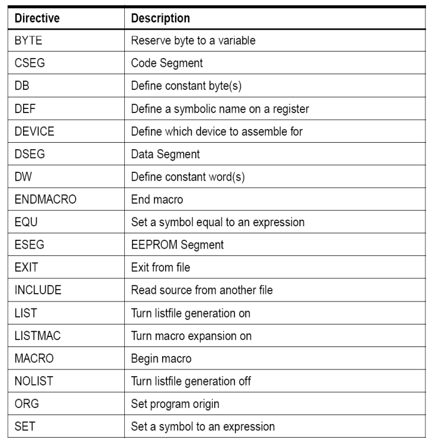

`.equ` is similar to #define, creates a constant, unredefinable. 
`.set` is a variable, it can be redefined
`.def` Define an alias for a register
`.dw ` Define word. 
`[name]:` a short-hand label for an address

Memory segment directives specify which memory segment to use and once set all commands afterwards will use the specified segment unless a new memory directive is specified. 
	* `.dseg`
		* Data segment
	* `.cseg`
		* Code segment (note: everything in cseg is 16 bits long)
	* `.eseg`
		* EEPROM segment

the `.org` directive specifies the start address
to store the related program/data. Small example

```
.dseg ; Start data segment                ; Default segment is .cseg
vartab: .byte 4 ; Reserve 4 bytes in SRAM ; (Will be at 0x200 on the atmega2560)
.cseg ; Start code segment                ; default start location is 0x0000
const: .dw 10, 0x10, 0b10, -1             ; Write 10, 16, 2, -1 in 
										  ; program memory, each value takes 2 bytes.
mov r1,r0                                 ; Do something

```

### Converting from c to assembler

ORIGINAL C
```
int a;
unsigned int b;
char c;
char* d;
```

CONVERTED
```
.dseg    	;data segment
a: .byte 2 
b: .byte 2
c: .byte 1
d: .byte 2  ;a pointrt is 16 bits. 
```

ORIGINAL C
```
int a;
const char b[] = "COMP2121";
const int c = 2121;
```

CONVERTED
```
.dseg
a: .byte 4

.cseg
b: .db "COMP2121", '/0'  ; multiple words
c: .dw 2121              ; just 1 plz

```

ORIGINAL
```
struct STUDENT_RECORD
{
 int student_ID;
 char name[20];
 char WAM;
};

typedef struct STUDENT_RECORD *student;

student s1 = {12345, "john smith", 75};
student s2;
```

CONVERTED
```
.equ student_ID = 0
.equ name = student_ID + 2
.equ WAM = name + 20
.equ STUDENT_RECORD_SIZE = WAM + 1

.cseg
s1_value: .dw 12345
		  .db ‚John Smith‛,0,0,0,0,0,0,0,0,0,0
		  .db 75

.dseg
s1: .byte STUDENT_RECORD_SIZE
s2: .byte STUDENT_RECORD_SIZE
```
note the .byte prob just stored these withing SRAM (registers) cause there arn't many and they will prob be used and discarded quick 
note static global variabels are always present during the lifetime of the program. 
note there is no system for handleing a stack overflow or heap stack collision. make sure you don't make that happen
note with structs all we do is store all the bytes in a line and keep track of where one section (like a int) ends and the next starts. 
note The constant values for initialization are stored in the program memory in order to keep the values when power is off.

Low(expression) will evlauate the expressiona nd takes the low byte. high will do the opposite. 
note bitshfiting works identically to c

note cpc is compare with carry which will compare two numbers taking into account the previous comparision. 
note that any memory in the program memory is there and constant, you can't really write to data memory and expect it to be there, it will get wiped. you also can't write to it before you start running the program, i.e you can't initialise it. 

note `ldm` is load form memory and will load from program memory but you have to give it the address in Z. it requires this tbh. 

### Macros

Allows you to set up some assembly code that you can reuse by a label. 
this is always inline, the code is copy pasted where you use the macro
you use these via the tags `.marco` and `.endmacro`. you can also give it a name and pass paramters which are references within the code via @1 @2 etc. you can then pass these in with `myMacro 1, 4, 6`

here is a swap macro that swaps memory addresses. 

```
.macro swap2
	lds r2, @0 ; load data from provided
	lds r3, @1 ; two locations
	sts @1, r2 ; interchange the data and
	sts @0, r3 ; store data back
.endmacro
swap2 a, b ; a is @0, b is @1
swap2 c, d ; c is @0, d is @1
```
### Using program memory
lets convert the following C code into some assembly
```
struct STUDENT_RECORD
{
int student_ID; char name[20]; char WAM;
};
typedef struct STUDENT_RECORD *student;
student s1 = {12345, "John Smith", 75};
```
ok so because byte addresses are double word addresses, we have to multiply a word address by 2. try to map out memory, 0 1 2 .. starting at every 16 bit word and then another set of addresses that go for every 8 bit byte, you'll to to convert between them you multiply by new
once you got the start of the word in bytes, just add one to get the one after. 
ZH is the higher byte and ZL is the lower byte

first the dseg stuff to create the data
```
.dseg
s1: .byte STUDENT_RECORD_SIZE
```
then we do some basic and code segment

```
.set student_ID = 0
.set name = student_ID + 2
.set WAM = name + 20
.set STUDENT_RECORD_SIZE = WAM + 1

.cseg rjmp start                  ; jump over data definitions

s1_value: 
	.dw HWRD(12345)
	.db "John Smith‚,0,0,0,0,0,0,0,0,0,0
	.db 75

start: 
	ldi ZH, high(s1_value<<1)     ; pointer to student initial memory
	ldi ZL, low(s1_value<<1)
	ldi YH, high(s1)              ; pointer to actual memory
	ldi YL, low(s1)
	clr r16                       ; clear register 16
load:
    cpi r16, STUDENT_RECORD_SIZE
    brge end 
	lpm r10, z+ 
	st y+, r10
	inc r16
	rjmp load
end:
	rjmp end

```
note that program memory is word addressed and ram addresses / data addresses is byte. 
note HWRD is high word, gets the high bytes. 

### Assembly
the code we write has to be converted to machine code and this is done by the assembler. there are two passes here

1. in pass one syntax and lexical errors and checked, all symboled are noted to exist, macros calls are expanded
2. use the symbol table to make sure everything is defined and fill in whatever is left, generate the actual machine code. 

there are two types of assembly
* Absolute Assembly
	* Can only be used for the source file that contains all the source code of the program
	* Programmers must use .org to tell the assembler the starting address of a segment
	* Whenever any change is made in the source program, all code must be assembled.
	* a loader loads a exectuable machine code file onto the target system
* Relocatable Assembly
	* Each source file can be assembled separately
	* Each file is assembled into an object file where some addresses may not be resolved
	* A linker program is needed to resolve all unresolved addresses and make all object files into a single executable file

### Numbering
#### Overview
* Sometimes it is easier to convert a big number to octal and then to binary, then straight to binary. 
* Binary multiplication is like normal multiplication, remember to add in the zeros per line. 
* In n-digit binary arithmetic, 2’s complement of b is b* = 2n – b
* This allows us to avoid subtraction. a - b = a + (-b) = a + b*
* with 2's compliment we have a sign bit and because of overflow it works quite nicely. 
* `0001 + 1001` = `1 + -1` = `0000` = `0`
* to convert a number into it's compliment we take the binary, swap the bits, and add 1
#### Overflow
* a quick way to see if overflow occured is to see if the carry into the high bit in the addition of two numbers is = to the carry out. if they arn't overflow happened. see below
```
1<0<0<0<
  1 0 0 0
  1 1 1 1
  --------
  0 1 1 1
```
* at the top right we have the carry out and next to that we have that carry in. we didn't carry in a 1 to trigger the binary calculation to export a 1, and yet it did it. only reason is if the final bit was a 1 1 calculation meaning we have 2 negative numbers adding together to give us a postive number. OVERFLOW

#### Floating Point (IEEE 754 FP standard)
* we represent floating point numbers with 3 peice of info
	* the sign
	* the significant
	* the exponent
* a 32 bit floating point number looks like this
	* `S EEEEEEEE 1NNNNNNNNNNNNNNNNNNNNNNN`
* S is the sign, E is the expondent and N is the number
* the first number in N is always 1, there is no reason for it to be 0 cause 01 is just 1. 
* E is some number from -127 to 126 to represent very small and very large numbers. there is no sign bit here just whatever number is read in (0-255) is subtracted from 127. the 127 is called bias. 
* `20.6` = `10100.110` = 1.0100110 × 2^4 = 0 00000100 0100110
* there are a whole bunch of special cases with this though
	* If E = 255 and F is nonzero, then V=NaN ("Not a number")
	* If E = 255 and F is zero and S is 1, then V= -Infinity
	* If E = 255 and F is zero and S is 0, then V= Infinity
	* If E = 0 and F is nonzero, then V=(-1) S * 2^-126 * 0.F. These are unnormalized numbers or subnormal numbers.
		* this comes from the fact that there are some numbers which are bigger than zero, but smaller than 1.0 × 2^min. Those numbers are the subnormals or denormals.
		* the smallest non 0 F is 1.0 and the smallest exponent is -127. 
		* so we define that if E=0 and F is nonzero we switch to 0.F to display these subnormal numbers.
		*  Subnormal numbers reduce the chance of underflow. Without subnormal numbers, the smallest positive number is 2^ –127 but With subnormal numbers, the smallest positive number is 0.00000000000000000000001 *2^-126 =2^-149
	* If E = 0 and F is 0 and S is 1, then V=-0
	* If E = 0 and F is 0 and S is 0, then V=0
#### other encoding
* you can have binary mean different things in many contextx
* some systems count up decimal by the gray system, which is where adding 1 to the number only produces 1 bit change. so 0001 doesn't mean 1 anymore, there is a new mapping. this is great when you have two chips exchanging information and if one incremeints from 1 to 2 which changes 2 bits and the other goes from 0 to 1 which is 1 bit that they don't out of sync. 
* ASCII stands for american standard code for information interchange 
* for ASCII null is 0
* to encode strings you can either have the first byte encode the length, OR have the last charecter is null OR send the string with a accompanying variable etc. 

# Stacks
## Introduction

[[ PROTIP: most of this is very confusing, read through but keep in mind the example helps the most ]]

What is stack?
* A data structure in which the data item that is Last In is First Out (LIFO)
* In AVR, a stack is implemented as a block of consecutive bytes in the SRAM memory
* A stack has at least two members:
	* Bottom
	* Stack pointer
* The stack usually grows from higher addresses to lower addresses
* in AVR, `0x0200` is the lowest address for the stack, stack bottom >=`0x0200`
* there is a built in stack pointer (SP) in `m2560def.inc` that is defaulted to `0x00000`
* its an IO register pair, SPH:SPL (as in not a register you have but on in the IO section)
* it can point to different things but in avr it points to the next free element that you can write to on the stack

## Pushing and popping
* To push onto the stack we use `push Rr` which puts the contents of Rr into SP and decrements SP (as the stack grows towards the lower addresses)
* pop does the opposite, `pop Rd`, puts the top element in Rd and increments SP by one
* Stacks are incredibly useful for freeing up registers during function calls.

## Functions
* The function being called is defined as the `callee` and the instruction calling it is the `caller`
* Functions are nothing more than special labels, and are called with `rcall [function]`. When you `rcall`, the current program counter is stored on the stack, and we jump to wherever the function was defined at. Once the function finished (we finish with a `ret`), we pop off the stack, and edit the current program counter to the one stored on the stack.
* You can pass in variables either by address, or by value.
* It's good to note that when you call a function, 3 pushes are made to store the program counter. Popping off more times than you push will corrupt the saved program counter, and you will not be able to jump back to the correct place in the program.
* to pass the values and have returns we have a conversion that we pass them in via specific registers and take them back.
* There is no specified method to return values from functions. Instead, we specify a particular register as a 'return register', and ensure that we use that throughout the program. 
* The pattern for making function calls:
	* Caller: make sure the callee has the paramters by storing them on the stack
		* move SP and SFP up a bit so we have space to put in paramaters and stuff. 
	* Call: use `rcall` or `call` to call the function, which is similiar to 'rjmp' and 'jmp', but store the program counter on the stack.
		* `icall` also works and is indirect call, this will call a function from a address dynamically, a function you haven't defined, like function pointers in c
		* `rcall` sets the return address for you and jumps to the code. (manual is useful)
		* Inside the function, push on all registers that you plan to use.
	* Return:
		* Return the value in your specified 'return register'
		* Adjust stack pointer to deallocate frame
		* Pop off conflict registers in the opposite order that you pushed them on.
		* End the function by calling `ret`

### Register conflicts and stack frames
* With only 32 registers (16 of them only useful for a large majority of functions), there will be some clash when executing functions.
* The way to deal with register conflict is to use the stack to store any original values, before using the registers.
* WINAVR is a C compiler to AVR. it makes the callee save conflict registers. it can be the caller responsbility as well. 
* WINAVR uses R8~28 to store actual values and these are then shifted to the stack to free up those registers for general use 
* the return registers are set aside (in WINAVR it's 24-25)
* you can also write to a specific peice of data memory but you don't want to do that because if you call a function recursivly it will edit the same data. 
* the stack frame is a set of EXTRA data on the stack associated with some function. What we can do is manually increment the stack pointer up a bit to allocate more memory to our stack for the current function.
* the stack frame pointer is not the stack pointer. the stack pointer points to the next available peice of memory where as the stack frame pointer is beneath that so we can get at the stack frame contents. In this we may store things as a convient temp memory section
	* return address
	* conflict registers
	* paramters and local variables
* note the stack frame pointer is stored in some registers, so is usually a conflict register (Y in WINAVR)
* note the stack frame pointer isbelow the stack frame so any function you call has access to the callee stack frame and hence paramaters put in there. 
* note that when storing values into data you should use push and pop, but if you are doing it yourself you should do it in reverse sometimes, this is because calculating values in reverse order is faster sometimes. (i honestly have no fucken idea what daniel is on about here)
* WINAVR reads it in reverse. winavr also uses Y for the stack frame pointer. 


* In the above diagram, `main` calls a function called `foo`
* Note, the stack grows downwards (i.e from higher addresses to lower addresses). This is because internally, the stack uses an instruction called `LDD`, which can only increase the stack pointer by 0-63. (Not entirely sure this makes sense, because when you push onto the stack, you decrease the stack pointer. What drugs are you on Zain?)

### Example

sample C code
```
// int parameters b & e,
// returns an integer
unsigned int pow(unsigned int b, unsigned int e) {
	unsigned int i, p;      // local variables
	p = 1;
	for (i = 0; i < e; i++) // p = be
	       p = p*b;
	return p;               // return value of the function
}

int main(void) {
       unsigned int m, n;
	m = 2;
	n = 3;
	m = pow(m, n);
	return 0;
}
```
Stack frame after running the above code:

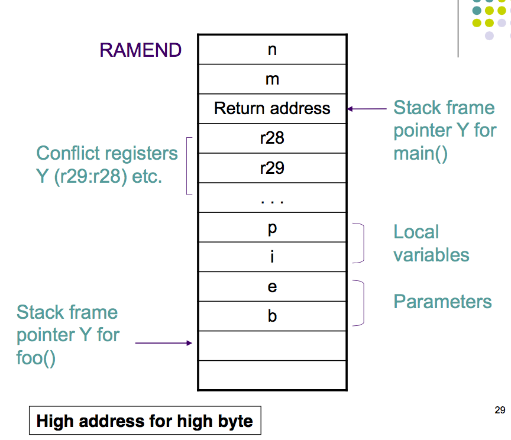

We store our parameters in data memory, rather than on the stack (just a coincidence that the stack is stored in the same place as out data memory). We then make the call to the function (note that the return address is pushed onto the stack). We then push on the conflict registers, and our function does what it needs to do. It's parameters are passed in via registers, and it is pushed onto the stack before working with them.


AVR Assembly Code:

```
.include "m2560def.inc"
.def zero = r15 ; To store constant value 0, useful to have r15 be set as zero register

; Multiplication of two 2-byte unsigned numbers with a 2-byte result.
; All parameters are registers, @5:@4 should be in the form: rd+1:rd,
; where d is the even number, and they are not r1 and r0.
; operation: (@5:@4) = (@1:@0) * (@3:@2)
; i skip the actual caluclations in this example, as it is irrelevent
; still a good example of how to write a macro though

.macro mul2
	mul @0, @2
    movw  @5:@4, r1:r0
    mul   @1, @2
    add   @5, r0
    mul   @0, @3
	add @5, r0
.endmacro

main:
ldi YL, low(RAMEND-4)    ; this block just moves the stack pointer down 4 so we can use dseg
ldi YH, high(RAMEND-4)   ; to hold some normal values before it becomes the stack
out SPH, YH
out SPL, YL

ldi r24, low(2)          ; m = 2
ldi r25, high(2)
std Y+1, r24
std Y+2, r25

ldi r24, low(3)          ; n = 3
ldi r25, high(3)
std Y+3, r24
std Y+4, r25

						 ; main function start()
ldd r20, Y+3             ; load m and n into the stack
ldd r21, Y+4
ldd r22, Y+1
ldd r23, Y+2 
rcall pow                ; run function
std Y+1, r24             ; process return value (return value stored into m)
std Y+2, r25
end:					 ; end of main function
	rjmp end

pow:					 ; pow start
	push YL              ; conflict registers
	push YH
	push r16
	push r17
	push r18 
	push r19
	push zero
	in YL, SPL           ; override y with the stack pointer so we can work with it
	in YH, SPH           ; we read it in via in because it's a IO register
	sbiw Y, 8            ; subtract immediate from word, allows us to shift the stack pointer
	
	out SPH, YH          ; update stack pointer with new value
    out SPL, YL

    std Y+1, r22         ; pass m to b (m is given via registers, b is in stack)
	std Y+2, r23
	std Y+3, r20         ; pass n to e (n is given via registers, e is in stack)
	std Y+4, r21

	; REST OF ACTUAL CALUCLATIONS (where mul2 would be used) ;

	ldd r25, Y+8 		 ; return p to the registers that are supposted to hold the return val
	ldd r24, Y+7
	adiw Y, 8            ; deallocate stack frame
	out SPH, YH
	out SPL, YL
	pop zero             ; return conflict
	pop r19
	pop r18
	pop r17
	pop r16
	pop YH
	pop YL
	ret                  ; jump back to main

```

*Note: AVR does not have add immediate instructions (addi, addci) ; but it can be done by subtracting a negative immediate.*

## Call Trees
Call trees outline how our program calls functions so we can calculate the maximum stack space it will use. 

To calculate the max stack space required, draw out the tree, and count up the weights.

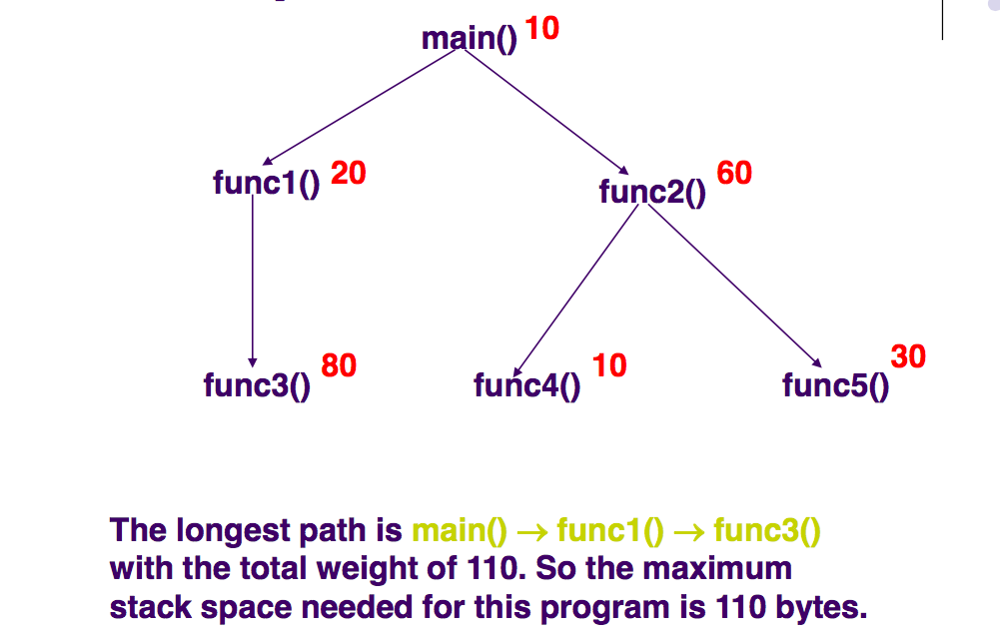

# Buses and IO
Computers have 5 main components split into 2 catagories
	* Computer
		* Control (brain)
		* Memory (passive memory where programs live)
		* Datapath (actual calculation systems)
	* Devices
		* Input
		* Output (including to disks or other data storage)
## Buses
A collection of wires through which data is transmitted from one of sources to destinations

All buses consist of 3 parts:
* Data bus
	* The actual data being transmitted
* Address bus 
	* Where to go
* Control bus
	* Control info

And are usually defined by two values:

* Bus width
	* How much data is transfered in one cycle (16, 32, 64)
* Clock speed
	* how many cycles can occur in a second

The typical bus looks like this, it can be read from or written to for data, only written to via the cpu in the address stream and can only be read form the address stream from that point on. 
Control is bidirectional too, sometimes memory needs to tell the bus that it's done reading memory or if it error'ed etc

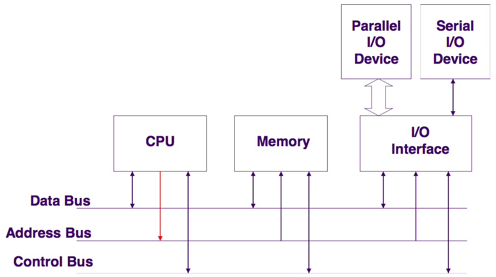

### CPU / Computer Buses

The reason the address bus arrow is uni directional is because usually only the cpu knows the addresses of where the data is supposed to go. 

A bus can have many sources and destinations but it only transfers from one source to one destination at any one time

### Input Interface

Often implemented with three-state buffers for data buses. This gives us the option to 0, 1 or to not drive the bus at all, which is different. This lets us choose if we want to actually drive it or not. (note one of the 3 buffers is output)

* For example,
	* a parallel, eight-bit input data is connected to eight three-state gates whose enable lines are tied together
	* When the data is to sent to the bus the eight three- state gates are enabled.
* The open-collector gate is often used for control signals such as request for interrupts.
	* A pull up resistor is used for setting a default voltage if the bus is not being talked to
	* The open collector makes sure that either there is no drive or all buses are being driven at the same voltage, not different voltages. 
* note that when there is no drive on a wire there is still a ambient voltage due to static electicity and stuff, so a on switch can stay like that even when there is no drive. 
* a pull up resistor takes away this and drives up the value to 1 (which is the no drive signal, yeah weird) you can swap these in software, the reasn we do this is just hardware
* We can actually turn a pull up a resistor in the avr chip on and off!! it's pree cool. When you write a 1 to the port when it is configered as input, you trigger the pull up resistor. if you give any 0 in the byte you write it is registered as a turn off. 

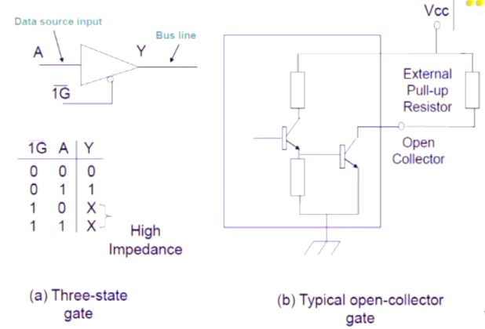

## Output Interface

The clock signal is a square wave, and on the rising (or falling) edge, it will trigger the latch, save the incoming data from the data bus, and save it in the output device.

*Note: You don't have to know what a latch in a technical sense, but it is a small circuit that allows us to store a bit of data, and can only be changed on the rising or falling edge of the clock.*

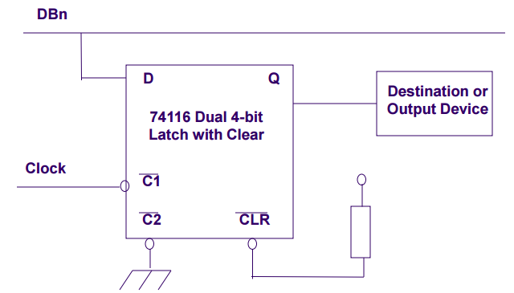

## Address Decoding

* To determine what device we send a particular signal to, we use an address decoder. We take in a certain number of address bits given by the CPU, and the decode outputs every single combination of those bits. From those outputs, we choose the one we want. Remember, the number of outputs in a decoder is 2^{Inputs}.

To create more complex address combinations, we simply use more decoders.

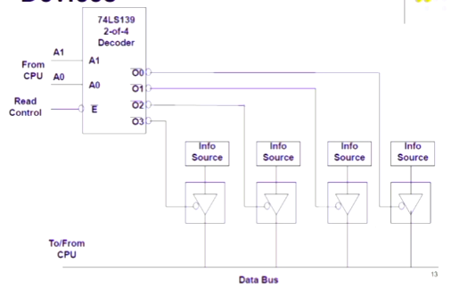

* Output is a tad bit different, but it decides on which of the dual 40-bit latches will read from the bus.

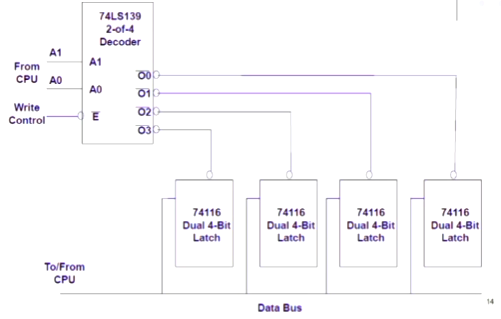

## CPU Timing Signals

* The CPU holds responsibility on providing timing and syncronisation, so multiple devices can work together without clashing.
* Usually we have a signal for read and write, if read is 0 we read if it is 1 we don't. This is why we say READ conjugate, with a line on top.
* IO devices may have a seperate IO clock
* Note below how when the CPU clock goes from high to low the address bus triggers, at the low to high switch the Data bus is driven and data is taken off of it and it triggers the READ control signal so other devices know that something is being read, it also indicates that data can be read and it valid. after this turns off data can't be read validly.

Our devices will use the READ signal to start reading, it signals that the data bus can be read for. 

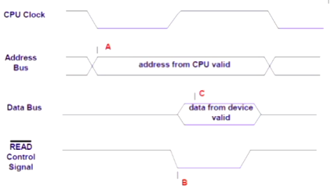

* A write cycle is identical but we trigger the WRITE signal
* Usually we have a complete IO interface so we can write and read form a set of addresses.

## IO Addressing

* If the same address bus is used for both memory and IO how do you know the difference between 0 in memory and 0 in sram or something
* If we use the same address bus for both memeory and IO, we need to determine a way so that it doesn't clash, and we have two approaches for that:
	* Memory Mapped IO
		* Using normal `ld` and store instuctions but depending on the address the instructions are intercepted and moved to the relevent IO (because we have mapped all IO to have a unique address)
		* Simpler CPU design, so special instuctions code can be reused from memory to IO, but it reduces the amount of avilable memory spaces available for application programs 
		* You also need to have address decoder to avoid conflict with memory address, it makes sure the address is valid for IO
	* Seperate IO
		* A complete different set of instructions to work with IO
		* Completly different address space, 0 here is diffrent to 0 for LDR. 
		* Simpiler circuit but extra control signal (rather then read and write)
		* Sometimes having a seperate command allows you to make it faster as IO have different structures then sram
* AVR does both
* In AVR 480 IO registers are mapped into memory space 0x0020 ~ 0x01FF (1 byte each)

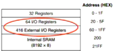

* As mentioned before, AVR does both, so the first 64 IO registers can be addressed seperately, and thus can only be accessed using `in` and `out`. After this, you are free to use `lds` and `sts`.
* Note that the 64 IO registers are after the general registers, so it is actually addressed (internally) from 32-96. However when we access it using `in` or `out`, AVR will add 32 to our given value.
* `lds` and `sts` though use the actual address.  

## IO Synchronization

* The CPU is typically much faster then IO devices, to fix this we can do it in two ways (or a mix of the two ways):
	* Software Synchronization (usually less efficient then hardware but still good)
		* Real time
			* Makes the code or processor waits for a certain number of cycles before continuing, for short delays this is awesome, efficient, but you need to know exactly what the delay is.
			* this doesn't work as efficently for a longer times (thousands or hundreds of thousands of cycles)
			* this also means the cpu does nothing while it waits, this means no buttons are being registered, no display is being updated, it just waits.
		* Polling IO
			* a status register with a DATA_READY bit is added to the device, the software keeps reading the status register untill the bit switches to 1. 
			* You just check the register every so often untill it is turned on, you can do other stuff while you wait. 
			* you still are wasting some cpu time checking it
			* also if you don't poll it often enough, data can fill up a buffer and then any more data that tried to be added can be lost. 
	* Hardware synchronization
		* Handshaking IO
			* There is a control signal which is either READY or WAIT, an input device when asked for data can ask the cpu to just chill the fuck out for a while
			* for an output device the same thing can happen if it's not ready
			* the IO just asserts and then deasserts the WAIT. 
			* great for short delays, but still has the cpu hanging
			* handles variable delays! the delay can be however long, but we want it short
		* there are also other types we don't discuss

 ## Parallel Input/Output AVR

 * Note: There is no Port I on our board.
 * Serial ports communicate by sending a single bit at a time, whilst parallel ports send multiple bits simultaneously.
 * Depending on software configuration, AVR ports can be used for both input and output
 * We have 3 IO memory addresses in data memory, each controlling a different IO piece
 	* PORTx 
 		* what we write to when trying to give output
 	* DDRx
 		* the direction (input or output) of a port
 	* PINx
 		* reading input from a port
 * To set a port as input or output, we set it using a number X, where the first 4 bits determine output, and the last 4 bits determine input.
 * `in` and `out` lets us read and write to these ports (only needs to be done initially)
 	* remember these only work on the first 64 IO register
 * Note that if we set a port to input or output, it may take some time before we are able to read from it (normally 1-2 cycles). This is why in the Keypad Lab, we wait a certain amount after configuration.
 * To write to an input pin, we trigger the pull up resistor. Writing to PORTx when the pin is designated as an input allows us to trigger it.
 * Note that some code is off by a couple of cycles for a wait, and that's fine as if you are measuring seconds you can have a bit of leeway
 * Note `sbis` skips the next instuction if the given variable's certain bit is set
 	* `sbis PINB, 0` will skip the next instruction if the bit 0 is set
 * `cbi` clears a single bit in a io register (only works on first 32 IO registers)
 	* `cbi DDRB, 0` clears bit 0 of DDRB (sets bit 0 as input)

# Interrupts

Interrupts are a way for the chip to do a certain routine at a certain frequency. When an interupt is called, the current program counter is stored on the stack, and we jump to the interrupt. To finish our interrupt, we call `reti`, which is similiar to `ret` although it sets the interrupt flag (more on this later).

There are two ways to interrupt:

* Polling
	* Easy, no hardware needed, but very inefficient
* Interrupts
	* Add extra signals between CPU and IO devices, hardware change, but way mroe efficient. 
	* This does have issues that the code can stop at any point when a interupt hits
	* This is why when we use interrupts we usually try and reset the universal flag byte to what it was before the interupt ran
with interupts there can be synchronus (DO THIS NOW) or asynchronus(do this at a specified time if it is still needed). There can also be multiple interupts at once which means we need to decide which one to do first. 

Usually a interrupt goes like this
	* finish current instruction
	* ackknowledge the interrupt device, let the device know it's doing it and to shut up
	* branch to the correct interrupt service routine, each interrupt has a special address where it runs code whenever it is triggered
	* go back to where it was wherever. 
This happens in hardware as shown below

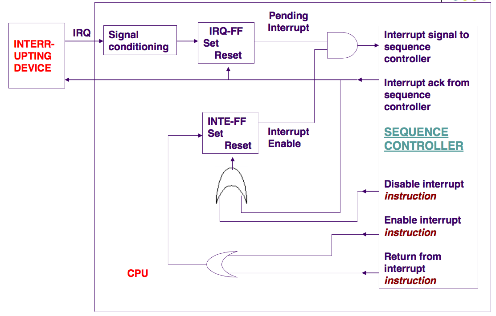

Note: Interrupts are activated using a global interrupt flag (INTE-FF Interrupt Enable Flip-Flop), and it is off be default. This is because before an interrupt is ever called, we need to do some configuration, such as initialising the stack. If an interrupt is called during inital configuration, it will cause undefined behaviour, so we turn on global interrupts after initialisaion. This flag is also set to 0 when an interrupt is called. This is to prevent interrupts from interrupting other interrupts, which may result in an infinite number of interrupt calls. After the interrupt is finished, we call `reti` which is just a `sei` and a `ret`.

When the INTE-FF is set (by the return from interrupt processes), all interrupts are enabled and the pending interrupt is allowed through the AND gate to the sequence controller.

Furthermore it is important to signal the device that we have acknoledged it so it knows it can send another interupt if needed.

Interrupt Request Flip-Flop (IRQ-FF) records the interrupt request until it is acknowledged.
* When IRQ-FF is set, it generates a pending interrupt signal that goes towards the Sequence Controller.
* IRQ-FF is reset when CPU acknowledges the interrupt. 

## Multiple Sources of Interupts
main two steps
* Idenify who generated the IRQ
	* We can do this via **polling**, ask every device if it was the one, requires no extra hardware. This is done as every device has a associated "i did it" bit, when you read this bit it is reset to 0, as you have acknoldged that it did it (it also clears the IRQ). this is ok but awful a lot of interupts cause you have to search each one, also some interupts can trigger as we are searching. BUT if we check the device in the priority we care about them, and just do the first device that had it's bit set, we as a side result set up a prioirty system. if there are multiple interupts the one's we care about the most are dealt with first. 
	* we can also do **vectoring**, which is the one that avr uses, every interupt has a assoicated address which you just jump to. Each interupt carries info about what device it came from, the cpu then has a table of where to jump for each interupt. There isn't much memory here, usually it's just to hold a jump instruction to some actual peice of code you've set up in your main cseg. the extra harware here is a peice that takes in a input from the CPU (so it knows it's being acknoledged) to reset itseld, rather then doing it when it is read. 
* Resolve simultaneous interrupt requests
	* we just use prioritization, this can be done via software or hardware
	* sofware
		* poll though and decide via a selection algorithm
	* hardware
		* daisy chain method. here the cpu sends the intA singal (the i have ackloedged you signal) down from device to device, here the devices most important are closer to the cpu physically. once it hits a device that actually generated a IRQ, we store the address of it's interupt code on the data bus, and stop seding the irq down. this means any lower priority devices with a IRQ still have their IRQ working and blinking, so they can be returned to after the higher priority stuff is done. remember with hardware level the INTA signal needs to go for it to be reset, it's not set when read. (this is what avr does)
		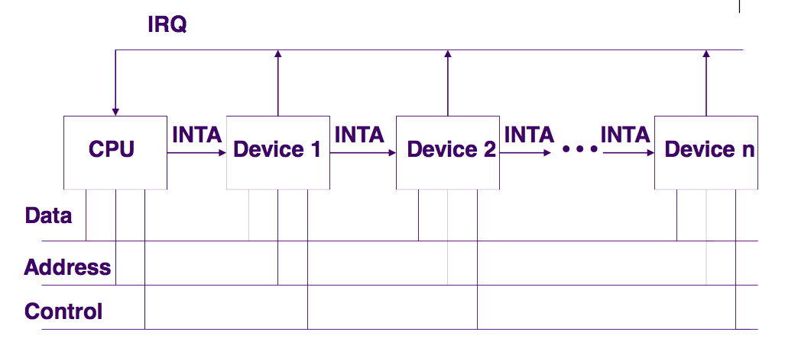
	* There are also other solutons
		* Separate IRQ Lines
			* each IRQ line is assigned a fixed prioirty.
			* usually lower level lies like IRQ0 are higher priority.
		* Hiearchical Prioritization (a mix of software and hardware)
			* higher prioirty inturrupts are allowed through the mask (talked about below) while lower ones are blocked.
			* this is done by software using the hardware masking service. 
		* Nonmaskable Interrupts
			* these are interrupts that can never be turned off
			* usually used for important events like a power failure, the power button or emergency stop buttons must always be done, always, even if the software is corrupt and it disables all interupts, the off button must always work

note the cpu has multiple IRQ input pins and using masking it can turn some on and others off. this is called multiple interrupt masking. you control this via editing special registers. 

## Interrupt Service Routine (ISR)
so the hardware needs to do some stuff before we get into the ISR
	* the return address must be saved, usually done on the stack
	* some registers should be saved like program status registers, this is done automatically on some machines, not for avr, we have to do it
note that the delay between the IRQ being generated and  the Interupt Service Routine being started (ISR) is called the **interrupt latency**. 

an ISR is just the code that a interrupt activates. 
consists of 
	* the prolouge, save conflict shit
	* body, do some shit
	* Epilouge, restore conflict shit, return from interrupt. 

## Software Interrupt
Sometimes we want to generate a interrupt, not just a device. 
these types of interupts are called software interupts and are ususally used to implement system calls in OS. 
Because of this some processors have special instructions to generate a software interrupt,like arm but avr doesn't, big suprise. 
with avr you use external interrupts to implement software interrupts. 
a cool thing with software interrupts is that sometimes they serve as a processors method to handle exceptions. the processor hits a internal bus error or something and raises this interrupt. 
AVR doesn't do this, it doesn't handle exceptions. again big suprise. 

a reset is a common non maskable (must happen) interrupt that has no real processes or prolouge to save conlfict shit, it just initalizes the system. the red button on our boards. 

note that nested interrupts are when an interrupts can interupt a interupt. 
a non nested interrupt can not be stopped, it goes till complesion. 

## AVR Interrupts (the practical stuff)
* you can devide this into internal and external interrupts, and each interrupt has a dedicated interrupt vector. 
* to use them first set the global interrupt enable bit via `sei` you can also use `cli` to disable them. you must also set the specific flag for the specific interrupt you are using.
note that the instruction after a sei or cli will be run before the code begins accepting interupts. 
* there is a inbuilt priority for AVR. 
* there is also a command called `sleep` where the code waits for a interrupt to happen, this is great as if there is no processing you can sleep the processor and this triggers the processor to go into low power mode. 
* all interrupt executions takes 5 cycles min, 2 to save the program counter, (position in code) and 3 for jumping to the interrupt routine
* AVR has about 57 possible interrupts. 

### Interrupt Vectors
* each interrupt has a 4 byte, 2 word, interrupt vector containing a instruction to be executed after the interrupt has been accepted. this is usually a jump to some low addresses in program memory where the interrupt vectors are. the lower this address the higher it's priority so just by looking at the vector the cpu can see how important a certain interrupt is. 
* RESET has the highest prioirty for obvious reasons. 
* if a interrupt is not handled(never set to be used) the one instruction it stores isn't a jump it's just `RETI` return from interupt. 
* if we want to write code for a interupt we don't have to remember the exact address, the m2560def.inc has it for us thus we can do
```
include "m2560def.inc"
.cseg
.org 0x0000 	; Reset vector is at address 0x0000
rjmp Reset 		; Jump to the reset code we wrote

.org INT0addr	; this is the memory(address addr) that interrupt 0 (INT0) will jump to when triggered
jmp IRQ0		; Long jump is used assuming IRQ0 is very far away
.org INT1addr	
reti            ; Return to the break point (point we broke off the original code) without handling the interrupt
...
RESET:
...
IRQ0:
```
* note that we can write a RESET ourselfes but there are a bunch of inbuilt ones. 

## RESET
* there are 5 ways we can reset in the ATmega2560
	* Power-on Reset
		* the MCU (multipoint control unit) is reset when the supply voltage is below the power on reset threshold VPOT. 
	* External Reset
		* the MCU is reset when a low level is present on the RESET pin for longer then the minimum pulse length
	* Watchdog Reset
		* the MCU is reset when the Watchdog timer expires (when set up)
		* this is a timer that is built into hardware for very important systems, the idea is you signal the watchdog every so often that everything is ok, if there is a rare bug that causes the processor to go into a infinite loop, the watchdog notices and reset the whole system
		* important for stuff like a electronic brake on a car or something that can NOT just get stick in a infinite loop
		* it does have to be enabled and configered (how long the time out period is) it has it's own clock whose speed can be controlled to vary intervals. This is good cause if the main clock fucks up, it still works. 
		* you turn it on by updating WDCE bit (watchdog control enable) and WDE bits in the WDTCSR
		* on some devides the watchdog can't be turned off once turned on. obvious reasons. 
		* when it does trigger it sets thw watchdog reset flag WDRF. 
		* note a prescaler is when you take a fast clock and devide it so the resultant output clock is slower. we use this because crystal oscilattors are not reliable at lower frequencies.
		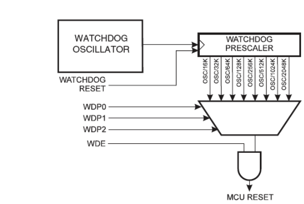
		* the WDTCSR or watchdog timer control and status register lets us control everything (we have to use lds and sds for them)
			* Bit 7 – WDIF - Watchdog interrupt flag
			* Bit 6 – WDIE - Watchdog interrupt enable
			* Bit 4
				* WDCE - Watchdog change enable
					* Should be set before any changes to be made
			* Bit 3
				* WDE - Watchdog enable
					* Set to enable watchdog;clear to disable the watchdog
			* Bits 5,2-0 
				* Prescaler
					* Named WDP3, WDP2, WDP1, WPD0
					* Determine the watchdog time reset intervals
					* there is a table where like 0000 is 2k cycle devide, 0111 is 256 cycle devide, 1001 is 1024K, which is the slowest. 
		* if we wanted toset it, we can use tags like WDE to create a mask, WDE is 3, so 1 <<WDE becomes 00000100 allowing us to set the 3rd bit. 
		* ldi r16, (1<<WDE)
		* sts WDTCSR, r16
		* we can also set multiple by getting 2 marks and or'ing them
		* ldi r16, (1<<WDCE)|(1<<WDE)
		* `wdr` is the command that triggers the watchdog timer to reset, i.e "EVERYTHING IS OK PLS DON'T RESET ME"
	* Brown-out reset
		* this is when the supply voltage is below the Brown-out Reset threshold VBOT and the brown out detector is enabled. This is good for whena battery is low and the processor needs to turn off rather then use the low voltage and end up making wrong calculaltions and decisions. 
	* JTAG AVR Reset
		* JTAG is a protocol for controlling a CPU remotely, usally for debugging. using this system we can reset the chip. 
		* when you reset while usinf JTAG it stores info on why and where it reset. 
Note that if a global or specific interupt is disabled, any interrupt will still be detected but queued, each type of interupt can hold only 1 in it's queue. 

## External Interrupts
* these are triggered by INT0-7 pins, if enabled the interrupts trigger even if you state that these pins are outputs, this is allowed because we can use externa interrupts to create software interrupts, as there is no inbuilt method of doing such a thing.
* this we can output a signal on that pin and the pin will detect it as a interrupt. 
* you can set them to be triggered by a falling or rising edge by playing with the External Interupt Control Register (EICRA for INT0-3 or EICRB for the other 4) exact specs on what bits do what can be found on the data sheet
* there is also the EIFR the external interrupt flag register which shows you what interupt has been activated 
* remember when coding with interrupts, set up the stack! it's needed for interupt calls as the return address is stored here, also remember to fucken jump back from the interupt call, oh my fucken god don't forget this, the command is `reti`

## Timer/Counters

* Simply they are binary counters, they count up, they can be used in two ways
	* As a timer, couting how much time has passed
	* As a Counter, counting how many times something has happened. 
* There are built in timers divided into two groups
	* 8 bit (Timer 0 and Timer 2)
	* 16 bit (timers 1, 3-5)
* The timer defaults to 0 when set up, you can also set it witha given value, you can also set the direction, i.e to count up or down
* This is it's own circuit in hardware, it does all the counting and stuff itself once we set it up via the Timer Counter Control Register n A or B (n being which timer we are messing with)
* We can set it to count up to the max value (like 255) and once it overflows start at 0 and trigger a interrupt, easy periodic innterupt 
* we can also have it count up and each count check if it is the same as the Output Compare interrupt request and if it is trigger a interrupt.
* we can also have it not generate ainterrupt but change some but (OCn hardware)
* one thing to be careful about is the interrupts via this system only have a queue of 1, so if your interrupt routine takes longer then how long it takes for the interrupt to hit again, you'll loose interrupts as you hit 3 while still processing the first one

### TIMSK0
* Timer/counter Interrupt Mask Register
* this is 0-2 on the TIMSK0 control register all other bits are never used
* bit 0 is TOIE0 (0 for timer 0) and turns overflow interrupt on or off
* bits 1 and 2 are OCIE0A and OCIE0B and they enable Compare Match Interrupt. you can have 2 of these interrupts, hence A and B
* you can have all 3 running at once, like have on trigger at 20, another at 40 then the overflow at max

### TIFR0
* Timer/Counter Interrupt Flag Register
* same as above, but the 3 values arn't to be written to, they are set by the hardware when the interrupt by the relevent bit (0 for overflow) is triggered, they stay set untill the interrupt is handled

### TCCRnA/B
* these two control the timers and counters rather then just enable or disable or detect a event
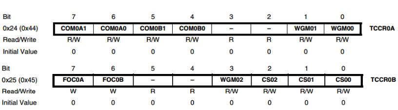
* COMnA0-1 and COMnB0-1
	* these control the mode of operation, these are combined with the waveform generation mode specifed in (WGM00-02) to define the behavior. 
	* the simplest mode is normal mode, the waveform bits are all 0. Counting goes up from 0 to max and rolls over to 0 at a overflow. the data sheet has more information about more complex modes like counting down and underflow interrupt, or count up then stop then count down to 0
	* the com bits tell what it should do with it's output compare, i.e what it shoudl do when it matches etc.
* The CS bits define how the counter should count up, i.e ever cycle, every 8 cycles every 1024 counter etc. 
* if they are all 0 the clock is off. if it is 001 is count once every cycle. if it's 100 it's /256
* use this with some math to work out actual time in seconds or more likely milliseconds
* note that 110 and 111 are to specificy a external clock source rather then the built in clock, i.e if you wanted to measure some other machines clock speed or something 

### Actual Use

ok so lets say you want to do something every second
if you set the prescaling value to 8 that means a 8 bit timer will trigger via overflow every 256*8 cycles, or 2048 cycles. 
given that the processor can do 16 MHz, or 16 000 000 cycles per second, this means that a timer set to interrupt every 2048 cycles will interupt every 128 microseconds. 
this means that 7812 interrupts about will mean a second has passed (well about 0.999936) but that's fine for user input, if you wanted to count seconds in a year then these errors woudl add up, here we would use exact cycles. but then you are generating HEAPS of interrupts. less efficient the code, the more accurate. 

great now you can code, note that some people like having a jmp to default that does nothing for interrupts even if you are not using them. this is in case you trigger then and accidently have them enabled 
it's a hard bug to solve so we are careful. 
anyway so timer0 will trigger the timer interupt 0 when it overflows. so we handle this with something like
```
.org OVF0addr
	jmp my_code
```
note OVF is overflow, this is overflow 0 address, i.e the interrupt vector for timer 0 overflow. 
my_code will of course count up untill it hits 7812, then trigger some code, then reset this counter. 
we also should have a reset handler which is our reset code, it just sets up the stack and sets up any led's we might beusing to be output or whatever. 

now in our main we need to set up our timer with the correct prescaler (8) (010)
next we have to enable the timer 0 overflow interrupt. 
```
ldi temp, 0b00000010
out TCCR0B, temp
ldi temp, 1<<TOIE0
sts TIMSK0, temp
```
# IO Devices

## Input Switches
These are the most basic binary input devices, it's either on or off, 1 or 0. Of course we need pull up resisters here so when it's off we get a logical 1 correctly. BUT we have bouncing, the mechanical springiness of the swtich means when electrical contact is made there is a bounce for about 5-10 ms 
You can also have a multiple pole switch as such
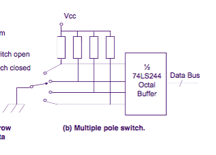

So is our only option software debouncing?? well no, a lot of systems prefer hardware debouncing, usually done by a NAND Latch, which smoothes out oscialting signals, if a signal was high and is now low, that's all we want to now, ew don't want to know if it goes back to high in that process for 2 microseconds. 

With software debouncing we have 2 main methods
	1. If we detect a fallign edge we wait 10-200ms and check it again to make sure it's still low.
	2. We can also use a counter based approach, we have a counter set to 10 and every millisecond poll the switch, if it is high we add 1, if it is low we subtract 1. if the counter hits 0 we conclude it was low for 10 consequtive microsecond and thus is a low signal. same with if it hits 20. 

## Array of switches
This is the method that a lot of Keyboard or keypad systems use, there is a array of swithes arranges in coloums and rows, depending on which button is pressed we can detect it by polling the row and colou switches. 
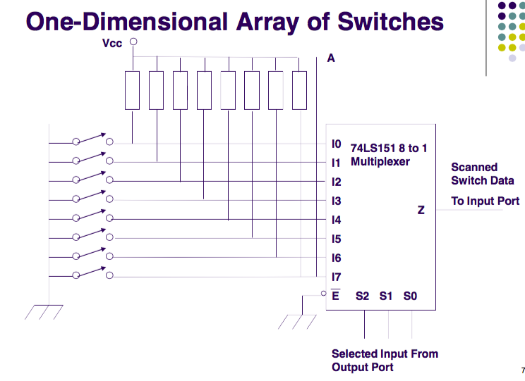

Of course the swtiches still need to be debounced. Again this can be hardware or software. IN software a button pressed is detected and the same methods are applied to make sure nly one signal is detected. 

So the way this works is that the horizontal lines have a current going through them, depending on the button pressed this horizontal line has it's current diverted into the vertical axis. 
By choosing a vertical line to turn off and then polling to horiztonal lines to see which ones have been triggered we can find the x,y co-ordinates of the button being pressed.
If they are arranged in a nice way we can use a quick math calc to figure out what it represents, otherwise a lookup table can be used 

There is also a diode attacked to the circuit to prevent ghosting

To see some functional code please refer to the lab's where we used the keyboard. 

## Ghosting

This is when several keys are pushed at once, consider the case below where 3 switches are closed. Col 0 is selected with a logic 0 signal, but when the rows are polled we see that Row 0 is low. However, this isn't correct, we have only selected 3 switches, but from the chip's perspective, we see that 4 have been selected. To stop this we use diodes that prevent any current flowing between rows. the current can only go from the bottom up. For the exam, just note that diodes let current only flow in one direction.

Drawing this out helps a lot, keep note that because of the switch being triggered at (1,1) the junction between (1,1) and (0,1) has no current in it as it would id (1,1) was open. Any col not being selected is at a logical High.

Because of this the current from R2 can easily flow down into (1,1) then via the path of least resistance to the logic low on col 0. 
With the resistor it can't do this and it goes foward correctly. 

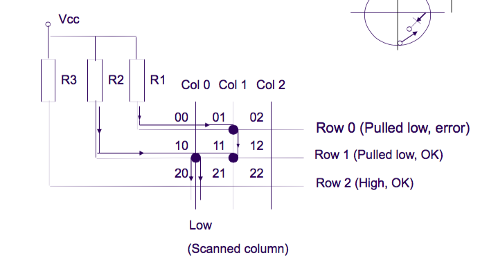

## LCD

This is mostly practical and the LCD manual tells you what you need to know. But some notes:
	* There is a controller, the MPU(mobile processing unit), used to control the communcation between the Chip and the LCD system. The controller has a internal character generator ROM (read only memory) which is can use to display characters etc. 
	* MPU communicates via two registers
		* IR, instruction register, This stores instruction codes like display clear or cursor shift, we can also use it to set addresses 
		* the Data register i sused to store the data to be read or written to the DD Ram of the displau controller
	* The Rs and R/W bits in the REgister Select signal determins which of the two registers is selected and for what. 
	* Also note how to edit the cursor values directly. 
	* Just edit the DDRAM address i think....i hope?
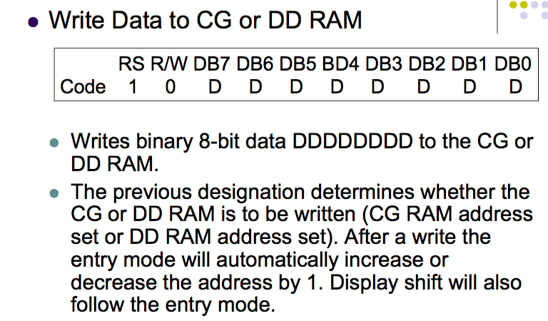

Ok here are some timing diagrams, don't worry too much the main thing you need to worry about is how some actions can't be done untill you wait a bit. For example te gap between the r/w falling edge and the E rising edge. 
For us we just do these instruction in the right order and just set a large delay between them like a couple or microseconds to be safe, We don't really need MAXIMUM SPEED 

Read

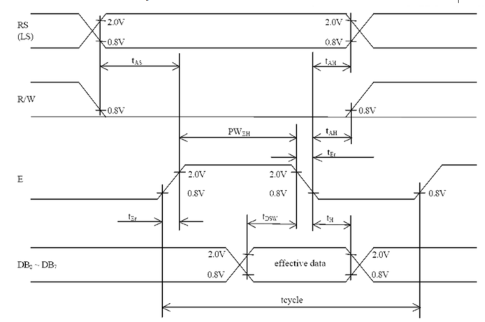

Write

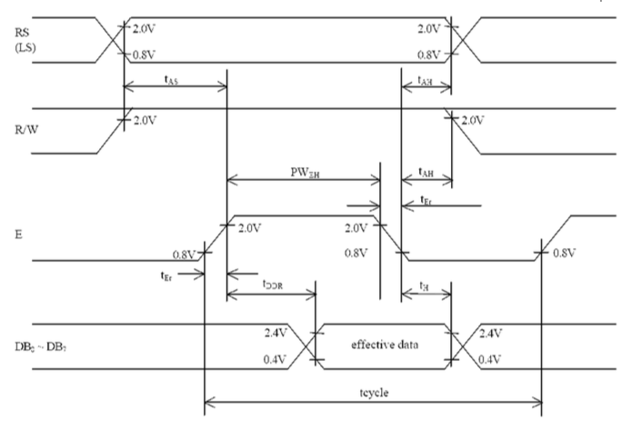

There is a internal reset circuit built into the lcd but it's not reliable so we use software initialization. 
It's a bunch of steps outlined in more detail in the lecture notes that sets up the display as 8bit, indicates the number of lines, font etc. Note that each commad needs some time afterwards to register with the lcd before you send another command 

# Analog Input and Output

## PWM Analog Output

Pulse Width Modulation, or PWM, is a way of digitally encoding analog signal levels. We define a PWM signal by its 'duty cycle'. The duty cycle is just a percentage of the entire period of the wave that it remains at a logical High.

Note that this is still a digital signal, not an analog wave. It is represented as a square wave though, and can be used to drive analog components.

PWM output has to be filtered to remove the inherent noise.

The output voltage is simply the average voltage over its period, so a higher duty cycle will result in a wave that is in the logical high longer, and will output a higher voltage. Using this, we can adjust voltages to dim LED's.

## PWM in AVR
Any timer/counter can be made into a PWM signal maker giver thingy. That's the technical term. 
You just gotta set them mad configeration bits.

In TCCR0A (Timer counter control register 0 A obviously) setting the control bits to 010 sets it to CTC. 
That is clear timer on compare match. When unset it counts up to it's max value then resets.
once we set a compare match, everytime the counter hits that value it can toggle the output compare pin to 0 (OCn)
and then when the counter hit's it's max value it can set the pin back to 1. This ofcourse can be flipped if needed. 
thus by varing where this compare happens we change the duty cycle. your compare value (set in OCRn) / 256 is your duty cycle
256/256 = 100% (never turns off)
0/256 = 0% (turns off the moment the overflow turns it on)

This is called FAST PWM which is easy but the phase is unreliable, the duty cycle is correct though. 
We would use phase correct PWM is we cared about phase and stuff. The cycles are perfectly in line where fast produces different positions of the wave. This counting and interrupt pattern for here is different, it doesn't count up to max then set to 0 it counts up to max then counts down. it has a slower run because it has to count down to 0 which means it has a lower frequency. The duty cycle is fine but the frequency is slower. 

On our board the output compare pin is defined, for examp,e it's L3 for OC5A

note the OCRnA defines the PWM cycle (the compare value) and is a 16 bit register (use OCRnAL and OCRnAH)
for our 8 bit counters we only use the low values and set the high alues to 0 obviously. god how didn't you know that get a fucken life

To set the timer to be phase correct, or fast etc. you load the right bit sequence into TCCRnA/B (this is where you'd set it to CTC for example for fast PWM)

## Digital to Analog Conversion

PWM is still a digital signal so if we wanted actual true analog signals we need to do some conversion. 

The digital to analog converter (D/A converter) converts a sigital value into a continues one and can also have a signal conditioning block attached. This acts as a filter to smooth the suqntized nature of the output and can also provide isolation, buffering and voltage amplification if needed. 

this roughly works as show below where the converted tries to stagger the change in voltage. 

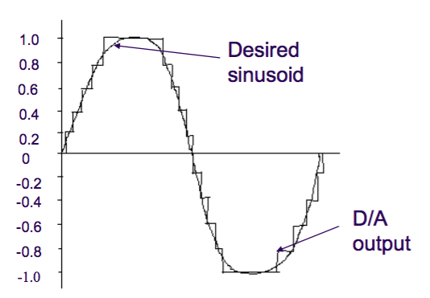

There are also multiple types of D/A converters:

* binary weighted 
	* here a set of 4 resisters we can control how much current is going through, a combination of these resisters gives a unique voltage allowing us to control the voltage output to match the desired sinusodial wave. 
	This onyl really works with 4 because any more and we are doubing and the rsistance gets too high, they get hot and the wires also have some resistance it gets messy
	* do note that also the resisters change depending on the temperture.
	
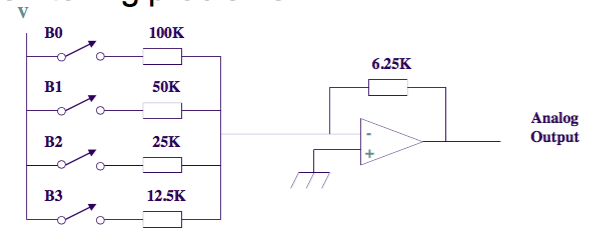

* R-2R Ladder
	* this is the same but it uses twice as many resistors, and as you can see you can still get the range of voltages but through a different structure. but now we don't need a resistor the size of a fucken pyramid, we can use smaller resistors, just more of them. but because the current goes through all the previous resistors so you can still add resistance on. 
	* more stable
	* this isn't the best because the resisters individually arn't perfect not exactly 10 ohms prob 9.991
	
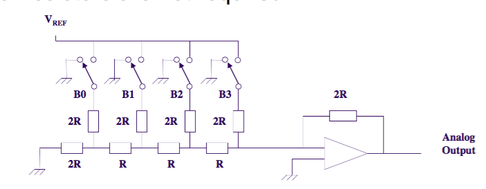

The Reolution of a D/A converter is given as the output voltage corresponding to the smallest digital step i.e 1 LSB. 
more bits in the A/D converted, the lower this value, the better the resolution. it's basically the minimum change in voltage in the final wave that is needed to be considered a step in the digital circuit. an ADC with a resolution of 8 bits can encode an analog input to one in 256 different levels, since 2^8 = 256. The values can represent the ranges from 0 to 255 (i.e. unsigned integer) or from −128 to 127 (i.e. signed integer), depending on the application.
increasing this bit means that there are more steps in the same voltage range hence more resolution. 

The linearity shows how closley the output matches the idea values. (this is a analoge wave that's a straight line from 0 to the max voltage)


the settling time is the time taken for the output voltage to settle to within a specifed error band usually +- half of the LSB. This is because the circuit takes a bit of time to reach the voltage you set to it. 

NOTE THIS IS WHAT PWM IS. when we switch back and forth quickly the whole thing is averaged out, the duty cycle defines the output voltage. it's still a single voltage basically, we use a DC motor!!!!! sometimes it is a perfect PWM wave but most times there is some smoothing. 

there is also glitching where one wire or one source changes faster then others which means we might get a flash of a wrong value before we get the right value. a sample and hold or a latch solves this by just waiting for all the changes to come through before going foward. 
an example is we if we are changing 10000000 to 01111111 (add 1) we add to the left most bit and then use the carry but if flipping the 1 to 0 and pushing the carry takes a bit less time then the cascase of 0 to 1 toggles we see this

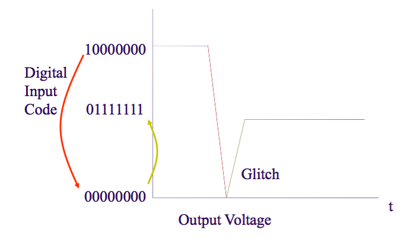

This is fixed with a sample and hold, where the value of the conversion is sampled then held. This takes a value and holds it for a bit to make sure that it's getting the current that's being sent the longest. 


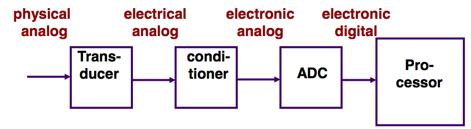

The whole conversion circuit for digita to analogue is as follows
	1. A transucer converts physical values to electrical siganls
	2. signal conditioner which provides
		- Isolation and buffering (from external voltages)
		- Amplication
		- bandwidth limiting: a low pass filter to limit the range of frequencies that can be digitzied
	3. Where multiple signals have to be converted we have a multiplexer which takes multiple signals into multiple signal conditioners
	4. these lead to a sample and hold to keep it stable and then into the actual converter. 
	5. then into three state gates hold the digital values

## Claude Shannon's Theorem

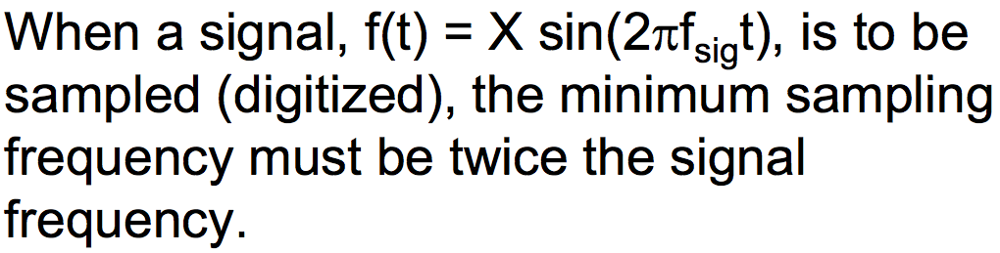

* To preserve the full information in the signal, it is necessary to sample at twice or more then the maximum frequency of the signal. This is known as the Nyquist rate and being under this means the wave is under sampled. 
* If you have an undersampled signal you get aliasing which is when you get the reconstructed signal have components not in the original signal. See below, the points that were sampled are correct but the wave between them is basically wrong as fuck

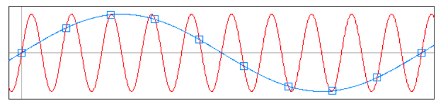

## Successive Approximation Analouge to Digital Converter
* Long story short every bit of the output digital signal is tested against the input to see if it is lower or not. works from most significant bit to lowest. 

i.e for a input voltage of 6 V

test bit 0, if higher set 0, else leave as 1 and move on
	1000
as 1000 is 8, 8 > 6, set this bit as 0
	0100
4>6, set this as 1
	0110
6!>6
	0111
7>6
	0110 
done!

we aproximated 6v to be 0110 which is 6! nice
in real circuits we don't use whole numbers but each bit represents a decimal. Allows for accurate voltage determination. ngl this is fucken cool as shit. 
also how smart do you sound when you do "Successive Approximation ADC" like shit dude i must know what i'm talking about. I mean my 51 in the course would say otherwise but fight me

## Parllel A/D Converter
* An array of 2N-1 comparators and produces an output code in the propagation time of the comparators and the output decoder.
	* The diagram helps more, the basic idea is a input signal is taken in and instantly run through the circuit to produce the final binary by comparing it in parralell rather then one by one like the previous design. something like 6V goes through and the first comparison says "nah the first bit is 0" then the second one at the same time goes "alright secodn but is 1" etc. 
	
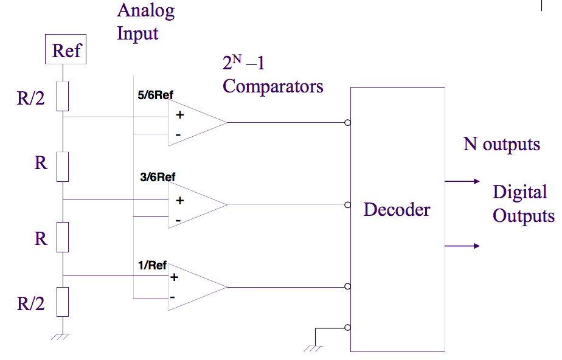

* Fast but more costly in comparison to other designs.
* Also called flash A/D converter.

## Two Stage Parllel A/D Converter
* suprise su-fucken-prise it gets more complicated
* The input signal is converted in two pieces.
	* First, a coarse estimate is found by the first parallel A/D converter. This digital value is sent to the D/A and summer, where it is subtracted from original signal.
	* The difference is converted by the second parallel converter and the result combined with the first A/D to give the digitized value.
* has the same speed as before but with less comparisions cause they don't compute every bit in the first stage. they compute the number of bits for N/2 
* better for where you need high quality high speed like video processing. 
* voltage has to be stable

## MATH
* cause who doesn't love math huh
* Conversion Time
	* The time required to complete a conversion of the input signal
	* this establishes the best frequency we can process without aliasing. 
	* fMAX= 1/(2*conversion time)
	* more time means less sampling, so our maximum frequency goes down. 
* Resolution
	* the smallest analog input signal for which the converter will produce a digital code
	* Resolution= full Scale signal/2^n
	* where n is the number of bits (more buts means better resolution)
	* full scale input signal is the max voltage the circuit will take in. 
	* can also be expressed in other ways
* Accuracy
	* relates the smallest signal to the measured signal 
	* The signal is accurate to within 100% * V.RESOLUTION/V.SIGNAL
* Linearity
	* The derivation in output codes from the real value
	* The best that can be achieved is 􏰁 1⁄2 of the least significant bit (1⁄2 LSB).
	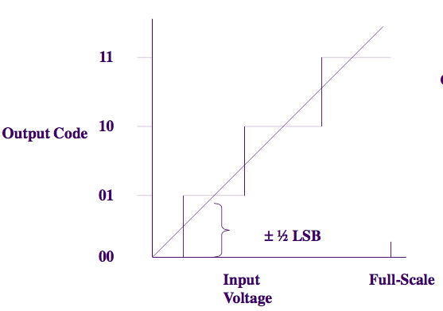

ok quick things, sometimes the circuit just misses a code due to some internal error possibly with successive approximation. 
Aperature time is the time the A/D converter is looking at the input signal, usually equal to conversion time because it takes the longest. 

## Errors
* well this shit still fucks up
* the input signal can have noise
* if you don't get your Nyquist frequency done correctly shit hits the fan and causes aliasing issues, a low pass filter helps fix this
* Aperture causes issues. In the aperture time in which we check the voltage there can be a suprisingly amount of signal variation. A design equation for the aperture time, tAP, in terms of the maximum signal frequency, fMAX, and the number of bits in the A/D converter is:

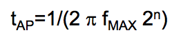

* i.e the faster your wave waves the quicker your input voltage checks have to be. 
* we try to keep the error (delta V) to be less then 1 LSB

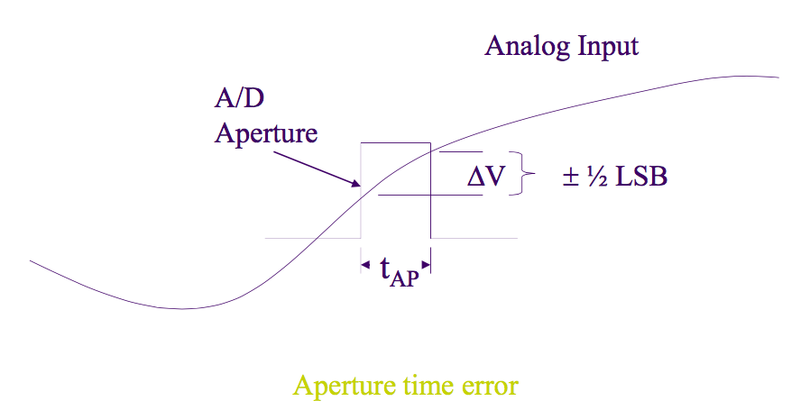

# Serial Communication

* Almost done!
* What is the difference between paralell and serial?
	* paralell sends data ... well .. in paralell
	* for example in a 32 bit system you can have 32 wires binded up to send 32 bits each time
	* serial is the opposite sending each bit one after another
* serial IO is perfered sometimes because of cost and size of the wires but also because paralell IO is susceptible to relfections and induced noises for long distance communcation. 

# Communication Structure
* the paralell data comes into a buffer then goes into a paralell in serial out shift register. (PISO) Register. Using a clock it shifts the date bits out from the shift register at a regular time interval, effectivly converting the data into a serial form
* the otherside then recieves this into it's SIPO Register and using it's own clock recontructs the data. once the entire byte or package is formed it's shifted up into the buffer. 

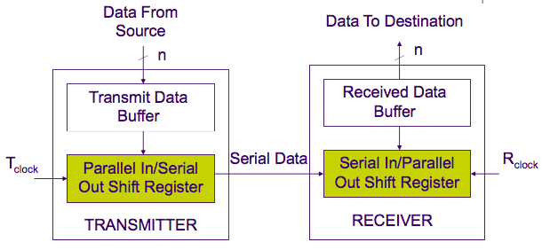

## Types
* there are two types of serial communcation
	* synchronous
		* guess what, huge surpise, the reciver and trasmiter are synchronized, this makes data trasnfer faster but needs additional hardware to keep them synced
		* we don't look at this much
	* asynchronous
		* take a while guess
		* this is cheaper and used in many applications such as keyboards, mice, modems etc,

## UART

* no YOU art
* haha little joke there
* Universal Async. Receiver/Transmitter
* this device implements both trans and reciver
* this uses least significant first order, i.e LSB transfered first
* basis for most serial communcation
* Before transmission the data should be encoded such as in ASCII
* then each peice of data is encapsulated with two bits, the start and stop bit. 
* The logic the and zero levels are called mark and space
	* there is more on this but the lecture notes have a picture ontop of the text????
	* ok i googled it
	* the start bit is a mark (logical one) and the end but is a zero (logical zero)
	* so after the transfer is done the signal stays in the space position and after a full character length of being in the space position the IART detects this and realises the data is done
* there is also a parity bit sometimes that is used to detect errors, if the bit makes the total number of 1s in the data odd we have a odd parity and the opposite is a even parity
* this helps us detect if we have missed bits.
* but how fast is this?
	* we can measure it via the baud rate, which is bits per second. 
	* standard rates range fomr 110 to 921600

## System types and devices
* there are 3 ways data can be sent
	* Simplex
		* data send in one direction only, i.e printer
		* no handshaking
		* 2 wire system (1 for ground)
	* Full-duplex (FDX)
		* both directions
		* 4 wire system
	* Half-duplex (HDX)
		* data is tramsiteed both directions but with only 2 signla wires
		* additional hardware is needed and a handshake is needed
* There are two Devices
	* DCE
		* Data Communications Equipment which provides a path for communication
	* DTE
		* Data Terminal Equipment
			* connects to a communication line
	* Below the Pc and internet provider are DTEs
	* the modems are DCE's
	
	
* Modem
	* a modulator/demodulator
	* converts logic levels into tones to be sent over a telephone line

## Standards

* mine are high, it's why i'm single :(
* anyway you need standards to allow hardware to link up and there are many different standards like RS-232-C (most common) RS-422 etc. for different speeds and distances
* these basically help coordinate stuff like
	* handshaking
	* direction of data
	* types of communication devices
	* connectors and interface mechanical considerations
	* electrical signal levels
* RS-232-C has each pin have a singal defintion
	* pin 1 on a 9 pin cable will be the data carrier detect, inidcates that a DCE has detected the carrier on the telephone line. 
	* 2 will be receiver data
	* 3 transmit the data. 
	* 4 is data terminal ready (DTE is ready to send or reciever data)
	* 5 is signal ground
	* 6 will be data set ready (sent by DCE when it's connected to the telephone line and is ready to receive data to send)
	* 7 will be request to send
	* 8 will be clear to send (yep send it through)
	* 9 is ring indicator (indicates that a rining signal is detected)
* there are 4 cables that can be used with RS-232-C
	* Full DTE-DCE cable
		* associates every DTE pin with a DCE pin. 
	* minimal DTE-DCE cable
		* all in all it means you just have the transmit and recieve lines needed, you skip all checking
		* the moment you are ready to send you automatically get a  clear to go response as the wires are set up so if you send a ready to send signal it just activates all the clear to go signals etc. 
		* the moment you are clear to send you have already requested to send again
	* DTE-DTE null modem cable
		* these are used to connect a computer to not a modem but another computer
		* these switch the transmision and receiving wires to go to the corrosponding ones on the other computer
		* swaps a couple of other pins
		* ready to send from one computer triggers clear to send on the opposite side. as well as other one
	* Minimal null modem cable 
		* same as DTE-DTE null modem cable but only the crucial pins.
* interface
	* usually the wires need a high voltage like about 12 because low voltages are more easy to have noise associated with them, so we take the low voltage out of the omcpute,r ramp it up trasnfer it then ramp it down
	* we usually isolate the cables and circuit because the wire could be hit by lignting or be crossed with a power cable
	* so we have ti like send a light beam to a reciever to transfer 1 and 0 thay way if theere is a power serge it bursts the light but doesn't send that 1000 V to the computer blowing it up
* RS-423
	* allows for longer distance and higher data rates, allows a driver to broadcase data to 10 receivers rather then just 1
* RS-422
	* has a differntial amplifier, these eliminate much of the common-mod noise experiences, allowing for evern longer distances and higher data rates also up to 10 recivers
	* this is because any noise will effect both wires being used so if we get + 5 on both the difference is still the same so the information hasn't been altered
* RS-485
	* same as 422 but provides for multiple drivers and receivers in a bussed enviornment
	* up to 32 recievers and 32 drivers all sending individual signals

## AVR USARTs
* USART is Universal Sync/Async ... can be either
* two units 0 and 1
* each unit can be synchronous or asynchronus
* USART unit 0 is used on the AVR lab board to reciever program code via PC
* it has transmission error detection (odd or even parity error) and framing error talked about later
* it has 3 interrupts on transmission complete (TX Complete) Transmission register empty and recieve complete (RX complete)
* it has 3 main components
	* Clock generator
	* Trasmitter
	* Receiver
* Frame Formats
	* there up to 30 formats with various combinations of a start bit, some data, some parity bit, and 1 or 2 stop bits
* Control Registers
	* UCSRA
		* stores status flags
			* Recive complete
			* transmit complete
			* USART Data Register Empty
			* Frame Error
			* Data OverRun
			* Parity Error
			* double transmission speed
			* multi processor communication mode
		* controls trasmission speed and multiple processor use
	* UCSRB
		* enables interrupts, tramission operations, frame formats and bit extension
			* recieve complete interrupt enable
			* transmit complete inerrupt enable
			* data register empty IE
			* Reciver Enable
			* Transmitter enable
			* character size
			* receiver data bit 8 (set bit 9 sent to be 0 or 1)
			* transmit data bit 8
	* UCSRC
		* operation configeration
			* Async or Sync
			* Parity Mode (2 bits)
			* Stop bit select (o or 1)
			* character size (3 bits)
			* UCPOL: clock polarity
		
### Using it
alright great job we just had to read through a fuckton of info on bits, but how the fuck do we actually use this in avr?
The initialization follows the basic structure of

* Setting the baud rate
* setting the frame format
* enabling the transmitter or reciver

If we have the USART trigger on a interrupt you should do a cli before editing the values of the control registers. for obvious reasons 

```
USART_Init:
	; Set baud rate, which is stored in r17:r16 lets say
	; USART Baud rate Register 1
	sts UBRR1H, r17
	sts UBRR1L, r16

	; Enable receiver and transmitter
	; RXEN1 recieve (RX) enable (EN) 1
	; when we OR the two numbers we just activate both in one line
	; 00100 | 00001 = 00101
	ldi r16, (1<<RXEN1)|(1<<TXEN1)
	sts UCSR1B,r16

	; Set frame format: 8 bit data, 2 stop bits
	; USART Stop Bit Select 1
	; USART Character Size 1:0
	ldi r16, (1<<USBS1)|(3<<UCSZ10)
	sts UCSR1C,r16
```

ok so now how do we send shit
load your data into the UDR IO location which acts as the data trasmission buffer. This then is moved to the shift register when the time has come

```
USART_Transmit:
	; Wait for empty transmit buffer
	lds r15, UCSR1A
	; check if data register empty 
	sbrs r15,UDRE1
	rjmp USART_Transmit

	; Put data (r16) into buffer, sends the data automagically
	; USART Data Register 1
	sts UDR1,r16
```

ok great but how do we know the transmission state? we have two flgas
	* UDRE to tell us when the transmit buffer is empty and ready to receiver new data to send
	* TXC transmist complete, is set when the data has been sent
both can be used to generate interrupts

ok now how do we receiver shit, what if yo boy form iceland wanna send me some mad memes yo
First we enable the reciver via the RXEN bit in UCSRB. this is assuming the vaud rate etc. are all set up before hand. 

```
USART_Receive:
	; Wait for data to be received
	; Keep checking Recive complete
	lds r10, UCSR1A
	sbrs r10, RXC1
	rjmp USART_Receive

	; Get and return received data from buffer
	; USART Data Recive
	lds r16, UDR1
```

ok but shit will fuck up and you wanna know if the dank meme is corrupted or not
main sources come up with out of sunc transmission and noise, to avoid this we check 3 errors

* Frame error (is the first stop bit correctly recieved)
* Parity error (do we have the right amount of 1's in the data)
* Data OverRun error (is incoming data overriding the previous frame)
* AVR includes a clock recovery and a data recover unit for handling errors as well
	* the clock is used for synchrpnizing internal baud rate clock 
	* the data recovery stuff samples and low pass filters the incoming bit thereby inproving the noise handling 
	
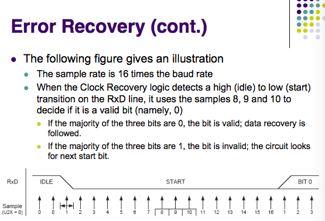
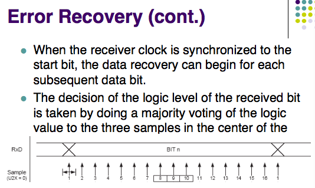
