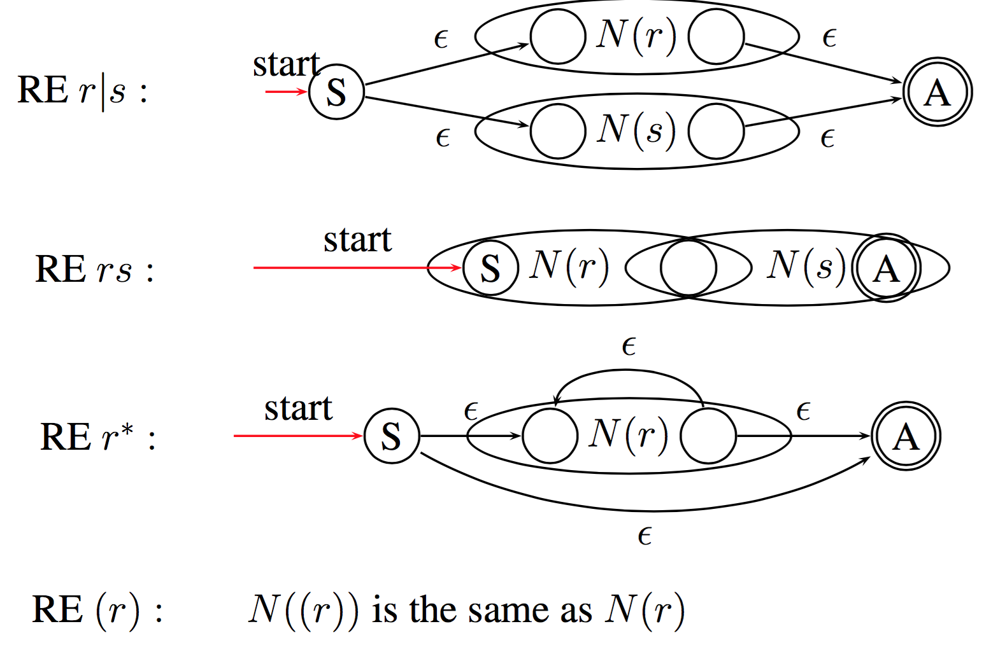
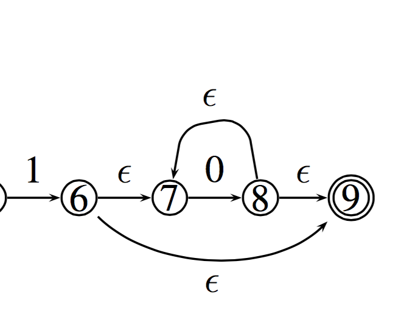
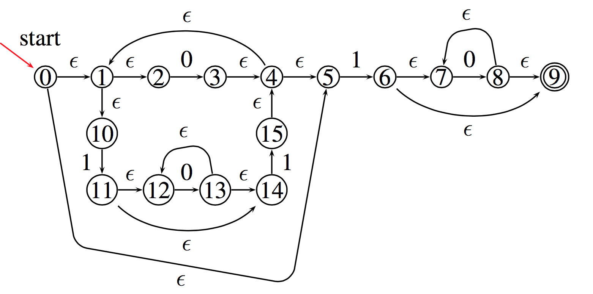

# Alphabet, Strings and Languages

## Definitions
---

#### Alphabet
denoted by Σ is any finite set of symbols. 
For example this set {0,1} is a alphabet that describes every symbol used in binary strings. This can be call

#### String
A finite sequence of symbols drawn from Σ, i.e a string is just a series of symbols from a alphabet connected. 
Note that in this notation |s| means the length of string which is just the number of symbols contained. 
We use the symbol ($\epsilon$)

#### Language
any set of strings over Σ, that is to say a series of strings. 
note that it has two special cases

- ∅: the empty set
- {$\epsilon$} : the set with only empty strings

#### Examples of languages

Σ = {0, 1} defines the a language where the only valid symbols are 0 and 1, in this language strings are just 0's and 1's. 
lets say every string in this language is a instruction
This language now defines the set of M68K, MIPS, Pentium instructions etc. 

now if we say Σ = {a,b,c,...} i.e Σ = ASCII set. We can now define most high level languages such as C, Haskell, VC etc. as every program in C is just a string in this alphabet. the '\n' is just another symbol. 

## String transformations
---

We can split up a string into multiple parts

| Term | Definition |
| --- | --- |
| prefix of s | s with 0 or more trailing (on the end) symbols removed|
| suffix of s | same as prefix but done with the leading symbols |
| substring of s | s after a prefix and suffix have been removed |
proper prefix suffix, substring of s | Any nonempty string x that is, respectively, a prefix, suffix or substring of s such that s != x |

We can also concatenate strings, if we have $x$ and $y$ adding y onto x or concatenating x and y gives us $xy$

if x is key and y is work xy is keyword. 

Not too complicated, but do note that with this we have this property with $\epsilon$

$\epsilon x= x\epsilon = x$

Again kinda obvious but it's good to have this formalised. 

## Language Transformations

Here is a quick table to outline some of these transformations on two languages L and M


This may seem hard to visualise, take a look at the example first


The union of two languages is just a combination of all the symbols in both. 

The superscript number just defines length of the string. 

the concatenation of two languages is a set of all combinations of a symbol from L followed by a symbol of M. 

The Kleene Closure is just the same as the * in regex. I.e it represents 0 or more consecutive instances of a string. 
The mathematical representation just says that L* is the set of every possible number of repetitions of L including the empty string, otherwise known as 0 or more concatenations of L. 

The Positive closure just states that the empty string is not included in this set. 

# Regular Expressions

RE is build on top of this. REs define `regular languages` (RL) or regular sets. That is to say a certain Regular Expression simply refers to a specific regular language or regular set of strings. 

This makes sense as a RE is used to match a certain type of string and thus must represent some set of correct matching expressions. 

You can formally define regular expressions in two steps, the inductive base (setting up the base cases) and then inductive steps which is the general cases. 

## Inductive Base
---
1. $\epsilon$ is a RE, denoting the RL {$\epsilon$}
2. a ∈ Σ is a RE,denoting the RL{a}f

In simple terms, $\epsilon$ represents a set of empty strings so the regular expression "" matching nothing. 
And in addition a regular expression with just a symbol defines a set with that symbol. i.e it can only match with every instance of that symbol. 

##  Inductive Step
---

Suppose r and s are REs, denoting the RLs L(r) and L(s)

Now we can start forming the regular expression language while linking it to our formal definition of languages, strings and alphabets. 

1. (r)|(s) is a RE, denoting the RL L(r) $\cup$ L(s)
2. (r)(s) is a RE, denoting the RL concatination L(r)L(s) 
3. (r)∗ is a RE, denoting the RL kleene closure L(r)∗
4. (r) is a RE, denoting the RL postive closure L(r)

## Rules
---

But we do have to define some rules around this now

#### Precedence

- “∗” has the highest precedence
- “Concatenation” has the second highest precedence
- “|” has the lowest precedence

#### Associativity

all are left-associative, if you don't have brackets, evaluate left to right, and all special symbols apply to the symbol to the left of it. 

$a|b^*c$ is the same as $(a)|((b)^*(c))$

## Examples
---

• Alphabet: Σ = {0, 1}
• RE: 0(0|1)*

What is the language defined by the RE?

Well we know from basic regex that 0(0|1)* is just any string that starts with a 0 and contains any combination of 0's and 1's afterwards. 

how this breaks down formally though is

$L(0(0|1)^* )$
$= L(0)L((0|1)^* )$
$= \{0\}L(0|1)^*$
$= \{0\}(L(0) ∪ L(1))^*$
$= \{0\}(\{0\} ∪ \{1\})^*$
$= \{0\}\{0, 1\}^*$
$= \{0\}\{\epsilon ,0,1,00,01,10,11,...\}$
$= \{0,00,01,000,001,010,011,...\}$

Kinda takes the magic out of regex doesn't it?

## Notational Shorthands
---

If you have used regex before you may be thinking what about the life savers like `?` or `[]`. These are actually defined by the language but  just in longer forms. So we use these shorthands

$r? = r|\epsilon$
$[a-z] = \{abcdefghijklmnopqrstuvwxyz\}$
and using the caret (`^`) just means the set of all valid symbols in the alphabet excluding the symbols specified. 

## VC
---

Just note that in VC you can use the following regex to tag identifiers (variable names etc.) 
`letter(letter|digit)*`
But note that in the spec letter includes the `_` character. For us letter will be ascii letters but in java it can be any unicode character awesome enough.
You can have variable names in greek letters or mandarin. 

Just has a heads up the RE for reals is a bit complex because you can have digits fractions and exponents. 
It ends up being a set of regex: (NOTE that in this . does not represent any character)

```perl
digit: 			/0|1|2|3|4|5|6|7|8|9/
fraction: 		/.digit+/
exponent: 		/(E|e)(+|-)?digit+/
floatLiteral:	/digit* fraction exponent? | digit+. | digit+.?exponent/
```

# Finite Automata / Finite State Machines

## Defintion
---

A finite automaton consists of a 5-tuple:
`(Σ,S,T,F,I)`

- Σ is an alphabet
- S is a finite set of states
- T is a state transition function: T : S × Σ → S
- F is a finite set of final or accepting states
- I is the start state: I ∈ S.

In essence it is just a way to represent a machine/automata/system which has a finite number of states and a fixed set of ways to transition between those state. 
## Representation
---

We can represent finite state automata (FA) with Transition graphs. Details below


Note that a FA will only accept a string x if there is some path on the machine which fits in with the string. I.e if x was hello there must be some path in the machine that starts with h at a valid start state and transitions legally to a end state with o.

## Example
---


This state will accept `strings of 0 and 1 with an odd number of 1's`

if we were to break this down into it's 5 tuple we would get this

- Σ : {0,1} 
- S : {S,A}
- T <br>
	: T(S,0) = S<br>
	: T(S,1) = A<br>
	: T(A,0) = A<br>
	: T(A,1) = S<br>
- F : {A}
- I : S

The alphabet is just 0 or 1, there are 2 states S or A. there is only 1 Final ending state, A, and there is only 1 start state, S. 

The transitions are listed as T(state, symbol) = result
Thus we can summarise the Transition functions as 

S -- 0 --> S
S -- 1 --> A
A -- 0 --> A
A -- 1 --> S

Remember that T is a function S×Σ to S.
But aside from this we also need to consider invalid input.

Lets sat that A -- 0 --> A wasn't defined and suddenly we get to the point where we need to calculate T(A, 0). Although this isn't on the graph it is implied to be = to error. These extra error transitions arn't drawn on but implied, by convention at least. 

## Determinism
---

You are filled with `DETERMINATION`

#### Deterministic Finite State Automata
a FA is a DFA if 

- no state has an $\epsilon$-transition, i.e. an transition on an empty string input
- for each state s and input symbol a, there is
at most one path out of the state. I.e there arn't two paths that you could take. 

#### Nondeterministic Finite State Automata
a FA is NFA if it is not a DFA i.e

- you can make several parallel transitions on a given input
- you can have a $\epsilon$ state

but a NFA still must have Acceptance, the existence of some path that leads to a finishing or accepting state. 

## Thompson’s Construction of NFA from REs
---

You can convert RE into NFA's through a series of ways, One of those ways is Thompsons construction. 
This method is syntax driven, Inductive, and important. 

Inductive just means the cases in the construction of the NFA follow
the cases in the definition of REs and important means that if a symbol occurs several times in a RE , a separate NFA is constructed for each occurrence

#### Inductive base


#### Inductive step
suppose N(r) and N(s) are NFAs for REs r and s.



note that `r|s` branches off into two NFA's. Also note that you can take a epsilon path without taking in another token. great for looping. 
 
The `rs` blends together so you transition from r to s to acceptance. 

the $r^*$ can either skip the NFA or enter into it with a variable number of repeats Before exit. again the repeat happens without needing a specific input token. 

#### Example

Converting $(0|10^{∗}1)^∗10^∗$ to an NFA

now we have some rules on how to handle r|s rs and r* so lets break this down into those terms

Let (0|10\*1) be A and 0 be B

thus we get

A* -- 1 --> B*

and as we know *'s are represented with 4 states, something like this


Where you can go from one state to the next then check if you are done and if not keep looping. There is also of course the option to skip as this is a * not a +.

now using this we can evaluate B quite easily. note the numbers on the states are arbitrary. 

0* is represented as 



We enter in, and we can either skip if there is no 0 or register the 0 as many times as there is one. Once it's done we go to the terminal state. 

A is more complex. We have (0|10*1) which we need to break up into two branches 0 and 10\*1. both of which can be looped due to the \*.

so we start the loop, either branch into 0 or 1 -> 0* -> 1 and then at the end of both loop back and repeat the branch. 
Thus we get this at the end




## Subset construction NFA to DFA
---

It's actually very difficult to go from a RE to DFA directly but going first to a NFA then to a DFA is very possible, especially in code. 

Note this algorithm is called subset construction because a DFA state corresponds to a subset of NFA states. There are at most $2^n$ DFA states, where $n$ is the total number of the NFA states. 


