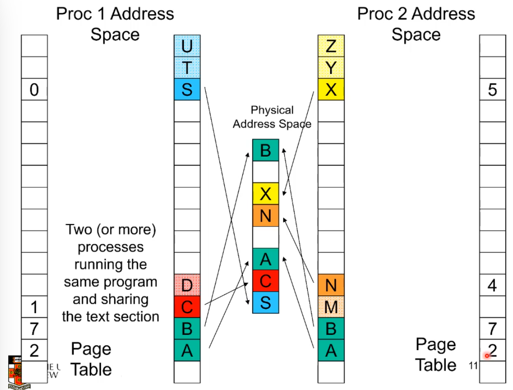

# Course Information

## Interesting Facts
---

C is the dominent language for OS and embedded systems

In code such as 

```c
int *a, *b;
```

Will just set up two pointers but not initialise them and thus a and b point to random places because they hold junk data. **wow**

## Assignments
---

We use OS/161 which was develoepd by the Systems Group at Harvard and contains roughly 20,000 lines of code and comments. 

A lot easier then unix, there are missing parts that we get to code up!

80% is understanding and 20% programming, less coding, more understanding. write code that you are somewhat sure works. build it up slowly. 

There is a warmup excersize that is due monday week 4 8am.
the main goal of this is to set up a build enviornment and code navigation system because there are 300 files and you need to hop between easily. 

vim emacs, sublime -> nail one down and have it set up so you can hop to a function defintion with one click and not look for the file. 

## Textbook
---

Andrew Tanenbaum Modern Operating Sytems 3rd and 4th addition prentice hall -> a good read apparently

# Introduction to Operating Systems

## Role 1 of the OS
---

> The operating system is an abstract machine

An os provides high level abstractions and extends basic hardware with added functionality. It allows a common core for all applications and allows the details fo the hardware to be hidden away. Makes application code portable, code can be cross computer because the os handles the direct interfacing with cards. 

## Role 2 of the OS
---

> The operating system is responsible for allocating and mediating resources between competing users and processes. It helps prevents world war `0011`

It must ensure no starvation of resources, progress (doesn't halt) and that allocation is according to some desired policy, first come first server or maybe weighted fair share it depends on the context. 

Overall the os must make sure the system is efficiently used. 

## Role 3 of the OS
---

> The os must enforce the "extended" machine, seperating itself from applications so it can enforce resoure allocation policies and prevent applications from interfeting with each other. 

The operating system is the nucleus or supervisor of the system because it is a privilaged (not user) system.

Applications should not be able to interfere or bypass the os. 


## Computer Structure
---
#### Basic

The operating system Kernel is the portion of the operating system that is running in privileged mode, it resides in main memory and contains fundamental functionality that other applications are built on. As such it must handle security as any application should not be able to break through the os to manipulate hardware. 

This means usually a computer system is split into user and kernal mode. user mode is what applications run in but a kernal mode is what the os runs in. 

When you call malloc or printf you are calling system libaries that interact with the os which is the only thing that can access devices and perriphals.
in some cases some applications do get access to devices exactly for example in frame buffers where going through the os would take too long for a time critical application. 

> The OS is the big dog

The os interacts with load and store instructions to all memory, cpu and devices registers and interrupts. any sort of hardware interaction goes through it
Note that this os code is not special, it's normal C code but the code just runs in privilged mode which makes it different. 

#### System Libraries

Now Applications interact with themselfes and system libraries but system libraries make `system calls` to the os in the kernal. 

Sometimes the system libraries don't need to interact with the os like mem copy, which you could code yourself, the os isn't need to move memory from one place to another. 

But some functions need to get the os involved. printf for example uses the write system call so the os can output something to a file or to the terminal. 
The system call does return something, either a success or error message or data if you are having a read system call. So the system libraries just act as a wrapper to help faciliate these system calls easier. 

system calls functions are in the library for convience if you want to use them directly

```bash
man syscalls
```

#### Privilege-less OS
Some Embedded OSs have no privileged component – e.g. PalmOS, Mac OS 9, RTEMS

These work the same as usual but without seperating, the os can not enforce any rules but only implement the abstractions as suggesting. 
Because all the code runs in a single memory space is a application goes down and crahses or is buggy, it all goes down, the od can't enforce each application to be seperate and isolated. 

> If i go down i'm taking you all with me

lmao i guess that means in some instances privilege is good

#### Operating System Software

The os is simple normal code, but it has to relinquishes control of the processor to execute other programs. This is done with the pretense/assumptions that the os will reestablish control after some system call from the application or through a interrupt (the os must come in to do something every 50 seconds and will shove aside application code or if someone plugs in a usb)

Do note that even though it is simple C you do not have the standard libraries because you are in the os. you can't use malloc in the os if malloc asks the os for memory. 


#### Structure
If you see a outline of os where it's just a simple onion like layered system, run. That is outdated and not right. If you see that in a book and keep reading it's all ogre from there. `I HAD TO I'M SORRY`

IN practice layering is only a guide, Operating systems have many interdepencies. the scheduling will rely on virtual memory and the vm will rely on I/o and rely on files but files rely on Vm etc etc.

It's not exactly a spaghetti nest but rather closer to a reasonable stucture of dependecy. This can be called `The Monolithic Operating System Structure`

## Major OS Concepts Overview
---

#### Processes
A program in execution. In essence a unit of resource ownership. A process id just tags something as having some amount of resource at the moment. 

A process does not have to be a program or have to be executing something. 
A process is loaded with code, it's seperate.

Note that for the os/161 only has 4k big stack, so avoid recurrsion in your os code. You will blow out the stack lmao

#### Process State
Consists of three components

- The program code
- The data needed by the program
	- Data
	- Stack 
- The execution context of the program
	- registers
	- program counter 
	- stack pointer 
	- internal os variables 
		- files that are open
		- etc. 

#### Memory Management

All about isolating processes so they can't access each others memory and also automatic alocation and amnagement of memory so users don't have to deal with data structures and physical memory. 

On top of this the os also has to handle protection and access control so every process can't just go wherever. 

and there is of course virtual memory and file systems

#### Virtual Memory

This allows programers to address memory from a logical point of view, it lets you use memory as if it makes sense. It's simple from `0x00000000` to `0x10000000`. 
This is not how physical memory works, this is a lie. an illusion. 

THE os gives logical addresses independent of other process and lets the user have the illsuion of have a lot of ram eventhough physically there isn't. 

It also allows processes to feel like they are in memory but really the os just is switching between giving both access quickly.

Because of all of this stuff the os has to handle, most microprocessors has a memory management unit that transltes program memory addresses into main memory addresses. It does this in real time at incredible speed. 

#### File Systems
Implements long term storage and helps organise data into objects called files. 
This lets us have meaningful names and structures to represent our data. 


#### Scheduling and Resource Management

This is to do with allocating processing cpu time and you want this to be fair to all processes but of course sometimes you want to have `differential responsiveness` to prioritise jobs and of course we always want to maximise efficiency. Maximising throughput and minimize response time and accomodate as many users as possible. 


# System Calls interface


## Intro
---


> the system call interface represents the abstract machine provided by the operating system. The set of systems calls that a OS offers are effectively the interface to the abstract machine

There is one and only one system call interface

The application attaches to system libraries which interacts from user mode to the os in kernel mode exclusively though System Calls. 

We can view system calls as special function calls that when called in kernel perform privileged operation and returns to original caller with the result. But it does this in a way that maintains system security. 

## Overview
---

The main things the system call interface allows for

1. Process management (coordinate activities on machine)
2. File i/o (allow for data to be stored for longer then just the program runtime)
3. Directory management
4. other (see man syscalls on linux)

#### Process Management

Some examples of a process management interface in unix are

calls | description
:--- | :---
`fork()` | Creates a child process identical to the parent but The child returns 0 where the parent returns the process id of the child to differentiate them |
`waitpid()` | wait for process to finish |
`execve()` | replace a processes core image |
`exit()` | exit a process with a given status code

there are many variants of `exec` functions which all just replace the current child within the process itself with the new program. ¸¸¸

It creates a new process by copying a process then replacing the internal program. 
(makes more sense later)

there are of course other features that allow to stop a process after it's starter rather then just wait for it to finish, which it might never do. this is usually called `kill()`

#### File management

calls | description
:--- | :---
`open()` | Opens a file, and grabs a integer which represents the file handler so it can be identified in other system calls. |
`close()` | close the current file. |
`read()` | read data from a file into a buffer |
`write()` | writes data into a file from a buffer |
`lseek()` | Move the file pointer, this is part of the file status and managed by the os |
`stat()`  | Get a files status information, creation time, access time, permissions

#### Directory Management

calls | description
:--- | :---
`mkdir()` | Create a new directory
`rmdir()` | Remove a empty directory
`link()`  | Create a new entry, name2, pointing to name1
`unlink()` | remove a directory entry (doesn't delete the directory unless there are no more entries)


note that link() allows you to create multiple links to the same directory so doing rm on a directory doesn't actually delete it if there is another pointer to it. only when all pointers are destroyed is the folder destroyed. 

#### Random Stuff

calls | description
:--- | :---
`chdir()` | Change the working directory
`chmod()` | change a files protection bits
`kill()`    | send a signal to a process, the process may handle the signal or if the signal is a syskill signal the process won't be able to catch it, it really just tells the os to kill that process (i.e kill and kill -9)
`time()` | gets the elapsed time since epoch

note that the os has to manage each process separately so each process has it's own current directory that can be independently manipulated.  

## Shell
---

note how a lot of these system calls seem like shell commands, that's because shell commands really just have commands that are wrappers for sys calls a lot of the time. They often just check input and make sure it's well formed and stuff. 

So we can totally build our own shell, the shell we use isn't special just that the os is configured to pull that one up by default. 

```c
while (TRUE) {
	//Display prompt
	type_prompt();
	//Get input
	read_command(command, parameters);
	
	// create a copy and wait for it to finish.
	if (fork() != 0) {
		/* Parent code */
		waitpid(-1, &status, 0);
	} else {
		/* Child code */
		// run the needed code in the child
		execve (command, parameters, 0);
	}
}
```

note if fork != 0 fork returned the process id, i.e i am the parent. if 0 i am the child. 

windows has a very similar sys call structure.


# System Call Implementation

## CPU Computation
---
We need a simple basic understanding of cpu computation before we can look at how OS161 works under the hood mostly so we can better understand how to cross the user-kernel boundary. 
So lets build up a abstract micro processor

#### The fetch execute cycle

At the start the machine has 1 register, the program counter, and a cycle to load memory contents from address in program counter (load the instruction), execute it, increment the Pc and repeat

```python
while(True)
	ins = getInstruction(pc)
	ins.run()
	pc++
```

with this the only instruction is a no-op, pass, nada, do nothing 

#### More Registers

Now lets add in some more so we can do something other then a no-op

Lets add in a general purpose register set that can hold operands of most instructions and enables programmers or compilers to minimise memory references. they are very fast. 

Now if we want to encode more complex instructions we need to do arithmetic/logic so we are going to add status registers to help us know if the last calculation was positive, negative, zero as well as other information about the system

We are also going to add a stack pointer register to keep track of the memory address of the top of the stack. 

What we have done is given the cpu a more complex state that needs to be kept track of. 

#### Privileged-mode Operation

To protect operating system election, two or more cpu modes of operation exist. 

when the cpu is in Privileged mode all instructions and registers are available. 

when in user mode we get only access to safe subset of these things, the things that only effect the state of the application, not other applications or the OS. 

an example of some things that are hidden in user mode are

* Interrupt masks
* Exception Type (gives information on why the os was given control again etc.)
* MMU regs (memory management unit has it's own registers to help it serve/write memory)
* other

one instruction that might be blocked for users is `cli` which disables interrupts. If this was available to applications, a app could do

```python
cli
while(True)
	pass
```

If this runs the operating system will never get control and the system will just run forever or crash. 

the os can only get access to the processor if the program runnings asks or if a timer interrupt goes off giving it access. if the interrupts are off then whoops. 

if you tried to run this on css or something, the cli will trigger a exception because you are not allowed to run it and the os will know.... it'll know

There is also a memory split up, in user mode there is only a subset of memory allowed whereas the os sees all of memory. 

the exact memory ranges are usually configurable and vary between CPU  architectures and/or os

so when a application makes a sys call there is a transfer to the os in kernel mode, first the os in kernel mode figures out the exception that called it and what it is asked to do by the sys call, it does it and then it needs to return this value back to the application in user mode.

note that sys call needs to switch the processor to run os code but also switch it so this is run in kernel mode. 

## System call mechanism
---

By the end of this topics you should be able to answer a couple of main questions

1. There is only one register set so how is this managed and how does an application expect a subset call to look like
2. How is the transition triggered
3. Where is the OS entry point (system call handler)
4. How does the OS know what to do when i regains control 


now to switch from user to kernel and back there are 2 special processor instructions
we call it the `sys call instruction` sometimes this is call `a trap instruction` because we trick the application into giving us control. 
when we jump back from privileged into kernel that's called a `return from exception instruction`

there are usually 3-4 ways you can do it because of backwards compatibility and them adding better methods to trigger sys calls.

note that sys161 is a simulated microprocessor based off the mips microprocessor that came out of stand ford

now to do this we need to change some things

1. Processor mode
	* Switch from user-mode to kernel mode
	* switch back when returning
2. SP
	* User-level Stack pointer is saved and a kernel SP is set up
	* This then switches back to what the SP was for the user
3. PC
	* User Level Program counter is saved and the Program Counter is set to kernel 	entry point (wherever in memory that is)
	* Kernel entry via the designed entry point must be strictly enforced, i.e you 	can't jump to random bits of os code that will run in privileged mode
4. Registers
	* Set at user-level to indicated system call type and it's arguments
		* set by a convention between applications and kernel
	* Some registers are preserved at user level or kernel level in order to 	restart user-level execution
		* i.e some registers are not touched so the application can continue
		* depends on the calling convention
	* Result of system call placed in registers when returning to user level
		* can also be thrown into a given buffer in user memory
	
note that the application and OS have two separate stacks so application can't corrupt it's own stack and fuck up the OS or to use it for nefarious reasons. 

why do we need system calls and not jumps to os code?

Function calls do not change from user to kernel mode and back and restrict possible entry point to secure locations to prevent entering after any security checks. 

#### Step by Step


1,2,3 push to the stack, the top block is the system call library which is called at step 4, it sets up the registers and calls the OS via a trap. the os does it things in steps 7 and 8 and then in step 9 jumps back to the sys call library that then returns to caller. in step 10 it increments the stack pointer (since stacks grow down this deletes the top of the stack which the sys call put on)


# The MIPS R2000/R3000
## Intro
---
This is the Microprocessor the the OS161 uses/emulates.

it's quite simple and doesn't have a million years of legacy and history to keep track of. 

## Load Store Architecture
---

There are no instructions that interact with memory other then `load` and `store`

| ins | action|
|---|---|
|`sw r4, r5`|store word store r4 into the address in r5 |
| `lw r3, r7`| loads into r3 from r7 |

with load 
Delay of one instruction after load before data available in destination register
i.e Must always an instruction between a load from memory
and the subsequent use of the register

There are also other variations like sh which is tore half word etc. to work with different sizes

This load store architecture means that all arithmetic is done with registers or immediate. note constants can only be 16 bits. 

`add r3, r2, r1 ⇒ r3 = r2 + r1`
`addi r2, r1, 2048`

note you can do `32(r29)` to offset a address in r0 by 32. I.e there is a variable at offset 32 on the stack where r29 is the stack pointer. 

lets do a + a + 1

```
lw r4,32(r29)      //r29 is stack pointer
li r5, 1
add r4, r4, r5
sw r4,32(r29)
```

## Registers
---

there are 32 general purpose, (2 of which are special, see below) all 32 bit. 

There are a couple of special registers aside from general purpose ones as well. 

in total we have 32 + 3 registers. 32 general, 3 special

| register | what makes it weird |
|---|---|
|r0 | hardwired to always be 0|
|HI/LO| 2*32-bit registers for multiply and divide |
|PC| program counter, not directly visible or editable by user |
| r31 |the link register for jump-and-link (JAL) instruction, known as the Return Address register RA |

## Branching and Jumping
---

Branching and jumping have  a branch delay slot
The instruction following a branch or jump is always executed prior to destination of jump

For example at location `1:` in this code

```
   li r2, 1
   sw r0,(r3)
   j 1f
0: li r2, 2
   li r2, 3
1: sw r2, (r3)
```
r2 is actually 2, because step 0: did run before the jump

this is because the chip is very pipelined. the li instruction is partially through pipeline prior to jmp having an effect. By the time the jump takes effect the li has already executed. 

 

Some microprocessors store the pipeline if it sees the jump coming, others throw out the partial pipe. 
this chip forces the compiler / user to deal with it. `lmao dicks.`

## Jump and Link instruction
---
This is called JAL and used to implement function calls. 

Return Address register (RA) is used to return from function call, it is the current program counter + 8 at the time of function call. I.e the current instruction + 8 bytes, i.e the next instruction. 

note RA is r31 as discussed previously.

## Compiler register conventions
---

Given 32 registers there needs to be a convention for a compiler to define what registers are used for what. I.e Local variables, argument passing, function call results, stack pointers. 

This is decided by the people creating the compiler. Although sometimes the hardware does force some registers for some tasks but mostly it's up to the compiler writers. 

 

## Example
---

Simple factorial Program in C

```c
int fact(int n)
{
	int r = 1;
	int i;
	for (i = 1; i < n+1; i++) {
		r = r * i;
	}
	return r;
}
```

Same program in MIPS
line numbers are 4 byte blocks

```assembly
  	1880000b 		blez a0,30 <fact+0x30>
  	24840001 		addiu a0,a0,1
  	24030001 		li v1,1
  	24020001 		li v0,1
 	00430018 		mult v0,v1
 	24630001 		addiu v1,v1,1
 	00001012 		mflo v0
 	00000000 		nop
 	1464fffc 		bne v1,a0,14 <fact+0x14>
 	00430018 		mult v0,v1
 	03e00008 		jr ra
 	00000000 		nop
 	03e00008 		jr ra
 	24020001 		li v0,1
```

## Function Stack Frames
---

Each function call allocates a new stack frame for local variables, the return address, previous frame pointer etc.

lets assume f1() calls f2()

 

note that this whole stack pointer is the bottom and frame pointer is the top is sorta confusing because stacks grow downwards but just go with it lmao

now when we call f2 we shift `frame pointer` down by f1() stack frame size where as the `stack pointer` moves down by the f2() stack size

 

you can learn more about this by googling `alloca`

In the mips gcc calling convention, 
Args 1-4 have space reserved for them, if there are more, gcc puts them on the stack. 

 

#### Example
C code:

```c
main (){
	int i;
	i = sixargs(1,2,3,4,5,6);
}
int sixargs(int a, int b, int c, int d, int e, int f){
	return a + b + c + d + e + f;
}
```

assembly

```
<main>:
	27bdffd8 addiu sp,sp,-40  // allocate stack frame sp = sp - 40 
	sw ra,36(sp)              // store return address
	sw s8,32(sp)              // store s8 
	move s8,sp                // move stack pointer into s8
	li v0,5                   
	sw v0,16(sp)              // store 5 into the stack (args)
	li v0,6                   
	sw v0,20(sp)              // load 6 into the stack  (args)
	li a0,1                   // start loading arguments
	li a1,2
	li a2,3
	jal 4000b0 <sixargs>      // call function
	li a3,4                   // use jump delay to load in arg 
	sw v0,24(s8)              // store return value on stack        
	move sp,s8                // restore stack pointer
	lw ra,36(sp)              // restore return address
	lw s8,32(sp)              // restore s8
	jr ra                     // jump back
	addiu sp,sp,40            // deallocate stack frame in delay slot
```
note v0 is from the calling convention, value returned by subroutine 0
now the next bit seems stupid, it's not optimising so it's gonna push everything onto the stack. 

```
<sixargs>:
	addiu sp,sp,-8
	sw s8,0(sp)
	move s8,sp
	sw a0,8(s8)
	sw a1,12(s8)
	sw a2,16(s8)
	sw a3,20(s8)
	lw v1,8(s8)
	lw v0,12(s8)
	nop
	addu v0,v1,v0
	lw v1,16(s8)
	nop
	addu v0,v0,v1
	lw v1,20(s8)
	nop
	addu v0,v0,v1
	lw v1,24(s8)
	nop
	addu v0,v0,v1
	lw v1,28(s8)
	nop
	addu v0,v0,v1
	move sp,s8
	lw s8,0(sp)
	jr ra
	addiu sp,sp,8
```

## CoProcessor 0
---

#### Intro
- The processor control registers
are located in CP0
	- Exception/Interrupt management
registers
	- Translation management registers
- CP0 is manipulated using mtc0 (move to) and mfc0 (move from) instructions
	- mtc0/mfc0 are only accessible in kernel mode. 

This coprocessor 0 is only manipulated by those move into coprocessor and move out of coprocessor. which is good because it can do stuff like memory management and keeps track of what mode the chip is in. 

#### Registers

quite a lot but lets focus on Exception Management
- c0_cause
	– Cause of the recent exception
	- there are many such as interrupt or syscall etc.
- c0_status
	– Current status of the CPU
- c0_epc
	– Address of the instruction that caused the exception

c0_Status

 

c0_cause

 

c0_epc

The Exception Program Counter, Points to address of where to restart execution after handling the exception or interrupt

Note that once a exception hits there is a list of exception vectors which are referenced by the exec code in c0_cause

 
 

## Hardware exception handling
---

1. Pc gets moved into EPC
2. we then set the c0_status
	- we set kernal mode 
	- interrupts are disabled and all the bits are shifted
	so the current status has been moved into the spots reserved for "previous" values i.e KUp, IEp
3. cause for exception places in c0_cause
4. place the exception handler address into the PC
5. move back into software now in kernal mode
6. exception stuff is done
7. put the return stuff which was stored in EPC into PC
8. shift the status back over to restore the state
9. set the mode back to user
10. jump back

## Software of Exception handling
---

what a sys call does / where the arguments are is defined by a convention. 

for OS/161

Arguments are passed and returned via the
normal C function calling convention Additionally

- Reg v0 contains the system call number
- On return, reg a3 contains
	- 0: if success, v0 contains successful result
	- not 0: if failure, v0 has the err no in it
		- v0 stored in errno (This is defined as some place)
		- -1 returned in v0

 

## OS161 Code walkthrough
---

lets the called the read() syscall function

```
move a0,s3						// Input Filehandle
addiu a1,sp,16					// set up buffer pointer input arg
jal 40068c <read>				// call system library read
i a2,1024							// delay slot: pass in buffer size
move s0,v0                    // get result
blez s0,400194 <docat+0x94>	// handle error (-1 result)
```

we just call it and test the return value. now lets go into read library function

we jump into the syscall and load 5 into v0 because the exception needs to know what the exception is (5 means syscall). note this runs before the jump because of the jump delay

```
0040068c <read>:
	40068c: 08100190 j 400640 <__syscall>
	400690: 24020005 li v0,5
```

now in the syscall function

```
00400640 <__syscall>:
    // Raise exception
	400640: 0000000c syscall
	// check result, jump to jr ra if good else do error handling
	400644: 10e00005 beqz a3,40065c <__syscall+0x1c>
	400648: 00000000 nop
	// error handling
	// at is err no
	40064c: 3c011000 lui at,0x1000
	400650: ac220000 sw v0,0(at)
	400654: 2403ffff li v1,-1
	400658: 2402ffff li v0,-1
	// return
	40065c: 03e00008 jr ra
	400660: 00000000 nop
```
From the caller’s perspective, the read() system call behaves like a normal function call

- It preserves the calling convention of the language

However, the actual function implements its own convention by agreement with the kernel

- Our OS/161 example assumes the kernel preserves appropriate registers(s0-s8, sp, gp, ra).

Most languages have similar libraries that
interface with the operating system.

lets look at the actual Os/161 code now

```
exception:
	/* Save previous stack pointer in k1 */
	// we use k1 because the operating systems 
	// interrupt systems don't touch this by convention
	move k1, sp
	/* Get status register, we need some info*/
	mfc0 k0, c0_status
	/* Check the we-were-in-user-mode bit */
	andi k0, k0, CST_Kup 
	/* If clear, from kernel, already have stack, jump to 1 */
	beq k0, $0, 1f 
	/* delay slot */
	nop 
	
	/* Coming from user mode - load kernel stack into sp */
	/* get address of "curkstack" current kernal stack */
	la k0, curkstack
	/* get its value */
	lw sp, 0(k0) 
	nop // delay
1:
	/* Now, load the exception cause. */
	mfc0 k0, c0_cause
	/* Skip to common code */
	j common_exception 
	nop // delay
```


```
common_exception:
	/*
	* At this point:
	* Interrupts are off. (The processor did this for us.)
	* k0 contains the exception cause value.
	* k1 contains the old stack pointer.
	* sp points into the kernel stack.
	* All other registers are untouched.
	*/
	/*
	* Allocate stack space for 37 words to hold the trap frame,
	* plus four more words for a minimal argument block.
	*/
	addi sp, sp, -164
	
	/* The order here must match mips/include/trapframe.h. */
	
	//ignore this, it's to trick gdb
	sw ra, 160(sp) /* dummy for gdb */
	sw s8, 156(sp) /* save s8 */
	sw sp, 152(sp) /* dummy for gdb */
	sw gp, 148(sp) /* save gp */
	sw k1, 144(sp) /* dummy for gdb */
	sw k0, 140(sp) /* dummy for gdb */
	// end ignore code
	
	sw k1, 152(sp) /* real saved sp */
	nop            /* delay slot for store */
	
	mfc0 k1, c0_epc /* c0 reg 13 == PC for exception */
	sw k1, 160(sp)  /* real saved PC */
	
	// save the entire state onto the stack
	sw t9, 136(sp)
	sw t8, 132(sp)
	sw s7, 128(sp)
	sw s6, 124(sp)
	sw s5, 120(sp)
	sw s4, 116(sp)
	sw s3, 112(sp)
	sw s2, 108(sp)
	sw s1, 104(sp)
	sw s0, 100(sp)
	sw t7, 96(sp)
	sw t6, 92(sp)
	sw t5, 88(sp)
	sw t4, 84(sp)
	sw t3, 80(sp)
	sw t2, 76(sp)
	sw t1, 72(sp)
	sw t0, 68(sp)
	sw a3, 64(sp)
	sw a2, 60(sp)
	sw a1, 56(sp)
	sw a0, 52(sp)
	sw v1, 48(sp)
	sw v0, 44(sp)
	sw AT, 40(sp)
	sw ra, 36(sp)
	
	/*
	* Save special registers. so we can use them
	*/
	mfhi t0
	mflo t1
	sw t0, 32(sp)
	sw t1, 28(sp)
	
	/*
	* Save remaining exception context information.
	*/
	sw k0, 24(sp)      /* k0 was loaded with cause earlier */
	mfc0 t1, c0_status /* c0 reg 11 == status */
	sw t1, 20(sp)
	mfc0 t2, c0_vaddr  /* c0 reg 8 == faulting vaddr */
	sw t2, 16(sp)
	/*
	* Pretend to save $0 for gdb's benefit.
	*/
	sw $0, 12(sp)
	/*
	* Prepare to call mips_trap(struct trapframe *)
	*/
	addiu a0, sp, 16 /* set argument */
	jal mips_trap /* call it */
	nop /* delay slot */
```

now we move into C

we pass a pointer to the stack and let the c code
pretend like it is a instance of the struct trapframe. 
this means they can just use struct references instead of
working with offsets directly. 

```c
struct trapframe {
	u_int32_t tf_vaddr;		/* vaddr register */
	u_int32_t tf_status;	/* status register */
	u_int32_t tf_cause;		/* cause register */
	u_int32_t tf_lo;
	u_int32_t tf_hi;
	u_int32_t tf_ra;		/* Saved register 31 */
	u_int32_t tf_at;		/* Saved register 1 (AT) */
	u_int32_t tf_v0;		/* Saved register 2 (v0) */
	u_int32_t tf_v1;		/* etc. */
	u_int32_t tf_a0;
	u_int32_t tf_a1;
	u_int32_t tf_a2;
	u_int32_t tf_a3;
	u_int32_t tf_t0;
	⁞
	u_int32_t tf_t7;
	u_int32_t tf_s0;
	⁞
	u_int32_t tf_s7;
	u_int32_t tf_t8;
	u_int32_t tf_t9;
	u_int32_t tf_k0;		/* dummy (see exception.S comments) */
	u_int32_t tf_k1;		/* dummy */
	u_int32_t tf_gp;
	u_int32_t tf_sp;
	u_int32_t tf_s8;
	u_int32_t tf_epc;		/* coprocessor 0 epc register*/
}


/*
* General trap (exception) handling function for mips.
* This is called by the assembly-language exception handler once
* the trapframe has been set up.
*/
void mips_trap(struct trapframe *tf) {
	u_int32_t code, isutlb, iskern;
	int savespl;
	/* The trap frame is supposed to be 37 registers long. */
	assert(sizeof(struct trapframe)==(37*4));
	/* Save the value of curspl, which belongs to the old context. */
	savespl = curspl;
	/* Right now, interrupts should be off. */
	curspl = SPL_HIGH;
	...
```

The kernel deals with whatever caused the
exception and then returns to the assembly code (note of course this c code is assembled down but we abstract out that section and look at the c code, because there is c code, the previous and after stuff was hand coded in assembly. 

The return code is quite long and really just reverses the start code. 
it restores the state and sets the stack back. 


# Processes and Threads

## Major Requirements of an Operating System
---
• Interleave the execution of several processes to maximise processor utilisation while providing reasonable response time
• Allocate resources to processes
• Support interprocess communication and user creation of processes

## Overview
---

#### Processes

Also called a task or a job. 
it is the "owner" of resources allocated for program execution
usually encompasses one thread but can encompass more. 
Some processes (lets say excel) need more threads. 

#### Threads

1 unit of execution
can be traced as it lists the sequence of instructions that execute, the actual activity of the program. 

Belongs to a process and executes within it, encompassed by a process. 

#### Example

Here are 3 single threaded programs


Assuming there is no virtual memory, there is simply 3 processes in memory that can be run in some sequence depending on where the program counter is. Note that the logical trace below shows that the programs are very straight forward, no branching or loops. 


We start to execute process A then a timer interrupt hits, then the shaded region runs the dispatcher, otherwise known as the scheduler.

Then process B starts running  which then hits a I/O Request at what point it stops and waits for an answer from the system call. 
Now wouldn't it be great if the processor did some work here while waiting for the I/O call to happen. At the moment it just waits, `HOW WASTEFUL`

## Process model
---

In this model each program has it's own program counter and this all make progress at the same time, how awesome. 
But that's not exactly how it works. Only one program is active at any instant. 
It just does it fast enough that the user thinks they all are happening at the same time (assuming a uni processor, with multi you CAN run multiple programs at the exact same time)


Note that the scheduler organises this and can actually set some processes to be high priority and thus it doesn't switch as that runs. 

Now note we can have multiple ways to organise a os to run processes and threads

- One process in the program, can only have 1 thread
	- Dos actually did this lmao
- multiple processes, single thread per process
	- Traditional unix (fork kinda faked multi thread by letting you make a new process)
- Multiple processes multiple threads per process
	- any modern general purpose protected os
- One process, multiple threads
	- os/161
	- it's missing the functionality to create more processes
	- this is something extended students do `lmao fuck.`

## Process Life
---

#### Creation

Principal events that cause process creation, Technically, all these cases use the same system mechanism to create new processes.

1. System initialisation
	- Foreground processes (interactive programs)
	- Background processes
	- Email server, web server, print server, etc.
	- Called a daemon (unix) or service (Windows)
2. Execution of a process creation system call by a running process
	- New login shell for an incoming telnet/ssh connection
3. User request to create a new process
4. Initiation of a batch job


#### Termination

can be:

1. Normalexit (voluntary)
2. Errorexit (voluntary)
3. Fatalerror (involuntary)
4. Killed by another process (involuntary)

involuntary is when the process does something that the os can't fix for it. I.e divide by 0, accessing invalid memory, infinite loop. 

error catching is when a program can ask the os to not kill it but to tell it the error so it can handle it. 

#### States


note that blocked is a process/thread that is now waiting for something. this is usually done via a device interrupt which the os notes and does the relevant logic to unblock a process. 

note that some programs can do a syscall `yield()` which is a program voluntary saying make me ready switch to another program. When the program is waiting for something internally. 

this sucks because the scheduler will keep waking the process up, use blocked by this, if you want to wait 5 seconds, register a timer interrupt event with the os. `TODO CHECK`

## Scheduler
---

Sometimes called the dispatcher, but long story short a usually complex system for choosing a ready process to run efficiently. In general we don't want to search through all the processes. This will happen often and if you have 100 or 1000 threads. That is gonna cause issues

similarly if we get a unblocking interrupt we don't want to search through all the processes to find the one to switch. This is why blocked processes are in a separate list. 

#### The Ready Queue

Simple queue, based on when a thread became ready, if a process gets switched into the ready state it goes to the end, if it exits it just is removed from the structure. 

Equal chance for everyone. 

With blocking added into the mix we get


note the timeout is just the scheduler kicking in to switch processes.

this is simple isn't it `WELL IT ISN'T GROW UP IT'S FUCKED`

 

Each event has it's own queue, if 7 events are waiting for a specific network packet they all are grouped together separate to the processes who are waiting for a specific hard drive response. 

This means the queues are usually quite small, 1 long most of the time. 

## Implementation of Processes
---
A processes’ information is stored in a process control block (PCB)

- The PCBs form a process table
- Sometimes the kernel stack for each process is in the PCB
- Sometimes some process info is on the kernel stack
	- E.g. registers in the trapframe in OS/161
- Reality is much more complex (hashing, chaining, allocation bitmaps,...) then a simple array. 

the PCB holds a lot of information like the process registers, program counter, process id, signals, cpu times uses children, time of next alarm, pointer to text segment or data segment or stack segment or root directory, working directly for the process. Each shell you has a separate location it is currently cd'ed into. 

## The Thread Model
---

threads execute in a environment (process) but each thread has it's own set of things to keep track of

program counter, a stack per thread, registers, generally the state of the thread. other things like pending alarms etc. are managed by the process. 


# Thread Analogy

## Single Threaded
---
lets say we have a mcdonalds we have to manage. 
At the moment we have 1 worker. He has to do everything. 

We have colours that symbolise types of activities
1. Blocking activities are yellow, they delay all activities
2. Reaction activities are green, they are reactions to events


## Multi Threaded
---

Now if we get more employees we can delegate tasks. if we ignore synchronisation issues we get this


This models a normal producer consumer relationship. 

the front of the restaurant consumes burgers but produces orders. 

now this still sucks, if the fries take a while everybody else waits for the fries. but now we can just scale up the slower activities. 


we now maintain a simple procedural workflow for each worker but 

## Finite-State Machine Model
---

this is a event based model where we can separate out the a-syncronous
external activities. This lets it be single threaded but it's much more complicated because everything can happen at any point. 

it's not procedural and thus requires a lot of documentation to keep track of where we are and what is happening. 


there may be 5 burgers and 4 fries all finishing and 6 orders all that you have to handle at the same time. 

# The Thread Model

## intro
---

Each thread has it's own stack and has a simple procedural workflow. 


this makes sense because you want all local variables to be local to each thread and have it's own function call stack. 

but do note that global variables don't have a stack, they are actually in the process memory space so can be accessed by any threads, they are shared. thus we have to manage concurrency with these things. 

A pointer can be local or global. malloc can return both. memory allocated on the heap can be local or global depending on the pointer, if the pointer is visible to all threads it's global if not local. 


## Computation state
---

with the finite state machine model the state is managed by the program explicitly but with the thread model it's done simply by storing the relevant details on the stack which is unique and distinct for every process (employee)

## Thread Usage
---

#### text editor

Lets say we have a text editor. It has 3 threads. one to react to the keyboard, one to manage the screen output, one to read and write to disk. 

note that in this format the screen thread can sit in a loop and constantly refresh the display without having to then poll other threads or stop for a random keyboard input. 

It has a simple task, and it just blocks or waits for something. 
And the amazing thing is the loop isn't a busy loop burning cpu, it updates, then it can block and wait for something to change, letting other threads do more computationally heavy stuff like if the disk thread has to save a very big file. 

#### Handoff / servers

A cool things with servers is that if reacting to a request takes a while you can have 2 threads, one to receive incoming requests, accept them and put them on a stack and another thread to process them so people aren't trying to connect with your website and being ignored while some disk i/o function is running. 

There are 3 ways to set up a server though

- Single-Threaded Model
	- No Parallelism, system calls and block.
- Threads
	-  Parallelism but system calls still block
- Finate-State 
	-  Parallelism non blocking system calls, use interrupts
	-  rely on async calls
	-  if you call read() it will return but that doesn't mean the file 	was read, when it finally was the program is alerted. 
	-  This requires you to keep track of the state of the machine and 	what's current in flight. More challenging. 


## Why threads
---

- Simpler to read
- less resources, having multiple threads in one process is less costly then having multiple processes because forking a whole new version of a server program like apache is fucken costly
	- On a further note it helps share memory between threads
- you can over write slow I/O with computations in other threads, slow I/O doesn't stop the program in it's track
	- note that we also sometimes get that all the threads are compute bound and that causes no performance upgrade on a uni processor system
	-  compute bound just means that the cpu is near 100% utilisation so having more threads doesn't increase speed anymore, the cpu is doing the best it can. 
- threads can take advantage of multi core computers, such as phones

# Concurrency and synchronisation

having lots of threads is great but now if they arn't synced up you get clashes and issues. 

## Example
---

lets say we have these two functions that run on separate threads

```c
void increment () {
	int t;
	t = count;
	t = t + 1;
	count = t;
}

void decrement () {
	int t;
	t = count;
	t = t - 1;
	count = t;
}
```

if we run we can't say what count will be at the end it could be 0, 1 or -1. whoever finishes last will over ride the other functions result. this is called a `race condition`, it's a race, whoever finishes first has their result destroyed. in this game the guy who comes last wins. 

A lot of issues arise with this simple concept of two processes trying to access some data both have access to, in this case it's a global variable but it could be a shared piece of memory, a linked list maybe, a print queue. 

This can even be a issue with internal variables the kernel handles like error no, if a error occurs in the middle of a error handling system it can over run some variables that were being used to calculate what to do. 

## Critical Region
---

We can control access to the shared resource by controlling access to the code that accesses the resource.

- A critical region is a region of code where shared resources are accessed or any region of code whose correctness relies on it not being interrupted or anything it uses to be concurrently modified.
	- Variables, memory, files, etc...
- Uncoordinated entry to the critical region results in a race condition
	- Incorrect behaviour, deadlock, lost work,...

The hard part is funny enough IDENTIFYING where there are these critical zones are so we can deal with them. 

like here they are for a linked list building program example


#### A solution

A good solution has multiple parts, it firstly has some level of `mutual exclusion`. 

If a process is in a critical region it flags that "I AM ABOUT TO DO SOME SHIT, DO NOT INTERRUPT ME"
anything that tries to will be blocked until it's done and it says "Alright i'm no longer in the critical region you can do what you need to"

it's basically us stating and then enforcing that "i expect that between lines 2 and 4, the value of `count` does not change. 

the solution `DOES NOT make assumptions on cpu type, number or speed`

it must handle `progress` correctly in that it doesn't let any process running outside the critical region may block another process. I.e only one process can hold a lock at a time. 

it also must be `bounded` if it's possible for a process to wait forever before entering a critical region because some asshole won't give up the lock, that's a issue. 

## Locks
---

Lets build up a Abstract Data type go handle this, lets start off with something simple. a flag. 

#### Flag

```c
int lock = 1; // i am locked
int lock = 0; // lock is over
```

is this good? well not exactly, what happens here

```c
// process 1
while(TRUE) {
  while(lock == 1);
  lock = 1;
  critical();
  lock = 0;
  non_critical();
}

//process 2
while(TRUE) {
  while(lock == 1);
  lock = 1;
  critical();
  lock = 0;
  non_critical();
}
```

both run and whoops, process 1 stops at line 4 (just after executing line 3) to let process 2 have a go, it goes down into 14 and does some stuff and then hands back over to process 1 at some point. 
1 goes down, re sets the lock 1 and does it's critical stuff. 
uh-oh both are doing their critical stuff at the same time. 

Great solution dingus, but don't be hard on yourself. It's very easy to prove something doesn't work but very hard to prove that something will work for all cases. 1 fail case is all it takes. 

#### taking turns


this works off the fact that the only person currently in power can set the turn and ths prevents race conditions. 

it works via the concept of `strict alternation`

it works! but it kinda sucks

- uses busy loops
- Process must wait its turn even while the other process is doing something else.
- sucks at handling multiple processes because some threads needs more turns then others, and everyone gets a turn before the token comes around and gives someone a turn. this means the entire system is only as fast as the slowest thread, if it takes 6 years to run, nothing else can run until it's done, it has a token. 

#### petersons solution

we don't talk about this but look it up if you want, complex system with a series of flags in a array. 

#### Disabling Interrupts

This is like a brute force solution. Just block all interrupts so the scheduler can't switch between threads. simple!! well it has issues

- Only available in the kernel
- Blocks everybody else, including devices or input, it reduces the interrupt response time, a network card may start dropping packets because it's interrupts don't get handled for a second and the buffer fills up
- doesn't work on multi processors because each processor will the have to co-ordinate turning their interrupts off. doesn't really solve the problem then does it, you can't have a system wide all core interrupt switch off. nor really at least. 

#### Test and Set instruction

it's like the lock flag but works correctly because it is built into hardware. the hardware instruction lets you test AND set in one command, it executes atomically, in one step, not in any sort of sub steps. once you run it you have tested and setted it. 

if the lock is open set it, if not inform the program to wait. 

if two try to run the instruction at the same time, one of then will be done first, you can't run two instructions at the same time but as soon as one runs it, it has the lock and the other now waits. 

Perfect. 

still not efficient because of busy loops but it works!!!

and the test and set can be allowed at user level, it doesn't undermine the OS. it totally can be extended for more locks as well

ok but Cons

- Busy waits (also termed a spin lock)
	- Consumes CPU
	- Livelock's in the presence of priorities
		- If a low priority process has the lock and a high priority process attempts to get it, the high priority process will busy-wait forever.
		- The idea is that if the low priority process gets the lock that's great but the os will always give the high priority guy the cpu access. so the high priority sits in a busy loop but because it's high priority the scheduler never gives the cpu to the low priority so it can release the lock. STALE FUCKEN MATE. This is called a live lock. 
- Starvation is possible when a process leaves its critical section and more than one process is waiting. it's possible that a unlucky process never gets a turn because other processes keep getting the lock. There is no idea of fairness built into the lock


## Busy Wait Problem
---

How can we solve this??

#### Sleep / Wakeup

this is the idea that a process can be put to sleep and then woken up. 

also lets just say that waking up a ready/active process doesn't nothing. 

We can use this with locks to sleep something that is waiting for the lock and wake it up when the lock is available. 

We can relate this to `the producer consumer problem` or `BOunded buffer problem` we call it bounded problem problem because this shines when the buffer has a max size that it hits at which point the producer stops giving stuff and is slept untill the consumer says "HEY I JUST TOOK SOMETHING, THERE IS SPACE NOW PRODUCE AGAIN!" and vice versa for the consumer and a empty buffer. 


now we can code this up via normal sys calls to the os to move a process into the sleep or ready states. 

but you have to be careful, both the consumer and the producer can access the memory at the same time, they can both edit the counter at the same time and even if you do `count++` that's not 1 instruction it's 3 `ld m` `m + 1` `st m`

it can also dead lock!! although that's next lecture. 

 


 
# Concurrency 

## Semaphores
---

#### Revision

Remember from last time if we had the producer consumer problem that we can't just have 1 sleep and then let the other run and wake it up because if both are testing the count for a value a race condition will occur, one may pass the test and then by the time it runs the next line of code the buffer is now empty. The test needs to be atomic. So you may be thinking "This is a critical region lets lock it!"
Then we get this

```c
acquire_lock()
if (count == N)
	sleep();
release_lock()
```

```c
acquire_lock()
if (count == 1)
	wakeup();
release_lock()
```

You can see the issue, if a program has the lock and then sleeps, it sleeps forever cause the other code that is supposed to wake it up will never run. 

`NOTE if you lock a region that has a function that in itself tries to get the same lock you get a dead lock. the function waits for the lock which only gets released once that function finishes. `
#### How it works

Dijkstra (1965) of search algorithm fame introduced two primitives that are more powerful than simple sleep and wakeup alone.

- P(): proberen, from Dutch to `test`.
- V(): verhogen, from Dutch to `increment`.
- Also called `wait & signal`, `down & up`.

the semaphore blocks any processes waiting for a recourse nd puts it into a internal queue. 
When a process releases a resource it signals the semaphore who then will resume one of the blocked processes. 
The main advantage is that the wait and signal operations (p and v) cannot be interrupted and thus are effectively atomic. how it does this depends on the implementation

#### Sample Implementation

```c
typedef struct {
	int count;
	struct process *L;
} semaphore;
```

```c
//wait(s):
	S.count--;
	if (S.count < 0){
		// add this process to S.L
		sleep;
	}
//signal(s):
	S.count++;
	if(S.count <=0){
		//remove a process P from S.L;
		wakeup(P);
	}
```

Each primitive is atomic

so lets say you want to call function `B` but only after `A` has been run

```c
//code ..
wait(A_Done_Flag); //the count is now -1, causing the thread to go to sleep
B(); //i woke up! lets go when i'm given the CPU. 
```

```c
//the above thread went to sleep on line 2 so now i am awake
A();
// we now increment the count, it's now 0
// which means a thread must be waiting, activate it!
signal(A_Done_Flag)
//code ..
```

note that if the bottom thread ran first it would increments the count to 1 which gets decremented to 0 at the wait in the first thread, which tells the sophomore to not wait but keep going, the signal that this thread was waiting for already happened.

#### Mutex
Mutex is short for Mutual Exclusion Can also be called a lock

```c
semaphore mutex;

mutex.count = 1; /* initialise mutex */

wait(mutex); /* enter the critcal region, count = 0, keep running*/
Blahblah();
signal(mutex); /* exit the critical region, count = 1 */

```
Notice that the initial count determines how many waits can progress before blocking and requiring a signal. if we had 2 waits in the row the first one wouldn't wait but the second one would. 

so now lets use this to solve the producer consumer problem

```c
#define N = 4

semaphore mutex = 1;

/* count empty slots */
semaphore empty = N;

/* count full slots */
semaphore full = 0; 
```

**Producer**

```c
prod() {
	while(TRUE) {
		item = produce()
		wait(empty);
		wait(mutex); //enter a mutually exclusive critical zone
		insert_item();
		signal(mutex); // exit zone
		signal(full);
	}
}
```

**Consumer**

```c
con() {
	while(TRUE) {
		wait(full);    //decrement the full count, if < 0, sleep. 
		wait(mutex);   //enter a mutually exclusive critical zone
		remove_item();
		signal(mutex); //end critical zone
		signal(empty);
	}
}
```

for a empty buffer the consumer hits wait at line 3, full is 0 i.e no full blocks. it thus becomes -1 and the thread sleeps. 

when the producer hits the signal(full) it does -1 + 1 = 0 and it does it again maybe and we get full = 0. (consumer is woken up!)
at some point it fills it up and full is now 4, while empty is 0. 

empty hits wait on line 4 and then hits a negative value so sleeps. 

now when the consumer runs it signals empty and wakes that up. and now both are awake and working, which is fine because the buffer isn't empty or full. 

`great!` but these an be issues. if the initial value is wrong or forget to match some signal for a wait can cause huge errors and dead locks. 

also complex to think about. 

## Monitors
---

To ease concurrent programming, Hoare (1974) proposed monitors.

- A higher level synchronisation primitive
- Programming language construct

#### How it works

- A set of procedures, variables, data types are
grouped in a special kind of module, a monitor.
	- Variables and data types only accessed from within the
monitor
- Only one process/thread can be in the monitor at any
one time
	- Mutual exclusion is implemented by the compiler (which
should be less error prone) 

you can just go "make sure this series of objects don't clash" rather then "alright these structures work this way with these variables and these flags and signal here and here and here and there and wait here and her eand AHHHHHHHHHHH

Thus we can do the producer and consumer like this because this enforces that producer and consumer can not run at the same time


```c
monitor counter {
	int count;
	procedure inc() {
		count = count + 1;
	}
	procedure dec() {
		count = count –1;
	}
}
```

#### Condition Variables
How to we block waiting for an event

We need a mechanism to block waiting for an event (in addition to ensuring mutual exclusion) we use Condition Variables for this. 

```c
condition x,y;
// means that the process invoking this operation
// is suspended until another process invokes signal
x.wait();
//The x.signal operation resumes exactly
//one suspended process. If no process
//is suspended, then the signal operation has no effect
x.signal();
```

this works with a internal "sleep" and "to run" queue in monitors

## Locks
---

```c
// Functions to create and destroy locks
struct lock *lock_create(const char *name);
void lock_destroy(struct lock *);
// Functions to acquire and release them
void lock_acquire(struct lock *);
void lock_release(struct lock *);
```

remember to give locks names that relate to their function to help debugging and also make sure to check the return values, the functions could give back nothing. 

> Fail Fast, Fail Early, Fail close to the issue - Kevin

Debugging is very difficult if the error ends up being miles away from the source. also though:

> Fail fast, Fail Early, Fail close to census date - ancient student proverb

note that there is a panic command

```c
panic("I'm Dead");
```

exits the system with the message

## Condition Variables in OS/161
---

OS161 lets you fake a monitor with condition variables. 

```c
struct cv *cv_create(const char *name);
void cv_destroy(struct cv *);
void cv_wait(struct cv *cv, struct lock *lock);
// Releases the lock and blocks
// Upon resumption, it re-acquires the lock
// Note: we must recheck the condition we slept on
void cv_signal(struct cv *cv, struct lock *lock);
void cv_broadcast(struct cv *cv, struct lock *lock);
// Wakes one/all, does not release the lock
// First “waiter” scheduled after signaller 
// releases the lock will reacquire
// the lock
// Note: All three variants must hold the lock passed in.
```

```c
lock_acquire(c_lock)
while (count == 0)
	cv_wait(c_cv, c_lock); // waits but lets others have the lock
remove_item();
count--;
lock_release(c_lock);
```


# Deadlocks
## Dining Philosophers
---

Philosophers need two forks to eat, they pick one at a time. They switch between eating and thinking. 
This can cause a deadlock quite easily. 
for example on a circular table if everyone grabs the left fork then everybody is waiting for the person on the right to drop their fork so they can pick it up. 
Deadlocked!


you could solve this would a lock for the whole table, only 1 person can eat at one time. Not a great one though, it doesn't scale, if you have 600 people and only 1 person can eat at a time the dinner takes 70 years to finish.

The solution works by having each philospher have a sate (eating, thinking, hungry) and then using semphomores sleeps any phil who is waiting for a fork. 

When someone puts down a fork they check if someone to the left or right of them is hungry, and if so (and there isn't someone else who could give them a fork after) wake them up and give them your fork.  

## The readers and writers problem
---

allows any amount of concurrent readers to read the info like reservations to bookings. 

The writer has exclusive access though to change the database state. 

a solution basically has the readers come in and use a mutex to increment and decrement a semphmore to represent how many readers are in. 

If this ever hits 0 the semphamore is released and the writers are then allowed to get in. 

the first reader in then re grabs this. 

this `fucken sucks`, a writer may never get allowed to write in. it's known to be `reader bias`

you can also build a `writer bias` system. 

there are also fair systems where the reader and writers all join the queue and readers that come in after the writer have to wait for it to be done. 

this is an alright solution for systems with no much writing, it has it's uses. 

## Resources
---

#### Intro

Examples of computer resources

- printers
- tape drives
- Tables in a database

can also be abstract like rows or cols in a database. whatever it is, processes need access to resources in a reasonable order. 
there are two types of resources

Preemptable resources

- can be taken away from a process with no ill effects
- a database write maybe

Nonpreemptable resources

- will cause the process to fail if taken away
- i.e you can't stop a printer half way through

#### Deadlocks

Suppose a process holds resource A and requests resource B

- at same time another process holds B and requests A
- both are blocked and remain so - Deadlocked

Deadlocks occur when

- processes are granted exclusive access to devices, locks, tables, etc..
- we refer to these entities generally as resources
- Not a issue if 7 processes can have access to the resource 

#### Access

Sequence of events required to use a resource

1. request the resource
2. use the resource
3. release the resource

Must wait if request is denied and the requesting process may be blocked 
to be fair though it may also fail with error code

note though that the order you grab locks is INCREDIBLY important

think about this

```c
semaphore res_1, res_2;
void proc_A() {
	down(&res_1);
	down(&res_2);
	use_both_res();
	up(&res_2);
	up(&res_1);
}
void proc_B() {
   down(&res_2);
   down(&res_1);
   use_both_res();
   up(&res_1);
   up(&res_2);
}
```

proc_a grabs lock 1 and then is interrupted. proc_b comes in and grabs lock 2 but then stops because proc_a has lock 1 so it sleeps. 

proc_a now restarts and goes down to try and grab lock2, but it's held by proc b so it sleeps. 

now neither can make progress!!!! D E A D L O C K 

## Four Conditions of a deadlock
---

1. Mutual exclusion condition
	- each resource assigned to 1 process or is available
2. Hold and wait condition
	- process holding resources can request additional ones without 	giving up what it currently holds
3. No preemption condition
	- no one can take the lock from you without your consent
4. Circular wait condition
- must be a circular chain of 2 or more processes
- each is waiting for resource held by next member of the chain


## Representing Deadlocks
---


circles are process, squares are resources. 

the cycle shown shows that D owns T and C owns U but C wants T and D wants U. 


 Here you can see that A gets R, then B gets S then C gets T. 
 
 seems fine, but then A wants S, but B won't give it up until it gets T and C won't give it up until it gets R which A won't give up until it gets S but B won't ...
 
 The issue is that this won't ALWAYS deadlock. 
 
 In a different execution run the entire program could run without deadlocking even though it IS possible. Here passing a test once does not mean the code is correct. 
 
If the system is complex enough sometimes a dead lock can go without even being triggered for a very long time and then once a year it just hangs but you can't figure out why because it's impossible to reproduce because of how specific the scheduling had to be to cause it. 

## Dealing with Deadlocks
---

1. Just ignore the problem altogether
2. prevention
	- negating one of the four necessary conditions
3. detection and recovery
4. dynamic avoidance
	- careful resource allocation

#### Ignoring it

This is called the The Ostrich Algorithm i.e stick your head in the sand is pretend nothing is happening. `My tactic with most of the problems in my life tbh`

This is fine if the deadlock is so rare or required such a complex sequence of events that the cost of fixing it is not worth it. The issue of the deadlock is rare and easily fixed by a reboot. 

#### Prevention

we can negate one of the four things needed for deadlocks to occur with Resource allocation rules. 

Now we can not change mutual exclusion, heaps of resources are NOT infinitely sharable and thus must have mutual exclusion. otherwise race conditions hit. 

We could attack hold and wait by making processes request resources before starting – a process never has to wait for what it needs but it has to know everything it needs before starting. It also then holds all those resources until it's done blocking them. 

BUT this is prone to livelock which is when we continuously work towards getting our resources, we are using the cpu but we still arn't actually getting anywhere. i.e releasing some resources and then attempting to acquire again over and over and over again. 

No premention, huge issues because now you can't rely on locks. a printer can be interrupted halfway through

Ok how about circular wait? well what we can do is assign a numerical order to every resource and if we want multiple resource we always get them in the specified predefined order. This is actually used a lot!!


It also helps us find dead locks because if you number all resources with a specific lock you can find the inconsitent ordering to find the deadlock. 

#### Detection

How can we detect a deadlock against just a slow program and furthermore how can we recover from it?

Well a good tactic which works if there are only 1 of each type of lock is to draw up the graph and look for cycles as a cycle means a circular dependency 


Here we can easily see the processes that are dead locked and separates them to the ones that are not dead locked. 

If we have multiple units of each resource or if we don't have the book keeping system in place to draw the graph or don't want to deal with the incredibly slow system that does deadlock detection?

what we can do is first develop a list of resources which can form a vector

$$(E_{1},E_{2},E_{3}...E_{m})$$

We can then form a matrix to outline every process as a row n and every col as a resource m. 

$$\begin{bmatrix}C_{11} & C_{12} & ... & C_{1m}\\C_{11} & C_{12} & ... & C_{2m}\\... & ... & ... & ...\\C_{n1}&C_{n2} & ... & C_{nm}\end{bmatrix}$$

here row n represents all the resource process n has

We then create another matrix identical but with requests for resources
here row n represents all the resources process n needs. 

The cols here are the list of available resources rather then all possible. each cell this represents `how many of resource m process n holds`

$$(A_{1},A_{2},A_{3}...A_{m})$$

$$\begin{bmatrix}R_{11} & R_{12} & ... & R_{1m}\\R_{11} & R_{12} & ... & R_{2m}\\... & ... & ... & ...\\R_{n1}&R_{n2} & ... & R_{nm}\end{bmatrix}$$

with this set up we set a system wide invariant:

$$\sum_{i=1}^n C_{ij} + A_{j} = E_{j}$$

This just says that for a particular resource j summing up all the processes that hold it + all the ones that arn't held should be equal to the total amount of the resource available. 

Quite obvious, if a printer hub has 3 printers then the number of processes using the hub + the number of available printers must be equal to 3. 

This doesn't seem like it helps with dead lock detection but lets go through. 


so this system has 4 tape drives available and 2 being used etc.

Now what we can do

1. Look for an unmarked process Pi, for which the i-th row of R is less than or equal to A
2. If found,add the i-th row of C to A,and mark Pi. Go to step 1
3. If no such process exists, terminate. Remaining processes are deadlocked

all this essentially does is to run through the program via the matricies and if you can't complete every process you can identify the dead lock. 

This is hard to do in text so really i suggest watching the lecture on this

it's in the last 10-15 minutes of Week 4 lecture 1. 

#### Recovery

Recovery through preemption

- take a resource from some other process to free them up and stop the deadlock
- depends on nature of the resource, it might crash the other resource or it might handle it
- It can't tell what's the best one to take from so it may stop a critical program even though it really should be taking from the least important process. 

Recovery through rollback

- checkpoint a process periodically
	- Used in mathematical and scientific calculations that takes months 	to run so if something goes wrong you don't have to start again. 
	- It might dead lock again when you restart and also has a lot of overhead but it's worth it for a program that runs for month cause if a power outage hits you want to handle it 
- use this saved state when a dead lock occurs
- we can also restart the process if it is found deadlocked 
	- No guarantee is won’t deadlock again

Recovery through killing processes

- crudest but simplest way to break a deadlock
- kill one of the processes in the deadlock cycle
- the other processes get its resources
- choose process that can be rerun from the beginning


 

 
 
# Deadlocks

## Deadlock Avoidance
---

Instead of detecting deadlock, can we
simply avoid it? YES, but only if enough information is
available in advance. Such as maximum number of each resource required

note that prevention is more like preventing them from being coded in and avoidance is avoiding a deadlock when it's already in the code. 

I.e be clever in the resource allocation so the deadlock condition state is never reached. 

quite hard to do with general computing systems like phones but works with systems whose code never changes from initial states like a washing machine. 

## Resource Trajectories
---

as you can see Process A needs the printer and the plotter in the time slice $I_2$ and $I_3$


the shaded areas represent places we can't go because the resources are not held in a mutual exclusive way. I.e both need it. 

the dotted line represents execution. Q to R is when the machine switches from Process A to process B. 

the dotted line must never enter the shaded zone otherwise both will need it and a deadlock can occur as one waits for the other. 

At the point shown the system can now tell if it keeps running Process B it'll it the shaded area and then be stuck, one of the processes has to run and if it does they'll be a clash of resources. 

Here you can see that process A has the printer and if process B gets the Plotter it way then wait for A to get the printer back to it, but as A progresses it hits the area where it needs Plotter. 

deadlock!

so instead we can see this and make process A run until it hits $l_4$ and then let process B run until end 

thus box t is about to enter, the box between B($l_5$,$l_6$)and A($l_1$,$l_2$) is a unsafe state. 

#### Safeness

A state is safe if

- The system is not deadlocked
- There exists a scheduling order that results in every process running to completion, even if they all request their maximum resources immediately

i.e take a state, make each one request it's maximum and see if it finishes.

safe states can guarantee we will end. 
Deadlock avoidance algorithm Only grant requests that result in safe states
	
#### Bankers Algorithm

- Modelled on a Banker with Customers
	- The banker has a limited amount of money to loan customers
		- Limited number of resources
	- Each customer can borrow money up to the customer’s credit limit
		- Maximum number of resources required
- Basic Idea
	- Keep the bank in a safe state
		- So all customers are happy even if they all request to borrow up to their credit limit at the same time.
	- Customers wishing to borrow such that the bank would enter an unsafe state must wait until somebody else repays their loan such that the the transaction becomes safe.

We wanna keep the system in a safe state. 


This is at the moment in a safe state at a. 
at state b some of the resources have been distributed, it is still in a safe state. then b asks for 1 more resource. should we grant this request or block it until the request can be made without it causing a unsafe state. note that if all 4 asked for mask resource would make them all block waiting but since none of them asked for 1 or less none of them ever unblock. 

now a more complex example


E is all the resources that exists, P is in use and A is available 

now should we allow b to get 1 scanner?

now we get A=(1010) and the matrix's update accordingly

if you work through it we can finish all the processes and leave the system in a state state. so this is fine

But what if B says he wants a scanner AND E says they want a scanner

then this would leave the system in a unsafe state. In this case we would block E until B was finished or the system was in a better state.

This is actually never used because you need to know how many resources you have in advance AND how many processes are there. In a computer this is very dynamic and this really only works for static systems. 

#### Starvation

A process never receives the resource it is waiting for,
despite the resource (repeatedly) becoming free, the
resource is always allocated to another waiting process.

can be fixed with a fair queue. (first in first serve)

# Processes and Threads Implementation

## Processes
---

Processes user-level stack and execution state exists on the user side but there os also a kernel stack per process in the kernel mode which can be chosen by the Scheduler. 

the schedular picks Process C which runs some of it's relevant kernel code and then jumps back into the user side. 

do note that the process specific kernel code is still kernel code and can access anything in the system. 

within these processes we can have multiple threads each with their own thread stack to manage the thread stack, Program counter etc. 

## API
---

Users need to be able to write multi threaded systems in their process, so we provide a api to let them create, desotry manage and sync threads. 

We can store this in the user mode in the form os a system libraries or we can have the os itself provide a comprehensive api. 


# Implementing a API

## Implementing threads in user space
---


This means that every process has to have their own scheduler which is implemented in the library. 

An advantage is that it takes load off the os. it's simpler. It's faster, it doesn't need as much overhead with system calls, you can switch between each thread more quickly. we can also implement or own algorithms and customise the thread library. further more we can implement multi threaded applications on top of a OS that doesn't have it. 
You can also use virtual memory (rather then real world memory that kernel has to use) to increase the amount of threads you run by lying to them about how much space they have until they try and grab some. 


A disadvantage is that the kernel is unaware of how many threads are available to run it'll block them all. If one thread blocks on a i/o call the kernel will block the entire process so if another thread could run, it won't, the internal scheduler won't grab power again. 
It also knows that a kernel which COULD use more then 1 CPU it won't, it can tell what process is multi threaded. 
Also each thread needs to yield, as the internal schedular doesn't have a build in timer interrupt to regain control. (this is called `cooperative multithreading` you CAN ask the os to do the interrupts for you but they are course grain and take something like a second at best. Way too slow. 

## Implementing threads in kernel space
---


Here each thread within a process has it's own stack within kernel space:


In this case the kernel is god and knows all

In this all thread functions, call, etc. are first level system calls and have that overhead now

but now we have preemptive multithreading allowing us to overlap system processing and I/O and this can actually use a multi processor architecture. 

## Multiprogramming implementation
---

#### Overview


#### Context Switching Terminology

a context switch is usually between two processes (saving, restoring and switching memory context)

sometimes people call thread switching context switching because there is a execution switch. do note that this is faster because there is no memory mapping that needs to happen. 

#### Occurrence

Context switches can occur between any two instructions(assembly) but also can be called via a system call due to a system call, interrupt or exception. 

#### Transparency 

This must be transparent. no thread should not be able to tell they were ever stopped. 

All state must be saved. 

#### Thread Switch Walkthrough

lets assume we have kernel stack for each thread. 

1. store the sp on the stack
2. store the trap frame i. registers
3. C function activation stack
4. kernel state

Now as the sp is saved, change it and return to a thread. This sp then unwindes/pops the elements and activates the other thread execution.

```c
static void thread_switch(threadstate_t newstate, struct wchan *wc)
{
	struct thread *cur, *next;
	cur = curthread;
	do {
		next = threadlist_remhead(&curcpu->c_runqueue);
		if (next == NULL) {
			cpu_idle();
		}
	} while (next == NULL);
	/* do the switch (in assembler in switch.S) */
	switchframe_switch(&cur->t_context, &next->t_context);
}

```

Assembly time

```
switchframe_switch:
/*
* a0 contains the address of the switchframe pointer in the old thread.
* a1 contains the address of the switchframe pointer in the new thread.
*
* The switchframe pointer is really the stack pointer. The other
* registers get saved on the stack, namely:
*
* s0-s6, s8
* gp, ra
*
* The order must match <mips/switchframe.h>.
*
* Note that while we'd ordinarily need to save s7 too, because we
* use it to hold curthread saving it would interfere with the way
* curthread is managed by thread.c. So we'll just let thread.c
* manage it.
*/

/* Allocate stack space for saving 10 registers. 10*4 = 40 */
addi sp, sp, -40

/* Save the registers, as per the c calling convention*/
sw ra, 36(sp)
sw gp, 32(sp)
sw s8, 28(sp)
sw s6, 24(sp)
sw s5, 20(sp)
sw s4, 16(sp)
sw s3, 12(sp)
sw s2, 8(sp)
sw s1, 4(sp)
sw s0, 0(sp)
/* Store the old stack pointer in the old thread control block*/
sw sp, 0(a0)

/* Get the new stack pointer from the new thread */
/* it saved at some point in the past like our one just did */
lw sp, 0(a1)
nop /* delay slot for load */
/* Now, restore the registers */
lw s0, 0(sp)
lw s1, 4(sp)
lw s2, 8(sp)
lw s3, 12(sp)
lw s4, 16(sp)
lw s5, 20(sp)
lw s6, 24(sp)
lw s8, 28(sp)
lw gp, 32(sp)
lw ra, 36(sp)
nop /* delay slot for load */
/* and return. */
j ra
addi sp, sp, 40 /* in delay slot */
```

# Computer Hardware Review
 
## Memory Hierarchy
---

Going down the hierarchy

- Decreasing cost per bit
- Increasing capacity
- Increasing access time

- Decreasing frequency of access to the memory by the processor
- Hopefully
- Principle of locality!!!!!
	- a lot of loops and stuff access the same code and memory over and 		over again so cacheing can help here a lot. 

The basic idea is that registers are super fast to access, something close to clock speed BUT we can't have a lot and we can't read a lot of data. We can increase the storage and the amount of data we can read at once but the time taken is crazy. 


 
## Caching
---

Given a two-levels data storage: small andnfast, versus large and slow,
caching can speed access to slower data by using intermediate-speed memory as a cache.

it can't store a lot but we can still have it store whatever we might need to increase our speed. 

SRAM is a type of this so we can load in code and run it from fast static memory, if we ran it from DRAM we would run 10 times slower!!

if the cache doesn't have the data we have a `cache miss` win which case we do go to main memory to grab the memory but after that it's available. 

This is great because of the principle of locality. 


Because of this fact that the SRAM is the middle ground between CPU and main m emory it is usually faster then if the CPU accessed the memory itself because it loads in not 1 byte but 64 or 255 bytes surrounding the requested byte. 

## Effective Access Time
---

Depends on hit rate high hit rate means little main memory access so fast! low hit rate means the rate approaches main memory speed. 


## Hard Disks
---

They are slow. You split up a disk into tracks (a circular line) which is split up into segments which contain some 4k block of data. 


If you miss the data you have to wait for the disk to spin around again

Disk can read/write data relatively fast

- 15,000 rpm drive - 80 MB/sec
- 1 KB block is read in 12 microseconds

Access time dominated by time to locate the
head over data

- Rotational latency
	- Half one rotation is 2 milliseconds
- Seek time
	- Full inside to outside is 8 milliseconds
	- Track to track .5 milliseconds
- 2 milliseconds is 164KB in “lost bandwidth”

moving to where the data is, it's slow af. 

Because hard disks are so slow it is useful to use main memory DRAM as a cache from the hard disk This is something the OS does, DRAM isn't a cache but it participates in caching. 

Internet browsers also participate in caching as we know. 

# File Management

## Brief History
---

early computing system were batch systems. 
no OS, I/O from punch cards, Tapes and drums for external storage. 
rudimentary library support for reading/writing tapes. (read this, write this) but there was 0 file system. 

it was all manual bit write, bit read. 

#### First

The first file systems were single level
(everything in one directory)
Files were stored in contiguous chunks
with the maximal file size must be known in advance

Now you can edit a program and save it in a named file on the tape! no more two people writing over each others data because of a easy to remember address. 

as long as the names were unique and nobody used the same ones you were good! BUTTT you had a set amount of space and you couldn't shift everyones data down to make more. 

#### Terminal come sin

Time-sharing OSs

- Required full-fledged file systems
- had a terminal!!

MULTICS (a research OS)

- Multilevel directory structure (keep files that belong to
different users separately)
- Access control lists
- Symbolic links

it didn't become popular it was ahead of it's time. 

#### UNIX

- Based on ideas from MULTICS
- Simpler access control model
- Everything is a file! everything is a file stream

#### Lieing

there is the actual logic but the interface can give the illusion of features which don't actually exist. 


note that fragmentation refers to the virtual memory ideal of "yeah this is all one piece of memory lmao u fucken idiot"

## File Names
---


note that unix knows nothing about suffixes of files .c doesn't mean anything, it's a convention that a lot of tools use but unix doesn't give 1 shit. 

windows does care and has magic special file names. 

## File Structure Abstractions
---


There are 3 types of files

- byte sequence
- record sequence (doesn't read by byte by byte but as record, so you could build a system that works specifically and well with some type of record i.e student files that are 555 bytes each
- key-based, tree structured (shown in the animal)
	- Full on tree where a key specifies a file.  

most os uses the simple byte sequence but build up tools to make it seem like to the end user we have these records or tree structures. 

## File Types
---

- Regular files
- Directories
	- a mapping of name to files 
- Device Files, May be divided into
	- Character Devices – stream of bytes
	- Block Devices
- Some systems distinguish between regular file types
	- ASCII text files, binary files
	- this is to convert some special files where encoding is inconsistent. Allows the os to converts ASCII files to some other form needed for it to display it but leave other byte files untouched
	- doesn't happen anymore everything is bytes. 


## File Access Types
---

Sequential access

- read all bytes/records from the beginning
- cannot jump around, could rewind or back up
- convenient when medium was magnetic tape

Random Access

- bytes/records read in any order
- essential for data base systems
- read can be ...
	- move file pointer (seek), then read or
		- lseek(location,...);read(...)
	- each read specifies the file pointer
		- read(location,...)
	- Both valid, depends on design choice

Random access can pretend to be sequential. You can actually specify that file ___ is gonna be read sequentially so the os can grab data in advance because it knows you aren't gonna jump to any address, you only move forward from the current pointer by 1 at a time. 

## File Attributes
---


## Typical file system operations
---

● Create
● Delete
● Open
● Close
● Append
● Seek
● Get attributes
● Set Attributes (actually how we change file names)
● Rename
● Read
● Write

An interesting thing is the difference between append and write, with write anybody can trash the existing content but with something like a log file you may want to enforce that people can only add, not edit set data. 

## An Example Program Using File System Calls
---

Lets look at a sample implementation of the `cp` command


First thing is we get a file handler for the in file and out file (just a int)

then we copy all the data from in into out. 

note that if we fail if we can't read or write any data we close all the files before we end 
note that failing to read is fine it means we hit EOF but failing to write is a real issue. 

## File Organisation and Access
---

Given an operating system supporting unstructured files that are a stream-of-bytes, how can one organise the contents of the files?

We can create any type of structure by simply having offsets define anything. You can have a tree as long as you remember what offsets refer to which nodes. 

#### Executable Linkable Format


This is a common file format. 

The Header is fixed and describes the file and properties. The program header table holds offsets and sizes of parts of the program that you can load into main memory. Lets you segment the file. 

The section header table does largely the same but for each section of the file. program headers splits into sections which the section header table helps us understand and use. 

We can use this to improve efficiency!

I.e when updating files we can update one section and the file system will split it up into these sections to maek updating easy. 

If a file is going to be read from start to finish we might have no sections and just a steam of byte. 

we can split the file into records or into blocks that we can traverse like an array, ie progress the read of the file AND rewind it back to the previous section.

Lets us use data structures to optimise use. 

#### File Organisation

We want to make things logical and easy to search. 

Things to consider when designing file layout

- Rapid access
	- Needed when accessing a single record
	- Not needed for batch mode
		- read from start to finish
- Ease of update
	- File on CD-ROM will not be updated, so this is not a concern
- Economy of storage
	- Should be minimum redundancy in the data
	- Redundancy can be used to speed access such as an index
		- You can store more indexes to get better performance

#### Directories

Provide mapping between file names and the files themselves

Most file systems don't store file names with the file. The directory maps this name to actual memory. 

The directory itself is just a file owned and managed by the operating systems. At first this was open for the user to edit but this causes many fuck ups so it's locked off now. 

Directories let us create hierarchal file systems. This is great lets us organise and also lets us have multiple files with the same name in different paths. They have different ABSOLUTE paths. 

We can now have a unique path for every file, allowing us to discern them.

the concept of working directory lets us skip the hassle of specifying a absolute pathname for everything. this working directory is just prepended onto any file you refer to. You can also use this to have relative path name. 

remember `.` is current directory `..` is the parent. 

Note you can not create directorys really in unix. making a new file can sometimes have a side effect of creating a new directory. 
We can also link and unlink files. 

#### Why we love unix naming

Names referring to different servers, objects, etc., have the same syntax. Regular tools can be used where specialised tools would be otherwise be needed. We just need the path name not all this issues with version and device and server and network etc. etc. etc.

#### File Sharing

We need to implement this but if we do we need to manage simultaneous access and access right. 

With Access rights we have a set of levels

**None**

- User may not know of the existence of the file
- User is not allowed to read the directory that includes the file

**Knowledge**

- User can only determine that the file exists and who its owner is
- Sometimes this is too much information, if the file is called "HOT_SLUTS_XXX" then knowing that the file exists or it's name is something that some users should not have access to. 

**Execution**

- The user can load and execute a program but cannot copy it

**Reading**

- The user can read the file for any purpose, including copying and execution
- This is good for being able to run code with secret keys in it. 

**Appending**

- The user can add data to the file but cannot modify or delete any of the file’s contents

**Updating**

- The user can modify, deleted, and add to the file’s data. This includes creating the file, rewriting it, and removing all or part of the data

**Changing protection**

- User can change access rights granted to other users

**Deletion**

- User can delete the file

**Owners**

- Has all rights previously listed
- May grant rights to others using the following classes of users
	- Specific user
	- User groups
	- All for public files

Ok so shared access
Most OSes provide mechanisms for users to manage concurrent access to files
Example: flock(), lockf(), system calls, in UNIX. Both are the same just history created two functions. 

This does mean you have to handle mutual exclusion of the locks AND deadlocks lmao. 

#### Case Study: UNIX Access Permissions

note that . and .. are directors or links to directories. 


note user is the owner of the file, the god. 

group is a set of users such as OSPRJ167


note that directors that are executable are directories you are allowed to enter. Access. 

What is the default setting for the files you create fresh. 
THis is determined by the UMASK this is a set of digits that correspond to each of the User group or other sections of the code. 

when a file is created the UMASK is or'ed with the file to set the bits. 

777 is 111 111 111 which sets read, write and execute for everybody. 

774 is 111 111 100 has other users have no right to write or execute. 

This is nice but not great. You can't set it for individual users. There is only 1 group in reference to each file. 


# File System Internals

## Unix Storagre Stack
---

There are several levels of abstraction before you get to the hardware. when it comes to file systems. After you get to the end of software interfaces usually the device driver you then interact with the disk controller. 


This is usually a microprocessor on the disk drive itself or in the computer which takes the tracks and sectors of the hard drive and converts it into a linear sequence of blocks. It handles all the physics. 

This lets the software read and write blocks rather then deal with the physics. 

#### Device Driver
Now lets move up the software stack. At the very bottom of this stack next to the disc controller is the device driver

Hides device-specific protocol and Exposes block-device Interface (linear sequence of blocks)

#### Buffer cache and Disk Scheduler
Mostly for optimisation. 

Keep recently accessed disk blocks in memory (cache)

Schedule disk accesses from multiple processes for performance and fairness (Scheduling) can reorder requests to improve performance. 

#### File System

Hides physical location of data on the disk
Exposes: 

- directory hierarchy
- symbolic file names
- random-access files
- protection

#### VFS

lets us abstract multiple different file systems types into a common interface. 


This lets us support multiple different file systems as different ones have different levels of efficiency and portability and security. We want to be able to use multiple without having to edit the file system to work with us. 

#### File descriptor and Open file tables:

Also known as FD table and OF table. 

Keep track of files opened by user-level processes
and Implement semantics of FS syscalls. Allows files to have names and extensions. 

## Popular File systems
---

There are a lot. FAT16, FAT32, ZFS, JFS, OCFS, Ext2,3,4 XFS etc. 

But why do we need so many, why hasn't 1 dominated the market?

Basically differently file systems work for different physical storage devices. And different uses cases naturally produce different hard disks. 
Ext3 is optimised  for magnetic disks
ISO9660 is best of CDROMS, i.e this doesn't have to worry about being writer/edited
JFFS2 is optimised for flash which can be edited etc. 

Furthermore storage capacities cause new file systems to be built such as Fat 32 which could support drives above 2GB. FAT32 can not do anything larger then 32GB though. 

Furthermore there are issues with CPU and memory requirements, FAT16 is not suitable for modern PCs but it is a good fit for many embedded devices. 

#### Hard drives

keep things that need to be accessed together, close to together so you don't have to seek

## Implementing a File System
---


the meta data of the file just describes the file for the OS. 

alright so lets do this. 

Step 1: break up the file into the blocks that the file system supports, lets say 256 byte blocks.

Step 2: decide where to place them and how to structure them. 

#### Contiguous Allocation

Easy bookkeeping but the blocks in order, all we need is the start block address and length, like a array.  

increases performance for sequential operations. 

The issue is that we need the maximum size for the file at the time of creation. And as files are deleted we get external fragmentation of the free space. 
There are smaller blocks of free space across the memory rather then bigger ones. 

This sucks for read write system but for CD ROMS where you know everything you need to write and afterwards will only read, this is fine!!

#### Dynamic Allocation Strategies


internal fragmentation is due to the fixed block size issues. If your file is 100 bytes in size and the block is 256 bytes the rest of that block is wasted. 

You have to pick a correct block size for our standard use case files. 

#### Linked List allocation

this is a type of dynamic allocation
also known as chained allocation. 


This works well for sequential files well BUT if the files arn't sequential i.e random access files, if you want to only read the last block it would take a complete traversal through the list. 

IT also is bad for performance as you have to seek per block. 

#### File Allocation Table

FAT file system 


The table basically tells us where everything is. Now we can sort of traverse the list but in ram rather then reading a block from memory grabbing the next address seeking and then grabbing the next. This lets you traverse REALLY quick to get to where you want for a random access file. 

This is really bad for memory though, you have to keep a table entry for every block 

Also with super large file systems you have to search through a very long array to find the next available free block. Can be slow

OK so where is this table stored, it's in ram sure but where does it get loaded into ram for. 

On the disk itself right at the start before the data blocks. 

Usually this table is copied twice so if one gets corrupted the other is still there. 

#### inode-based FS structure

Way more common then Fat. most popular today. 


each file has a separate table of index nodes that point to the actual memory blocks. Is still fast because we know where the blocks are but still requires seeking. This is good for sequential seeking because we can just use the table to go to the relevant memory and Random access is still fast too, we can just look at the table. 

i-nodes occupy one or several disk areas though as any table would. 
Part of the disk is thus reserved. 

if we have a set size of the disk allowed for the i node tables doesn't that mean we don't have a dynamic system. 

What we can do is have the i-node table point to other pieces of memory which can hold further i node info outside of the set i-node section of the disk. 

So with i-node it has both common methods of handling free space. 

We have a linked list of free blocks that we can search and add to. 
in this one free block holds a set of 256 numbers referring to other free blocks. And the very last of these 256 numbers points to the next free block which holds even more numbers. 
this allows to use free memory to store info about free memory. Sorta genius tbh. 
Once all the numbers in the free memory block are used the block becomes free itself to be used by the user. 

we can also have a dedicated bitmap, every block has a bit, if it's 0 it's free if it's 1 it's used. Although this requires a set amount of space for the free bitmap regardless of how many blocks are actually allocated or not it consumes the max space. This also is a shitty thing to search, you can optimise it by having a two level table or some stuff. Furthermore one part of the disk (the bitmap) will be easy to use (all the data right next to each other) and easy to use to find contiguous space, (look for a string of 0's)

Directories here are just like normal files, it contains within the data block a series of directory entries. Map a name to inode number. The FS assigns special meaning to the content of these files

fixed-size directory entries kinda suck. either your names have to be too short i.e 8+3 characters or you have 255 characters which is way too much for most directories which are ls, dir, bin, pwd. ETC.

Thus we mostly use Variable size directory entries. this can cause external fragmentation but can be compacted in RAM. 

The structure of directory listings depends. Sometimes it's a hashmap, a binary tree or a linear array. Each have their searching and implementation uses. 

if we use a linear array we can use a directory cache in software to speed up search and usually is easy because ls just gives you the list, no reordering needed. 

now with storing attributes for files, you can store the with the directory entry or have the entry point to some external bit of memory which has the file attributes. windows and FAT does the first, unix does the latter. 

#### Trade off in FS block size

File systems deal with 2 types of blocks

- Disk blocks or sectors (usually 512 bytes)
- File system blocks 512 * 2^N bytes
- What is the optimal N?

Larger blocks require less FS metadata (less blocks = less meta data sections)

Smaller blocks waste less disk space (less internal fragmentation)

Sequential Access benefits from larger block size

Random Access benefits from smaller block sizes as the larger the block size, as if you want to read 100 bytes from a block you have to read in the entire block, most of which is useless to the current operation. 

at the moment N is moving towards being 3. I.e 4K blocks. 

## Case Study: ext2 FS
---

There is a main problem with this which is that it doesn't cleanly shut down when not given the chance to. I.e if the power cuts out or the drive gets pulled out it can't be restarted and just resume. It will have a inconsistent state. 
To deal with this, every time it would restart after a unexpected unmount it would have to run a file system checker to make sure everything was in order and to fix any issues. Not to bad with smaller disks but with terabyte disks it was AWFUL and would take almost half a day to be back up and running. 

#### Recap

directories map names to i-nodes. all files are referred to by i-nodes. 

#### Ext2 i-nodes


#### Inode contents


this is a good question, and the fact is we have size and block count as separate entities they must be something different. 

what happens if we have a file with 5mb but within it we just store 1byte at the 3MB mark. only 1 byte is being stored but at a very high index. 

thus


block count includes the meta data but size is just the highest index. 


the direct blocks store the address of the first 12 blocks of the fine. 3 is block 10 and 21 is block 11. 

This is fine for most files because most files are quite small so this helps look them up super quickly. 

for larger files we use single indirect which points to a block which inside of it holds the addresses for the next blocks from 12 onwards. This takes 2 disk reads but it still fine. 

If this one block can't hold any more blocks we use double indirect or triple indirects. i.e a double indirect points to blocks of memory which holds points to single indirects. 

as in a pointer to a block that points to a block which points to the file blocks.

using this structure we get way bigger max file sizes, with a 4byte block numbers and 1K blocks we can get to 16GB max file sizes!!!. 

note we try to use just double indirects before going on to triple because triple takes 3 disk reads rather then 2. 

you can use some smart convert index to binary and use the binary numbers to tell you the path through the indirections to get to your block!!

note if you carry through the index calculations (in lecture) to get the location of a given data block you notice that empty blocks arn't allocated i.e pointed to by the single, double or triple indirects. 


# More Unix I-node File Systems

## Worst and Best Case Access Patterns
---

**To Read 1 byte**
Best: 1 access via direct block
Worst: 4 accesses via the triple indirect block
The worst depends on the implementation as disks can skip some steps such as reading a empty block from disk (as you can just return 0's)
**To Write 1 byte**
Best: 1 write via direct block (with no previous content)
Worst: 4 reads (to get previous contents of block via triple indirect) + 1 write (to write modified block back)
We can also possibly need 4 writes to create the 3 indirect blocks if they don't exist yet. 

## Summary
---

The inode (and indirect blocks) contains the on-disk metadata associated with a file
- Contains mode, owner, and other bookkeeping
- Efficient random and sequential access via indexed allocation
- Small files (the majority of files) require only a single access
- Larger files require progressively more disk accesses for random access
Sequential access is still efficient
- Can support really large files via increasing levels of indirection

## Where/How are inodes stored
---

#### s5fs


superblock: This is what the formatter writes to when defining the file system attributes

This has issues though. If you put the inode at the start of the disk and the data behind there is a constant movement of the head as you shift back and forth. 

There is also only 1 superblock, if it was corrupted or broken ur fucked. The entire file system would be gone, a single point of failure, death star style. 

Over time the list of free blocks get's fractured and randomised the inode free list is also randomised over time so we end up with a random access pattern. 

#### FFS/EXT2FS

the Berkeley file system tries to build upon the issues of s5fs
this later lead to ext2fs


There are no SO many super blocks as there is 1 in every block group. 
we also shift from a free list strategy to a bitmap strategy. 

Note that we also have some data in the superblocks now that signals if a system check is needed. It basically flags if it is inconsistent, wasn't unmounted correctly or crashed the last time it was running. 
Also contains the number of mounts since last check and time expired between last check. 
If something went wrong it automatically runs the file system checker. 

It lets us recover from a corrupted file system. 

The group descriptors contains the location of the bitmaps, counter for free blocks and inodes in this group and the number of directories in the group. Now if this fails the group is fucked BUT only the group, not the whole file systems. 

note that with block groups you don't have to move around as much for bitmap and actual data.

There is also a optimisation in place where block groups that are related (lets say written by the same thread but interrupts by other threads so the memory it writes to isn't sequential) are put together. 
Whenever 1 write is done the file system reserved 8 blocks after the written block so if the thread / program wants to write again it can do it right after the previous one because the space is available. 

This doesn't waste the space because once you close the file and say you are not gonna write to it again right no, it'll un reserve this. 

Great for concurrency. 

#### Ext2fs Directories


it's very controlled access to make sure the directories are always in the correct expected format. 

inode = 0 means empty entry. this number is reserved. 


4 byte blocks (called entires), the rec length is the number of bytes to skip before you can get to the next directory name. you have to pass name length and name and rec length which is 3*4 = 12

going from the green to the blue is 4*4 = 16

Now with this we can create hard links, that is when you can have more then one name for the same file. 

3 names all point to inode 7. in unix we can do this with the `link` command. 

But the issue is if you delete "file" but there is still another reference called "my_file". what happens? well when you delete a file you don't do shit. You just remove the name from the directory and decrement the reference count in the inode. If decrementing this leads to 0, THEN the file is freed. 


note that to prevent issues like this one where one person can delete a file but because their dick friend has a reference to it they gain no disk space, we can only hard link to files we own. 


Now we also have Symbolic links. A symbolic link is a file that contains a reference to another file or directory. /foo/bar just links to /foo/bar2 which is then looked up to find a inode. 

Has its own inode and data block, which contains a path to the target file
- Marked by a special file attribute
- Transparent for some operations
- Can point across FS boundaries

This has issues because we can create a cylic graph. You can make infinite loops that the file system searches. 
So the file system only looks up to 16 files and then gives up. 

This is more useful then hard links because they need a inode to point to where as symbolic link can point to other file systems and hard drives. 

#### Deleting Ext2fs Directories

we just adjust the reference count of the directory before toDelete to skip over the now deleted place and some compaction can be done to avoid fragmentation. 

#### FS reliability

we cache data in ram which raises some issues
there is also the issue that FS is not atomic and can me interrupted when it is in a inconsistent state. 


we can for example in deleting a file remove the directory entry and then before we get to marking the i-node as free crash. The system is now in a inconsistent state. 

we can deal with this via the super block flag which makes the file system check which finds orphan data blocks or orphan file systems. Sometimes it will find a data block with no name pointing to it and will put it into a folder called lost and found. aw

The file system checker is very slow. so what we added in the next generation of file system we use journaling. we keep a journal of FS updates which are atomic you write to it in 1 step. 
if shit fucks up we can reply the last journal entries to regain a consistent state. (ext3fs)


 


 


# ext3 FS

## Journaling
---

#### Intro

The issue with the last file system we looked at was the problem of updating the file system because of the disk crashes at any point in the updating process the disk is left in a inconsistent state. This leaves us with needing a file checker. 

with journaling (similar to a log file system) we have a part of the disk reserved for keeping track of what we are doing. If we ever crash we can reply this record of what we need to do to go back to the state we were at. 

if we want to delete a file we put all 3 steps into the journal, complete all 3 then remove all 3 from the journal. 

if we fail at any of the 3 steps, when the system is relaunched all 3 steps are there in the journal and re run. Running a step twice is fine not running it at all is the issue. 

ext3 basically just had journaling and otherwise was just ext2. it did have backwards compatibility between ext2 and ext3 you could mount partions backwards and forwards.  

ext3 wanted to leverage the proven ext2 base (rather then rebuilding and testing ext2) and allowed the reuse of ext2 tools as well. 

#### How to Implement

we have 2 options. 


the left side has the higher level operations where as the right hand side has the lower level actual change to the disk. 


thus ext3 uses Option 2. 

the journaling layer must understand HOW a file is delete and the range of specific operations that are needed and in what order etc.  in option 2 we don't need all this information. 

#### JBD

The ext3 journaling layer is called Journaling Block Device (JBD)

it sits between ext3fs and the actual block device AND Journal. 

any transactions go through here and it handles them, updating both the journal and the blocks. 

it puts the completed transactions will be cached in ram initially and flushes them out after a while. 

after a while the log can be committed, flushes the ram into the Journal. it does multiple transactions into the journal. this has good write performance. 

a checkpoint is when we flush the journal into the disk for storage, this is what we do if the disk is being unmounted or the Journal is full. 

#### Transaction life cycle


#### Journaling modes

there are 2 which you choose between depending on ur use. You see with journaling you have to write all data twice and if you are doing some write intensive stuff this basically becomes a performance bottle neck. 

1. Metadata + data : Here all the data and meta data gets stored, this is for paranoid people, EVERYTHING it stored. this enforces the atomicity of all FS  operations. 
2. Metadata journaling: here metadata is journaled and data blocks are written directly to the disk. improves performance and ensures critical updates work correctly. the data blocks themselves may be inconsistently written to the disk though. you can deal with this at application level with some tricks that flush and stuff. usually these issues are rare enough that we take the risk. 

#### Data Structure

you can have the journal on a SSD and have an array of hard drives on large high performance system. 

you have the journal that needed a lot of access being stored on a faster high performance but expensive device and all the data on the stock standard hard drives. 
Furthermore this allows for compatibility with ext2 as the file system can still be ext2 with just a extra layer of the journaling system attacked to it with ext3 on top of that. 

JBD is also independent of ext3-specific data structures 

# Unix File Management

## Virtual File Systems
---

Older systems only had a single file system. they had file system specific open, close, read, write etc. 

But modern systems needed multi file system types such as ISO9660 for CDROMS or MSDOS for floppy or ext2fs. 

there is also tmpfs which was optimised for fast temporary storage for scratch files (files we don't care about for persistent state) stuff like compiler file intermediates. We just want speed from this. An example is like /tmp. 

So tmpfs is basically just a layer over ram! Allowing programs to pass small files to each other which arn't persistent. won't last over a reboot. 

#### How to support multiple file systems

We could keep adding file system code to support all the new stuff but it gets complicated fast. 

So sun Microsystems came out with the "virtual filesystem framework". Provide a framework that separates file system independent and file system dependent code. Allows different file systems to be “plugged in”.


Allows us to have a consistent read, write etc to use. 

in CSE we use a mix of ext3 and nfs. 

this is because individual users files are stored on network drives in a rack in cse and we can access this simply by going through the mount point which is the directory!

vfs thus lets us handle network file systems where through a directory we can access files not stored on the local machine. 

note that vfs lets us create any file system and if it meets the interface it can run. 
An example on linux is /proc. it is a operating system dynamic file system. if you create a new process a magic file appears in this file system with the name = process id. when we use ps, it's just walking this magic file system. It's a dynamically populated namespace. 

it was a trick to let us observe the current machine state. 

/dev is similar but represents the current state of the machine in reference to the current devices connected to it. 

#### Implementing a VFS

We layer a VFS on top of the actual FS, it presents to the higher level a standard interface. it has a vnode which can be translated into the underlying file system request. 

a good read:
S.R. Kleiman., "Vnodes: An Architecture for Multiple File System Types in Sun Unix," USENIX Association: Summer Conference Proceedings, Atlanta, 1986

Anyway there are two main data types. 

VFS

- Represents all file system types
- Contains pointers to functions to manipulate each file system as a whole (e.g. mount, unmount)
- Form a standard interface to the file system

Vnode

- Represents a file (inode) in the underlying filesystem
- Points to the real inode
- contains pointers to functions to manipulate files/inodes (e.g. open, close, read, write,...)

VFS uses Vnodes


#### OS161 VFS

Here is the os161 file system type. Represents the interface to a mounted filesystem


note the vnode operations is a array of functions that the vnode must supply so it can interact with the VFS. It's the interface. 

```c
struct vnode_ops {
unsigned long vop_magic; /* should always be VOP_MAGIC */
int (*vop_eachopen)(struct vnode *object, int flags_from_open);
int (*vop_reclaim)(struct vnode *vnode);
int (*vop_read)(struct vnode *file, struct uio *uio);
int (*vop_readlink)(struct vnode *link, struct uio *uio);
int (*vop_getdirentry)(struct vnode *dir, struct uio *uio);
int (*vop_write)(struct vnode *file, struct uio *uio);
int (*vop_ioctl)(struct vnode *object, int op, userptr_t data);
int (*vop_stat)(struct vnode *object, struct stat *statbuf);
int (*vop_gettype)(struct vnode *object, int *result);
int (*vop_isseekable)(struct vnode *object, off_t pos);
int (*vop_fsync)(struct vnode *object);
int (*vop_mmap)(struct vnode *file /* add stuff */);
int (*vop_truncate)(struct vnode *file, off_t len);
int (*vop_namefile)(struct vnode *file, struct uio *uio);
... this goes on for a while
```

isSeekable is a function that lets us tell if a file lets us move arounf the file pointer. remember everything in unix is a file so a serial port is a file that is not seekable, where as normal files are. when we create the vnode for this serial port we have isSeekable return false. :)

now this all works with vnodes, how can we work with directory. 

There is a higher level API on names and directories that uses the internal VOP_* functions that lets us take in path and it will return the associated vnode so we don't have to assume how the file system handles these. 

## File Descriptor and Open File Table
---

This is the code that talks to the application and uses the higher level interface provided by the VFS. 


how os161 works is there is a special magic box that transfers calls to the emulated file system into calls to the actual os that os161 is running on. 

note that this emulated file system is a 1 level system you can't make any directories or anything else. 

This basically is the interface between applications (the system call interface) and the VFS interface which deals with vnodes and reads and writes to this vnode and closing it. With the system call all we use it path names. 

#### File Descriptors

each file has a file descriptor which read, write and lseek use to specify the file, this is not the vnode and is managed by this FD/OF interface. It's basically just a int. 

There is also some state associated with this file descriptor though such as the location of the file pointer and the mode (read only etc) This is important on top of file permissions, if the file is read write but i really want to make sure i don't fuck up and write to it i can open it as read only. 

how to we implement this? well lets look at options

1. use vnode numbers as file descriptors and add a file pointer to the vnode. i.e we identify files by the assoicated vnode address etc. 
	- The issue with this is each file must opened once. if it's opened once we now can't keep track of which instance is which and the associated file pointer. 
	- you should have two different file descriptors for two different accesses of the same file. 

2. Single global open file array. the file descriptor is a index and it points to a struct that has info on the file pointer and vnode. 
	- stdout is file descriptor is `1` by convention. and anything that writes to stdout will obviously show up on terminal. 
	- but if you have a global array there is only 1 output terminal and everyone has to share
	- we should have stdout always be file descriptor 1 BUT we should have multiple people access different versions of this. 

3. same as above but each process has 1 table. 
	- now remember fork is defined in a way that the child has the exact same file pointers as the parent. so now these both can't work with the same file. You make a new process in the middle of a file operation and now you have 2 processes with identical file id's/ 
	- there is also Dup2 which should give is another file descriptor to the same file pointer etc. makes sence you make a new file descriptor that mimics where you are up to in the current file. Impossible with this system. 
	- the file pointer and vnodes are in a array, it has a set single index. we want to be able to have 2 processes work with the same file pointer 

The solution??? Per-Process fd table with global open file table. 


## Buffer
---

Temporary storage used when transferring data between two entities

- Especially when the entities work at different rates (one is outputting faster then the other can input, so we buffer)
-  Or when the unit of transfer is incompatible, Example: between application program and disk, the disk only lets you right 4k blocks but we write to the disk in 1 byte blocks so we buffer until we hit 4k then we flush. 

this is nice cause it's also faster to buffer and write in blocks rather then write very byte. we don't have to wait for the i/o to complete before returning every time. 

the buffer here also lets us read ahead in sequential file access etc. to improve performance. 

#### Cache

we can cache disk blocks to optimise for repeated access. 
this is similar in buffering. so we can combine the two to produce the buffer cache. 

we buffer a block and then leave it there so it can be a cache. this is usually dynamically sized so programs that use a lot of ram arn't hindered by a large buffer cache, i.e the buffer cache shrinks here. 

note unix uses a hash table to match a read to a cached version.

there is collisions so each hash key points to a chain. each entry has a hash pointer to the next entry. this is called internal chaining. 

so what do we do when the buffer cache fills up?
here we need a replacement policy, who is getting kicked out?

typically we chose the victim who isn't going to be used for the longest time. we could use first in first out but really we want to prioritise.


the daemon's life is to wake up every 30 seconds and call sync on all file systems. 


## File System Consistency
---

Alternatively, use a write-through cache

- All modified blocks are written immediately to disk
- Generates much more disk traffic
	- Temporary files written back 
	- Multiple updates not combined
- Used by DOS

Gave okay consistency when

- Floppies were removed from drives
- Users were constantly resetting (or crashing) their machines

it's still used, e.g. USB storage devices

## Disk Scheduler
---


the disk scheduler issues requests for blocks of memories and passes those up to the buffer section. 

the interface between here and the disk driver is VERY dependent on the specific disk. 

Managing this is important. a good placement of data on the disk and good request order makes a huge difference in performance.

The disk scheduler this must be aware of disk geometry to optimise itself. 


the left image is how it is actually layed out given geometry but the disk lies to us and gives us the right image to make it easier. Nower days all we usually are given is a logical sequence of blocks that spiral outwards that we can access. we make sure this is a spiral so a user can say "oh i'm moving from block 1 to 57 that is going to be slow lets move to block 2" and that be a correct conclusion. 

note that most of the modern hard drive increase in performance comes from a increase in information density. they spin about the same and the read and seek times are a bit better but because we can store 1000 times more info per mm the same amount of disk being read result in WAY more data. 

#### Estimate Access Time


note that b / N gives us the angle i.e how much disk needed to read to get b bytes of data and then we just divide this by our speed to get time

$$ T_s = seek time $$

the take away from this is if you calculated some values for randomly accessing like 1.2 mb and accessing 1.2 mb with good sequential access/scheduling you'd get one being 67ms and the other being 20s. huge difference. 

Note that dis performance is entirely dominated by Seek and Rotational Delays

Will only get worse as capacity increases much faster than increase in seek time and rotation speed

Note it has been easier to spin the disk faster than improve seek time. this Seek time dominates time use. 

so operating systems should minimise mechanical delays as much as possible

#### Disk Arm Scheduling Algorithms

lets look at a couple, note that here we assume the file system is issuing a stream of requests constantly so we have a list of outstanding request. there is no need for a scheduling algorithm if we only get 1 request at a time. 

**First in First out**

this won't starve, it's fair in choosing people, everyone get's a chance. 
it's good for few processes with clustered requests. it deteriorates to random if there are many processes. 


**Shortest Seek Time First**

Selects the request that minimises seek time, it looks for the closest request. 
this MAY lead to starvation though. 
way faster then FIFO


note how the graph ends half way where for FIFO it ended near the right of the screen, thats' because this is a FASTER algorithm. 

**Elevator Algorithm (SCAN)**

Move head in one direction, services requests in track order until it reaches the last track then reverses. 

Better then FIFO but usually worse then SSTF, avoids starvation but makes poor use of sequential reads (on down-scan as data is requested in the opposite direction - i.e we write a file 5 6 7 8 and if we are moving from 5 to 10 we can accept the new requests as we go. but if we are going 6 to 0 we go past 6 and the request for 7 hits but we have to go all the way to the other end before we go back and see it.)

inner tracks serviced more frequently than outer tracks. That's just because on average 1 traversal in either direction will pass through the middle, if you need to go to one of the extremes (the inner ring or outer most ring) you have to hit the other wall then come back. 


There is also modified elevator (Ciruclar SCAn or C-SCAN). Here we only read sectors in one direction, when we reach the last track we return back to the start (not reading) and restart. 

better locality on sequential reads, better use of read ahead cache (the disk itself will have some cache will aim to store sequential data so it can just give u shit u need), reduces max delay to read a particular sector as it's just seeking between runs rather then also reading. 


# Memory Management

## Process
---

As a recap remember that this is just one or more threads of execution with assoicated resources such as CPU time, files, disk space, printers and memory. 

The memory splits into program code (text) data (stack) and buffers held in the kernel on behalf of the process. 

## OS Memory Management
---

The os has the job of keeping track of how and where memory is used between it's users. It must also must manage the transfer of memory between RAM and disk. 

> Sometimes the OS moves ram into secondary storage to give more ram access to users

There are two broad classes of memory systems

1. those that transfer processes to and from externel storage (called swapping or `paging`)
2. Those that don't do this, and are much simpler and thus used for stuff like microwaves. 

## Basic Memory Management
---

This is called monoprogramming without swapping or paging. And there ends up being 3 simple ways of organising memory for a OS and 1 user process. 


> Remember that ROM is just Read Only Memory 

Note that the device drivers in ROM now days are within the BIOS, it helps bootstrap the operating system. 

This is ok but it has poor CPU utiisation in the presence of I/O waiting and with a varied job mix really doesn't utilise memory. It's ok if you only have one thing to do and the memory available approximetly equates to memory required. I.e you don't have multiple things competing for resources. But otherwise you need to match memory to the largest possible job etc.  


## MultiProgramming/MultiProcessing Memory Management
---

OK so we are trying to maximise memory utilisation and cpu utilisation by subdividing memory and runnning more then one process at once.

But now given a workload how do we keep track of free memory and locate free memory for new processes?

Well at a overview level we have a simple evolution

1. Static fixed partioning approcaches
    - Simple predictable workloads of early computing 
2. Dynamic paritioning approaches
    - more flexible computing as compute power and complexity increased

Later on we can use segmentation and paging to provide a more flexible computing enviornment but that's the modern solution. 

## Static/Fixed paritions
---

#### Fixed, equal sized parititions

Lets say we want to divide memory, we could divide into equal-sized paritions. any process less then or equal to the parition size can run and if all are used it waits. 

This is wasteful, we get internal fragmentation. 


Furthermore process smaller then main memory but larger than a partition cannot run. If memory is 8GB and we want to run a 7GB process and there are 4GB parition, it'll never run. 

#### Fixed, variable sized partitions

Divide memory at boot time into a selection of different sized paritions, and these are set to match the frequency of the expected workload. i.e if we have some big programs but a lot of small ones, we have 100 small paritions and 1 big one. 

Each pariticion has it's own queue that processes with matching memory sizes wait on . 

But what happens if only small jobs are availble so the large parition never really runs and it's wasted. 
And not every workload is that predictable. 

#### Alternative Queue strategy. 

We now have a global queue for all processes that need memory and this queue can put processes on any of the variable sized paritions. It'll just pick the best available paritition. 
So if a small program has a small parititon awesome, if not it'll grab a bigger ones. 

Of course this still has internal fragmentation when a larger program further back in the queue has to wait for a tiny program that's using it's parition. 

#### Conclusion

Fixed Partition summary is simple and easy to implement but can result in poor memory utilisation. 

Used on early OS like the IBM System 360 in 1964 and is still used in simple embedded systems where the workload is static and known in advance

## Dynamic Partitioning
---

Partitions are of variable legnth here and are allocated on demand from tanges free memory. 

Process is allocated exactly what it needs but assumes the process knows what it needs. 

Of course as memory is allocated and free'ed most of our memory is fragmented so a contigious block of memory of larger sizes becomes impossible to find. 

this is EXTERNAL fragmentation but we've solved internal fragmentation. 

Now there are dynamic parition allocation algorithms that must given a memory region quickily locate a free parition with minimal CPU time search, minimise external fragmentation, minimise memory overhead from bookeeping and efficiently support merging two adjacent free partitions into a larger parition. (i.e free BLOCK BLOCK becomes free BLOCK not free free BLOCK)

This is allo applicable to out of OS stuff like malloc, an in application allocator. 

#### Classic Aproaches

Represent available memory as a linked list of available holes, it's kept in order of increasing address (so we know which ones are adjacent to merge them). The free memory is also thus STORING the data structure with each free block having the hole size and the next pointer. 0 memory overhead as a result. 
Merging is thus easy as well as we just combine two/three adjacent nodes and increase the nodes size to match.

#### First Fit Algorithm

scan the list for the first entry that fits. It minimises amount of searching performed, O(n). 
it can generally can result in smaller holes at the front end of memory that must be searched over when trying to find a free block. as if any memory at the front is big enough it'll be allocated first and end up splitting into smaller and smaller peices. 

It thus tends to perserve large blocks at the end. 

#### Next Fit

Like first fit except it beings it's search from the point in list where the last request succeeded. It's speads allocation more uniformly over entire memory and tends to break up memory towards the end of the list. 
It also tends ot break up the largest block of memory so it may cause larger requests to not be fullfilled. 

Still results in fragmentaton as well

#### Best-fit 

chooses the block that is closest in size to the request. It has awful performance because you have to search the entire list each time. 
Furthermore since the smallest block is chosen for a process, the smallest amount of external fragmentation is left. i.e it uses up all the 5MB holes but leaves all the 1MB holes meaning we creates LOTS of unusable holes. 

#### Worst-fit algorithm

This was a stupid idea where it was like "wow the best fit leaves the smallest holes so maybe this will leave the biggest holes"

It also sucks, still searches the whole list, and didn't improve fragmentation really. 

#### Summary

First fit and next fit and generally better then the others and easy to implement and they are great simple solutions to a still exsisting OD or application level memory allocation system. 

But they have largely been superseded by more complex and specific allocation strategies such as `lazy buddy` and `slab` allocators. These are more application specific and make assumptions about the performance, hardware and users to optimise. 

## Compaction
---

This is a method by which we can reduce external fragmentation. 

WE shuffle memory contents to place all free memory together in one large block. We can only do this if we can relocate running programs and the hardware supports it. 


This is not easy, because when you have a program running, the compiler expects the stack and variables etc. to be at a certain address. 

#### Issues

1. Relocation, how does a process run in different locations in memory
2. How do we prevent processes interfering with each other via a buffer overflow etc. 

#### Logical Address Space layout

logical addressed refer to specific locations within the program, once running these addresses must refer to real physical memory. These addresses start from 0 and the program uses this address space which is translated at a different time depends on the implementation

1. Compile/link time
    - Must know the run location at compile time, and when the location changes the files must be recompiled. 
    - This assumes the location the program has been compiled for is ready to be run from after the compile. 
    - Enforces that only 1 instance can run at a time given that you can only use that memory location once
    - Generates a load module (or executable file)
2. Load time
    -  We can ask the compiler to generate relocatable code, basically changes all the addresses to like labels which can be replaced by a actual addresses when it's loaded in by the OS to be run. 
    -  This takes longer to run a program cause we have to patch the bunary to bind the addresses. 
3. Run time
    - Logical compile time addresses translated to physical addresses by special hardware. It goes "he thinks he's running 0x4544 but really we are gonna grab the memory from 0x2922"

#### Hardware Support for Runtime Binding and Protection

The process has a logical address space from 0 to max mem. 
In the translation we need to add a appropriate offset to achieve relocation.

We must limit the maximum logical address to protect memory higher then the process B (i.e overflow). Note that because the offset is added on then there is no way the process can access memory before it. 

To do this we use a Base limit or base and bound machines.  


the check makes sure the address is correct, if not it raises a trap into the operating system so it can tell the user it fucked up a memory access. 
Otherwise it does the offset via a relocation register and continues on it's merry way. 

So this hardware has registers called Relocation and limit registers or base and bound registers. Which obviously set the base and the bound of the process. 

These registers can be used to relocate the currently active process but must be updated at load time, reloaction (comapction time) and on a context switch as the current process changes (and this the process base and limit is different)

This provides us with protection (processes can't access each other) and the ability to do compaction. Of course physical memory allocation must still be contiguous, a process must need a contigious peice of memory and you can't run any process bigger then ram even if it never uses ALL of ram at one time. 
we also can't support partial sharing of address spaces, no shared code, libraries, or data structures between processes. Multi application coperating on a common task is really hard. 

## TimeSharing
---

Within a timesharing machine there will be a mix of active and inactive processes. So if we can only use 4 processes in our machine but most of them will be inactive we want ot handle that!

So in order to support more processes we use something called swapping. 

#### Swapping

The action of swapping a process out of memory to a backing store to give us space for another process then switching it back for continued execution. 

We call it swapping because when me move a process into the backing store we swap one that it's in the backing store in. 

The major issue with this is the overhead of copying an entire program into disk and back is incredible. This is super slow but it was good when computers were expencive so the slowness was better then buying another computer. 

## Virtual Memory
---

#### Application

So far we can not handle any process is larger that's larger then ram. 
We can always solve this (as dos did) by just pushing the issue back to the application. Some stuff like autocad which was built knowing that only some parts of it would be in ram at any time. Basically it would copy code into buffer, then run it, then over ride it then run it.

You had to craft the system so you know what functions are needed in memory at what time and what is relient on what. 

There was sometimes a overlay driver which made this a bit easier, but it was still tedious and error prone

#### Intro

Thus virtual memory was born, there are 2 types
1. Paging
2. Segmentation

Paging is now the cominent one of the two, although some architectures support hybrids. 

It's called virtual memory because the memory abstraction provdied to applications with a simple contigious memory segement that did not reflect actual physical memory. It lets the program think it has the machine to itself. 

#### Paging

Here an application assumes it has an address space that's available everytime it runs. This is split up into logical virtual page size, this is fixed by the hardware. This is always a power of 2. Now each of these is associated with a physical frame but not every single one needs to be. 

> Virtual pages do not *NEED* to have a physical page frame assoicated with it. 

The pagse frame is equal to the virtual page size. 

The physical memory does NOT have to be contiguous which gives us a lot of advantages. 


The virtual space is simple, contigious, but the hardware translates between these virtual and physical page. 

Note that because we don't enforce physical contingious allocation we can limit fragmentation by allocating frames wherever they are free to a process. Doesn't matter where they are we don't need them to be contigious. 

We get 0 external fragmentation and very little internal fragmentation. 

With this what we get is each process having it's own page table which links it's virtual pages to physical pages. 

In addition we also have a Free frame list of all the physical page that are free.
This also allows sharing of memory as multiple virtual memory pages can point to the same physical one. 


#### Memory Management Unit

Also called Translation Look-aside buffer - TLB

This is a bit of hardware to convert virtual memory into physical memory. This is because there is no way to do it in software as we need to know the physical hardware addresses. 


It works by taking in virtual addresses and converts it. 
The offset within the page (the lower 12 bits) goes right through. 
the first 4 bits which specify the page number is what is translated. 
Here these 4 bits are converted to 3 bits to have a 15 bit output. That's fine. 
The 4 bits specify the Virtual page number, this gets converted to a physical "
3 most significant bits" via the table and then pushed onto the offset. 

Note, 4 bits -> 16 virtual pages, 12 bits -> 4096 (i.e 4K page internal offset)


Note the present / absent bit which lets us know if a certain page was ever allocated. 

#### Segmentation

This wants to have a memory management scheme that supports a users view of memory. 

A program is a collection of segments, a segment is a locgical unit such as a main program, method, object, local variables, global variables. etc. 


Note that with this we have all the issues with external fragmentation due to each segment being a differently sized peice of memory. First find best find etc. are all relevent here

Logical addresses have two parts, the offset in a segment and the segement number. 

The segment number just refers to a netry in the segment table which maps a segment number to a base limit pair. 

the Segment-table base register (STBR) points to the segment tabels location in memory and the Segment table length register (STLR) does what you think. It is useful for checking that a segment number is legal as if it exceeds STLR it's invalid. 


we check for a valid segment and a valud offset. and if it works, add the offset and use physical memory thus allowing us to describe logical segments of memory. This is useful because every segment is now forbidden from doing a buffer overflow. Within the main logical segment you can't run off and hit a function's code because the moment you do you've left the segment and get a fault. 

With paging we don't split up user memory into logical sections like this so we are still prone to, and still do, buffer overflow all the time. 

This is also nicer because we can increase the segment relatively easily without having to create a new section of memory and copy over which is what page based memory does. This still might involve shuffling possibly but it's transparent to the programmer usually. 

note that each of the segment entries in the table can have assoicated read/write/execute privileges, i.e set the code to read only. 

Note that segmentation does let multiple processes access the same memory!


#### Segmentation vs Paging


Segmentation does require you to understand it for example programming on a segment machine had the concept of near and far pointers. near pointers are just offsets within the same segment whereas far pointers where offsets + segement numbers because they pointed to other segments. 

we can reuse memory so we can exceed physical memory with segmentation. 

note with paging you ~~can~~ share user functions but really you can share large blocks of code where segmentation actually lets you share speficic functions. 

# Virtual Memory - Detail

## Typical Address Space Layout and NULL Pointers
---


The 0th page (the bottom) is not used and actually set to fault if ever accedded because it is used to mark a `NULL POINTER`. If you ever dereference a NULL pointer you access this page and this page is always set to trigger a fault the moment something tried to access it. Thus segemntation fault! (the name comes from history, it's just a fault)

## Page Faults
---

#### Intro

A process may be only partially resident, that's fine, some virtual pages exist to the user but have no physical mapping. This allows the OS to save memory for infrequently used data and code by saving those ones on disk. 

If we try to access a virtual memory page that isn't on ram it triggers a `page fault` this triggers the OS to swoop in, it can see you are trying to get to a page in memory and will move B into physical memory, while it waits for I//O it'll switch into some other process to keep the CPU busy. When it comes back B is in physical memory and it returns to the application and the application is none the wiser. 


Broadly there are two standard page fault types
1. Illegal Address (protection error), a page fault is triggered because theree is a virtual page which maps to a 0th page(NULL) or a non exitstant physical page. 
2. Page not resident, i.e the page exists but is in secondary memory.

Which one caused the page fault isn't known untill the os kicks in and checks. 

But how does the OS know?? it has a data structure but lets build up our understanding of how a os could do this. 

Lets for now assume that the os has a page table which has a entry per virtual page that contains the page frame (physical page) that the virtual page maps to. 


#### Shared Pages

Each process can have it's own copy of code and data and can be anywhere in the address space but we can have shared code. A single copy of code in a page that is shared between all processes executing it, The code itself must not be self modifying i.e read only. Code must appear at same address in all processes. do note that this read onyl code doesn't work for java, java compiles and change's itself as it runs remeber!!

so if we want this we can't have a global page table, so we make process specific tables then. 



#### Page Table Structure

So how does this table work? It's a logical array of frame numbers that are indexed by page number. 

Each page-table entry (PTE) also has other info. 


Present/absent let us know if this is valid, if it's not we raise a page fault for one of the two reasons, Protection lets us set read, write, execution bits. 

We also have referenced and modified bits in some systems (not all). The referenced bit gets set if the page is ever accessed and the modified gets set if it's modified. 

There are very useful for knowing what pages are very unused and thus can be swapped into disk without causing too many issues. 

Caching disabled allows us to enforce that all memory we access from the page should not be chached, This is very useful cause we can have a virtual page address space map to a device like a video card. a video card gives you a continious stream of data like gameplay or a youtube video, you do not want to cache any of that !!

#### Address Translation

Every load and every store instruction a dn every instruction fetch needs to have this virtual to real translation. 


(a shitty non existant machine lmao but demonstrates the ideas)

## Page Tables
---

#### Issue

Assume we have 32-bit virtual addresses for a 4GB address space and 4KB page size. How many page table entries do we need for one process?

Well \\({2^{32}}\over{2^{12}}\\) is about 1 million (\\(2^{20}\\)). That's quite high overhead, up to 4MB of overhead. For a 64bit virtual address space we get a HUGE table which is too much overhead and furthermore the table must be quick to search and use because this translation happens EVERY isntruction. 

Most processes are much smaller then the full range of memory available. We should be able to represent the table compactily. There are three basic schemes

1. Use a structure that adapts to sparsity
2. Use a structure which only represents resident pages that are used
3. Use VM techniques for pages tables (covered in EOS)

#### Two-Level Page Table

This is one that adapts to sparsity. 

We have the space split into regions. The top level tabel covers 4MB regions, each of the entries point to a table with the page entries for those 4M address spaces, but if nothing is there the table isn't allocated. 


This is standard for ARM and 32 bit X86. 


This now requires a two level translation of page number to frame number. 

#### Inverted Page Table

Here we store an entry per frame rather then per page, globally. 

But how do we search by page number then? if you search the entire table i.e every frame on the system would be fucken way to slow. So we use a Hash Anchor Table that hashes a page to the frame numer index. 

Once hashed if the Frame number entry matches the input Virtual Page number we are good! note we can combine the VPN and PID to created process specific page numbers. 


note ppn -> physical page number

If we there is collisions we use internal chaining. I.e if multiple VPN's go to the same physical entry, we search along the chain using the next entry for a VPN match. If the next is null and we never found the frame raise a page fault.

an IPT (inverted page table) grows with size of RAM not the virtual address space as it's as big as the number of frames we have i.e ram. furthermore we need a frame table already to be able to keep track of page replacement so we already had this table, extending it isn't that bad. 

But we still need a seperate data structure for non-resident pages to know what is currently in memory and can be swapped in. 

We can built a sparse tree by increasing levels which can get big but this saves a vast amount of space. 

It's still used in some HP workstations and IBM but is mostly phased out. why?

Well given n processes the system has 1 global table for this implementation. 

What about sharing now? it's super difficult because two VPN's now need to hash to the same physical frame but the physical frame can only hold 1 matching VPN...doesn't really work does it.

#### Hashed Page Table

These take the fast lookup of IPT and low space usage but enable efficient frame sharing and support more than one mapping for the same frame. 


We just store entries in a chain and store the frame number so two entries can have the same frame number! Here the index in the table is no meaningless, just something the hash spits out

We can tune the HPT size based on physical memory size, expecting sharing and hash collision avoidance. But it never became wide spread. 

#### Performance

Atm we have to make 2 physical memory accesses per instruction, 1 for the load/store and 1 to get the page table. This is a intolerable performance impact. 

if we were using a Two level it would be 3 accesses!! too much!!

This is why we have a High sped cache for pag tbale entries called a translation look aside buffer that keeps a subset of the page table. 

We try to find a page number in the cache, it's hardware search so it seaches all 64/128 entires in one hit and if it finds a hit it places the frame number. 

if it isn't in the tlb and resutls in a tlb miss where we go to the main memory. 

#### TLB

it's just a logical array of frame numbers and page numbers and if they are valid and writable. It's super fast in hardware. 

you can't make these much bigger then 128 cause physics. 

an interesting thing is that the TLB may be under direct OS control. 

1. hardware-loaded TLB
    - On miss, hardware performs PT lookup and reloads TLB
    - x86, ARM
2. Software-loaded TLB
    - on miss, hardware generates a TLB miss exception and lets the OS handle it and update the TLB through special instructions
    - MIPS
    - This is much slower but with stuff like 64 bit tables that hardware manafactures have no idea how to handle it allows reserches to play around with data structures of page tables etc. 

You can have seperate TLBs for instructions fetch and data access and can also be used with inverted page tables. 

#### TLB and context switching

TLB is a shared peice of hardware and it process specific as we store page numbers not page numbers AND PID. 

So we need to flush the TLB per context switch. this is high overhead, flushing it out is shitty and then the TLB has to be repopulated. 

Intel x86 does this and results in overhead. 

More modern arcitectures tag entries with address-space ID (ASID) called a tagged TLB so we can just not match with non relevent entries. 

This lowers the overhead immensily. 

is the TLB worth it? well without the TLB we have 2 phyical memory lookups per instruction but with the TLB we have 1.01 (assuming a 99% hit ratio) which is near full speed performance. 

## MIPS R3000
---

#### TLB


These are page table entries. (you can ignore G)

#### Address Space Layout


**kseg 0**
We have kseg0 which is 512 MB and has a 1 to 1 translation into physical memory, it just subtracts 2Gb from the address and we have physical memory. No need for a TLB, has a translation window to physical memory. This is obviously only usable bu the kernel and is usually where the kernel code is placed. 

**kuseg**
2GB of memory for applications to run in. This uses a TLB and is cacheable (which can be turned off in the TLB entries) and can be accessed by kernel and user-mode. page size is 4K

when we context switch what application is running we swap what is currently within kuseg. 

**kseg1**

A mirror copy of kseg 0 but if you access addresses there is no cache. accessing the same address within the virtual memory in kseg1 and kseg0 we get the same physical memory. But if we want to access devices we do it through kseg1 so cahcing is always turned off.


# Virtual Memory 2

## MIPS VM related exceptions
---

#### TLB Refill

TLB refill is handled by software via an exception handler in the mips. TLB refill expections accessing useg are expected to be frequent so the CPU is optiised for handling kuseg TLB refills by hacing a special exception handler just for this.

#### The Special Exception vector

At physical address `0x00000000` is for kuseg TLB miss's only. all other exceptions have the normal vector of `0x00000080`

Because of this the exception doesn't need to check what caused the exception, t's obvious. Furthermore we only need to use two regsiters `k0,k1` that are always to be used only her and thus we don't need to save any register state. small, fast. 
note it does not check if PTE exists it Assumes virtual linear array –
see extended OS notes. 

#### Others

Others still need to be handled but go through general exception handling

**TLB Mod** Is the TLB modify exception, attempt to write a read only page
**TLB Load** Attempted load from a page with a invalid translation
**TLB Store** Attempt to store to a page with an invalid translation.

Note that we have a register `c0_badvaddr` is the 
Note: these can be slower as they are mostly either caused by an error, or non-resident page. Page-loads from disk dominate the fault resolution cost so really not worth setting up special vectors and as a general rule:

> We never optimise for errors, it's never worth it

#### Amdahl's Law

States that overall performance improvement is limited by the fraction of time an enhancement can be used. 

If we only run a code 5% of the time but double it's speed it isn't that great. 

\\(Speedp={ExecutionTimeWithoutEnhancement\over ExecutionTimeWithEnhancement}\\)

#### The TLB and EntryHi,EntryLo

Each TLB entry contains EntryHi to match Page# and ASID and EntryLo which contains frame# and protection. 

we can use the c0 registers `c0_EntryHi, c0EntryLo, c0_Index` to interact with the TLB. the index being the table line. 

#### Special TLB management Instructions

- TLBR
    - TLB Read, EntryHi and EntryLo are set from index register
- TLBP
    - TLB probe
    - index is loaded with the value of a line that matches the current EntryHi
- TLBWR
    - Write EntryHi and EntryLo to a psudorandom location
- TLBWI
    - Write EntryHi and EntryLo to the location in the TLB pointed to by the Index register

usually we just use random, working out where to replace and why is too much work and just replacing a random one usually works out being way faster and fine for most cases

#### Coproc 0 registers on a refil exception

Instr | value
--- | ---
c0.EPC | PC
c0.cause.ExcCode | TLBL ; if read fault
c0.cause.ExcCode | TLBS ; if write fault
c0.BadVaddr | faulting address
c0.EntryHi.VPN | page number of faulting address
c0.status | kernel mode, interrupts disabled.
c0.PC | 0x8000 0000   

#### TLB miss handling

What software does is look up the PTE (in main memory) corresponding to the faulting address, if it's found we load c0_EntryLo with translation and use TLBWR. If not found page fault. 
We could create the EntryLo 32 bits but why do that when we can load up the PTE with the preformatted ready to go EntryLo. This is what we do. 

Now in OS161 there is none of this. 

After switch to kernel stack, it simply calls the common exception handler
– Stacks all registers
– Can (and does) call ‘C’ code
– Unoptimised
– Goal is ease of kernel programming, not efficiency

It does not have a page table, It uses the 64 TLB entries and then panics it runs out. Only supports 256K user level address space. 

## Demand Paging/Segmentation
---

With VM, only parts of the program image need to be resident in memory for execution, we can transfer presently unused pages/segments to disk and reloaded them when needed, i.e on demand.

Of course doing this we may need to free some programs in memory before swapping one from disk in. This is where we have some page replacement policies where we choose which page (the victim) is gonna go. 

Note we call a victim clean if it's unmodified since the last time we brought it in from disk, i,e we don't have to write it into disk, it's already there on disk we just replace it. Hence why we have the ""dirty"" bit. 

#### Why does this work?

The program executes at full speed only when accessing the resident set, TLB misses introduce delays of several microseconds as so page/segment faults. 

So why do it? It means we need less physical memory required per process.  Improved chance of finding a runnable one and we can pack more process into memory. 

Furthermore the prinicple of locality holds. This principle states that a program spends 90% of times in 10% of it's code. Keep that 10% in memory and we are good. 

We can reasonably predict what instructiosn and data a program wil use in the near future based on the past. So we can make this work well. 

#### Locality

There are two types of locality

1. Temporal locality, if i accessed something in the last second i will access it again
2. Spatial locality, things close together can accessed together

Research shows that both of these hold somewhat well for paging. 

#### Working Set

The pages/segments required by an application in a time window (∆) is called its memory working set.

Working set is an approximation of a programs’ locality

- if ∆ too small will not encompass entire locality.
- if ∆ too large will encompass several localities.
- if ∆ = ∞ it will encompass entire program.
- – ∆’s size is an application specific tradeoff

System should keep resident at least a process’s
working set cause the process executes while it remains in its working set

Working set tends to change gradually as it gets only a few page/segment faults during a time window. It's possible (but hard) to make intelligent guesses about which pieces will be needed in the future and use this to be able to pre-fetch page/segments


#### Thrashing

CPU utilisation tends to increase with the degree of multiprogramming. 

Higher degrees of multiprogramming also means less memory available per process. 

SOme process's working sets may no longer git in RAM, which implies a increasing page fault rate. 
Edventually many processes will have insufficient memory, we can't find a runnable process, decreases CPU utilisation and causes the system to become I/O limited as a process starts and immedietly had to swap out the entire working set. 

This is called `thrashing` and basically kicks in when the sum of all the working set sizes exceeds the total physical memory size and we rely heavily on page faulting. 

This is what happens when you don't have a lot of RAM and open 30 tabs and have word open. 

Recovering from thrashing is basically suspend a few processes to reduce degree of multiprogramming. You can restart these processes (usually we choose big ones) when we have more memory.

Lets look at a cool example

```c
int array[10000][10000];
int i,j;

for (i=0; i<10000;i++){
    for (j=0; j<10000;j++){
        array[i][j] = 0; // solution 1
        array[j][i] = 0; // solution 2
    }
}
```

solution 1 and 2 are identical but solution 1 is faster then 2. why?

If you go accross you go with virtual memory going through a whole page then into another page. 
if you go through coloumn you actually set the first int in one page then jump to another page to set the second int (which is the 10001st integer).

Remember if i do a 3 by 3 array it looks like `[[1,2,3],[4,5,6],[7,8,9]]` or basically `1 2 3 4 5 6 7 8 9` going from left to right then decending down a col makes sense, if you did it by col you would be doing `1 4 7 2 5 8 ...`

## Virtual Memory Management Policies
---

Policies choose the:
- Page table format (if not enforced by hardware)
    - can be multi level, inverted, hashed etc.
- Page size (if not enforced by hardware)
- Fetch Policy
    - When to bring a page off disk, can be done on demand or be more clever 
- Replacement policy
    - Choosing a victim in memory
- Resident set size
    - Minimum allocation
    - Local verses global allocation
- Page cleaning policy (how to handle clean and dirty pages)

#### Page size

We want pages to be small to reduce internal fragmentation. This isn't too big of an issue as most programs are bigger then the page size but bigger pages have to be loaded into memory and these reduces adaptability to working set size. 
Increasing the page size does mean we have less pages for a given address space, reduced page table size and makes the TLB more effective coverage, reduce the number of TLB misses. 
But it does increase the page fault latency, takes longer to read in a page from disk. 
It does increase the swapping I/O throughput because small I/O are dominated by seek/roation times, large reads are good in this case. 

Optimal page size is a very careful tradeoff. 

Here is a question, will the working set size increase with increasing page size? yes! your working set size is your used pages times your page size. 

#### Fetch Policy

Determines when a page should be brought into memory. Demand paging only loads pages in respond to a page fault, which naturally causes a lot of page faults at the start of running. 
Pre-paging brings in more pages than needed at the moment. 
if you do it right it improves I/O performance by reading in larger chucks and prefetches when the disk is idle. 
Wastes I/O bandwidth if prefetches are not used i.e incorrectly predidicted. and if you have to swap out this prefetched page well then u done fucked up cause that's even more work for no benifit. 

So lots of people don't bother and just do it on demand

#### Replacement Policy

Who is the victim? we want to pick the page that is the least likely to be needed in the future so we try to predict this via looking at the past

> Kill the one who has let us down in the past

Note that there are locked frames, the kernel code, main kernel data structure, I/O buffers etc. can not be pushed out lmao. You can also tell the OS to not swap out a performance critical user-pages. 

Frame table has a lock (or pinned) bit in this case. 

We can have a Optimal Replacement Policy if we know the future, We Toss the page that won't be used for the longest time in the future. 

Only good as a theoretic reference point so we can see how good a algorithm is to being optimal. 

for example for the page access pattern `1 2 3 4 1 2 5 1 2 3 4 5` given 4 frames in our RAM we get to the 5 and we swap out th3 4 in the optimal solution. We swap 4 back in getting rid of any of 1 2 or 3 and then finish. 
Optimally we get 6 page faults (4 when it starts to fill the table, then 2 to get in 5 and 4). 

**FIFO** on the other hand is not optimal and get's a page fault count of 10 because it kept swapping out the page it needed next. It isn't considering previous patterns. The age of the page in memory isn't really relating to use patterns. 

**LRU** is Least recently Used, it assumes the least recently used page is the one to throw out, and it works if locality holds. But updating and keeping track of a timestamp at every stage is incredibly difficult and requires hardware. Most applications aproximate this. If we did have a perfect LRU implementation we would get a page fault count of 8 for our example. which is closer to optimal. 

**Clock Policy** also called Second Change employs a usage or reference bit in the frame table, set to one when the page is used, and while it's scanning for a victim resets all the reference bits. It only considers pages with 0 reference bits to be victims. for any pages we read in we set the use bit to 1 and if a page is used between scans it's set to 1 so it gets a _second chance_ to not be considered by the page fault system. 

Usually we can use the valid bit in the PTE  which can be set by hardware sorta. we can have the page fault handler set the Ref. and Valid bit.


note the upper frame thing here should be V=0. 

Our performance ends up being 

1. Optimal
2. LRU
3. Clock
4. FIFO

Optimal ones up the top and clock is better the FIFO. 

There are obviously more complex ones.

#### Resident Set Size

How many frames should each process have?

1. Fixed Allocation
    - Gives a process a fixed number of pages within which to execute
    - Isolates process memory usage from each other
    - When page fault occurs one of the pages of that process must be replaced. 
    - Achieving high utilisation is an issue as some process ahve high fault rates while others don't use their allocation at all
2. Variable Allocation
    - Number of pages allocated to a process varies over the lifetime of the process
    - Global Scope
        - This is a stratagy that is easy to implement, and just has a global  table of free frames and is given to the resident set of a process when a page fault occurs. If no free frame is found it replaces one from any process.
        - It has automatic balancing accross the system but doesn't allow you to prioritise important programs
    - Local Scope
        - Allocate number of page frames to a new process based on application type, program request and other criteria. 
        - We then Re-evaluate allocation from time to time
        - What we do a lot of the time is use a Page Fault Frequency Scheme where we have a tolerence range of page faults, if it is too high we add frames, if it is to low it loses frames so we can give them to someone else. 

#### Cleaning Policy

Clean pages are much cheaper to replace then dirty pages. 

**Demand Cleaning** Is when a page is written out only when it has been selected for replacement, is high latency between the decision to replace and availability of free frame as you have to copy it over and then tag it as clean. 

**Precleaning** is when pages are written out in batches in the background to increase the likelihood we replace a clean frame. We also try to overlap this I/O


