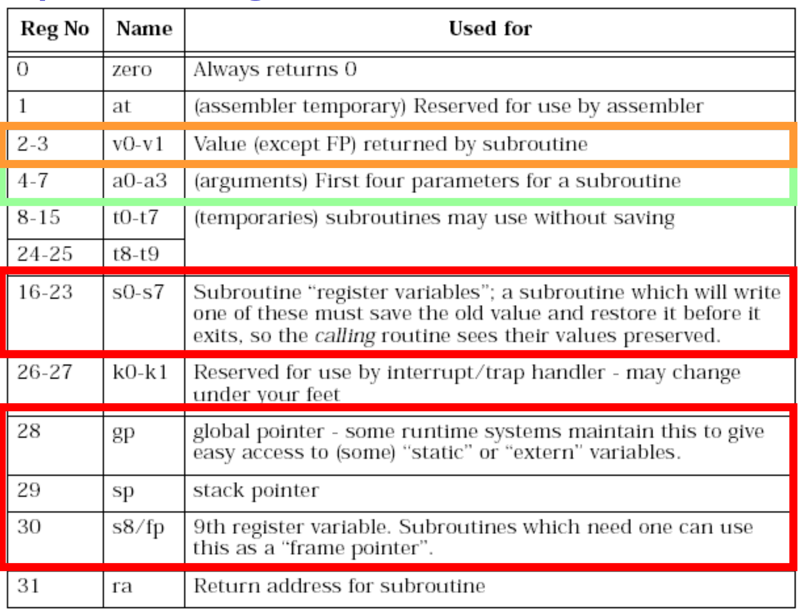
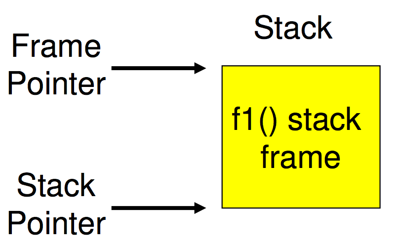
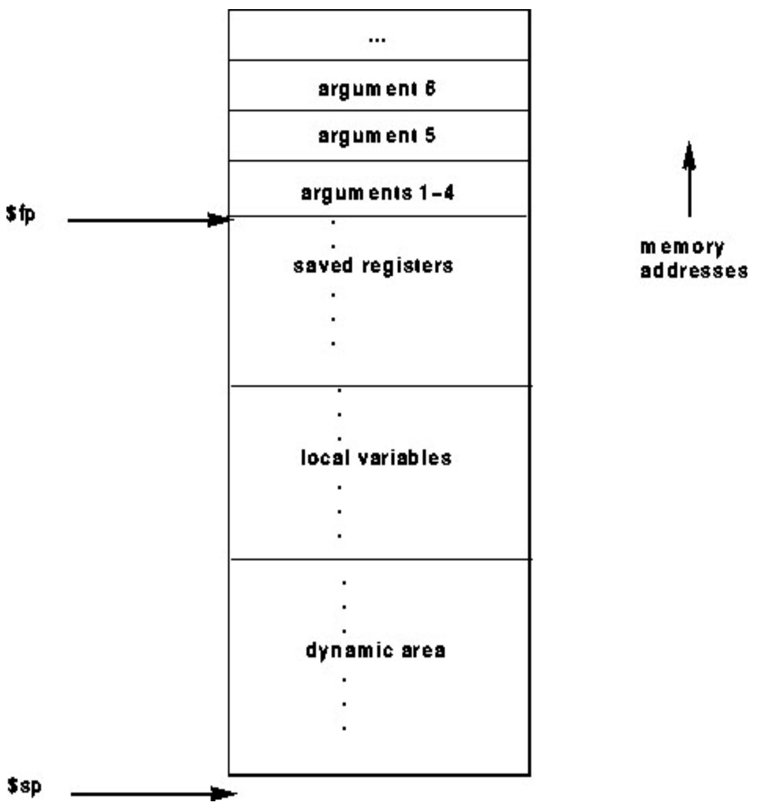
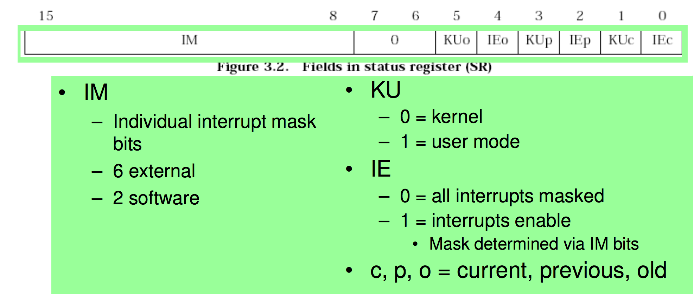
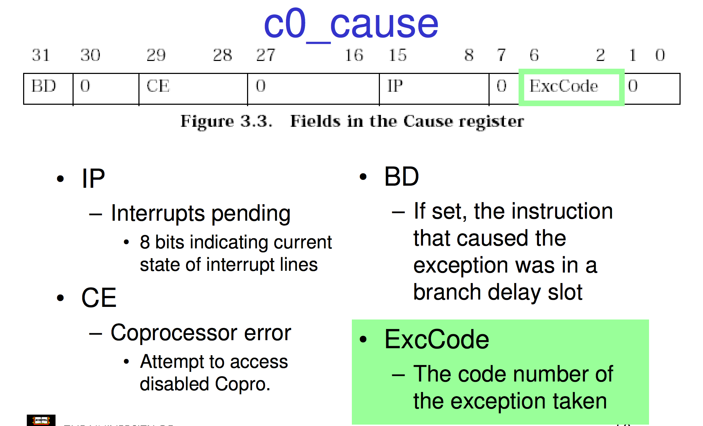
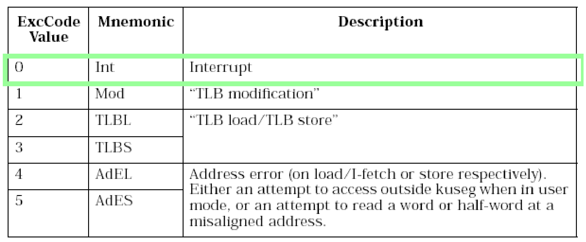
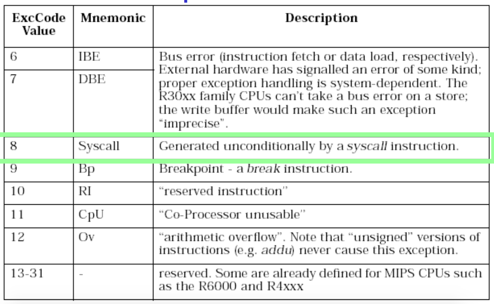

# The MIPS R2000/R3000
## Intro
---
This is the Microprocessor the the OS161 uses/emulates.

it's quite simple and doesn't have a million years of legacy and history to keep track of. 

## Load Store Architecture
---

There are no instructions that interact with memory other then `load` and `store`

| ins | action|
|---|---|
|`sw r4, r5`|store word store r4 into the address in r5 |
| `lw r3, r7`| loads into r3 from r7 |

with load 
Delay of one instruction after load before data available in destination register
i.e Must always an instruction between a load from memory
and the subsequent use of the register

There are also other variations like sh which is tore half word etc. to work with different sizes

This load store architecture means that all arithmetic is done with registers or immediate. note constants can only be 16 bits. 

`add r3, r2, r1 ⇒ r3 = r2 + r1`
`addi r2, r1, 2048`

note you can do `32(r29)` to offset a address in r0 by 32. I.e there is a variable at offset 32 on the stack where r29 is the stack pointer. 

lets do a + a + 1

```
lw r4,32(r29)      //r29 is stack pointer
li r5, 1
add r4, r4, r5
sw r4,32(r29)
```

## Registers
---

there are 32 general purpose, (2 of which are special, see below) all 32 bit. 

There are a couple of special registers aside from general purpose ones as well. 

in total we have 32 + 3 registers. 32 general, 3 special

| register | what makes it weird |
|---|---|
|r0 | hardwired to always be 0|
|HI/LO| 2*32-bit registers for multiply and divide |
|PC| program counter, not directly visible or editable by user |
| r31 |the link register for jump-and-link (JAL) instruction, known as the Return Address register RA |

## Branching and Jumping
---

Branching and jumping have  a branch delay slot
The instruction following a branch or jump is always executed prior to destination of jump

For example at location `1:` in this code

```
   li r2, 1
   sw r0,(r3)
   j 1f
0: li r2, 2
   li r2, 3
1: sw r2, (r3)
```
r2 is actually 2, because step 0: did run before the jump

this is because the chip is very pipelined. the li instruction is partially through pipeline prior to jmp having an effect. By the time the jump takes effect the li has already executed. 

 

Some microprocessors store the pipeline if it sees the jump coming, others throw out the partial pipe. 
this chip forces the compiler / user to deal with it. `lmao dicks.`

## Jump and Link instruction
---
This is called JAL and used to implement function calls. 

Return Address register (RA) is used to return from function call, it is the current program counter + 8 at the time of function call. I.e the current instruction + 8 bytes, i.e the next instruction. 

note RA is r31 as discussed previously.

## Compiler register conventions
---

Given 32 registers there needs to be a convention for a compiler to define what registers are used for what. I.e Local variables, argument passing, function call results, stack pointers. 

This is decided by the people creating the compiler. Although sometimes the hardware does force some registers for some tasks but mostly it's up to the compiler writers. 

 

## Example
---

Simple factorial Program in C

```c
int fact(int n)
{
	int r = 1;
	int i;
	for (i = 1; i < n+1; i++) {
		r = r * i;
	}
	return r;
}
```

Same program in MIPS
line numbers are 4 byte blocks

```assembly
  	1880000b 		blez a0,30 <fact+0x30>
  	24840001 		addiu a0,a0,1
  	24030001 		li v1,1
  	24020001 		li v0,1
 	00430018 		mult v0,v1
 	24630001 		addiu v1,v1,1
 	00001012 		mflo v0
 	00000000 		nop
 	1464fffc 		bne v1,a0,14 <fact+0x14>
 	00430018 		mult v0,v1
 	03e00008 		jr ra
 	00000000 		nop
 	03e00008 		jr ra
 	24020001 		li v0,1
```

## Function Stack Frames
---

Each function call allocates a new stack frame for local variables, the return address, previous frame pointer etc.

lets assume f1() calls f2()

 

note that this whole stack pointer is the bottom and frame pointer is the top is sorta confusing because stacks grow downwards but just go with it lmao

now when we call f2 we shift `frame pointer` down by f1() stack frame size where as the `stack pointer` moves down by the f2() stack size

 

you can learn more about this by googling `alloca`

In the mips gcc calling convention, 
Args 1-4 have space reserved for them, if there are more, gcc puts them on the stack. 

 

#### Example
C code:

```c
main (){
	int i;
	i = sixargs(1,2,3,4,5,6);
}
int sixargs(int a, int b, int c, int d, int e, int f){
	return a + b + c + d + e + f;
}
```

assembly

```
<main>:
	27bdffd8 addiu sp,sp,-40  // allocate stack frame sp = sp - 40 
	sw ra,36(sp)              // store return address
	sw s8,32(sp)              // store s8 
	move s8,sp                // move stack pointer into s8
	li v0,5                   
	sw v0,16(sp)              // store 5 into the stack (args)
	li v0,6                   
	sw v0,20(sp)              // load 6 into the stack  (args)
	li a0,1                   // start loading arguments
	li a1,2
	li a2,3
	jal 4000b0 <sixargs>      // call function
	li a3,4                   // use jump delay to load in arg 
	sw v0,24(s8)              // store return value on stack        
	move sp,s8                // restore stack pointer
	lw ra,36(sp)              // restore return address
	lw s8,32(sp)              // restore s8
	jr ra                     // jump back
	addiu sp,sp,40            // deallocate stack frame in delay slot
```
note v0 is from the calling convention, value returned by subroutine 0
now the next bit seems stupid, it's not optimising so it's gonna push everything onto the stack. 

```
<sixargs>:
	addiu sp,sp,-8
	sw s8,0(sp)
	move s8,sp
	sw a0,8(s8)
	sw a1,12(s8)
	sw a2,16(s8)
	sw a3,20(s8)
	lw v1,8(s8)
	lw v0,12(s8)
	nop
	addu v0,v1,v0
	lw v1,16(s8)
	nop
	addu v0,v0,v1
	lw v1,20(s8)
	nop
	addu v0,v0,v1
	lw v1,24(s8)
	nop
	addu v0,v0,v1
	lw v1,28(s8)
	nop
	addu v0,v0,v1
	move sp,s8
	lw s8,0(sp)
	jr ra
	addiu sp,sp,8
```

## CoProcessor 0
---

#### Intro
- The processor control registers
are located in CP0
	- Exception/Interrupt management
registers
	- Translation management registers
- CP0 is manipulated using mtc0 (move to) and mfc0 (move from) instructions
	- mtc0/mfc0 are only accessible in kernel mode. 

This coprocessor 0 is only manipulated by those move into coprocessor and move out of coprocessor. which is good because it can do stuff like memory management and keeps track of what mode the chip is in. 

#### Registers

quite a lot but lets focus on Exception Management
- c0_cause
	– Cause of the recent exception
	- there are many such as interrupt or syscall etc.
- c0_status
	– Current status of the CPU
- c0_epc
	– Address of the instruction that caused the exception

c0_Status

 

c0_cause

 

c0_epc

The Exception Program Counter, Points to address of where to restart execution after handling the exception or interrupt

Note that once a exception hits there is a list of exception vectors which are referenced by the exec code in c0_cause

 
 

## Hardware exception handling
---

1. Pc gets moved into EPC
2. we then set the c0_status
	- we set kernal mode 
	- interrupts are disabled and all the bits are shifted
	so the current status has been moved into the spots reserved for "previous" values i.e KUp, IEp
3. cause for exception places in c0_cause
4. place the exception handler address into the PC
5. move back into software now in kernal mode
6. exception stuff is done
7. put the return stuff which was stored in EPC into PC
8. shift the status back over to restore the state
9. set the mode back to user
10. jump back

## Software of Exception handling
---

what a sys call does / where the arguments are is defined by a convention. 

for OS/161

Arguments are passed and returned via the
normal C function calling convention Additionally

- Reg v0 contains the system call number
- On return, reg a3 contains
	- 0: if success, v0 contains successful result
	- not 0: if failure, v0 has the err no in it
		- v0 stored in errno (This is defined as some place)
		- -1 returned in v0

 

## OS161 Code walkthrough
---

lets the called the read() syscall function

```
move a0,s3						// Input Filehandle
addiu a1,sp,16					// set up buffer pointer input arg
jal 40068c <read>				// call system library read
i a2,1024							// delay slot: pass in buffer size
move s0,v0                    // get result
blez s0,400194 <docat+0x94>	// handle error (-1 result)
```

we just call it and test the return value. now lets go into read library function

we jump into the syscall and load 5 into v0 because the exception needs to know what the exception is (5 means syscall). note this runs before the jump because of the jump delay

```
0040068c <read>:
	40068c: 08100190 j 400640 <__syscall>
	400690: 24020005 li v0,5
```

now in the syscall function

```
00400640 <__syscall>:
    // Raise exception
	400640: 0000000c syscall
	// check result, jump to jr ra if good else do error handling
	400644: 10e00005 beqz a3,40065c <__syscall+0x1c>
	400648: 00000000 nop
	// error handling
	// at is err no
	40064c: 3c011000 lui at,0x1000
	400650: ac220000 sw v0,0(at)
	400654: 2403ffff li v1,-1
	400658: 2402ffff li v0,-1
	// return
	40065c: 03e00008 jr ra
	400660: 00000000 nop
```
From the caller’s perspective, the read() system call behaves like a normal function call

- It preserves the calling convention of the language

However, the actual function implements its own convention by agreement with the kernel

- Our OS/161 example assumes the kernel preserves appropriate registers(s0-s8, sp, gp, ra).

Most languages have similar libraries that
interface with the operating system.

lets look at the actual Os/161 code now

```
exception:
	/* Save previous stack pointer in k1 */
	// we use k1 because the operating systems 
	// interrupt systems don't touch this by convention
	move k1, sp
	/* Get status register, we need some info*/
	mfc0 k0, c0_status
	/* Check the we-were-in-user-mode bit */
	andi k0, k0, CST_Kup 
	/* If clear, from kernel, already have stack, jump to 1 */
	beq k0, $0, 1f 
	/* delay slot */
	nop 
	
	/* Coming from user mode - load kernel stack into sp */
	/* get address of "curkstack" current kernal stack */
	la k0, curkstack
	/* get its value */
	lw sp, 0(k0) 
	nop // delay
1:
	/* Now, load the exception cause. */
	mfc0 k0, c0_cause
	/* Skip to common code */
	j common_exception 
	nop // delay
```


```
common_exception:
	/*
	* At this point:
	* Interrupts are off. (The processor did this for us.)
	* k0 contains the exception cause value.
	* k1 contains the old stack pointer.
	* sp points into the kernel stack.
	* All other registers are untouched.
	*/
	/*
	* Allocate stack space for 37 words to hold the trap frame,
	* plus four more words for a minimal argument block.
	*/
	addi sp, sp, -164
	
	/* The order here must match mips/include/trapframe.h. */
	
	//ignore this, it's to trick gdb
	sw ra, 160(sp) /* dummy for gdb */
	sw s8, 156(sp) /* save s8 */
	sw sp, 152(sp) /* dummy for gdb */
	sw gp, 148(sp) /* save gp */
	sw k1, 144(sp) /* dummy for gdb */
	sw k0, 140(sp) /* dummy for gdb */
	// end ignore code
	
	sw k1, 152(sp) /* real saved sp */
	nop            /* delay slot for store */
	
	mfc0 k1, c0_epc /* c0 reg 13 == PC for exception */
	sw k1, 160(sp)  /* real saved PC */
	
	// save the entire state onto the stack
	sw t9, 136(sp)
	sw t8, 132(sp)
	sw s7, 128(sp)
	sw s6, 124(sp)
	sw s5, 120(sp)
	sw s4, 116(sp)
	sw s3, 112(sp)
	sw s2, 108(sp)
	sw s1, 104(sp)
	sw s0, 100(sp)
	sw t7, 96(sp)
	sw t6, 92(sp)
	sw t5, 88(sp)
	sw t4, 84(sp)
	sw t3, 80(sp)
	sw t2, 76(sp)
	sw t1, 72(sp)
	sw t0, 68(sp)
	sw a3, 64(sp)
	sw a2, 60(sp)
	sw a1, 56(sp)
	sw a0, 52(sp)
	sw v1, 48(sp)
	sw v0, 44(sp)
	sw AT, 40(sp)
	sw ra, 36(sp)
	
	/*
	* Save special registers. so we can use them
	*/
	mfhi t0
	mflo t1
	sw t0, 32(sp)
	sw t1, 28(sp)
	
	/*
	* Save remaining exception context information.
	*/
	sw k0, 24(sp)      /* k0 was loaded with cause earlier */
	mfc0 t1, c0_status /* c0 reg 11 == status */
	sw t1, 20(sp)
	mfc0 t2, c0_vaddr  /* c0 reg 8 == faulting vaddr */
	sw t2, 16(sp)
	/*
	* Pretend to save $0 for gdb's benefit.
	*/
	sw $0, 12(sp)
	/*
	* Prepare to call mips_trap(struct trapframe *)
	*/
	addiu a0, sp, 16 /* set argument */
	jal mips_trap /* call it */
	nop /* delay slot */
```

now we move into C

we pass a pointer to the stack and let the c code
pretend like it is a instance of the struct trapframe. 
this means they can just use struct references instead of
working with offsets directly. 

```c
struct trapframe {
	u_int32_t tf_vaddr;		/* vaddr register */
	u_int32_t tf_status;	/* status register */
	u_int32_t tf_cause;		/* cause register */
	u_int32_t tf_lo;
	u_int32_t tf_hi;
	u_int32_t tf_ra;		/* Saved register 31 */
	u_int32_t tf_at;		/* Saved register 1 (AT) */
	u_int32_t tf_v0;		/* Saved register 2 (v0) */
	u_int32_t tf_v1;		/* etc. */
	u_int32_t tf_a0;
	u_int32_t tf_a1;
	u_int32_t tf_a2;
	u_int32_t tf_a3;
	u_int32_t tf_t0;
	⁞
	u_int32_t tf_t7;
	u_int32_t tf_s0;
	⁞
	u_int32_t tf_s7;
	u_int32_t tf_t8;
	u_int32_t tf_t9;
	u_int32_t tf_k0;		/* dummy (see exception.S comments) */
	u_int32_t tf_k1;		/* dummy */
	u_int32_t tf_gp;
	u_int32_t tf_sp;
	u_int32_t tf_s8;
	u_int32_t tf_epc;		/* coprocessor 0 epc register*/
}


/*
* General trap (exception) handling function for mips.
* This is called by the assembly-language exception handler once
* the trapframe has been set up.
*/
void mips_trap(struct trapframe *tf) {
	u_int32_t code, isutlb, iskern;
	int savespl;
	/* The trap frame is supposed to be 37 registers long. */
	assert(sizeof(struct trapframe)==(37*4));
	/* Save the value of curspl, which belongs to the old context. */
	savespl = curspl;
	/* Right now, interrupts should be off. */
	curspl = SPL_HIGH;
	...
```

The kernel deals with whatever caused the
exception and then returns to the assembly code (note of course this c code is assembled down but we abstract out that section and look at the c code, because there is c code, the previous and after stuff was hand coded in assembly. 

The return code is quite long and really just reverses the start code. 
it restores the state and sets the stack back. 


