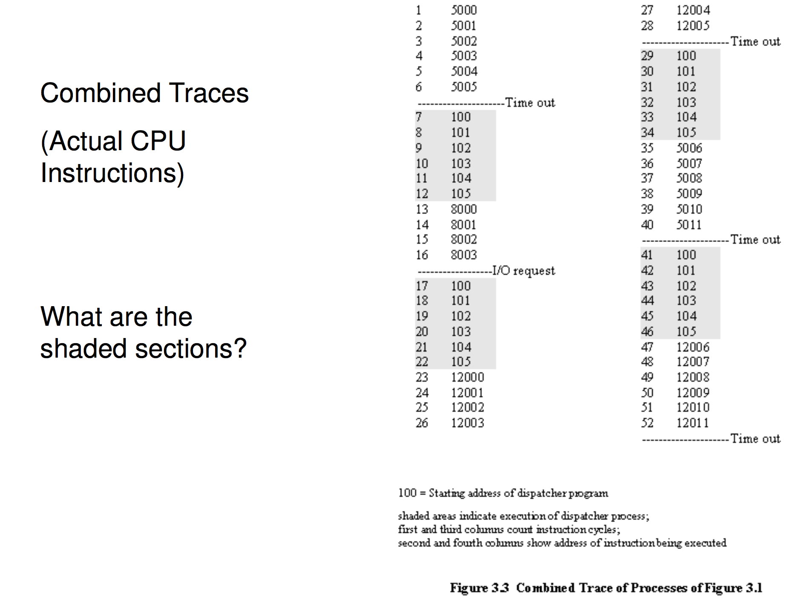
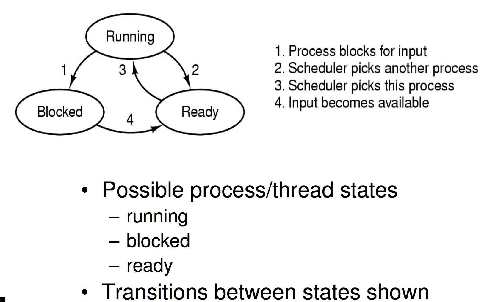
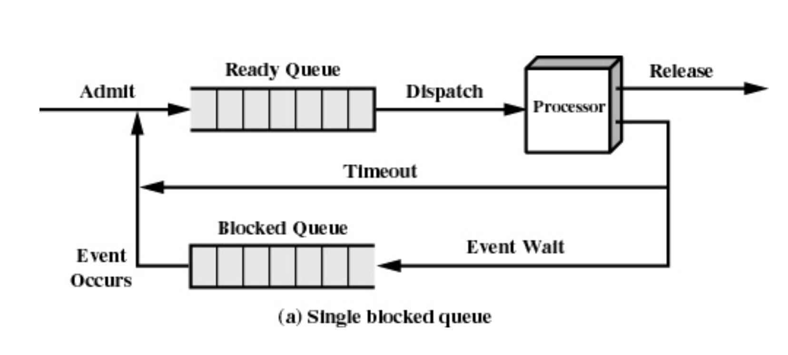

# Processes and Threads

## Major Requirements of an Operating System
---
• Interleave the execution of several processes to maximise processor utilisation while providing reasonable response time
• Allocate resources to processes
• Support interprocess communication and user creation of processes

## Overview
---

#### Processes

Also called a task or a job. 
it is the "owner" of resources allocated for program execution
usually encompasses one thread but can encompass more. 
Some processes (lets say excel) need more threads. 

#### Threads

1 unit of execution
can be traced as it lists the sequence of instructions that execute, the actual activity of the program. 

Belongs to a process and executes within it, encompassed by a process. 

#### Example

Here are 3 single threaded programs

Assuming there is no virtual memory, there is simply 3 processes in memory that can be run in some sequence depending on where the program counter is. Note that the logical trace below shows that the programs are very straight forward, no branching or loops. 

We start to execute process A then a timer interrupt hits, then the shaded region runs the dispatcher, otherwise known as the scheduler.

Then process B starts running  which then hits a I/O Request at what point it stops and waits for an answer from the system call. 
Now wouldn't it be great if the processor did some work here while waiting for the I/O call to happen. At the moment it just waits, `HOW WASTEFUL`

## Process model
---

In this model each program has it's own program counter and this all make progress at the same time, how awesome. 
But that's not exactly how it works. Only one program is active at any instant. 
It just does it fast enough that the user thinks they all are happening at the same time (assuming a uni processor, with multi you CAN run multiple programs at the exact same time)

Note that the scheduler organises this and can actually set some processes to be high priority and thus it doesn't switch as that runs. 

Now note we can have multiple ways to organise a os to run processes and threads

- One process in the program, can only have 1 thread
	- Dos actually did this lmao
- multiple processes, single thread per process
	- Traditional unix (fork kinda faked multi thread by letting you make a new process)
- Multiple processes multiple threads per process
	- any modern general purpose protected os
- One process, multiple threads
	- os/161
	- it's missing the functionality to create more processes
	- this is something extended students do `lmao fuck.`

## Process Life
---

#### Creation

Principal events that cause process creation, Technically, all these cases use the same system mechanism to create new processes.

1. System initialisation
	- Foreground processes (interactive programs)
	- Background processes
	- Email server, web server, print server, etc.
	- Called a daemon (unix) or service (Windows)
2. Execution of a process creation system call by a running process
	- New login shell for an incoming telnet/ssh connection
3. User request to create a new process
4. Initiation of a batch job

#### Termination

can be:

1. Normalexit (voluntary)
2. Errorexit (voluntary)
3. Fatalerror (involuntary)
4. Killed by another process (involuntary)

involuntary is when the process does something that the os can't fix for it. I.e divide by 0, accessing invalid memory, infinite loop. 

error catching is when a program can ask the os to not kill it but to tell it the error so it can handle it. 

#### States

note that blocked is a process/thread that is now waiting for something. this is usually done via a device interrupt which the os notes and does the relevant logic to unblock a process. 

note that some programs can do a syscall `yield()` which is a program voluntary saying make me ready switch to another program. When the program is waiting for something internally. 

this sucks because the scheduler will keep waking the process up, use blocked by this, if you want to wait 5 seconds, register a timer interrupt event with the os. `TODO CHECK`

## Scheduler
---

Sometimes called the dispatcher, but long story short a usually complex system for choosing a ready process to run efficiently. In general we don't want to search through all the processes. This will happen often and if you have 100 or 1000 threads. That is gonna cause issues

similarly if we get a unblocking interrupt we don't want to search through all the processes to find the one to switch. This is why blocked processes are in a separate list. 

#### The Ready Queue

Simple queue, based on when a thread became ready, if a process gets switched into the ready state it goes to the end, if it exits it just is removed from the structure. 

Equal chance for everyone. 

With blocking added into the mix we get

note the timeout is just the scheduler kicking in to switch processes.

this is simple isn't it `WELL IT ISN'T GROW UP IT'S FUCKED`

 

Each event has it's own queue, if 7 events are waiting for a specific network packet they all are grouped together separate to the processes who are waiting for a specific hard drive response. 

This means the queues are usually quite small, 1 long most of the time. 

## Implementation of Processes
---
A processes’ information is stored in a process control block (PCB)

- The PCBs form a process table
- Sometimes the kernel stack for each process is in the PCB
- Sometimes some process info is on the kernel stack
	- E.g. registers in the trapframe in OS/161
- Reality is much more complex (hashing, chaining, allocation bitmaps,...) then a simple array. 

the PCB holds a lot of information like the process registers, program counter, process id, signals, cpu times uses children, time of next alarm, pointer to text segment or data segment or stack segment or root directory, working directly for the process. Each shell you has a separate location it is currently cd'ed into. 

## The Thread Model
---

threads execute in a environment (process) but each thread has it's own set of things to keep track of

program counter, a stack per thread, registers, generally the state of the thread. other things like pending alarms etc. are managed by the process. 

