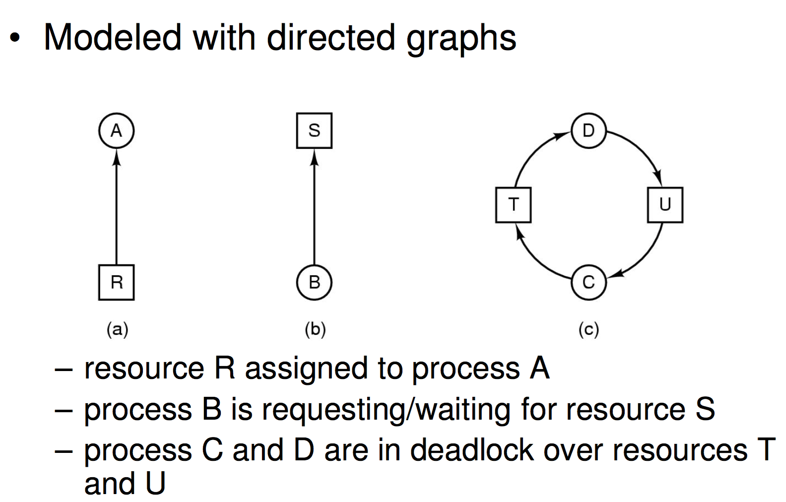
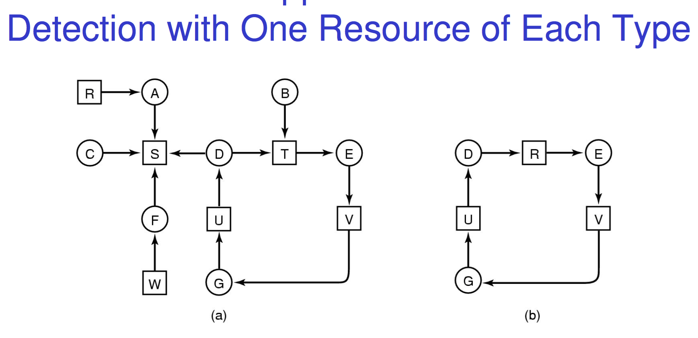
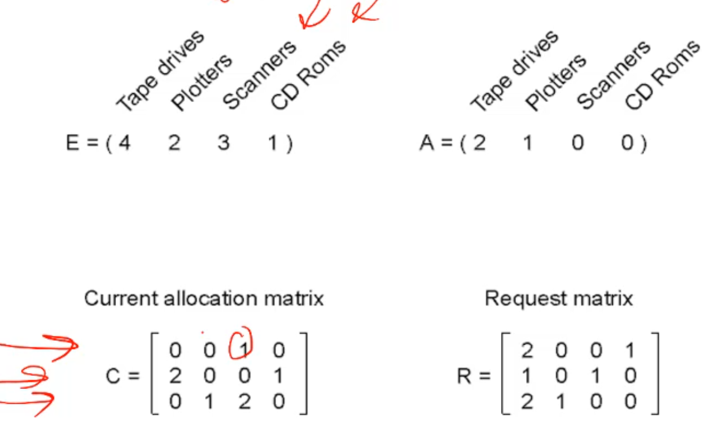

# Deadlocks
## Dining Philosophers
---

Philosophers need two forks to eat, they pick one at a time. They switch between eating and thinking. 
This can cause a deadlock quite easily. 
for example on a circular table if everyone grabs the left fork then everybody is waiting for the person on the right to drop their fork so they can pick it up. 
Deadlocked!


you could solve this would a lock for the whole table, only 1 person can eat at one time. Not a great one though, it doesn't scale, if you have 600 people and only 1 person can eat at a time the dinner takes 70 years to finish.

The solution works by having each philospher have a sate (eating, thinking, hungry) and then using semphomores sleeps any phil who is waiting for a fork. 

When someone puts down a fork they check if someone to the left or right of them is hungry, and if so (and there isn't someone else who could give them a fork after) wake them up and give them your fork.  

## The readers and writers problem
---

allows any amount of concurrent readers to read the info like reservations to bookings. 

The writer has exclusive access though to change the database state. 

a solution basically has the readers come in and use a mutex to increment and decrement a semphmore to represent how many readers are in. 

If this ever hits 0 the semphamore is released and the writers are then allowed to get in. 

the first reader in then re grabs this. 

this `fucken sucks`, a writer may never get allowed to write in. it's known to be `reader bias`

you can also build a `writer bias` system. 

there are also fair systems where the reader and writers all join the queue and readers that come in after the writer have to wait for it to be done. 

this is an alright solution for systems with no much writing, it has it's uses. 

## Resources
---

#### Intro

Examples of computer resources

- printers
- tape drives
- Tables in a database
can also be abstract like rows or cols in a database. whatever it is, processes need access to resources in a reasonable order. 
there are two types of resources

Preemptable resources
- can be taken away from a process with no ill effects
- a database write maybe
Nonpreemptable resources
- will cause the process to fail if taken away
- i.e you can't stop a printer half way through

#### Deadlocks

Suppose a process holds resource A and requests resource B
- at same time another process holds B and requests A
- both are blocked and remain so - Deadlocked

Deadlocks occur when
- processes are granted exclusive access to devices, locks, tables, etc..
- we refer to these entities generally as resources
- Not a issue if 7 processes can have access to the resource 

#### Access

Sequence of events required to use a resource
1. request the resource
2. use the resource
3. release the resource
Must wait if request is denied and the requesting process may be blocked 
to be fair though it may also fail with error code

note though that the order you grab locks is INCREDIBLY important

think about this

```c
semaphore res_1, res_2;
void proc_A() {
	down(&res_1);
	down(&res_2);
	use_both_res();
	up(&res_2);
	up(&res_1);
}
void proc_B() {
   down(&res_2);
   down(&res_1);
   use_both_res();
   up(&res_1);
   up(&res_2);
}
```

proc_a grabs lock 1 and then is interrupted. proc_b comes in and grabs lock 2 but then stops because proc_a has lock 1 so it sleeps. 

proc_a now restarts and goes down to try and grab lock2, but it's held by proc b so it sleeps. 

now neither can make progress!!!! D E A D L O C K 

## Four Conditions of a deadlock
---

1. Mutual exclusion condition
	- each resource assigned to 1 process or is available
2. Hold and wait condition
	- process holding resources can request additional ones without 	giving up what it currently holds
3. No preemption condition
	- no one can take the lock from you without your consent
4. Circular wait condition
- must be a circular chain of 2 or more processes
- each is waiting for resource held by next member of the chain


## Representing Deadlocks
---



circles are process, squares are resources. 

the cycle shown shows that D owns T and C owns U but C wants T and D wants U. 


 Here you can see that A gets R, then B gets S then C gets T. 
 
 seems fine, but then A wants S, but B won't give it up until it gets T and C won't give it up until it gets R which A won't give up until it gets S but B won't ...
 
 The issue is that this won't ALWAYS deadlock. 
 
 In a different execution run the entire program could run without deadlocking even though it IS possible. Here passing a test once does not mean the code is correct. 
 
If the system is complex enough sometimes a dead lock can go without even being triggered for a very long time and then once a year it just hangs but you can't figure out why because it's impossible to reproduce because of how specific the scheduling had to be to cause it. 

## Dealing with Deadlocks
---

1. Just ignore the problem altogether
2. prevention
	- negating one of the four necessary conditions
3. detection and recovery
4. dynamic avoidance
	- careful resource allocation

#### Ignoring it

This is called the The Ostrich Algorithm i.e stick your head in the sand is pretend nothing is happening. `My tactic with most of the problems in my life tbh`

This is fine if the deadlock is so rare or required such a complex sequence of events that the cost of fixing it is not worth it. The issue of the deadlock is rare and easily fixed by a reboot. 

#### Prevention

we can negate one of the four things needed for deadlocks to occur with Resource allocation rules. 

Now we can not change mutual exclusion, heaps of resources are NOT infinitely sharable and thus must have mutual exclusion. otherwise race conditions hit. 

We could attack hold and wait by making processes request resources before starting – a process never has to wait for what it needs but it has to know everything it needs before starting. It also then holds all those resources until it's done blocking them. 

BUT this is prone to livelock which is when we continuously work towards getting our resources, we are using the cpu but we still arn't actually getting anywhere. i.e releasing some resources and then attempting to acquire again over and over and over again. 

No premention, huge issues because now you can't rely on locks. a printer can be interrupted halfway through

Ok how about circular wait? well what we can do is assign a numerical order to every resource and if we want multiple resource we always get them in the specified predefined order. This is actually used a lot!!


It also helps us find dead locks because if you number all resources with a specific lock you can find the inconsitent ordering to find the deadlock. 

#### Detection

How can we detect a deadlock against just a slow program and furthermore how can we recover from it?

Well a good tactic which works if there are only 1 of each type of lock is to draw up the graph and look for cycles as a cycle means a circular dependency 



Here we can easily see the processes that are dead locked and separates them to the ones that are not dead locked. 

If we have multiple units of each resource or if we don't have the book keeping system in place to draw the graph or don't want to deal with the incredibly slow system that does deadlock detection?

what we can do is first develop a list of resources which can form a vector

$$(E_{1},E_{2},E_{3}...E_{m})$$

We can then form a matrix to outline every process as a row n and every col as a resource m. 

$$\begin{bmatrix}C_{11} & C_{12} & ... & C_{1m}\\\C_{11} & C_{12} & ... & C_{2m}\\\\... & ... & ... & ...\\\C_{n1}&C_{n2} & ... & C_{nm}\end{bmatrix}$$

here row n represents all the resource process n has

We then create another matrix identical but with requests for resources
here row n represents all the resources process n needs. 

The cols here are the list of available resources rather then all possible. each cell this represents `how many of resource m process n holds`

$$(A_{1},A_{2},A_{3}...A_{m})$$

$$\begin{bmatrix}R_{11} & R_{12} & ... & R_{1m}\\\R_{11} & R_{12} & ... & R_{2m}\\\\... & ... & ... & ...\\\R_{n1}&R_{n2} & ... & R_{nm}\end{bmatrix}$$

with this set up we set a system wide invariant:

$$\sum_{i=1}^n C_{ij} + A_{j} = E_{j}$$

This just says that for a particular resource j summing up all the processes that hold it + all the ones that arn't held should be equal to the total amount of the resource available. 

Quite obvious, if a printer hub has 3 printers then the number of processes using the hub + the number of available printers must be equal to 3. 

This doesn't seem like it helps with dead lock detection but lets go through. 



so this system has 4 tape drives available and 2 being used etc.

Now what we can do

1. Look for an unmarked process Pi, for which the i-th row of R is less than or equal to A
2. If found,add the i-th row of C to A,and mark Pi. Go to step 1
3. If no such process exists, terminate. Remaining processes are deadlocked

all this essentially does is to run through the program via the matricies and if you can't complete every process you can identify the dead lock. 

This is hard to do in text so really i suggest watching the lecture on this

it's in the last 10-15 minutes of Week 4 lecture 1. 

#### Recovery

Recovery through preemption
- take a resource from some other process to free them up and stop the deadlock
- depends on nature of the resource, it might crash the other resource or it might handle it
- It can't tell what's the best one to take from so it may stop a critical program even though it really should be taking from the least important process. 

Recovery through rollback
- checkpoint a process periodically
	- Used in mathematical and scientific calculations that takes months 	to run so if something goes wrong you don't have to start again. 
	- It might dead lock again when you restart and also has a lot of overhead but it's worth it for a program that runs for month cause if a power outage hits you want to handle it 
- use this saved state when a dead lock occurs
- we can also restart the process if it is found deadlocked 
	- No guarantee is won’t deadlock again

Recovery through killing processes
- crudest but simplest way to break a deadlock
- kill one of the processes in the deadlock cycle
- the other processes get its resources
- choose process that can be rerun from the beginning


 

 
 