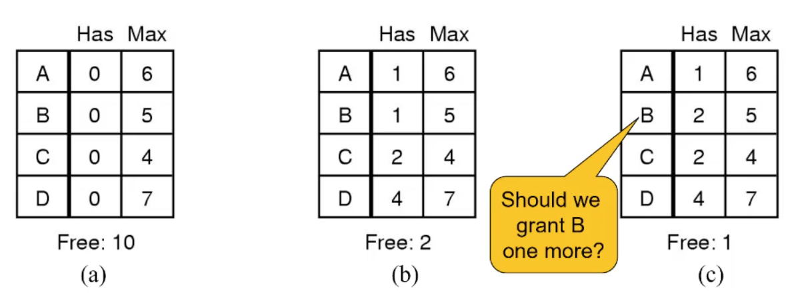
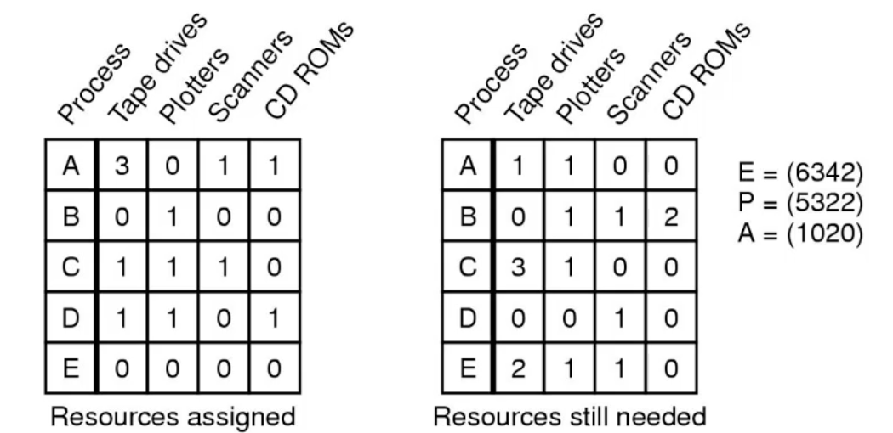

# Deadlocks

## Deadlock Avoidance
---

Instead of detecting deadlock, can we
simply avoid it? YES, but only if enough information is
available in advance. Such as maximum number of each resource required

note that prevention is more like preventing them from being coded in and avoidance is avoiding a deadlock when it's already in the code. 

I.e be clever in the resource allocation so the deadlock condition state is never reached. 

quite hard to do with general computing systems like phones but works with systems whose code never changes from initial states like a washing machine. 

## Resource Trajectories
---

as you can see Process A needs the printer and the plotter in the time slice $I_2$ and $I_3$

the shaded areas represent places we can't go because the resources are not held in a mutual exclusive way. I.e both need it. 

the dotted line represents execution. Q to R is when the machine switches from Process A to process B. 

the dotted line must never enter the shaded zone otherwise both will need it and a deadlock can occur as one waits for the other. 

At the point shown the system can now tell if it keeps running Process B it'll it the shaded area and then be stuck, one of the processes has to run and if it does they'll be a clash of resources. 

Here you can see that process A has the printer and if process B gets the Plotter it way then wait for A to get the printer back to it, but as A progresses it hits the area where it needs Plotter. 

deadlock!

so instead we can see this and make process A run until it hits $l_4$ and then let process B run until end 

thus box t is about to enter, the box between B($l_5$,$l_6$)and A($l_1$,$l_2$) is a unsafe state. 

#### Safeness

A state is safe if

- The system is not deadlocked
- There exists a scheduling order that results in every process running to completion, even if they all request their maximum resources immediately

i.e take a state, make each one request it's maximum and see if it finishes.

safe states can guarantee we will end. 
Deadlock avoidance algorithm Only grant requests that result in safe states
	
#### Bankers Algorithm

- Modelled on a Banker with Customers
	- The banker has a limited amount of money to loan customers
		- Limited number of resources
	- Each customer can borrow money up to the customer’s credit limit
		- Maximum number of resources required
- Basic Idea
	- Keep the bank in a safe state
		- So all customers are happy even if they all request to borrow up to their credit limit at the same time.
	- Customers wishing to borrow such that the bank would enter an unsafe state must wait until somebody else repays their loan such that the the transaction becomes safe.

We wanna keep the system in a safe state. 

This is at the moment in a safe state at a. 
at state b some of the resources have been distributed, it is still in a safe state. then b asks for 1 more resource. should we grant this request or block it until the request can be made without it causing a unsafe state. note that if all 4 asked for mask resource would make them all block waiting but since none of them asked for 1 or less none of them ever unblock. 

now a more complex example

E is all the resources that exists, P is in use and A is available 

now should we allow b to get 1 scanner?

now we get A=(1010) and the matrix's update accordingly

if you work through it we can finish all the processes and leave the system in a state state. so this is fine

But what if B says he wants a scanner AND E says they want a scanner

then this would leave the system in a unsafe state. In this case we would block E until B was finished or the system was in a better state.

This is actually never used because you need to know how many resources you have in advance AND how many processes are there. In a computer this is very dynamic and this really only works for static systems. 

#### Starvation

A process never receives the resource it is waiting for,
despite the resource (repeatedly) becoming free, the
resource is always allocated to another waiting process.

can be fixed with a fair queue. (first in first serve)

# Processes and Threads Implementation

## Processes
---

Processes user-level stack and execution state exists on the user side but there os also a kernel stack per process in the kernel mode which can be chosen by the Scheduler. 

the schedular picks Process C which runs some of it's relevant kernel code and then jumps back into the user side. 

do note that the process specific kernel code is still kernel code and can access anything in the system. 

within these processes we can have multiple threads each with their own thread stack to manage the thread stack, Program counter etc. 

## API
---

Users need to be able to write multi threaded systems in their process, so we provide a api to let them create, desotry manage and sync threads. 

We can store this in the user mode in the form os a system libraries or we can have the os itself provide a comprehensive api. 

