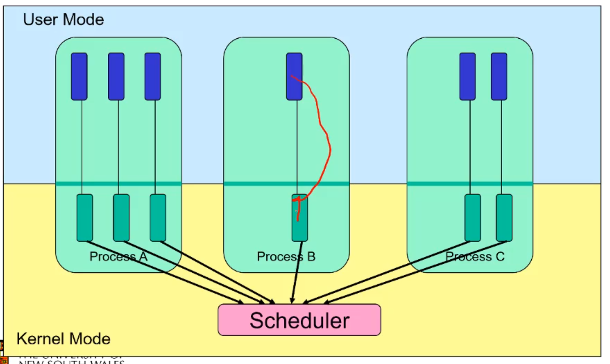
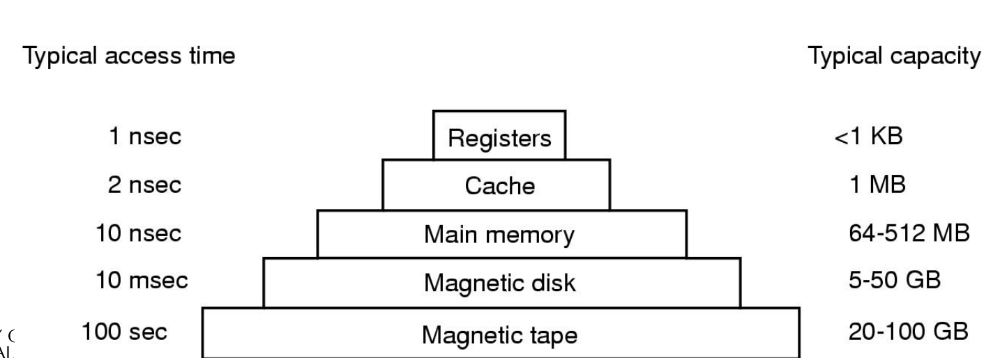
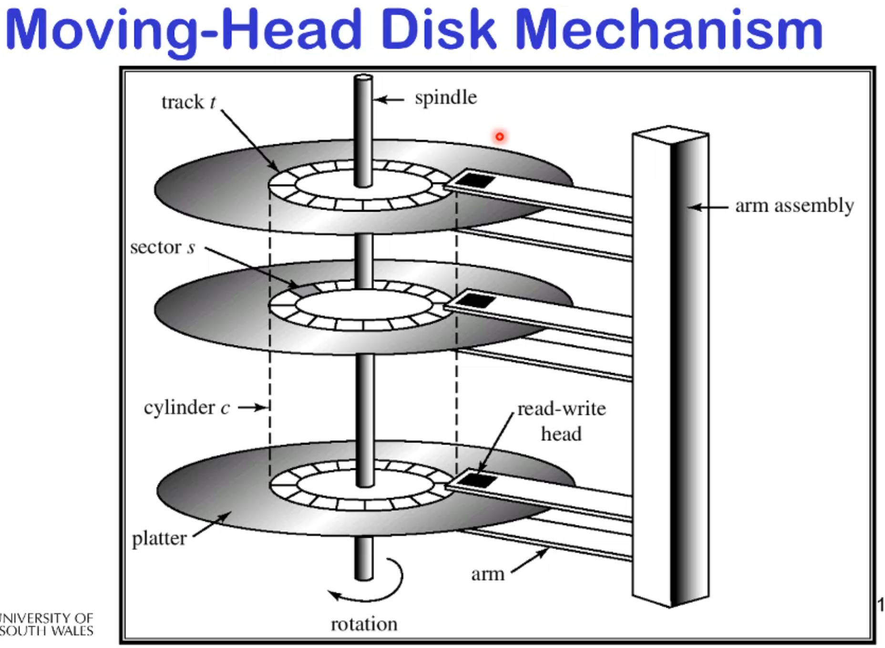
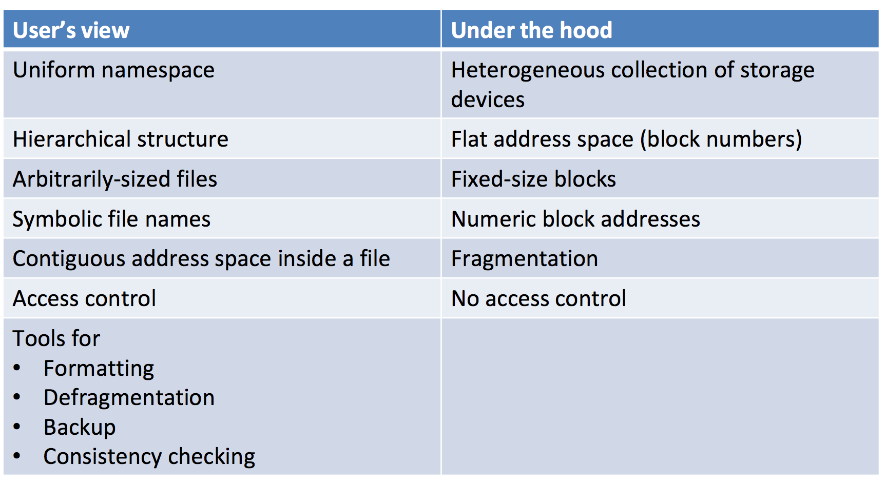
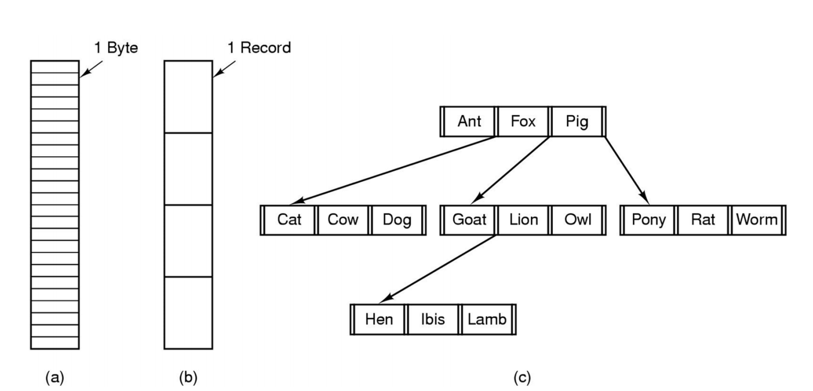

# Implementing a API

## Implementing threads in user space
---


This means that every process has to have their own scheduler which is implemented in the library. 

An advantage is that it takes load off the os. it's simpler. It's faster, it doesn't need as much overhead with system calls, you can switch between each thread more quickly. we can also implement or own algorithms and customise the thread library. further more we can implement multi threaded applications on top of a OS that doesn't have it. 
You can also use virtual memory (rather then real world memory that kernel has to use) to increase the amount of threads you run by lying to them about how much space they have until they try and grab some. 


A disadvantage is that the kernel is unaware of how many threads are available to run it'll block them all. If one thread blocks on a i/o call the kernel will block the entire process so if another thread could run, it won't, the internal scheduler won't grab power again. 
It also knows that a kernel which COULD use more then 1 CPU it won't, it can tell what process is multi threaded. 
Also each thread needs to yield, as the internal schedular doesn't have a build in timer interrupt to regain control. (this is called `cooperative multithreading` you CAN ask the os to do the interrupts for you but they are course grain and take something like a second at best. Way too slow. 

## Implementing threads in kernel space
---


Here each thread within a process has it's own stack within kernel space:



In this case the kernel is god and knows all

In this all thread functions, call, etc. are first level system calls and have that overhead now

but now we have preemptive multithreading allowing us to overlap system processing and I/O and this can actually use a multi processor architecture. 

## Multiprogramming implementation
---

#### Overview


#### Context Switching Terminology

a context switch is usually between two processes (saving, restoring and switching memory context)

sometimes people call thread switching context switching because there is a execution switch. do note that this is faster because there is no memory mapping that needs to happen. 

#### Occurrence

Context switches can occur between any two instructions(assembly) but also can be called via a system call due to a system call, interrupt or exception. 

#### Transparency 

This must be transparent. no thread should not be able to tell they were ever stopped. 

All state must be saved. 

#### Thread Switch Walkthrough

lets assume we have kernel stack for each thread. 

1. store the sp on the stack
2. store the trap frame i. registers
3. C function activation stack
4. kernel state

Now as the sp is saved, change it and return to a thread. This sp then unwindes/pops the elements and activates the other thread execution.

```c
static void thread_switch(threadstate_t newstate, struct wchan *wc)
{
	struct thread *cur, *next;
	cur = curthread;
	do {
		next = threadlist_remhead(&curcpu->c_runqueue);
		if (next == NULL) {
			cpu_idle();
		}
	} while (next == NULL);
	/* do the switch (in assembler in switch.S) */
	switchframe_switch(&cur->t_context, &next->t_context);
}

```

Assembly time

```
switchframe_switch:
/*
* a0 contains the address of the switchframe pointer in the old thread.
* a1 contains the address of the switchframe pointer in the new thread.
*
* The switchframe pointer is really the stack pointer. The other
* registers get saved on the stack, namely:
*
* s0-s6, s8
* gp, ra
*
* The order must match <mips/switchframe.h>.
*
* Note that while we'd ordinarily need to save s7 too, because we
* use it to hold curthread saving it would interfere with the way
* curthread is managed by thread.c. So we'll just let thread.c
* manage it.
*/

/* Allocate stack space for saving 10 registers. 10*4 = 40 */
addi sp, sp, -40

/* Save the registers, as per the c calling convention*/
sw ra, 36(sp)
sw gp, 32(sp)
sw s8, 28(sp)
sw s6, 24(sp)
sw s5, 20(sp)
sw s4, 16(sp)
sw s3, 12(sp)
sw s2, 8(sp)
sw s1, 4(sp)
sw s0, 0(sp)
/* Store the old stack pointer in the old thread control block*/
sw sp, 0(a0)

/* Get the new stack pointer from the new thread */
/* it saved at some point in the past like our one just did */
lw sp, 0(a1)
nop /* delay slot for load */
/* Now, restore the registers */
lw s0, 0(sp)
lw s1, 4(sp)
lw s2, 8(sp)
lw s3, 12(sp)
lw s4, 16(sp)
lw s5, 20(sp)
lw s6, 24(sp)
lw s8, 28(sp)
lw gp, 32(sp)
lw ra, 36(sp)
nop /* delay slot for load */
/* and return. */
j ra
addi sp, sp, 40 /* in delay slot */
```

# Computer Hardware Review
 
## Memory Hierarchy
---

Going down the hierarchy

- Decreasing cost per bit
- Increasing capacity
- Increasing access time

- Decreasing frequency of access to the memory by the processor
- Hopefully
- Principle of locality!!!!!
	- a lot of loops and stuff access the same code and memory over and 		over again so cacheing can help here a lot. 

The basic idea is that registers are super fast to access, something close to clock speed BUT we can't have a lot and we can't read a lot of data. We can increase the storage and the amount of data we can read at once but the time taken is crazy. 


 
## Caching
---

Given a two-levels data storage: small andnfast, versus large and slow,
caching can speed access to slower data by using intermediate-speed memory as a cache.

it can't store a lot but we can still have it store whatever we might need to increase our speed. 

SRAM is a type of this so we can load in code and run it from fast static memory, if we ran it from DRAM we would run 10 times slower!!

if the cache doesn't have the data we have a `cache miss` win which case we do go to main memory to grab the memory but after that it's available. 

This is great because of the principle of locality. 


Because of this fact that the SRAM is the middle ground between CPU and main m emory it is usually faster then if the CPU accessed the memory itself because it loads in not 1 byte but 64 or 255 bytes surrounding the requested byte. 

## Effective Access Time
---

Depends on hit rate high hit rate means little main memory access so fast! low hit rate means the rate approaches main memory speed. 


## Hard Disks
---

They are slow. You split up a disk into tracks (a circular line) which is split up into segments which contain some 4k block of data. 



If you miss the data you have to wait for the disk to spin around again

Disk can read/write data relatively fast

- 15,000 rpm drive - 80 MB/sec
- 1 KB block is read in 12 microseconds

Access time dominated by time to locate the
head over data

- Rotational latency
	- Half one rotation is 2 milliseconds
- Seek time
	- Full inside to outside is 8 milliseconds
	- Track to track .5 milliseconds
- 2 milliseconds is 164KB in “lost bandwidth”

moving to where the data is, it's slow af. 

Because hard disks are so slow it is useful to use main memory DRAM as a cache from the hard disk This is something the OS does, DRAM isn't a cache but it participates in caching. 

Internet browsers also participate in caching as we know. 

# File Management

## Brief History
---

early computing system were batch systems. 
no OS, I/O from punch cards, Tapes and drums for external storage. 
rudimentary library support for reading/writing tapes. (read this, write this) but there was 0 file system. 

it was all manual bit write, bit read. 

#### First

The first file systems were single level
(everything in one directory)
Files were stored in contiguous chunks
with the maximal file size must be known in advance

Now you can edit a program and save it in a named file on the tape! no more two people writing over each others data because of a easy to remember address. 

as long as the names were unique and nobody used the same ones you were good! BUTTT you had a set amount of space and you couldn't shift everyones data down to make more. 

#### Terminal come sin

Time-sharing OSs

- Required full-fledged file systems
- had a terminal!!

MULTICS (a research OS)

- Multilevel directory structure (keep files that belong to
different users separately)
- Access control lists
- Symbolic links

it didn't become popular it was ahead of it's time. 

#### UNIX

- Based on ideas from MULTICS
- Simpler access control model
- Everything is a file! everything is a file stream

#### Lieing

there is the actual logic but the interface can give the illusion of features which don't actually exist. 



note that fragmentation refers to the virtual memory ideal of "yeah this is all one piece of memory lmao u fucken idiot"

## File Names
---


note that unix knows nothing about suffixes of files .c doesn't mean anything, it's a convention that a lot of tools use but unix doesn't give 1 shit. 

windows does care and has magic special file names. 

## File Structure Abstractions
---



There are 3 types of files

- byte sequence
- record sequence (doesn't read by byte by byte but as record, so you could build a system that works specifically and well with some type of record i.e student files that are 555 bytes each
- key-based, tree structured (shown in the animal)
	- Full on tree where a key specifies a file.  

most os uses the simple byte sequence but build up tools to make it seem like to the end user we have these records or tree structures. 

## File Types
---

- Regular files
- Directories
	- a mapping of name to files 
- Device Files, May be divided into
	- Character Devices – stream of bytes
	- Block Devices
- Some systems distinguish between regular file types
	- ASCII text files, binary files
	- this is to convert some special files where encoding is inconsistent. Allows the os to converts ASCII files to some other form needed for it to display it but leave other byte files untouched
	- doesn't happen anymore everything is bytes. 


