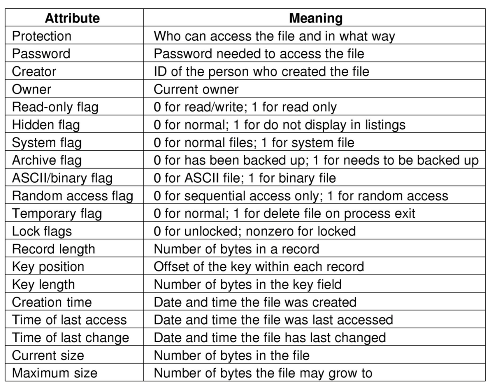
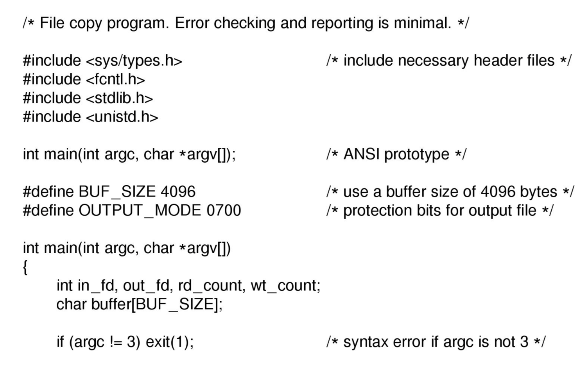
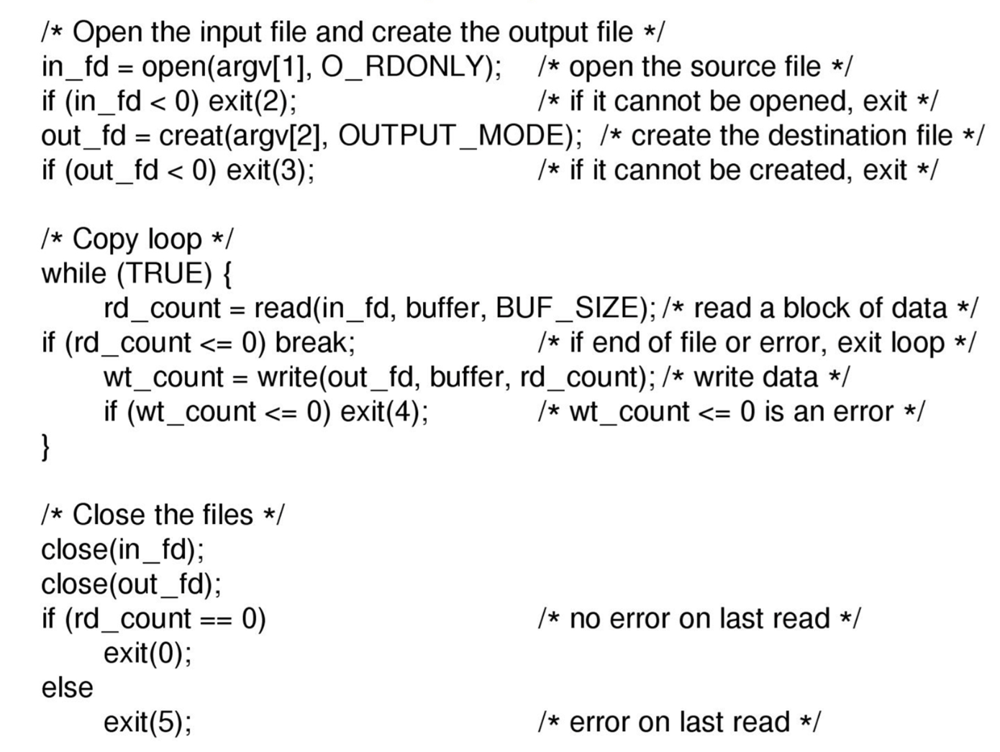
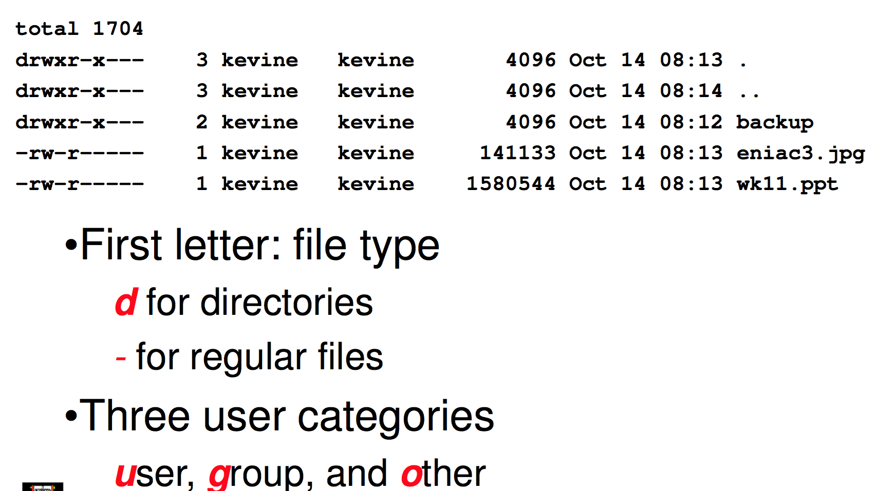

## File Access Types
---

Sequential access

- read all bytes/records from the beginning
- cannot jump around, could rewind or back up
- convenient when medium was magnetic tape

Random Access

- bytes/records read in any order
- essential for data base systems
- read can be ...
	- move file pointer (seek), then read or
		- lseek(location,...);read(...)
	- each read specifies the file pointer
		- read(location,...)
	- Both valid, depends on design choice

Random access can pretend to be sequential. You can actually specify that file ___ is gonna be read sequentially so the os can grab data in advance because it knows you aren't gonna jump to any address, you only move forward from the current pointer by 1 at a time. 

## File Attributes
---

## Typical file system operations
---

● Create
● Delete
● Open
● Close
● Append
● Seek
● Get attributes
● Set Attributes (actually how we change file names)
● Rename
● Read
● Write

An interesting thing is the difference between append and write, with write anybody can trash the existing content but with something like a log file you may want to enforce that people can only add, not edit set data. 

## An Example Program Using File System Calls
---

Lets look at a sample implementation of the `cp` command

First thing is we get a file handler for the in file and out file (just a int)

then we copy all the data from in into out. 

note that if we fail if we can't read or write any data we close all the files before we end 
note that failing to read is fine it means we hit EOF but failing to write is a real issue. 

## File Organisation and Access
---

Given an operating system supporting unstructured files that are a stream-of-bytes, how can one organise the contents of the files?

We can create any type of structure by simply having offsets define anything. You can have a tree as long as you remember what offsets refer to which nodes. 

#### Executable Linkable Format

This is a common file format. 

The Header is fixed and describes the file and properties. The program header table holds offsets and sizes of parts of the program that you can load into main memory. Lets you segment the file. 

The section header table does largely the same but for each section of the file. program headers splits into sections which the section header table helps us understand and use. 

We can use this to improve efficiency!

I.e when updating files we can update one section and the file system will split it up into these sections to maek updating easy. 

If a file is going to be read from start to finish we might have no sections and just a steam of byte. 

we can split the file into records or into blocks that we can traverse like an array, ie progress the read of the file AND rewind it back to the previous section.

Lets us use data structures to optimise use. 

#### File Organisation

We want to make things logical and easy to search. 

Things to consider when designing file layout

- Rapid access
	- Needed when accessing a single record
	- Not needed for batch mode
		- read from start to finish
- Ease of update
	- File on CD-ROM will not be updated, so this is not a concern
- Economy of storage
	- Should be minimum redundancy in the data
	- Redundancy can be used to speed access such as an index
		- You can store more indexes to get better performance

#### Directories

Provide mapping between file names and the files themselves

Most file systems don't store file names with the file. The directory maps this name to actual memory. 

The directory itself is just a file owned and managed by the operating systems. At first this was open for the user to edit but this causes many fuck ups so it's locked off now. 

Directories let us create hierarchal file systems. This is great lets us organise and also lets us have multiple files with the same name in different paths. They have different ABSOLUTE paths. 

We can now have a unique path for every file, allowing us to discern them.

the concept of working directory lets us skip the hassle of specifying a absolute pathname for everything. this working directory is just prepended onto any file you refer to. You can also use this to have relative path name. 

remember `.` is current directory `..` is the parent. 

Note you can not create directorys really in unix. making a new file can sometimes have a side effect of creating a new directory. 
We can also link and unlink files. 

#### Why we love unix naming

Names referring to different servers, objects, etc., have the same syntax. Regular tools can be used where specialised tools would be otherwise be needed. We just need the path name not all this issues with version and device and server and network etc. etc. etc.

#### File Sharing

We need to implement this but if we do we need to manage simultaneous access and access right. 

With Access rights we have a set of levels

**None**

- User may not know of the existence of the file
- User is not allowed to read the directory that includes the file

**Knowledge**

- User can only determine that the file exists and who its owner is
- Sometimes this is too much information, if the file is called "HOT_SLUTS_XXX" then knowing that the file exists or it's name is something that some users should not have access to. 

**Execution**

- The user can load and execute a program but cannot copy it

**Reading**

- The user can read the file for any purpose, including copying and execution
- This is good for being able to run code with secret keys in it. 

**Appending**

- The user can add data to the file but cannot modify or delete any of the file’s contents

**Updating**

- The user can modify, deleted, and add to the file’s data. This includes creating the file, rewriting it, and removing all or part of the data

**Changing protection**

- User can change access rights granted to other users

**Deletion**

- User can delete the file

**Owners**

- Has all rights previously listed
- May grant rights to others using the following classes of users
	- Specific user
	- User groups
	- All for public files

Ok so shared access
Most OSes provide mechanisms for users to manage concurrent access to files
Example: flock(), lockf(), system calls, in UNIX. Both are the same just history created two functions. 

This does mean you have to handle mutual exclusion of the locks AND deadlocks lmao. 

#### Case Study: UNIX Access Permissions

note that . and .. are directors or links to directories. 

note user is the owner of the file, the god. 

group is a set of users such as OSPRJ167

note that directors that are executable are directories you are allowed to enter. Access. 

What is the default setting for the files you create fresh. 
THis is determined by the UMASK this is a set of digits that correspond to each of the User group or other sections of the code. 

when a file is created the UMASK is or'ed with the file to set the bits. 

777 is 111 111 111 which sets read, write and execute for everybody. 

774 is 111 111 100 has other users have no right to write or execute. 

This is nice but not great. You can't set it for individual users. There is only 1 group in reference to each file. 

