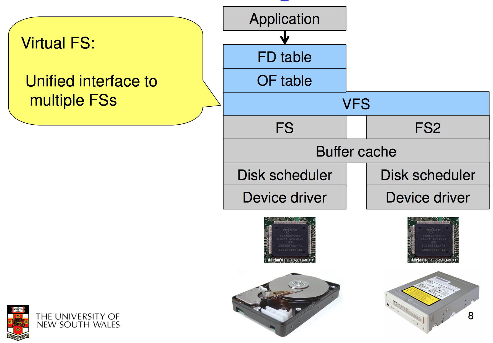
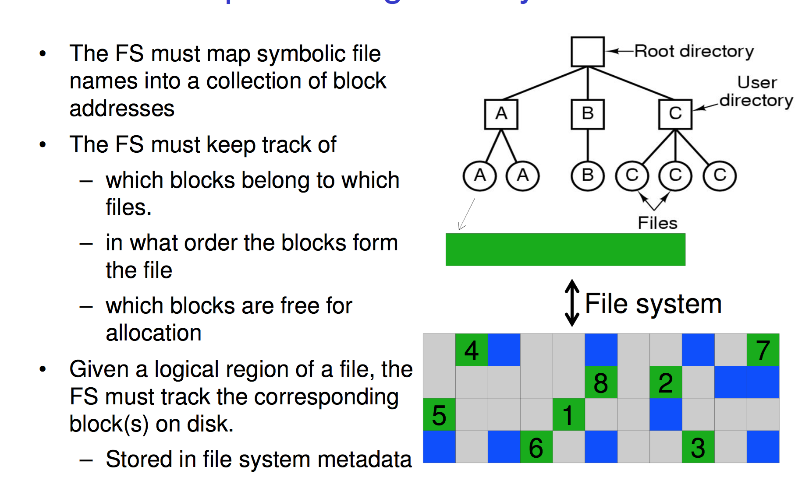
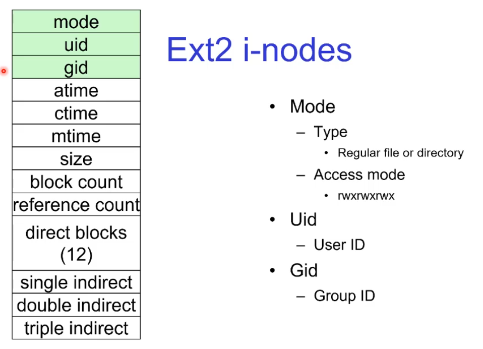

# File System Internals

## Unix Storagre Stack
---

There are several levels of abstraction before you get to the hardware. when it comes to file systems. After you get to the end of software interfaces usually the device driver you then interact with the disk controller. 

This is usually a microprocessor on the disk drive itself or in the computer which takes the tracks and sectors of the hard drive and converts it into a linear sequence of blocks. It handles all the physics. 

This lets the software read and write blocks rather then deal with the physics. 

#### Device Driver
Now lets move up the software stack. At the very bottom of this stack next to the disc controller is the device driver

Hides device-specific protocol and Exposes block-device Interface (linear sequence of blocks)

#### Buffer cache and Disk Scheduler
Mostly for optimisation. 

Keep recently accessed disk blocks in memory (cache)

Schedule disk accesses from multiple processes for performance and fairness (Scheduling) can reorder requests to improve performance. 

#### File System

Hides physical location of data on the disk
Exposes: 

- directory hierarchy
- symbolic file names
- random-access files
- protection

#### VFS

lets us abstract multiple different file systems types into a common interface. 

This lets us support multiple different file systems as different ones have different levels of efficiency and portability and security. We want to be able to use multiple without having to edit the file system to work with us. 

#### File descriptor and Open file tables:

Also known as FD table and OF table. 

Keep track of files opened by user-level processes
and Implement semantics of FS syscalls. Allows files to have names and extensions. 

## Popular File systems
---

There are a lot. FAT16, FAT32, ZFS, JFS, OCFS, Ext2,3,4 XFS etc. 

But why do we need so many, why hasn't 1 dominated the market?

Basically differently file systems work for different physical storage devices. And different uses cases naturally produce different hard disks. 
Ext3 is optimised  for magnetic disks
ISO9660 is best of CDROMS, i.e this doesn't have to worry about being writer/edited
JFFS2 is optimised for flash which can be edited etc. 

Furthermore storage capacities cause new file systems to be built such as Fat 32 which could support drives above 2GB. FAT32 can not do anything larger then 32GB though. 

Furthermore there are issues with CPU and memory requirements, FAT16 is not suitable for modern PCs but it is a good fit for many embedded devices. 

#### Hard drives

keep things that need to be accessed together, close to together so you don't have to seek

## Implementing a File System
---

the meta data of the file just describes the file for the OS. 

alright so lets do this. 

Step 1: break up the file into the blocks that the file system supports, lets say 256 byte blocks.

Step 2: decide where to place them and how to structure them. 

#### Contiguous Allocation

Easy bookkeeping but the blocks in order, all we need is the start block address and length, like a array.  

increases performance for sequential operations. 

The issue is that we need the maximum size for the file at the time of creation. And as files are deleted we get external fragmentation of the free space. 
There are smaller blocks of free space across the memory rather then bigger ones. 

This sucks for read write system but for CD ROMS where you know everything you need to write and afterwards will only read, this is fine!!

#### Dynamic Allocation Strategies

internal fragmentation is due to the fixed block size issues. If your file is 100 bytes in size and the block is 256 bytes the rest of that block is wasted. 

You have to pick a correct block size for our standard use case files. 

#### Linked List allocation

this is a type of dynamic allocation
also known as chained allocation. 

This works well for sequential files well BUT if the files arn't sequential i.e random access files, if you want to only read the last block it would take a complete traversal through the list. 

IT also is bad for performance as you have to seek per block. 

#### File Allocation Table

FAT file system 

The table basically tells us where everything is. Now we can sort of traverse the list but in ram rather then reading a block from memory grabbing the next address seeking and then grabbing the next. This lets you traverse REALLY quick to get to where you want for a random access file. 

This is really bad for memory though, you have to keep a table entry for every block 

Also with super large file systems you have to search through a very long array to find the next available free block. Can be slow

OK so where is this table stored, it's in ram sure but where does it get loaded into ram for. 

On the disk itself right at the start before the data blocks. 

Usually this table is copied twice so if one gets corrupted the other is still there. 

#### inode-based FS structure

Way more common then Fat. most popular today. 

each file has a separate table of index nodes that point to the actual memory blocks. Is still fast because we know where the blocks are but still requires seeking. This is good for sequential seeking because we can just use the table to go to the relevant memory and Random access is still fast too, we can just look at the table. 

i-nodes occupy one or several disk areas though as any table would. 
Part of the disk is thus reserved. 

if we have a set size of the disk allowed for the i node tables doesn't that mean we don't have a dynamic system. 

What we can do is have the i-node table point to other pieces of memory which can hold further i node info outside of the set i-node section of the disk. 

So with i-node it has both common methods of handling free space. 

We have a linked list of free blocks that we can search and add to. 
in this one free block holds a set of 256 numbers referring to other free blocks. And the very last of these 256 numbers points to the next free block which holds even more numbers. 
this allows to use free memory to store info about free memory. Sorta genius tbh. 
Once all the numbers in the free memory block are used the block becomes free itself to be used by the user. 

we can also have a dedicated bitmap, every block has a bit, if it's 0 it's free if it's 1 it's used. Although this requires a set amount of space for the free bitmap regardless of how many blocks are actually allocated or not it consumes the max space. This also is a shitty thing to search, you can optimise it by having a two level table or some stuff. Furthermore one part of the disk (the bitmap) will be easy to use (all the data right next to each other) and easy to use to find contiguous space, (look for a string of 0's)

Directories here are just like normal files, it contains within the data block a series of directory entries. Map a name to inode number. The FS assigns special meaning to the content of these files

fixed-size directory entries kinda suck. either your names have to be too short i.e 8+3 characters or you have 255 characters which is way too much for most directories which are ls, dir, bin, pwd. ETC.

Thus we mostly use Variable size directory entries. this can cause external fragmentation but can be compacted in RAM. 

The structure of directory listings depends. Sometimes it's a hashmap, a binary tree or a linear array. Each have their searching and implementation uses. 

if we use a linear array we can use a directory cache in software to speed up search and usually is easy because ls just gives you the list, no reordering needed. 

now with storing attributes for files, you can store the with the directory entry or have the entry point to some external bit of memory which has the file attributes. windows and FAT does the first, unix does the latter. 

#### Trade off in FS block size

File systems deal with 2 types of blocks

- Disk blocks or sectors (usually 512 bytes)
- File system blocks 512 * 2^N bytes
- What is the optimal N?

Larger blocks require less FS metadata (less blocks = less meta data sections)

Smaller blocks waste less disk space (less internal fragmentation)

Sequential Access benefits from larger block size

Random Access benefits from smaller block sizes as the larger the block size, as if you want to read 100 bytes from a block you have to read in the entire block, most of which is useless to the current operation. 

at the moment N is moving towards being 3. I.e 4K blocks. 

## Case Study: ext2 FS
---

There is a main problem with this which is that it doesn't cleanly shut down when not given the chance to. I.e if the power cuts out or the drive gets pulled out it can't be restarted and just resume. It will have a inconsistent state. 
To deal with this, every time it would restart after a unexpected unmount it would have to run a file system checker to make sure everything was in order and to fix any issues. Not to bad with smaller disks but with terabyte disks it was AWFUL and would take almost half a day to be back up and running. 

#### Recap

directories map names to i-nodes. all files are referred to by i-nodes. 

#### Ext2 i-nodes

#### Inode contents

this is a good question, and the fact is we have size and block count as separate entities they must be something different. 

what happens if we have a file with 5mb but within it we just store 1byte at the 3MB mark. only 1 byte is being stored but at a very high index. 

thus

block count includes the meta data but size is just the highest index. 

the direct blocks store the address of the first 12 blocks of the fine. 3 is block 10 and 21 is block 11. 

This is fine for most files because most files are quite small so this helps look them up super quickly. 

for larger files we use single indirect which points to a block which inside of it holds the addresses for the next blocks from 12 onwards. This takes 2 disk reads but it still fine. 

If this one block can't hold any more blocks we use double indirect or triple indirects. i.e a double indirect points to blocks of memory which holds points to single indirects. 

as in a pointer to a block that points to a block which points to the file blocks.

using this structure we get way bigger max file sizes, with a 4byte block numbers and 1K blocks we can get to 16GB max file sizes!!!. 

note we try to use just double indirects before going on to triple because triple takes 3 disk reads rather then 2. 

you can use some smart convert index to binary and use the binary numbers to tell you the path through the indirections to get to your block!!

note if you carry through the index calculations (in lecture) to get the location of a given data block you notice that empty blocks arn't allocated i.e pointed to by the single, double or triple indirects. 

