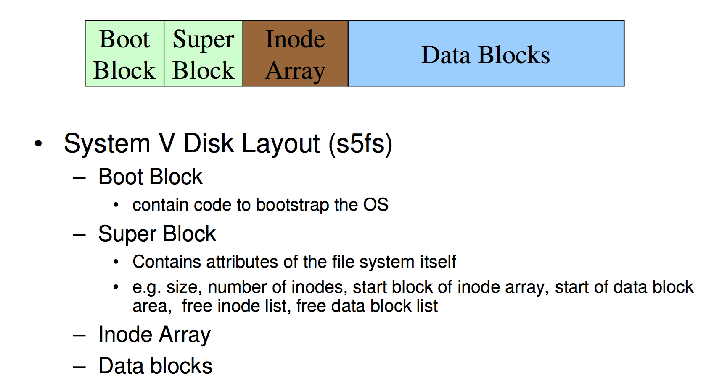
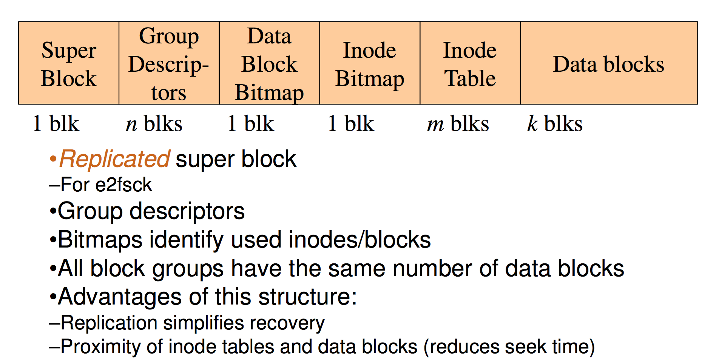
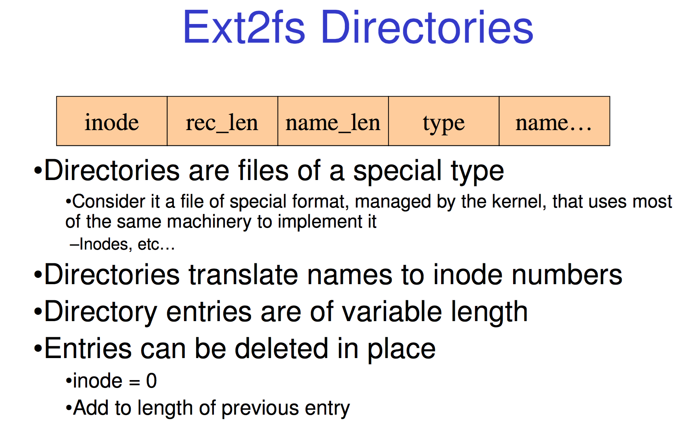
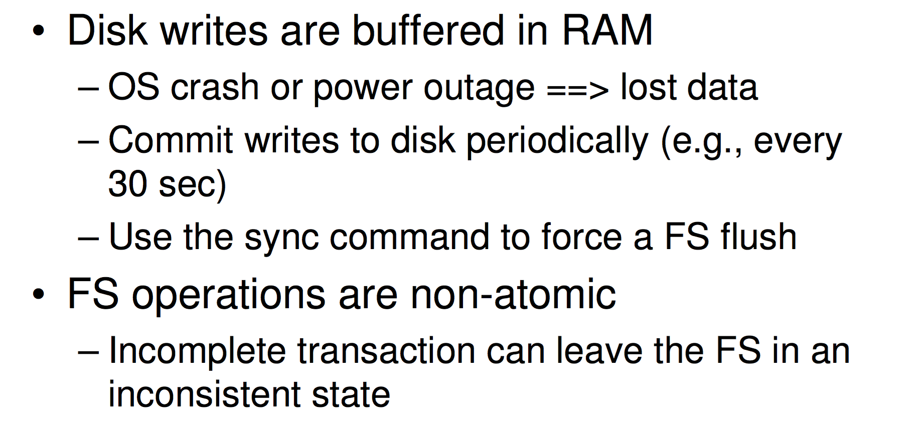

# More Unix I-node File Systems

## Worst and Best Case Access Patterns
---

**To Read 1 byte**
Best: 1 access via direct block
Worst: 4 accesses via the triple indirect block
The worst depends on the implementation as disks can skip some steps such as reading a empty block from disk (as you can just return 0's)
**To Write 1 byte**
Best: 1 write via direct block (with no previous content)
Worst: 4 reads (to get previous contents of block via triple indirect) + 1 write (to write modified block back)
We can also possibly need 4 writes to create the 3 indirect blocks if they don't exist yet. 

## Summary
---

The inode (and indirect blocks) contains the on-disk metadata associated with a file
- Contains mode, owner, and other bookkeeping
- Efficient random and sequential access via indexed allocation
- Small files (the majority of files) require only a single access
- Larger files require progressively more disk accesses for random access
Sequential access is still efficient
- Can support really large files via increasing levels of indirection

## Where/How are inodes stored
---

#### s5fs

superblock: This is what the formatter writes to when defining the file system attributes

This has issues though. If you put the inode at the start of the disk and the data behind there is a constant movement of the head as you shift back and forth. 

There is also only 1 superblock, if it was corrupted or broken ur fucked. The entire file system would be gone, a single point of failure, death star style. 

Over time the list of free blocks get's fractured and randomised the inode free list is also randomised over time so we end up with a random access pattern. 

#### FFS/EXT2FS

the Berkeley file system tries to build upon the issues of s5fs
this later lead to ext2fs

There are no SO many super blocks as there is 1 in every block group. 
we also shift from a free list strategy to a bitmap strategy. 

Note that we also have some data in the superblocks now that signals if a system check is needed. It basically flags if it is inconsistent, wasn't unmounted correctly or crashed the last time it was running. 
Also contains the number of mounts since last check and time expired between last check. 
If something went wrong it automatically runs the file system checker. 

It lets us recover from a corrupted file system. 

The group descriptors contains the location of the bitmaps, counter for free blocks and inodes in this group and the number of directories in the group. Now if this fails the group is fucked BUT only the group, not the whole file systems. 

note that with block groups you don't have to move around as much for bitmap and actual data.

There is also a optimisation in place where block groups that are related (lets say written by the same thread but interrupts by other threads so the memory it writes to isn't sequential) are put together. 
Whenever 1 write is done the file system reserved 8 blocks after the written block so if the thread / program wants to write again it can do it right after the previous one because the space is available. 

This doesn't waste the space because once you close the file and say you are not gonna write to it again right no, it'll un reserve this. 

Great for concurrency. 

#### Ext2fs Directories

it's very controlled access to make sure the directories are always in the correct expected format. 

inode = 0 means empty entry. this number is reserved. 

4 byte blocks (called entires), the rec length is the number of bytes to skip before you can get to the next directory name. you have to pass name length and name and rec length which is 3*4 = 12

going from the green to the blue is 4*4 = 16

Now with this we can create hard links, that is when you can have more then one name for the same file. 

3 names all point to inode 7. in unix we can do this with the `link` command. 

But the issue is if you delete "file" but there is still another reference called "my_file". what happens? well when you delete a file you don't do shit. You just remove the name from the directory and decrement the reference count in the inode. If decrementing this leads to 0, THEN the file is freed. 

note that to prevent issues like this one where one person can delete a file but because their dick friend has a reference to it they gain no disk space, we can only hard link to files we own. 

Now we also have Symbolic links. A symbolic link is a file that contains a reference to another file or directory. /foo/bar just links to /foo/bar2 which is then looked up to find a inode. 

Has its own inode and data block, which contains a path to the target file
- Marked by a special file attribute
- Transparent for some operations
- Can point across FS boundaries

This has issues because we can create a cylic graph. You can make infinite loops that the file system searches. 
So the file system only looks up to 16 files and then gives up. 

This is more useful then hard links because they need a inode to point to where as symbolic link can point to other file systems and hard drives. 

#### Deleting Ext2fs Directories

we just adjust the reference count of the directory before toDelete to skip over the now deleted place and some compaction can be done to avoid fragmentation. 

#### FS reliability

we cache data in ram which raises some issues
there is also the issue that FS is not atomic and can me interrupted when it is in a inconsistent state. 

we can for example in deleting a file remove the directory entry and then before we get to marking the i-node as free crash. The system is now in a inconsistent state. 

we can deal with this via the super block flag which makes the file system check which finds orphan data blocks or orphan file systems. Sometimes it will find a data block with no name pointing to it and will put it into a folder called lost and found. aw

The file system checker is very slow. so what we added in the next generation of file system we use journaling. we keep a journal of FS updates which are atomic you write to it in 1 step. 
if shit fucks up we can reply the last journal entries to regain a consistent state. (ext3fs)

 

 

