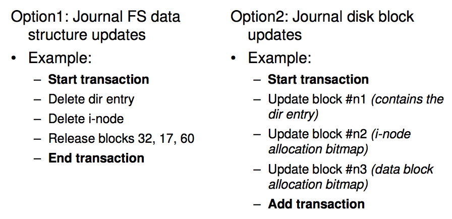
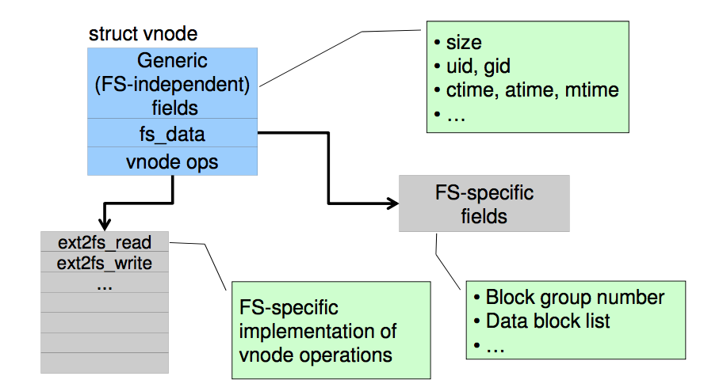
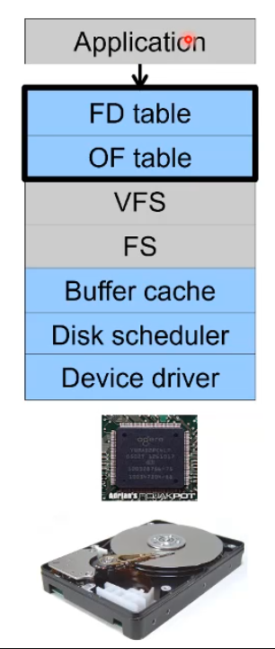

# ext3 FS

## Journaling
---

#### Intro

The issue with the last file system we looked at was the problem of updating the file system because of the disk crashes at any point in the updating process the disk is left in a inconsistent state. This leaves us with needing a file checker. 

with journaling (similar to a log file system) we have a part of the disk reserved for keeping track of what we are doing. If we ever crash we can reply this record of what we need to do to go back to the state we were at. 

if we want to delete a file we put all 3 steps into the journal, complete all 3 then remove all 3 from the journal. 

if we fail at any of the 3 steps, when the system is relaunched all 3 steps are there in the journal and re run. Running a step twice is fine not running it at all is the issue. 

ext3 basically just had journaling and otherwise was just ext2. it did have backwards compatibility between ext2 and ext3 you could mount partions backwards and forwards.  

ext3 wanted to leverage the proven ext2 base (rather then rebuilding and testing ext2) and allowed the reuse of ext2 tools as well. 

#### How to Implement

we have 2 options. 



the left side has the higher level operations where as the right hand side has the lower level actual change to the disk. 


thus ext3 uses Option 2. 

the journaling layer must understand HOW a file is delete and the range of specific operations that are needed and in what order etc.  in option 2 we don't need all this information. 

#### JBD

The ext3 journaling layer is called Journaling Block Device (JBD)

it sits between ext3fs and the actual block device AND Journal. 

any transactions go through here and it handles them, updating both the journal and the blocks. 

it puts the completed transactions will be cached in ram initially and flushes them out after a while. 

after a while the log can be committed, flushes the ram into the Journal. it does multiple transactions into the journal. this has good write performance. 

a checkpoint is when we flush the journal into the disk for storage, this is what we do if the disk is being unmounted or the Journal is full. 

#### Transaction life cycle


#### Journaling modes

there are 2 which you choose between depending on ur use. You see with journaling you have to write all data twice and if you are doing some write intensive stuff this basically becomes a performance bottle neck. 

1. Metadata + data : Here all the data and meta data gets stored, this is for paranoid people, EVERYTHING it stored. this enforces the atomicity of all FS  operations. 
2. Metadata journaling: here metadata is journaled and data blocks are written directly to the disk. improves performance and ensures critical updates work correctly. the data blocks themselves may be inconsistently written to the disk though. you can deal with this at application level with some tricks that flush and stuff. usually these issues are rare enough that we take the risk. 

#### Data Structure

you can have the journal on a SSD and have an array of hard drives on large high performance system. 

you have the journal that needed a lot of access being stored on a faster high performance but expensive device and all the data on the stock standard hard drives. 
Furthermore this allows for compatibility with ext2 as the file system can still be ext2 with just a extra layer of the journaling system attacked to it with ext3 on top of that. 

JBD is also independent of ext3-specific data structures 

# Unix File Management

## Virtual File Systems
---

Older systems only had a single file system. they had file system specific open, close, read, write etc. 

But modern systems needed multi file system types such as ISO9660 for CDROMS or MSDOS for floppy or ext2fs. 

there is also tmpfs which was optimised for fast temporary storage for scratch files (files we don't care about for persistent state) stuff like compiler file intermediates. We just want speed from this. An example is like /tmp. 

So tmpfs is basically just a layer over ram! Allowing programs to pass small files to each other which arn't persistent. won't last over a reboot. 

#### How to support multiple file systems

We could keep adding file system code to support all the new stuff but it gets complicated fast. 

So sun Microsystems came out with the "virtual filesystem framework". Provide a framework that separates file system independent and file system dependent code. Allows different file systems to be “plugged in”.


Allows us to have a consistent read, write etc to use. 

in CSE we use a mix of ext3 and nfs. 

this is because individual users files are stored on network drives in a rack in cse and we can access this simply by going through the mount point which is the directory!

vfs thus lets us handle network file systems where through a directory we can access files not stored on the local machine. 

note that vfs lets us create any file system and if it meets the interface it can run. 
An example on linux is /proc. it is a operating system dynamic file system. if you create a new process a magic file appears in this file system with the name = process id. when we use ps, it's just walking this magic file system. It's a dynamically populated namespace. 

it was a trick to let us observe the current machine state. 

/dev is similar but represents the current state of the machine in reference to the current devices connected to it. 

#### Implementing a VFS

We layer a VFS on top of the actual FS, it presents to the higher level a standard interface. it has a vnode which can be translated into the underlying file system request. 

a good read:
S.R. Kleiman., "Vnodes: An Architecture for Multiple File System Types in Sun Unix," USENIX Association: Summer Conference Proceedings, Atlanta, 1986

Anyway there are two main data types. 

VFS

- Represents all file system types
- Contains pointers to functions to manipulate each file system as a whole (e.g. mount, unmount)
- Form a standard interface to the file system

Vnode

- Represents a file (inode) in the underlying filesystem
- Points to the real inode
- contains pointers to functions to manipulate files/inodes (e.g. open, close, read, write,...)

VFS uses Vnodes




#### OS161 VFS

Here is the os161 file system type. Represents the interface to a mounted filesystem


note the vnode operations is a array of functions that the vnode must supply so it can interact with the VFS. It's the interface. 

```c
struct vnode_ops {
unsigned long vop_magic; /* should always be VOP_MAGIC */
int (*vop_eachopen)(struct vnode *object, int flags_from_open);
int (*vop_reclaim)(struct vnode *vnode);
int (*vop_read)(struct vnode *file, struct uio *uio);
int (*vop_readlink)(struct vnode *link, struct uio *uio);
int (*vop_getdirentry)(struct vnode *dir, struct uio *uio);
int (*vop_write)(struct vnode *file, struct uio *uio);
int (*vop_ioctl)(struct vnode *object, int op, userptr_t data);
int (*vop_stat)(struct vnode *object, struct stat *statbuf);
int (*vop_gettype)(struct vnode *object, int *result);
int (*vop_isseekable)(struct vnode *object, off_t pos);
int (*vop_fsync)(struct vnode *object);
int (*vop_mmap)(struct vnode *file /* add stuff */);
int (*vop_truncate)(struct vnode *file, off_t len);
int (*vop_namefile)(struct vnode *file, struct uio *uio);
... this goes on for a while
```

isSeekable is a function that lets us tell if a file lets us move arounf the file pointer. remember everything in unix is a file so a serial port is a file that is not seekable, where as normal files are. when we create the vnode for this serial port we have isSeekable return false. :)

now this all works with vnodes, how can we work with directory. 

There is a higher level API on names and directories that uses the internal VOP_* functions that lets us take in path and it will return the associated vnode so we don't have to assume how the file system handles these. 

## File Descriptor and Open File Table
---

This is the code that talks to the application and uses the higher level interface provided by the VFS. 



how os161 works is there is a special magic box that transfers calls to the emulated file system into calls to the actual os that os161 is running on. 

note that this emulated file system is a 1 level system you can't make any directories or anything else. 

This basically is the interface between applications (the system call interface) and the VFS interface which deals with vnodes and reads and writes to this vnode and closing it. With the system call all we use it path names. 

#### File Descriptors

each file has a file descriptor which read, write and lseek use to specify the file, this is not the vnode and is managed by this FD/OF interface. It's basically just a int. 

There is also some state associated with this file descriptor though such as the location of the file pointer and the mode (read only etc) This is important on top of file permissions, if the file is read write but i really want to make sure i don't fuck up and write to it i can open it as read only. 

how to we implement this? well lets look at options

1. use vnode numbers as file descriptors and add a file pointer to the vnode. i.e we identify files by the assoicated vnode address etc. 
	- The issue with this is each file must opened once. if it's opened once we now can't keep track of which instance is which and the associated file pointer. 
	- you should have two different file descriptors for two different accesses of the same file. 

2. Single global open file array. the file descriptor is a index and it points to a struct that has info on the file pointer and vnode. 
	- stdout is file descriptor is `1` by convention. and anything that writes to stdout will obviously show up on terminal. 
	- but if you have a global array there is only 1 output terminal and everyone has to share
	- we should have stdout always be file descriptor 1 BUT we should have multiple people access different versions of this. 

3. same as above but each process has 1 table. 
	- now remember fork is defined in a way that the child has the exact same file pointers as the parent. so now these both can't work with the same file. You make a new process in the middle of a file operation and now you have 2 processes with identical file id's/ 
	- there is also Dup2 which should give is another file descriptor to the same file pointer etc. makes sence you make a new file descriptor that mimics where you are up to in the current file. Impossible with this system. 
	- the file pointer and vnodes are in a array, it has a set single index. we want to be able to have 2 processes work with the same file pointer 

The solution??? Per-Process fd table with global open file table. 


## Buffer
---

Temporary storage used when transferring data between two entities

- Especially when the entities work at different rates (one is outputting faster then the other can input, so we buffer)
-  Or when the unit of transfer is incompatible, Example: between application program and disk, the disk only lets you right 4k blocks but we write to the disk in 1 byte blocks so we buffer until we hit 4k then we flush. 

this is nice cause it's also faster to buffer and write in blocks rather then write very byte. we don't have to wait for the i/o to complete before returning every time. 

the buffer here also lets us read ahead in sequential file access etc. to improve performance. 

#### Cache

we can cache disk blocks to optimise for repeated access. 
this is similar in buffering. so we can combine the two to produce the buffer cache. 

we buffer a block and then leave it there so it can be a cache. this is usually dynamically sized so programs that use a lot of ram arn't hindered by a large buffer cache, i.e the buffer cache shrinks here. 

note unix uses a hash table to match a read to a cached version.

there is collisions so each hash key points to a chain. each entry has a hash pointer to the next entry. this is called internal chaining. 

so what do we do when the buffer cache fills up?
here we need a replacement policy, who is getting kicked out?

typically we chose the victim who isn't going to be used for the longest time. we could use first in first out but really we want to prioritise.


the daemon's life is to wake up every 30 seconds and call sync on all file systems. 


