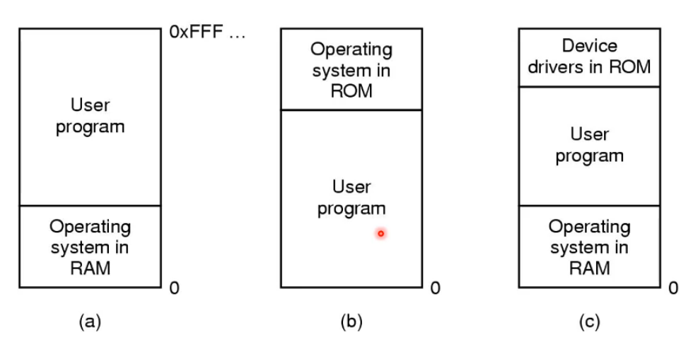
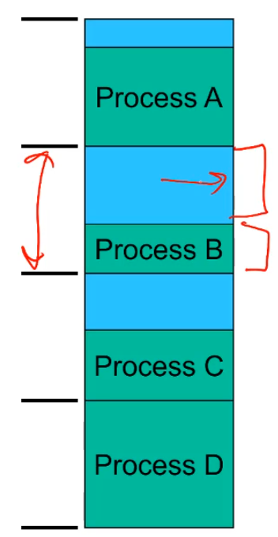

# Memory Management

## Process
---

As a recap remember that this is just one or more threads of execution with assoicated resources such as CPU time, files, disk space, printers and memory. 

The memory splits into program code (text) data (stack) and buffers held in the kernel on behalf of the process. 

## OS Memory Management
---

The os has the job of keeping track of how and where memory is used between it's users. It must also must manage the transfer of memory between RAM and disk. 

> Sometimes the OS moves ram into secondary storage to give more ram access to users
s
There are two broad classes of memory systems

1. those that transfer processes to and from externel storage (called swapping or `paging`)
2. Those that don't do this, and are much simpler and thus used for stuff like microwaves. 

## Basic Memory Management
---

This is called monoprogramming without swapping or paging. And there ends up being 3 simple ways of organising memory for a OS and 1 user process. 

> Remember that ROM is just Read Only Memory 

Note that the device drivers in ROM now days are within the BIOS, it helps bootstrap the operating system. 

This is ok but it has poor CPU utiisation in the presence of I/O waiting and with a varied job mix really doesn't utilise memory. It's ok if you only have one thing to do and the memory available approximetly equates to memory required. I.e you don't have multiple things competing for resources. But otherwise you need to match memory to the largest possible job etc.  

## MultiProgramming/MultiProcessing Memory Management
---

OK so we are trying to maximise memory utilisation and cpu utilisation by subdividing memory and runnning more then one process at once.

But now given a workload how do we keep track of free memory and locate free memory for new processes?

Well at a overview level we have a simple evolution

1. Static fixed partioning approcaches
    - Simple predictable workloads of early computing 
2. Dynamic paritioning approaches
    - more flexible computing as compute power and complexity increased

Later on we can use segmentation and paging to provide a more flexible computing enviornment but that's the modern solution. 

## Static/Fixed paritions
---

#### Fixed, equal sized parititions

Lets say we want to divide memory, we could divide into equal-sized paritions. any process less then or equal to the parition size can run and if all are used it waits. 

This is wasteful, we get internal fragmentation. 

Furthermore process smaller then main memory but larger than a partition cannot run. If memory is 8GB and we want to run a 7GB process and there are 4GB parition, it'll never run. 

#### Fixed, variable sized partitions

Divide memory at boot time into a selection of different sized paritions, and these are set to match the frequency of the expected workload. i.e if we have some big programs but a lot of small ones, we have 100 small paritions and 1 big one. 

Each pariticion has it's own queue that processes with matching memory sizes wait on . 

But what happens if only small jobs are availble so the large parition never really runs and it's wasted. 
And not every workload is that predictable. 

#### Alternative Queue strategy. 

We now have a global queue for all processes that need memory and this queue can put processes on any of the variable sized paritions. It'll just pick the best available paritition. 
So if a small program has a small parititon awesome, if not it'll grab a bigger ones. 

Of course this still has internal fragmentation when a larger program further back in the queue has to wait for a tiny program that's using it's parition. 

#### Conclusion

Fixed Partition summary is simple and easy to implement but can result in poor memory utilisation. 

Used on early OS like the IBM System 360 in 1964 and is still used in simple embedded systems where the workload is static and known in advance

## Dynamic Partitioning
---

Partitions are of variable legnth here and are allocated on demand from tanges free memory. 

Process is allocated exactly what it needs but assumes the process knows what it needs. 

Of course as memory is allocated and free'ed most of our memory is fragmented so a contigious block of memory of larger sizes becomes impossible to find. 

this is EXTERNAL fragmentation but we've solved internal fragmentation. 

Now there are dynamic parition allocation algorithms that must given a memory region quickily locate a free parition with minimal CPU time search, minimise external fragmentation, minimise memory overhead from bookeeping and efficiently support merging two adjacent free partitions into a larger parition. (i.e free BLOCK BLOCK becomes free BLOCK not free free BLOCK)

This is allo applicable to out of OS stuff like malloc, an in application allocator. 

#### Classic Aproaches

Represent available memory as a linked list of available holes, it's kept in order of increasing address (so we know which ones are adjacent to merge them). The free memory is also thus STORING the data structure with each free block having the hole size and the next pointer. 0 memory overhead as a result. 
Merging is thus easy as well as we just combine two/three adjacent nodes and increase the nodes size to match.

#### First Fit Algorithm

scan the list for the first entry that fits. It minimises amount of searching performed, O(n). 
it can generally can result in smaller holes at the front end of memory that must be searched over when trying to find a free block. as if any memory at the front is big enough it'll be allocated first and end up splitting into smaller and smaller peices. 

It thus tends to perserve large blocks at the end. 

#### Next Fit

Like first fit except it beings it's search from the point in list where the last request succeeded. It's speads allocation more uniformly over entire memory and tends to break up memory towards the end of the list. 
It also tends ot break up the largest block of memory so it may cause larger requests to not be fullfilled. 

Still results in fragmentaton as well

#### Best-fit 

chooses the block that is closest in size to the request. It has awful performance because you have to search the entire list each time. 
Furthermore since the smallest block is chosen for a process, the smallest amount of external fragmentation is left. i.e it uses up all the 5MB holes but leaves all the 1MB holes meaning we creates LOTS of unusable holes. 

#### Worst-fit algorithm

This was a stupid idea where it was like "wow the best fit leaves the smallest holes so maybe this will leave the biggest holes"

It also sucks, still searches the whole list, and didn't improve fragmentation really. 

#### Summary

First fit and next fit and generally better then the others and easy to implement and they are great simple solutions to a still exsisting OD or application level memory allocation system. 

But they have largely been superseded by more complex and specific allocation strategies such as `lazy buddy` and `slab` allocators. These are more application specific and make assumptions about the performance, hardware and users to optimise. 

## Compaction
---

This is a method by which we can reduce external fragmentation. 

WE shuffle memory contents to place all free memory together in one large block. We can only do this if we can relocate running programs and the hardware supports it. 

This is not easy, because when you have a program running, the compiler expects the stack and variables etc. to be at a certain address. 

#### Issues

1. Relocation, how does a process run in different locations in memory
2. How do we prevent processes interfering with each other via a buffer overflow etc. 

#### Logical Address Space layout

logical addressed refer to specific locations within the program, once running these addresses must refer to real physical memory. These addresses start from 0 and the program uses this address space which is translated at a different time depends on the implementation

1. Compile/link time
    - Must know the run location at compile time, and when the location changes the files must be recompiled. 
    - This assumes the location the program has been compiled for is ready to be run from after the compile. 
    - Enforces that only 1 instance can run at a time given that you can only use that memory location once
    - Generates a load module (or executable file)
2. Load time
    -  We can ask the compiler to generate relocatable code, basically changes all the addresses to like labels which can be replaced by a actual addresses when it's loaded in by the OS to be run. 
    -  This takes longer to run a program cause we have to patch the bunary to bind the addresses. 
3. Run time
    - Logical compile time addresses translated to physical addresses by special hardware. it goes "he thinks he's running 0x"

