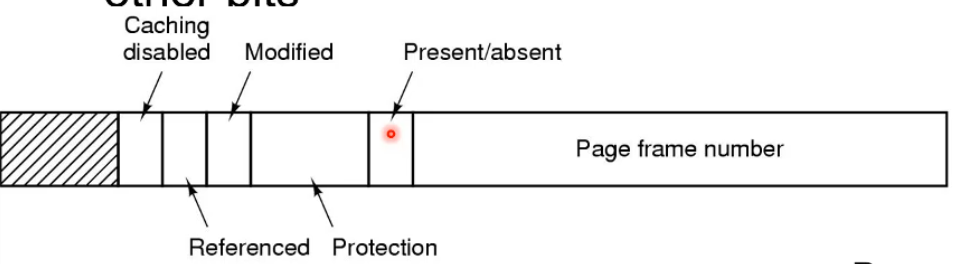
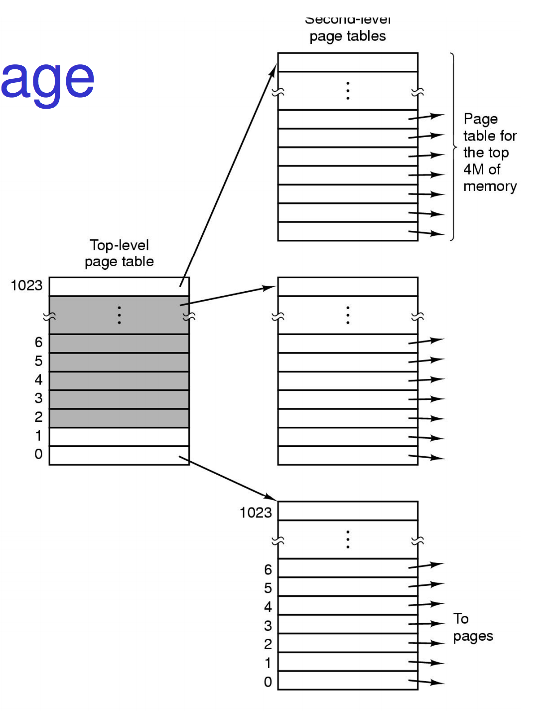
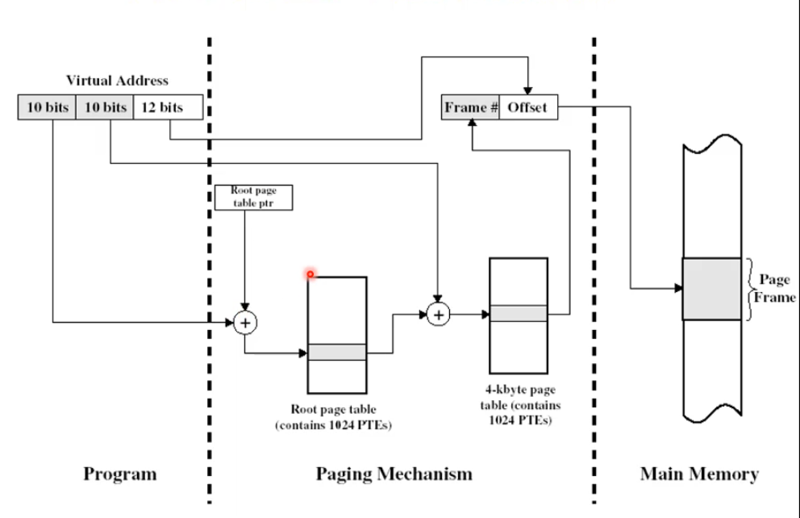
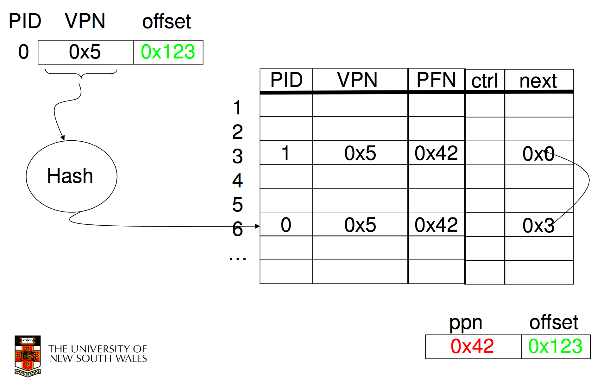
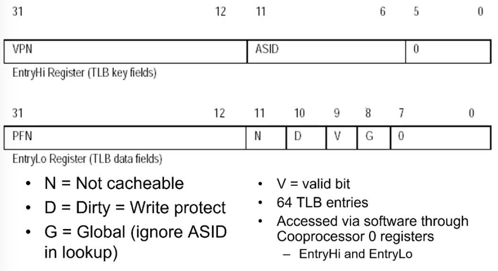

Broadly there are two standard page fault types
1. Illegal Address (protection error), a page fault is triggered because theree is a virtual page which maps to a 0th page(NULL) or a non exitstant physical page. 
2. Page not resident, i.e the page exists but is in secondary memory.

Which one caused the page fault isn't known untill the os kicks in and checks. 

But how does the OS know?? it has a data structure but lets build up our understanding of how a os could do this. 

Lets for now assume that the os has a page table which has a entry per virtual page that contains the page frame (physical page) that the virtual page maps to. 

#### Shared Pages

Each process can have it's own copy of code and data and can be anywhere in the address space but we can have shared code. A single copy of code in a page that is shared between all processes executing it, The code itself must not be self modifying i.e read only. Code must appear at same address in all processes. do note that this read onyl code doesn't work for java, java compiles and change's itself as it runs remeber!!

so if we want this we can't have a global page table, so we make process specific tables then. 

#### Page Table Structure

So how does this table work? It's a logical array of frame numbers that are indexed by page number. 

Each page-table entry (PTE) also has other info. 

Present/absent let us know if this is valid, if it's not we raise a page fault for one of the two reasons, Protection lets us set read, write, execution bits. 

We also have referenced and modified bits in some systems (not all). The referenced bit gets set if the page is ever accessed and the modified gets set if it's modified. 

There are very useful for knowing what pages are very unused and thus can be swapped into disk without causing too many issues. 

Caching disabled allows us to enforce that all memory we access from the page should not be chached, This is very useful cause we can have a virtual page address space map to a device like a video card. a video card gives you a continious stream of data like gameplay or a youtube video, you do not want to cache any of that !!

#### Address Translation

Every load and every store instruction a dn every instruction fetch needs to have this virtual to real translation. 

(a shitty non existant machine lmao but demonstrates the ideas)

## Page Tables
---

#### Issue

Assume we have 32-bit virtual addresses for a 4GB address space and 4KB page size. How many page table entries do we need for one process?

Well \\({2^{32}}\over{2^{12}}\\) is about 1 million (\\(2^{20}\\)). That's quite high overhead, up to 4MB of overhead. For a 64bit virtual address space we get a HUGE table which is too much overhead and furthermore the table must be quick to search and use because this translation happens EVERY isntruction. 

Most processes are much smaller then the full range of memory available. We should be able to represent the table compactily. There are three basic schemes

1. Use a structure that adapts to sparsity
2. Use a structure which only represents resident pages that are used
3. Use VM techniques for pages tables (covered in EOS)

#### Two-Level Page Table

This is one that adapts to sparsity. 

We have the space split into regions. The top level tabel covers 4MB regions, each of the entries point to a table with the page entries for those 4M address spaces, but if nothing is there the table isn't allocated. 

This is standard for ARM and 32 bit X86. 

This now requires a two level translation of page number to frame number. 

#### Inverted Page Table

Here we store an entry per frame rather then per page, globally. 

But how do we search by page number then? if you search the entire table i.e every frame on the system would be fucken way to slow. So we use a Hash Anchor Table that hashes a page to the frame numer index. 

Once hashed if the Frame number entry matches the input Virtual Page number we are good! note we can combine the VPN and PID to created process specific page numbers. 

note ppn -> physical page number

If we there is collisions we use internal chaining. I.e if multiple VPN's go to the same physical entry, we search along the chain using the next entry for a VPN match. If the next is null and we never found the frame raise a page fault.

an IPT (inverted page table) grows with size of RAM not the virtual address space as it's as big as the number of frames we have i.e ram. furthermore we need a frame table already to be able to keep track of page replacement so we already had this table, extending it isn't that bad. 

But we still need a seperate data structure for non-resident pages to know what is currently in memory and can be swapped in. 

We can built a sparse tree by increasing levels which can get big but this saves a vast amount of space. 

It's still used in some HP workstations and IBM but is mostly phased out. why?

Well given n processes the system has 1 global table for this implementation. 

What about sharing now? it's super difficult because two VPN's now need to hash to the same physical frame but the physical frame can only hold 1 matching VPN...doesn't really work does it.

#### Hashed Page Table

These take the fast lookup of IPT and low space usage but enable efficient frame sharing and support more than one mapping for the same frame. 

We just store entries in a chain and store the frame number so two entries can have the same frame number! Here the index in the table is no meaningless, just something the hash spits out

We can tune the HPT size based on physical memory size, expecting sharing and hash collision avoidance. But it never became wide spread. 

#### Performance

Atm we have to make 2 physical memory accesses per instruction, 1 for the load/store and 1 to get the page table. This is a intolerable performance impact. 

if we were using a Two level it would be 3 accesses!! too much!!

This is why we have a High sped cache for pag tbale entries called a translation look aside buffer that keeps a subset of the page table. 

We try to find a page number in the cache, it's hardware search so it seaches all 64/128 entires in one hit and if it finds a hit it places the frame number. 

if it isn't in the tlb and resutls in a tlb miss where we go to the main memory. 

#### TLB

it's just a logical array of frame numbers and page numbers and if they are valid and writable. It's super fast in hardware. 

you can't make these much bigger then 128 cause physics. 

an interesting thing is that the TLB may be under direct OS control. 

1. hardware-loaded TLB
    - On miss, hardware performs PT lookup and reloads TLB
    - x86, ARM
2. Software-loaded TLB
    - on miss, hardware generates a TLB miss exception and lets the OS handle it and update the TLB through special instructions
    - MIPS
    - This is much slower but with stuff like 64 bit tables that hardware manafactures have no idea how to handle it allows reserches to play around with data structures of page tables etc. 

You can have seperate TLBs for instructions fetch and data access and can also be used with inverted page tables. 

#### TLB and context switching

TLB is a shared peice of hardware and it process specific as we store page numbers not page numbers AND PID. 

So we need to flush the TLB per context switch. this is high overhead, flushing it out is shitty and then the TLB has to be repopulated. 

Intel x86 does this and results in overhead. 

More modern arcitectures tag entries with address-space ID (ASID) called a tagged TLB so we can just not match with non relevent entries. 

This lowers the overhead immensily. 

is the TLB worth it? well without the TLB we have 2 phyical memory lookups per instruction but with the TLB we have 1.01 (assuming a 99% hit ratio) which is near full speed performance. 

## MIPS R3000
---

#### TLB

These are page table entries. (you can ignore G)

#### Address Space Layout

**kseg 0**
We have kseg0 which is 512 MB and has a 1 to 1 translation into physical memory, it just subtracts 2Gb from the address and we have physical memory. No need for a TLB, has a translation window to physical memory. This is obviously only usable bu the kernel and is usually where the kernel code is placed. 

**kuseg**
2GB of memory for applications to run in. This uses a TLB and is cacheable (which can be turned off in the TLB entries) and can be accessed by kernel and user-mode. page size is 4K

when we context switch what application is running we swap what is currently within kuseg. 

**kseg1**

A mirror copy of kseg 0 but if you access addresses there is no cache. accessing the same address within the virtual memory in kseg1 and kseg0 we get the same physical memory. But if we want to access devices we do it through kseg1 so cahcing is always turned off.

