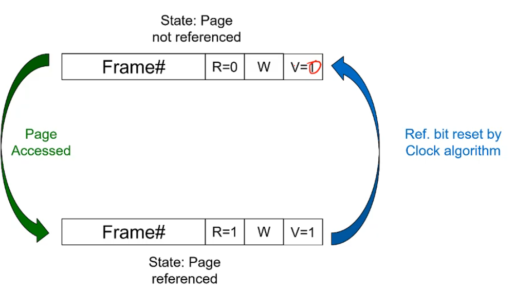

#### Thrashing

CPU utilisation tends to increase with the degree of multiprogramming. 

Higher degrees of multiprogramming also means less memory available per process. 

SOme process's working sets may no longer git in RAM, which implies a increasing page fault rate. 
Edventually many processes will have insufficient memory, we can't find a runnable process, decreases CPU utilisation and causes the system to become I/O limited as a process starts and immedietly had to swap out the entire working set. 

This is called `thrashing` and basically kicks in when the sum of all the working set sizes exceeds the total physical memory size and we rely heavily on page faulting. 

This is what happens when you don't have a lot of RAM and open 30 tabs and have word open. 

Recovering from thrashing is basically suspend a few processes to reduce degree of multiprogramming. You can restart these processes (usually we choose big ones) when we have more memory.

Lets look at a cool example

```c
int array[10000][10000];
int i,j;

for (i=0; i<10000;i++){
    for (j=0; j<10000;j++){
        array[i][j] = 0; // solution 1
        array[j][i] = 0; // solution 2
    }
}
```

solution 1 and 2 are identical but solution 1 is faster then 2. why?

If you go accross you go with virtual memory going through a whole page then into another page. 
if you go through coloumn you actually set the first int in one page then jump to another page to set the second int (which is the 10001st integer).

Remember if i do a 3 by 3 array it looks like `[[1,2,3],[4,5,6],[7,8,9]]` or basically `1 2 3 4 5 6 7 8 9` going from left to right then decending down a col makes sense, if you did it by col you would be doing `1 4 7 2 5 8 ...`

## Virtual Memory Management Policies
---

Policies choose the:
- Page table format (if not enforced by hardware)
    - can be multi level, inverted, hashed etc.
- Page size (if not enforced by hardware)
- Fetch Policy
    - When to bring a page off disk, can be done on demand or be more clever 
- Replacement policy
    - Choosing a victim in memory
- Resident set size
    - Minimum allocation
    - Local verses global allocation
- Page cleaning policy (how to handle clean and dirty pages)

#### Page size

We want pages to be small to reduce internal fragmentation. This isn't too big of an issue as most programs are bigger then the page size but bigger pages have to be loaded into memory and these reduces adaptability to working set size. 
Increasing the page size does mean we have less pages for a given address space, reduced page table size and makes the TLB more effective coverage, reduce the number of TLB misses. 
But it does increase the page fault latency, takes longer to read in a page from disk. 
It does increase the swapping I/O throughput because small I/O are dominated by seek/roation times, large reads are good in this case. 

Optimal page size is a very careful tradeoff. 

Here is a question, will the working set size increase with increasing page size? yes! your working set size is your used pages times your page size. 

#### Fetch Policy

Determines when a page should be brought into memory. Demand paging only loads pages in respond to a page fault, which naturally causes a lot of page faults at the start of running. 
Pre-paging brings in more pages than needed at the moment. 
if you do it right it improves I/O performance by reading in larger chucks and prefetches when the disk is idle. 
Wastes I/O bandwidth if prefetches are not used i.e incorrectly predidicted. and if you have to swap out this prefetched page well then u done fucked up cause that's even more work for no benifit. 

So lots of people don't bother and just do it on demand

#### Replacement Policy

Who is the victim? we want to pick the page that is the least likely to be needed in the future so we try to predict this via looking at the past

> Kill the one who has let us down in the past

Note that there are locked frames, the kernel code, main kernel data structure, I/O buffers etc. can not be pushed out lmao. You can also tell the OS to not swap out a performance critical user-pages. 

Frame table has a lock (or pinned) bit in this case. 

We can have a Optimal Replacement Policy if we know the future, We Toss the page that won't be used for the longest time in the future. 

Only good as a theoretic reference point so we can see how good a algorithm is to being optimal. 

for example for the page access pattern `1 2 3 4 1 2 5 1 2 3 4 5` given 4 frames in our RAM we get to the 5 and we swap out th3 4 in the optimal solution. We swap 4 back in getting rid of any of 1 2 or 3 and then finish. 
Optimally we get 6 page faults (4 when it starts to fill the table, then 2 to get in 5 and 4). 

**FIFO** on the other hand is not optimal and get's a page fault count of 10 because it kept swapping out the page it needed next. It isn't considering previous patterns. The age of the page in memory isn't really relating to use patterns. 

**LRU** is Least recently Used, it assumes the least recently used page is the one to throw out, and it works if locality holds. But updating and keeping track of a timestamp at every stage is incredibly difficult and requires hardware. Most applications aproximate this. If we did have a perfect LRU implementation we would get a page fault count of 8 for our example. which is closer to optimal. 

**Clock Policy** also called Second Change employs a usage or reference bit in the frame table, set to one when the page is used, and while it's scanning for a victim resets all the reference bits. It only considers pages with 0 reference bits to be victims. for any pages we read in we set the use bit to 1 and if a page is used between scans it's set to 1 so it gets a _second chance_ to not be considered by the page fault system. 

Usually we can use the valid bit in the PTE  which can be set by hardware sorta. we can have the page fault handler set the Ref. and Valid bit.



note the upper frame thing here should be V=0. 

Our performance ends up being 

1. Optimal
2. LRU
3. Clock
4. FIFO

Optimal ones up the top and clock is better the FIFO. 

There are obviously more complex ones.

#### Resident Set Size

How many frames should each process have?

1. Fixed Allocation
    - Gives a process a fixed number of pages within which to execute
    - Isolates process memory usage from each other
    - When page fault occurs one of the pages of that process must be replaced. 
    - Achieving high utilisation is an issue as some process ahve high fault rates while others don't use their allocation at all
2. Variable Allocation
    - Number of pages allocated to a process varies over the lifetime of the process
    - Global Scope
        - This is a stratagy that is easy to implement, and just has a global  table of free frames and is given to the resident set of a process when a page fault occurs. If no free frame is found it replaces one from any process.
        - It has automatic balancing accross the system but doesn't allow you to prioritise important programs
    - Local Scope
        - Allocate number of page frames to a new process based on application type, program request and other criteria. 
        - We then Re-evaluate allocation from time to time
        - What we do a lot of the time is use a Page Fault Frequency Scheme where we have a tolerence range of page faults, if it is too high we add frames, if it is to low it loses frames so we can give them to someone else. 

#### Cleaning Policy

Clean pages are much cheaper to replace then dirty pages. 

**Demand Cleaning** Is when a page is written out only when it has been selected for replacement, is high latency between the decision to replace and availability of free frame as you have to copy it over and then tag it as clean. 

**Precleaning** is when pages are written out in batches in the background to increase the likelihood we replace a clean frame. We also try to overlap this I/O


