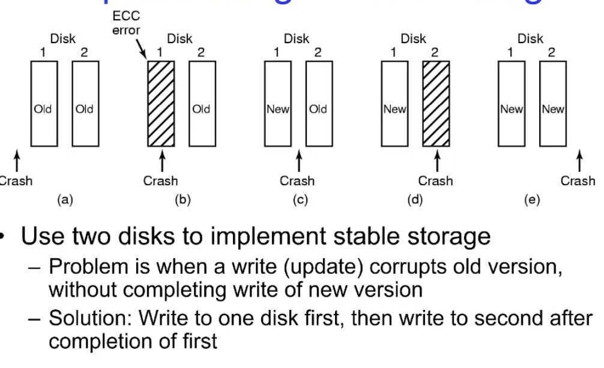
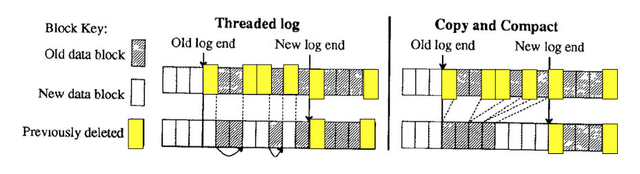
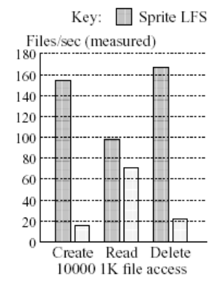
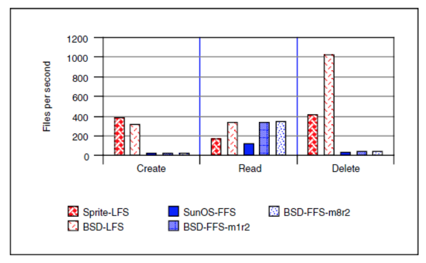
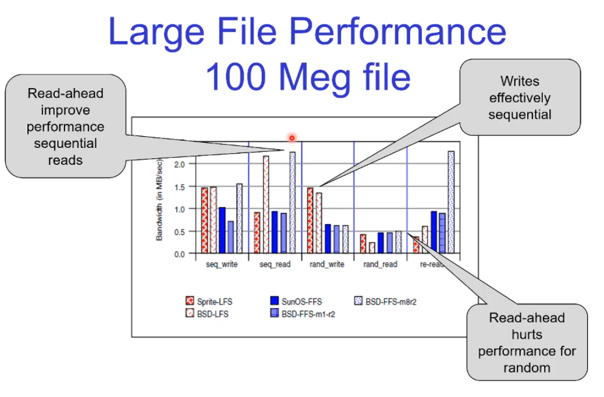
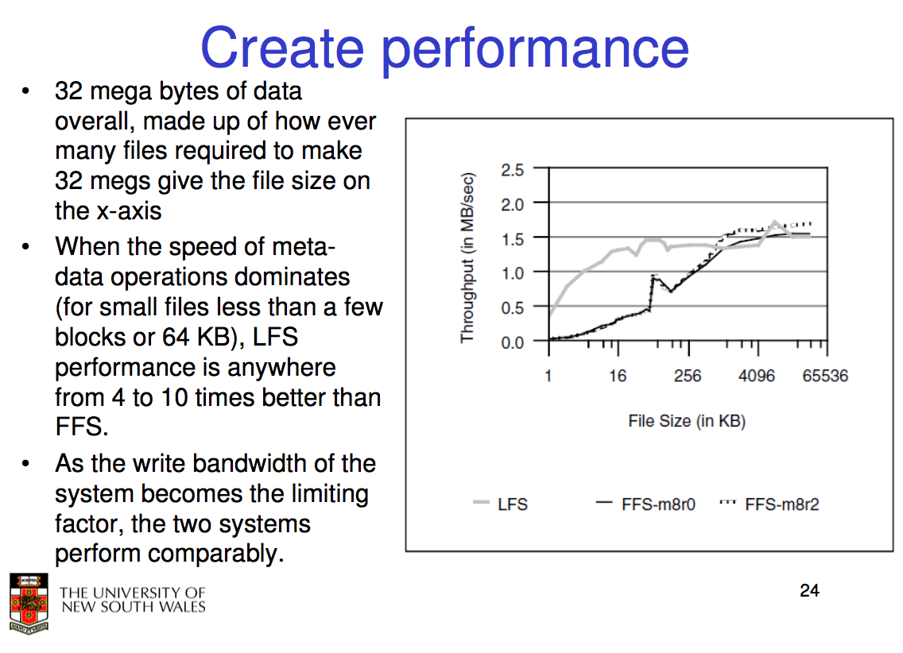
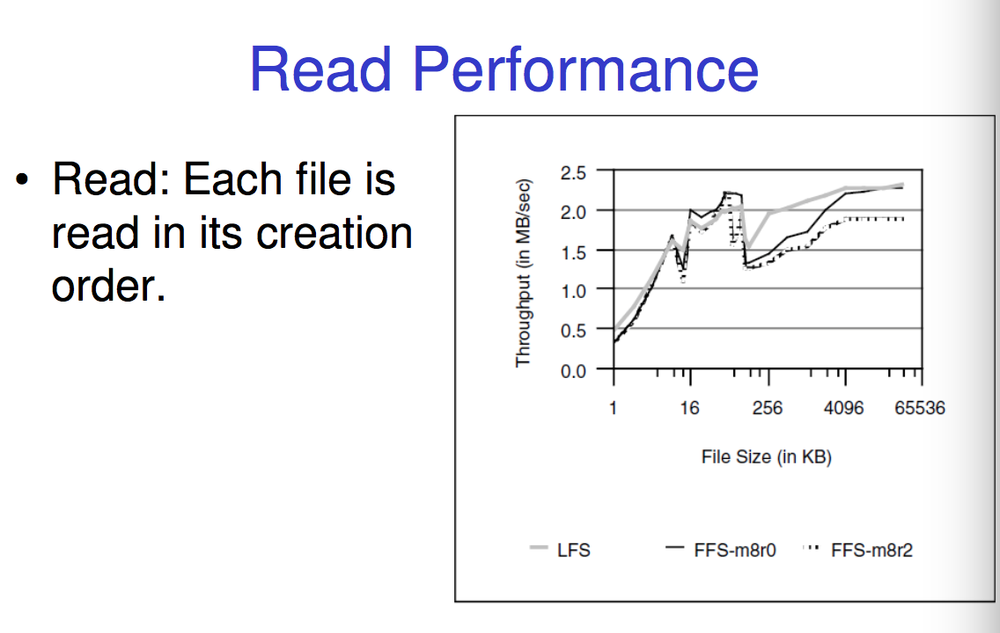
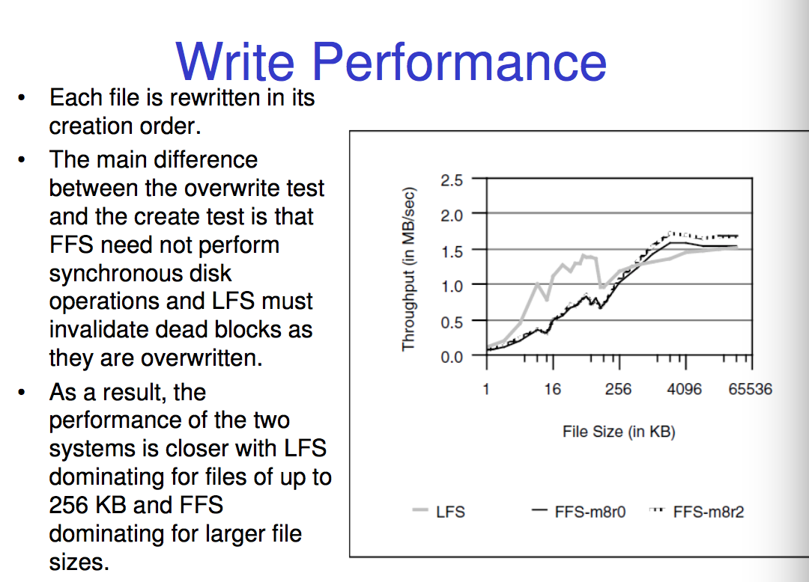
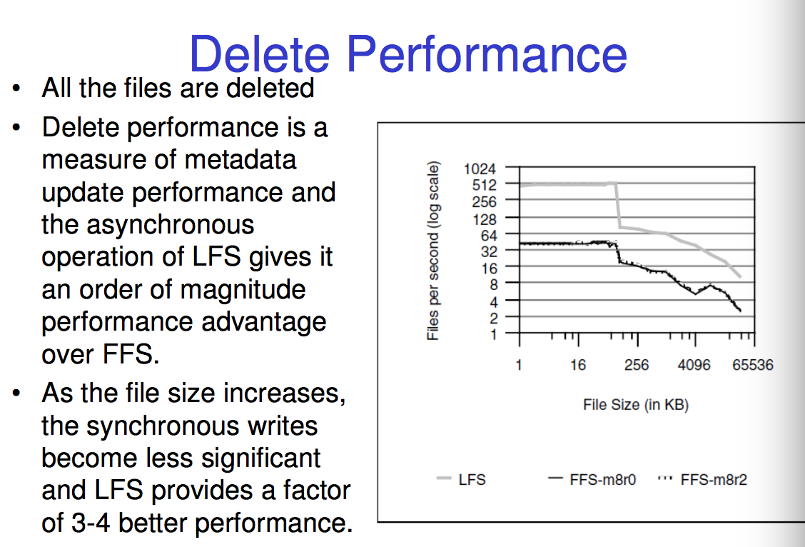
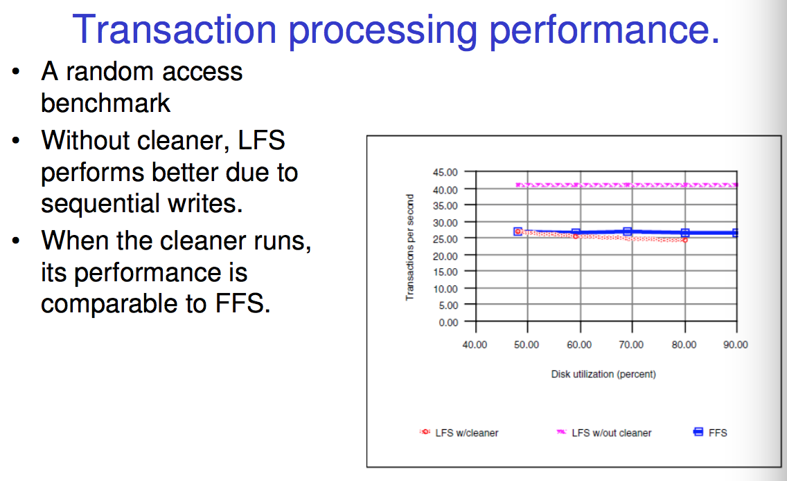

# Extension Lecture 5, Log Structured File Systems

## Original Motivating Observations

Memory Size is growing at a rapid rate, so we have a growing proportion of file systen reads will be satisfied by file system buffer cache. 

Writes will increasingly dominate over reads and thus must be optimised. We can avoid accessing the disk in terms od reads thanks to caching but not writes. 

I-node does poorly for small files. 1 very small file (which is the typical use case for coders and system designers, we work with smaller files) wuld take 5 writes to set up the whole block.

and each of these writes are at a different point in the group meaning head moves. 

Synchronous writes (write-through caching) of metadata and directories makes it worse as each operation will wait for the disk write to complete. Basically usually we have a 30 second buffer where any write to the disk is cahced for 30 seconds then flushed into the actual disk. But the OS doesn't do this, it it does a small meta data write and waits for the disk to finish before going to the next one. It can't risk having a 30 second window where something goes wrong. 

Furthermore every thing you do usually results in multiple head moves and look ups and meta data updates. 

so what we want to do is imporve our performance for small writes and see if we can improve this slow and annoying meta data process. 

We also needed to deal with the awful boot times and file system checking (this method, log stuff, came before journaling)

## Basic Idea

we just fill up the disk with all the seperate sections of a block in no real order, we just write sequencially. this basically looks like a log as we write files in order of time. hence the name. 

we place the data next to the i node next to the directory entry. Because we writes these sequencially the write is super fast, no seeking. 

## Locating i nodes

But now how the `fuck` do we find out i nodes. there is no i node table anymore. 

What we do is keep a inode map. it maps inode numbers to locations. 

Keep a map of inode locations

- Inode map is also “logged” as in written sequencially. we don't update the mpa, we copy it, add it to the front of the log and change it so it is consistent. 
- Assumption is I-node map is heavily cached and rarely results in extra disk accesses. Remember reading isn't as big of a issue as writing. 
- To find block in the I-node map, use two fixed location on the disk contains address of the inode map blocks. 
    - Two copies of the inode map addresses so we can recover if error during updating map.
    - Basically both should point to the most recent and if either one is corrupted we just grab the most recent pointer (via timestamps) that isn't corrupted. At best we just update the second pointer to match the first.
    - At worst we roll back to the old version so we lose some data but roll back to a consistent state close to what we had at the time of crash. 

the image says 2 disks, it means 2 disk blocks. 

## Cleaner

File system cleaner runs in the background and recovers blocks that are no longer in use by consulting current inode map. 

Compacts remaining blocks on disk to form contiguous segments for improved write performance. 

Basically when we delete a block we just remove the inode map and then the cleaner takes care of the rest, sorta like java's garbage collector. 

How the cleaner does this is via 2 methods, threaded log (put the free blocks into a linked list so we can write semi sequencially.) and copy and compact which is stock standard just grab all the used blocks and chuck them next to each other. 

threaded log is faster, less overhead but results in more fragmentation whereas the copy and compact has more compression but way more overhead. 

But wait, if we move blocks around doesn't that make the inode map inconsistent. 

How it works is we copy all the data into a new area where it can be written sequencially and then tag the previous copy as free. 

## Recovery

File system is check-pointed regularly which saves – A pointer to the current head of the log

- The current Inode Map blocks
    - On recovery, simply restart from previous checkpoint.
- Can scan forward in log and recover any updates written after previous checkpoint
- Write updates to log (no update in place), so previous checkpoint always consistent

this means we don't have to have a file system checker! we just use a snapshot. 

## Performance

wow it's amazing huh? well....

Margo Seltzer and Keith A. Smith and Hari Balakrishnan and Jacqueline Chang and Sara Mcmains and Venkata Padmanabhan all basically set up a log file system in BSD 4.4 and did a direct comparison with the normal FFS and this. 

they most importantly did a critical examination of cleaning overhead. furthermore FFS just has clustering come out with was a good optimisation so it was a good time to have another look at it. 

note with this graph we have BSD-FFS with a clusterfactor of 1 and 8 (m1 m8)
and the r value just the fact that they stored data on the disk with gaps between. What happened was if you sent 2 requests chances are it's sequencial so the disk really should just grab both and return them. but if you weren't fast enough with your requests you might grab one block and by the time the second request gets there the disk has flown past and the head now needs to wait for the disk to do another turn become getting the next data block which was stored right after the first.

the empty spots inbetween give you time to send 2 requests and the disk grab both quickily without waiting for the disk to turn.

so hey deleting is fast but who the fuck does this many small file deletions etc. how does it behave for large files, because those still exist

new benchmarks:

1. Create the file by sequentially writing 8 KB units.
2. Read the file sequentially in 8 KB units.
3. Write 100 KB of data randomly in 8 KB units.
4. Read 100 KB of data randomly in 8 KB units.
5. Re-read the file sequentially in 8 KB units

the clustering effect makes it just as good as the log structured file system. 

random writes is basically just rsequential writes to the head of the log. 

note with the random read that BSD does this thing where if you ask for 2 blocks that are next to each other it assumes you are doing sequential reads and turns on prefetching where it grabs the next set of blocks before you ask for them expecting that you will. 
if the 3rd block you request isn't sequencital it realises it was wrong in assuming you were going to be reading sequentially and turns that off. 
This is usually a good optimisation but sometimes you get fucked in the worst case like in this test. We reads 2 4K blocks next to each other then jump to another area. 

that's 2 sequential reads then a random read meaning that we are CONSTANTLY turining on sequenital pre fetching, doing the over head with that then turning it off and basically just wasting all the prefetched data. 

you can see here the cross over point is when the files are so large that meta data optimisations like those in the log FS don't mean much. 

here note that the random drop happens because BDS switches from the single indriect to multi indirect when the files start getting big so it has to switch between data blocks. 

yeah about the same, smaller files work bettwe with log. 

log wins because it cheats with the delete, doesn't actually delete it just removes from the map. 

But now what happens when the disk fills up!!

the cleaner fucks shit up hard. 

## Is LFS a clear winner?

When LFS cleaner overhead is ignored, and FFS runs on a new, unfragmented file system, each file system has regions of performance dominance.

- LFS is an order of magnitude faster on small file creates and deletes.
- The systems are comparable on creates of large files (one-half megabyte or more).
- The systems are comparable on reads of files less than 64 kilobytes.
- LFS read performance is superior between 64 kilobytes and four megabytes, after which FFS is comparable.
- LFS write performance is superior for files of 256 kilobytes or less.
- FFS write performance is superior for files larger than 256 kilobytes.

Cleaning overhead can degrade LFS performance by more than 34% in a transaction processing environment. Fragmentation can degrade FFS performance, over a two to three year period, by at most 15% in most environments but by as much as 30% in file systems such as a news partition.

BUT when meta-data operations are the bottle neck, LFS wins and it still used in ZFS and BTRFS (Better FS) which use this idea of snapshots.

they also sorta exist in journaling file systems. 

Hybrid of
- I-node based file system
- Log structured file system (journal)
- 
Two variations
- log only meta-data to journal (default)
- log-all to journal

Need to write-twice (i.e. copy from journal to i- node based files)

Example
- ext3
- Main advantage is guaranteed meta-data consistency

