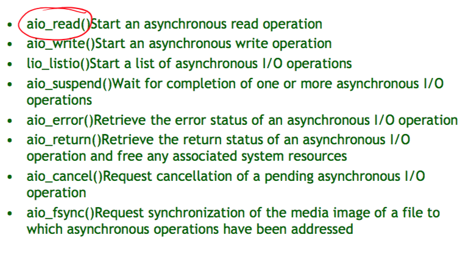
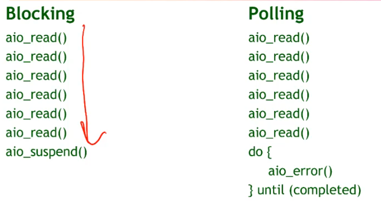
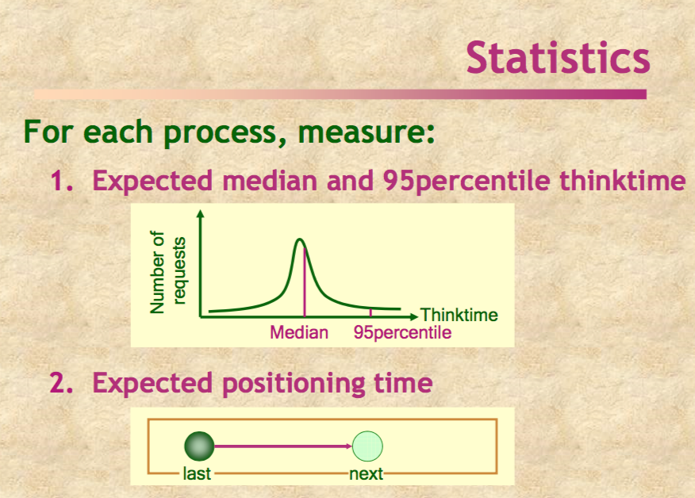
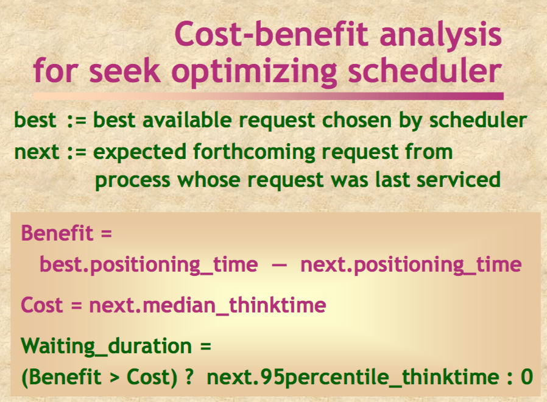
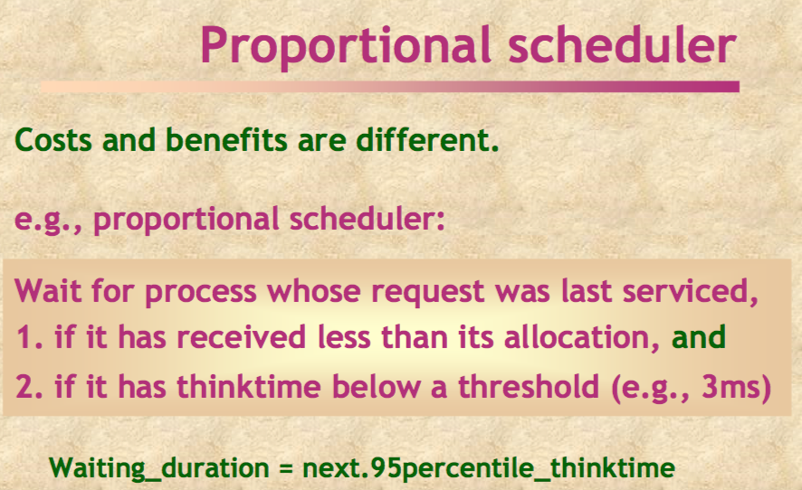
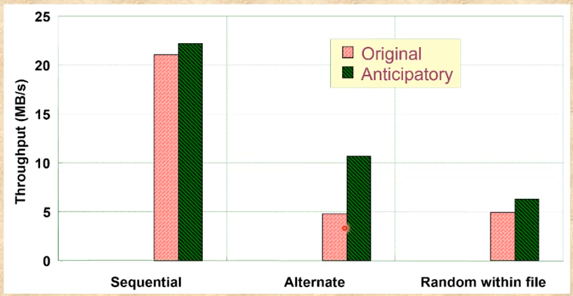
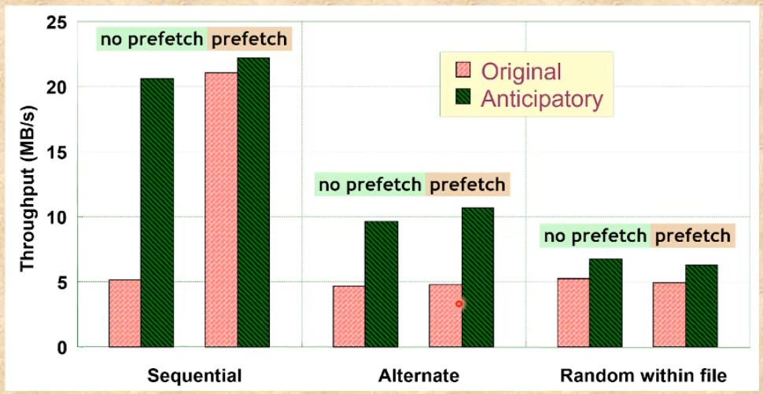
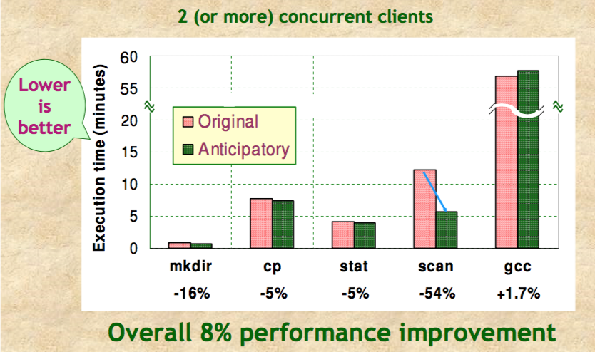
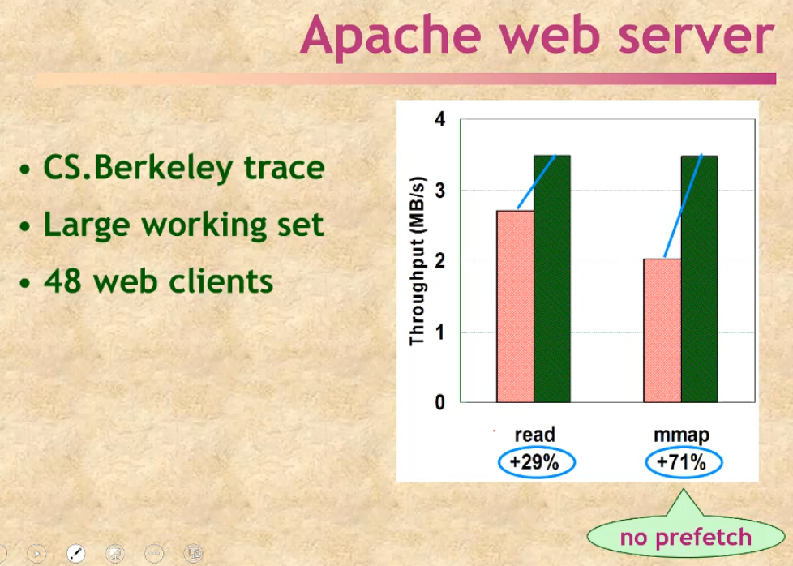
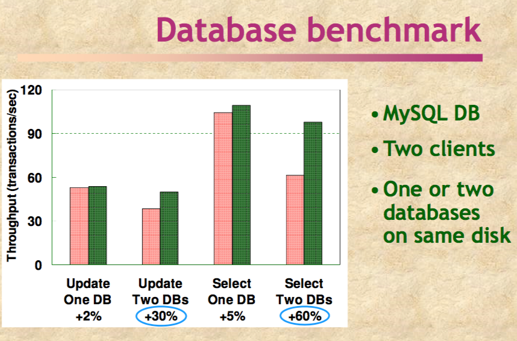

# Extended Lecture 6, Anticipatory scheduling
a disk scheduling framework to overcome deceptive idleness in synchronous I/O

Proceedings of the 18th ACM symposium on Operating systems principles, 2001

## Disk Scheduler
---

we want to reorder available disk requests for seek optimisation or proportional resource allocation (i.e some users should get better access to the disk then others)

The issue with synchronous I/O is that often a program will not request the next piece of sequential data until it recieves back the first one and processes it. which means you can read some data, go and handle some other reuqest and the nhave to come back to because in you going off to handle another one the first program submitted the next peice it needed which was right next to the first. 

#### Deceptive idleness

Process A is about to issue next request but Scheduler hastily assumes that process A has no further requests!

#### Proportional scheduler

These schedule service is a ratio, it serves process B twice for ever process A request it processes. 

This works if there are already 10 for both process A and B. but if B has 1 and is about to call another one the scheduler just shifts back to process A again. 

#### Prefetch

Overlaps computation with I/O, it avoids deceptive idleness. 
we can do this in the kernel OR in the application. 

Application driven is done via async io. 

Here we can issue multiple reads in the application and because i don't wait for one to finish before requesting the next one i get the desired effect. I can do this via blocking where i wait for all the previous reads to complete. You can also poll where we test if our calls have finished. Usually you'd aim to do some useful computing between checking for them to be finished. 

You can also use signals and signal handlers to get a interrupt when it's done

This is hard to program, applications need to know their future i.e don't need every piece of data to know where to look next, think linked lists. 

existing apps now need to be re written and also may be less efficient than mmap (memory mapped files and paging). ALSO a lot of kernels at the time of this paper didn't have async lmao

#### Memory Mapped Files and Paging

look at the video lmao hard to explain

#### Kernel Driven

less capable of knowing the future, Access patterns difficult to predict even with locality (ready every 10th block in the file is hard to pick up), cost of misprediction can be high (reading in or removing something from the cache that isn't needed or is needed) 

medium files are also too small to trigger sequential access detection. 

## Anticipatory scheduling
---

key idea: sometimes we wait for process whose request was last serviced. 

keeps disk idle for short intervals but with informed decisions that improves throughout and achieves desired proportions (2:1).

When should we or shouldn't we delay disk requests, how long? HOW?

#### Cost-benefit analysis

Balance expected benefits of waiting against cost of keeping disk idle. 

think-time is computation time. graph 1 tells us at what time 95% of the requests would have come through. 

expected positioning time is the average time the process takes to switch between requests. 

here cost is the median think time. 

#### Experiment - Microbenchmark

it wwas pree good

Alternate is read, stop, read, stop. I.e it prevents the pre fetcher from kicking in. ... so what happens if we turn the prefetcher off for all of them??

but here we arn't measuring CPU use of the new code. the Andrew benchmark is a benchmark. 

Scan is a command that doesn't take any advantage of prefetching hence the improvement. 

GCC takes longer because GCC can not be improved at all, it's big reads and big writes, it's mostly computer bounded not I/O bounded. The change is due to the over head of keeping track of these think times etc. 

Apache web server is also a benchmark 

As is Database

The database gets betters with more being added as switching between databases sucks and waiting a bit longer to service the requests is a good idea. 

GnuLD is a basically a random access generator because it links files in separate locations. with on instance it's about the same with two though you have two instances and each get's a chance to maximise locality access now. 

An Intelligent adversary is a user who knows the algorithm and tries it's best to fuck you up, i.e it sets up the median think time to make it wait then don't do anything it is about to cut you off. 

But it's not that bad here, the system handles it well. 

