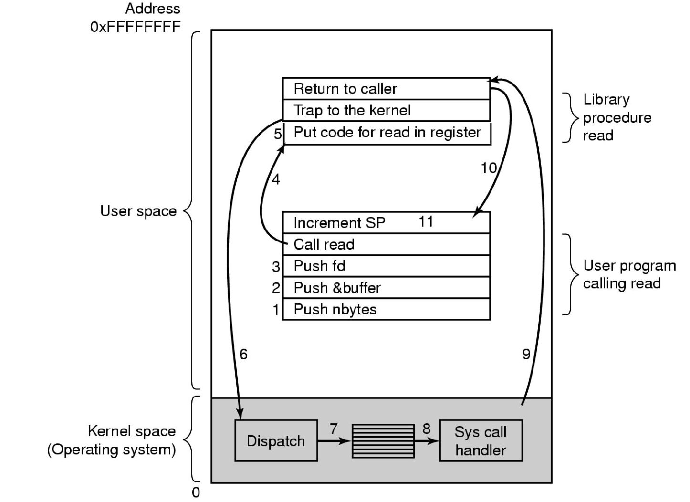

# System Calls interface


## Intro
---


> the system call interface represents the abstract machine provided by the operating system. The set of systems calls that a OS offers are effectively the interface to the abstract machine

There is one and only one system call interface

The application attaches to system libraries which interacts from user mode to the os in kernel mode exclusively though System Calls. 

We can view system calls as special function calls that when called in kernel perform privileged operation and returns to original caller with the result. But it does this in a way that maintains system security. 

## Overview
---

The main things the system call interface allows for

1. Process management (coordinate activities on machine)
2. File i/o (allow for data to be stored for longer then just the program runtime)
3. Directory management
4. other (see man syscalls on linux)

#### Process Management

Some examples of a process management interface in unix are

calls | description
:--- | :---
`fork()` | Creates a child process identical to the parent but The child returns 0 where the parent returns the process id of the child to differentiate them |
`waitpid()` | wait for process to finish |
`execve()` | replace a processes core image |
`exit()` | exit a process with a given status code

there are many variants of `exec` functions which all just replace the current child within the process itself with the new program. ¸¸¸

It creates a new process by copying a process then replacing the internal program. 
(makes more sense later)

there are of course other features that allow to stop a process after it's starter rather then just wait for it to finish, which it might never do. this is usually called `kill()`

#### File management

calls | description
:--- | :---
`open()` | Opens a file, and grabs a integer which represents the file handler so it can be identified in other system calls. |
`close()` | close the current file. |
`read()` | read data from a file into a buffer |
`write()` | writes data into a file from a buffer |
`lseek()` | Move the file pointer, this is part of the file status and managed by the os |
`stat()`  | Get a files status information, creation time, access time, permissions

#### Directory Management

calls | description
:--- | :---
`mkdir()` | Create a new directory
`rmdir()` | Remove a empty directory
`link()`  | Create a new entry, name2, pointing to name1
`unlink()` | remove a directory entry (doesn't delete the directory unless there are no more entries)


note that link() allows you to create multiple links to the same directory so doing rm on a directory doesn't actually delete it if there is another pointer to it. only when all pointers are destroyed is the folder destroyed. 

#### Random Stuff

calls | description
:--- | :---
`chdir()` | Change the working directory
`chmod()` | change a files protection bits
`kill()`    | send a signal to a process, the process may handle the signal or if the signal is a syskill signal the process won't be able to catch it, it really just tells the os to kill that process (i.e kill and kill -9)
`time()` | gets the elapsed time since epoch

note that the os has to manage each process separately so each process has it's own current directory that can be independently manipulated.  

## Shell
---

note how a lot of these system calls seem like shell commands, that's because shell commands really just have commands that are wrappers for sys calls a lot of the time. They often just check input and make sure it's well formed and stuff. 

So we can totally build our own shell, the shell we use isn't special just that the os is configured to pull that one up by default. 

```c
while (TRUE) {
	//Display prompt
	type_prompt();
	//Get input
	read_command(command, parameters);
	
	// create a copy and wait for it to finish.
	if (fork() != 0) {
		/* Parent code */
		waitpid(-1, &status, 0);
	} else {
		/* Child code */
		// run the needed code in the child
		execve (command, parameters, 0);
	}
}
```

note if fork != 0 fork returned the process id, i.e i am the parent. if 0 i am the child. 

windows has a very similar sys call structure.


# System Call Implementation

## CPU Computation
---
We need a simple basic understanding of cpu computation before we can look at how OS161 works under the hood mostly so we can better understand how to cross the user-kernel boundary. 
So lets build up a abstract micro processor

#### The fetch execute cycle

At the start the machine has 1 register, the program counter, and a cycle to load memory contents from address in program counter (load the instruction), execute it, increment the Pc and repeat

```python
while(True)
	ins = getInstruction(pc)
	ins.run()
	pc++
```

with this the only instruction is a no-op, pass, nada, do nothing 

#### More Registers

Now lets add in some more so we can do something other then a no-op

Lets add in a general purpose register set that can hold operands of most instructions and enables programmers or compilers to minimise memory references. they are very fast. 

Now if we want to encode more complex instructions we need to do arithmetic/logic so we are going to add status registers to help us know if the last calculation was positive, negative, zero as well as other information about the system

We are also going to add a stack pointer register to keep track of the memory address of the top of the stack. 

What we have done is given the cpu a more complex state that needs to be kept track of. 

#### Privileged-mode Operation

To protect operating system election, two or more cpu modes of operation exist. 

when the cpu is in Privileged mode all instructions and registers are available. 

when in user mode we get only access to safe subset of these things, the things that only effect the state of the application, not other applications or the OS. 

an example of some things that are hidden in user mode are

* Interrupt masks
* Exception Type (gives information on why the os was given control again etc.)
* MMU regs (memory management unit has it's own registers to help it serve/write memory)
* other

one instruction that might be blocked for users is `cli` which disables interrupts. If this was available to applications, a app could do

```python
cli
while(True)
	pass
```

If this runs the operating system will never get control and the system will just run forever or crash. 

the os can only get access to the processor if the program runnings asks or if a timer interrupt goes off giving it access. if the interrupts are off then whoops. 

if you tried to run this on css or something, the cli will trigger a exception because you are not allowed to run it and the os will know.... it'll know

There is also a memory split up, in user mode there is only a subset of memory allowed whereas the os sees all of memory. 

the exact memory ranges are usually configurable and vary between CPU  architectures and/or os

so when a application makes a sys call there is a transfer to the os in kernel mode, first the os in kernel mode figures out the exception that called it and what it is asked to do by the sys call, it does it and then it needs to return this value back to the application in user mode.

note that sys call needs to switch the processor to run os code but also switch it so this is run in kernel mode. 

## System call mechanism
---

By the end of this topics you should be able to answer a couple of main questions

1. There is only one register set so how is this managed and how does an application expect a subset call to look like
2. How is the transition triggered
3. Where is the OS entry point (system call handler)
4. How does the OS know what to do when i regains control 


now to switch from user to kernel and back there are 2 special processor instructions
we call it the `sys call instruction` sometimes this is call `a trap instruction` because we trick the application into giving us control. 
when we jump back from privileged into kernel that's called a `return from exception instruction`

there are usually 3-4 ways you can do it because of backwards compatibility and them adding better methods to trigger sys calls.

note that sys161 is a simulated microprocessor based off the mips microprocessor that came out of stand ford

now to do this we need to change some things

1. Processor mode
	* Switch from user-mode to kernel mode
	* switch back when returning
2. SP
	* User-level Stack pointer is saved and a kernel SP is set up
	* This then switches back to what the SP was for the user
3. PC
	* User Level Program counter is saved and the Program Counter is set to kernel 	entry point (wherever in memory that is)
	* Kernel entry via the designed entry point must be strictly enforced, i.e you 	can't jump to random bits of os code that will run in privileged mode
4. Registers
	* Set at user-level to indicated system call type and it's arguments
		* set by a convention between applications and kernel
	* Some registers are preserved at user level or kernel level in order to 	restart user-level execution
		* i.e some registers are not touched so the application can continue
		* depends on the calling convention
	* Result of system call placed in registers when returning to user level
		* can also be thrown into a given buffer in user memory
	
note that the application and OS have two separate stacks so application can't corrupt it's own stack and fuck up the OS or to use it for nefarious reasons. 

why do we need system calls and not jumps to os code?

Function calls do not change from user to kernel mode and back and restrict possible entry point to secure locations to prevent entering after any security checks. 

#### Step by Step



1,2,3 push to the stack, the top block is the system call library which is called at step 4, it sets up the registers and calls the OS via a trap. the os does it things in steps 7 and 8 and then in step 9 jumps back to the sys call library that then returns to caller. in step 10 it increments the stack pointer (since stacks grow down this deletes the top of the stack which the sys call put on)


