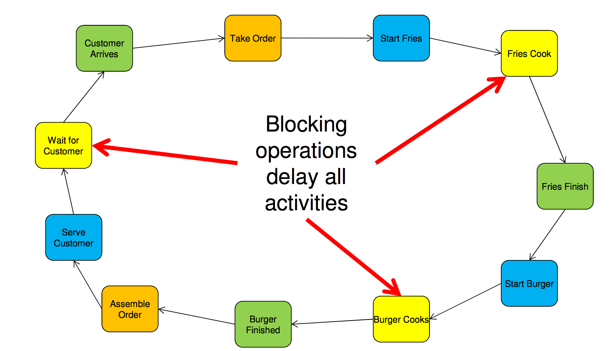
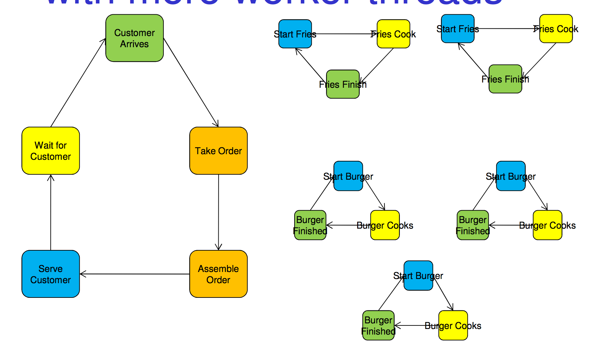
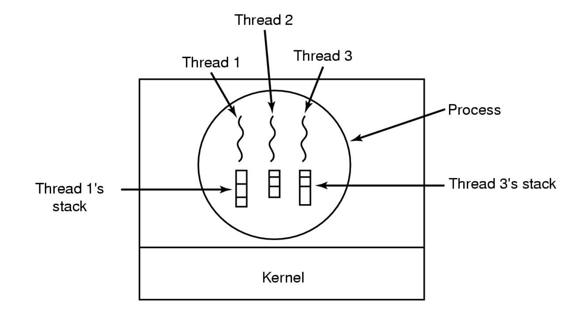
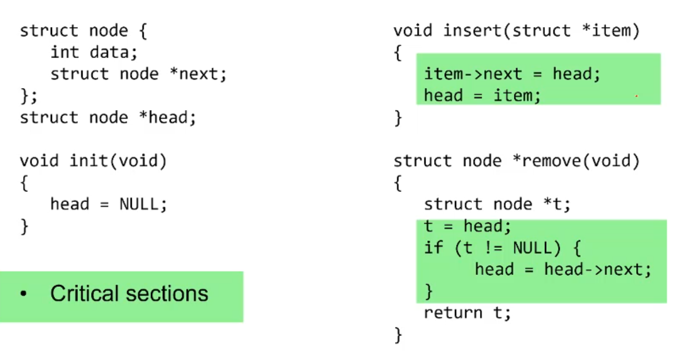
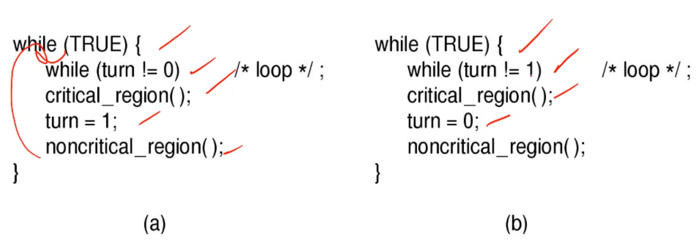

# Thread Analogy

## Single Threaded
---
lets say we have a mcdonalds we have to manage. 
At the moment we have 1 worker. He has to do everything. 

We have colours that symbolise types of activities
1. Blocking activities are yellow, they delay all activities
2. Reaction activities are green, they are reactions to events



## Multi Threaded
---

Now if we get more employees we can delegate tasks. if we ignore synchronisation issues we get this


This models a normal producer consumer relationship. 

the front of the restaurant consumes burgers but produces orders. 

now this still sucks, if the fries take a while everybody else waits for the fries. but now we can just scale up the slower activities. 



we now maintain a simple procedural workflow for each worker but 

## Finite-State Machine Model
---

this is a event based model where we can separate out the a-syncronous
external activities. This lets it be single threaded but it's much more complicated because everything can happen at any point. 

it's not procedural and thus requires a lot of documentation to keep track of where we are and what is happening. 


there may be 5 burgers and 4 fries all finishing and 6 orders all that you have to handle at the same time. 

# The Thread Model

## intro
---

Each thread has it's own stack and has a simple procedural workflow. 



this makes sense because you want all local variables to be local to each thread and have it's own function call stack. 

but do note that global variables don't have a stack, they are actually in the process memory space so can be accessed by any threads, they are shared. thus we have to manage concurrency with these things. 

A pointer can be local or global. malloc can return both. memory allocated on the heap can be local or global depending on the pointer, if the pointer is visible to all threads it's global if not local. 


## Computation state
---

with the finite state machine model the state is managed by the program explicitly but with the thread model it's done simply by storing the relevant details on the stack which is unique and distinct for every process (employee)

## Thread Usage
---

#### text editor

Lets say we have a text editor. It has 3 threads. one to react to the keyboard, one to manage the screen output, one to read and write to disk. 

note that in this format the screen thread can sit in a loop and constantly refresh the display without having to then poll other threads or stop for a random keyboard input. 

It has a simple task, and it just blocks or waits for something. 
And the amazing thing is the loop isn't a busy loop burning cpu, it updates, then it can block and wait for something to change, letting other threads do more computationally heavy stuff like if the disk thread has to save a very big file. 

#### Handoff / servers

A cool things with servers is that if reacting to a request takes a while you can have 2 threads, one to receive incoming requests, accept them and put them on a stack and another thread to process them so people aren't trying to connect with your website and being ignored while some disk i/o function is running. 

There are 3 ways to set up a server though

- Single-Threaded Model
	- No Parallelism, system calls and block.
- Threads
	-  Parallelism but system calls still block
- Finate-State 
	-  Parallelism non blocking system calls, use interrupts
	-  rely on async calls
	-  if you call read() it will return but that doesn't mean the file 	was read, when it finally was the program is alerted. 
	-  This requires you to keep track of the state of the machine and 	what's current in flight. More challenging. 


## Why threads
---

- Simpler to read
- less resources, having multiple threads in one process is less costly then having multiple processes because forking a whole new version of a server program like apache is fucken costly
	- On a further note it helps share memory between threads
- you can over write slow I/O with computations in other threads, slow I/O doesn't stop the program in it's track
	- note that we also sometimes get that all the threads are compute bound and that causes no performance upgrade on a uni processor system
	-  compute bound just means that the cpu is near 100% utilisation so having more threads doesn't increase speed anymore, the cpu is doing the best it can. 
- threads can take advantage of multi core computers, such as phones

# Concurrency and synchronisation

having lots of threads is great but now if they arn't synced up you get clashes and issues. 

## Example
---

lets say we have these two functions that run on separate threads

```c
void increment () {
	int t;
	t = count;
	t = t + 1;
	count = t;
}

void decrement () {
	int t;
	t = count;
	t = t - 1;
	count = t;
}
```

if we run we can't say what count will be at the end it could be 0, 1 or -1. whoever finishes last will over ride the other functions result. this is called a `race condition`, it's a race, whoever finishes first has their result destroyed. in this game the guy who comes last wins. 

A lot of issues arise with this simple concept of two processes trying to access some data both have access to, in this case it's a global variable but it could be a shared piece of memory, a linked list maybe, a print queue. 

This can even be a issue with internal variables the kernel handles like error no, if a error occurs in the middle of a error handling system it can over run some variables that were being used to calculate what to do. 

## Critical Region
---

We can control access to the shared resource by controlling access to the code that accesses the resource.

- A critical region is a region of code where shared resources are accessed or any region of code whose correctness relies on it not being interrupted or anything it uses to be concurrently modified.
	- Variables, memory, files, etc...
- Uncoordinated entry to the critical region results in a race condition
	- Incorrect behaviour, deadlock, lost work,...

The hard part is funny enough IDENTIFYING where there are these critical zones are so we can deal with them. 

like here they are for a linked list building program example



#### A solution

A good solution has multiple parts, it firstly has some level of `mutual exclusion`. 

If a process is in a critical region it flags that "I AM ABOUT TO DO SOME SHIT, DO NOT INTERRUPT ME"
anything that tries to will be blocked until it's done and it says "Alright i'm no longer in the critical region you can do what you need to"

it's basically us stating and then enforcing that "i expect that between lines 2 and 4, the value of `count` does not change. 

the solution `DOES NOT make assumptions on cpu type, number or speed`

it must handle `progress` correctly in that it doesn't let any process running outside the critical region may block another process. I.e only one process can hold a lock at a time. 

it also must be `bounded` if it's possible for a process to wait forever before entering a critical region because some asshole won't give up the lock, that's a issue. 

## Locks
---

Lets build up a Abstract Data type go handle this, lets start off with something simple. a flag. 

#### Flag

```c
int lock = 1; // i am locked
int lock = 0; // lock is over
```

is this good? well not exactly, what happens here

```c
// process 1
while(TRUE) {
  while(lock == 1);
  lock = 1;
  critical();
  lock = 0;
  non_critical();
}

//process 2
while(TRUE) {
  while(lock == 1);
  lock = 1;
  critical();
  lock = 0;
  non_critical();
}
```

both run and whoops, process 1 stops at line 4 (just after executing line 3) to let process 2 have a go, it goes down into 14 and does some stuff and then hands back over to process 1 at some point. 
1 goes down, re sets the lock 1 and does it's critical stuff. 
uh-oh both are doing their critical stuff at the same time. 

Great solution dingus, but don't be hard on yourself. It's very easy to prove something doesn't work but very hard to prove that something will work for all cases. 1 fail case is all it takes. 

#### taking turns



this works off the fact that the only person currently in power can set the turn and ths prevents race conditions. 

it works via the concept of `strict alternation`

it works! but it kinda sucks

- uses busy loops
- Process must wait its turn even while the other process is doing something else.
- sucks at handling multiple processes because some threads needs more turns then others, and everyone gets a turn before the token comes around and gives someone a turn. this means the entire system is only as fast as the slowest thread, if it takes 6 years to run, nothing else can run until it's done, it has a token. 

#### petersons solution

we don't talk about this but look it up if you want, complex system with a series of flags in a array. 

#### Disabling Interrupts

This is like a brute force solution. Just block all interrupts so the scheduler can't switch between threads. simple!! well it has issues

- Only available in the kernel
- Blocks everybody else, including devices or input, it reduces the interrupt response time, a network card may start dropping packets because it's interrupts don't get handled for a second and the buffer fills up
- doesn't work on multi processors because each processor will the have to co-ordinate turning their interrupts off. doesn't really solve the problem then does it, you can't have a system wide all core interrupt switch off. nor really at least. 

#### Test and Set instruction

it's like the lock flag but works correctly because it is built into hardware. the hardware instruction lets you test AND set in one command, it executes atomically, in one step, not in any sort of sub steps. once you run it you have tested and setted it. 

if the lock is open set it, if not inform the program to wait. 

if two try to run the instruction at the same time, one of then will be done first, you can't run two instructions at the same time but as soon as one runs it, it has the lock and the other now waits. 

Perfect. 

still not efficient because of busy loops but it works!!!

and the test and set can be allowed at user level, it doesn't undermine the OS. it totally can be extended for more locks as well

ok but Cons

- Busy waits (also termed a spin lock)
	- Consumes CPU
	- Livelock's in the presence of priorities
		- If a low priority process has the lock and a high priority process attempts to get it, the high priority process will busy-wait forever.
		- The idea is that if the low priority process gets the lock that's great but the os will always give the high priority guy the cpu access. so the high priority sits in a busy loop but because it's high priority the scheduler never gives the cpu to the low priority so it can release the lock. STALE FUCKEN MATE. This is called a live lock. 
- Starvation is possible when a process leaves its critical section and more than one process is waiting. it's possible that a unlucky process never gets a turn because other processes keep getting the lock. There is no idea of fairness built into the lock


## Busy Wait Problem
---

How can we solve this??

#### Sleep / Wakeup

this is the idea that a process can be put to sleep and then woken up. 

also lets just say that waking up a ready/active process doesn't nothing. 

We can use this with locks to sleep something that is waiting for the lock and wake it up when the lock is available. 

We can relate this to `the producer consumer problem` or `BOunded buffer problem` we call it bounded problem problem because this shines when the buffer has a max size that it hits at which point the producer stops giving stuff and is slept untill the consumer says "HEY I JUST TOOK SOMETHING, THERE IS SPACE NOW PRODUCE AGAIN!" and vice versa for the consumer and a empty buffer. 


now we can code this up via normal sys calls to the os to move a process into the sleep or ready states. 

but you have to be careful, both the consumer and the producer can access the memory at the same time, they can both edit the counter at the same time and even if you do `count++` that's not 1 instruction it's 3 `ld m` `m + 1` `st m`

it can also dead lock!! although that's next lecture. 

 


 
