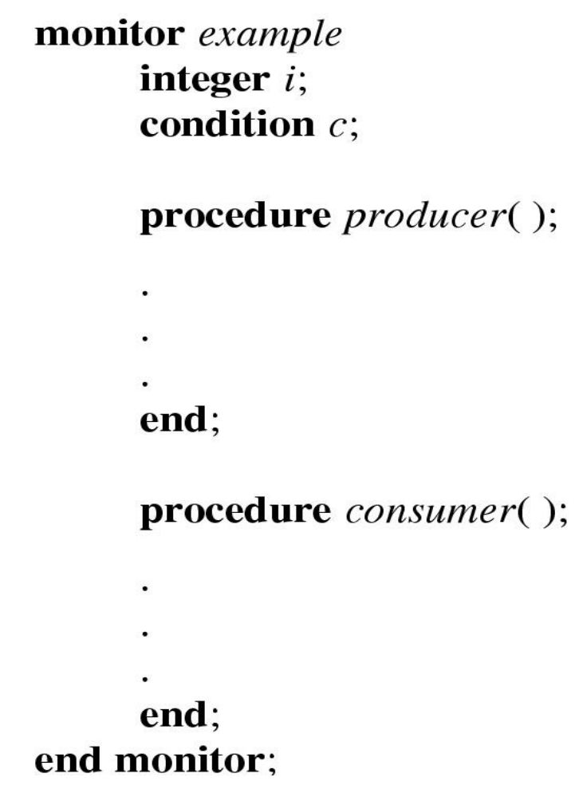

# Concurrency 

## Semaphores
---

#### Revision

Remember from last time if we had the producer consumer problem that we can't just have 1 sleep and then let the other run and wake it up because if both are testing the count for a value a race condition will occur, one may pass the test and then by the time it runs the next line of code the buffer is now empty. The test needs to be atomic. So you may be thinking "This is a critical region lets lock it!"
Then we get this

```c
acquire_lock()
if (count == N)
	sleep();
release_lock()
```

```c
acquire_lock()
if (count == 1)
	wakeup();
release_lock()
```

You can see the issue, if a program has the lock and then sleeps, it sleeps forever cause the other code that is supposed to wake it up will never run. 

`NOTE if you lock a region that has a function that in itself tries to get the same lock you get a dead lock. the function waits for the lock which only gets released once that function finishes. `
#### How it works

Dijkstra (1965) of search algorithm fame introduced two primitives that are more powerful than simple sleep and wakeup alone.

- P(): proberen, from Dutch to `test`.
- V(): verhogen, from Dutch to `increment`.
- Also called `wait & signal`, `down & up`.

the semaphore blocks any processes waiting for a recourse nd puts it into a internal queue. 
When a process releases a resource it signals the semaphore who then will resume one of the blocked processes. 
The main advantage is that the wait and signal operations (p and v) cannot be interrupted and thus are effectively atomic. how it does this depends on the implementation

#### Sample Implementation

```c
typedef struct {
	int count;
	struct process *L;
} semaphore;
```

```c
//wait(s):
	S.count--;
	if (S.count < 0){
		// add this process to S.L
		sleep;
	}
//signal(s):
	S.count++;
	if(S.count <=0){
		//remove a process P from S.L;
		wakeup(P);
	}
```

Each primitive is atomic

so lets say you want to call function `B` but only after `A` has been run

```c
//code ..
wait(A_Done_Flag); //the count is now -1, causing the thread to go to sleep
B(); //i woke up! lets go when i'm given the CPU. 
```

```c
//the above thread went to sleep on line 2 so now i am awake
A();
// we now increment the count, it's now 0
// which means a thread must be waiting, activate it!
signal(A_Done_Flag)
//code ..
```

note that if the bottom thread ran first it would increments the count to 1 which gets decremented to 0 at the wait in the first thread, which tells the sophomore to not wait but keep going, the signal that this thread was waiting for already happened.

#### Mutex
Mutex is short for Mutual Exclusion Can also be called a lock

```c
semaphore mutex;

mutex.count = 1; /* initialise mutex */

wait(mutex); /* enter the critcal region, count = 0, keep running*/
Blahblah();
signal(mutex); /* exit the critical region, count = 1 */

```
Notice that the initial count determines how many waits can progress before blocking and requiring a signal. if we had 2 waits in the row the first one wouldn't wait but the second one would. 

so now lets use this to solve the producer consumer problem

```c
#define N = 4

semaphore mutex = 1;

/* count empty slots */
semaphore empty = N;

/* count full slots */
semaphore full = 0; 
```

**Producer**

```c
prod() {
	while(TRUE) {
		item = produce()
		wait(empty);
		wait(mutex); //enter a mutually exclusive critical zone
		insert_item();
		signal(mutex); // exit zone
		signal(full);
	}
}
```

**Consumer**

```c
con() {
	while(TRUE) {
		wait(full);    //decrement the full count, if < 0, sleep. 
		wait(mutex);   //enter a mutually exclusive critical zone
		remove_item();
		signal(mutex); //end critical zone
		signal(empty);
	}
}
```

for a empty buffer the consumer hits wait at line 3, full is 0 i.e no full blocks. it thus becomes -1 and the thread sleeps. 

when the producer hits the signal(full) it does -1 + 1 = 0 and it does it again maybe and we get full = 0. (consumer is woken up!)
at some point it fills it up and full is now 4, while empty is 0. 

empty hits wait on line 4 and then hits a negative value so sleeps. 

now when the consumer runs it signals empty and wakes that up. and now both are awake and working, which is fine because the buffer isn't empty or full. 

`great!` but these an be issues. if the initial value is wrong or forget to match some signal for a wait can cause huge errors and dead locks. 

also complex to think about. 

## Monitors
---

To ease concurrent programming, Hoare (1974) proposed monitors.

- A higher level synchronisation primitive
- Programming language construct

#### How it works

- A set of procedures, variables, data types are
grouped in a special kind of module, a monitor.
	- Variables and data types only accessed from within the
monitor
- Only one process/thread can be in the monitor at any
one time
	- Mutual exclusion is implemented by the compiler (which
should be less error prone) 

you can just go "make sure this series of objects don't clash" rather then "alright these structures work this way with these variables and these flags and signal here and here and here and there and wait here and her eand AHHHHHHHHHHH

Thus we can do the producer and consumer like this because this enforces that producer and consumer can not run at the same time




```c
monitor counter {
	int count;
	procedure inc() {
		count = count + 1;
	}
	procedure dec() {
		count = count –1;
	}
}
```

#### Condition Variables
How to we block waiting for an event

We need a mechanism to block waiting for an event (in addition to ensuring mutual exclusion) we use Condition Variables for this. 

```c
condition x,y;
// means that the process invoking this operation
// is suspended until another process invokes signal
x.wait();
//The x.signal operation resumes exactly
//one suspended process. If no process
//is suspended, then the signal operation has no effect
x.signal();
```

this works with a internal "sleep" and "to run" queue in monitors

## Locks
---

```c
// Functions to create and destroy locks
struct lock *lock_create(const char *name);
void lock_destroy(struct lock *);
// Functions to acquire and release them
void lock_acquire(struct lock *);
void lock_release(struct lock *);
```

remember to give locks names that relate to their function to help debugging and also make sure to check the return values, the functions could give back nothing. 

> Fail Fast, Fail Early, Fail close to the issue - Kevin

Debugging is very difficult if the error ends up being miles away from the source. also though:

> Fail fast, Fail Early, Fail close to census date - ancient student proverb

note that there is a panic command

```c
panic("I'm Dead");
```

exits the system with the message

## Condition Variables in OS/161
---

OS161 lets you fake a monitor with condition variables. 

```c
struct cv *cv_create(const char *name);
void cv_destroy(struct cv *);
void cv_wait(struct cv *cv, struct lock *lock);
// Releases the lock and blocks
// Upon resumption, it re-acquires the lock
// Note: we must recheck the condition we slept on
void cv_signal(struct cv *cv, struct lock *lock);
void cv_broadcast(struct cv *cv, struct lock *lock);
// Wakes one/all, does not release the lock
// First “waiter” scheduled after signaller 
// releases the lock will reacquire
// the lock
// Note: All three variants must hold the lock passed in.
```

```c
lock_acquire(c_lock)
while (count == 0)
	cv_wait(c_cv, c_lock); // waits but lets others have the lock
remove_item();
count--;
lock_release(c_lock);
```


