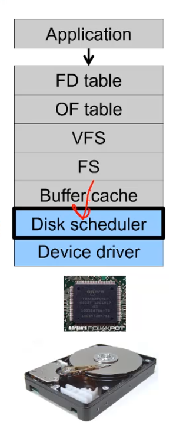
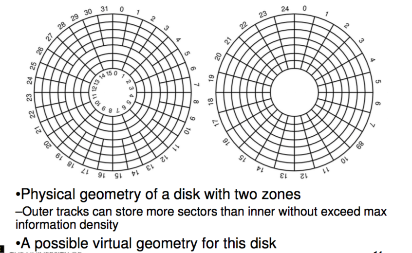
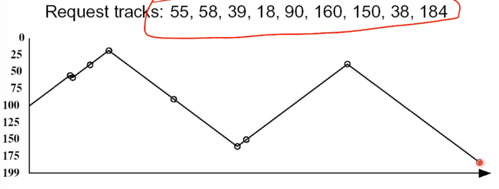
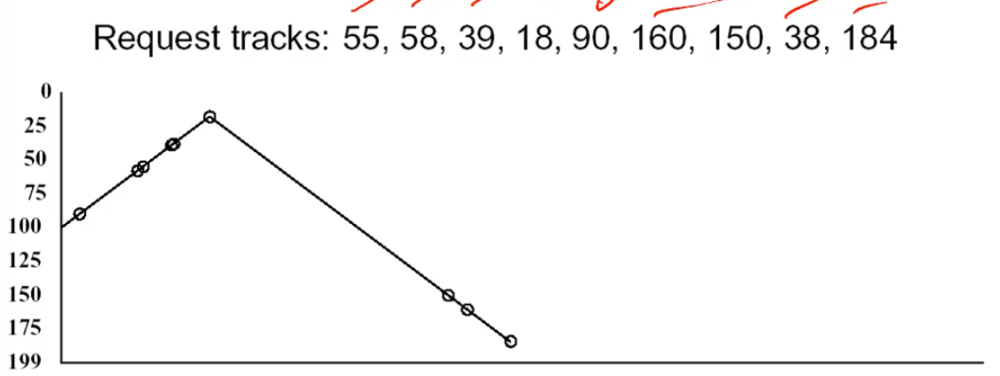

## File System Consistency
---

Alternatively, use a write-through cache

- All modified blocks are written immediately to disk
- Generates much more disk traffic
	- Temporary files written back 
	- Multiple updates not combined
- Used by DOS

Gave okay consistency when

- Floppies were removed from drives
- Users were constantly resetting (or crashing) their machines

it's still used, e.g. USB storage devices

## Disk Scheduler
---

the disk scheduler issues requests for blocks of memories and passes those up to the buffer section. 

the interface between here and the disk driver is VERY dependent on the specific disk. 

Managing this is important. a good placement of data on the disk and good request order makes a huge difference in performance.

The disk scheduler this must be aware of disk geometry to optimise itself. 

the left image is how it is actually layed out given geometry but the disk lies to us and gives us the right image to make it easier. Nower days all we usually are given is a logical sequence of blocks that spiral outwards that we can access. we make sure this is a spiral so a user can say "oh i'm moving from block 1 to 57 that is going to be slow lets move to block 2" and that be a correct conclusion. 

note that most of the modern hard drive increase in performance comes from a increase in information density. they spin about the same and the read and seek times are a bit better but because we can store 1000 times more info per mm the same amount of disk being read result in WAY more data. 

#### Estimate Access Time

note that b / N gives us the angle i.e how much disk needed to read to get b bytes of data and then we just divide this by our speed to get time

$$ T_s = seek time $$

the take away from this is if you calculated some values for randomly accessing like 1.2 mb and accessing 1.2 mb with good sequential access/scheduling you'd get one being 67ms and the other being 20s. huge difference. 

Note that dis performance is entirely dominated by Seek and Rotational Delays

Will only get worse as capacity increases much faster than increase in seek time and rotation speed

Note it has been easier to spin the disk faster than improve seek time. this Seek time dominates time use. 

so operating systems should minimise mechanical delays as much as possible

#### Disk Arm Scheduling Algorithms

lets look at a couple, note that here we assume the file system is issuing a stream of requests constantly so we have a list of outstanding request. there is no need for a scheduling algorithm if we only get 1 request at a time. 

**First in First out**

this won't starve, it's fair in choosing people, everyone get's a chance. 
it's good for few processes with clustered requests. it deteriorates to random if there are many processes. 

**Shortest Seek Time First**

Selects the request that minimises seek time, it looks for the closest request. 
this MAY lead to starvation though. 
way faster then FIFO

note how the graph ends half way where for FIFO it ended near the right of the screen, thats' because this is a FASTER algorithm. 

**Elevator Algorithm (SCAN)**

Move head in one direction, services requests in track order until it reaches the last track then reverses. 

Better then FIFO but usually worse then SSTF, avoids starvation but makes poor use of sequential reads (on down-scan as data is requested in the opposite direction - i.e we write a file 5 6 7 8 and if we are moving from 5 to 10 we can accept the new requests as we go. but if we are going 6 to 0 we go past 6 and the request for 7 hits but we have to go all the way to the other end before we go back and see it.)

inner tracks serviced more frequently than outer tracks. That's just because on average 1 traversal in either direction will pass through the middle, if you need to go to one of the extremes (the inner ring or outer most ring) you have to hit the other wall then come back. 

There is also modified elevator (Ciruclar SCAn or C-SCAN). Here we only read sectors in one direction, when we reach the last track we return back to the start (not reading) and restart. 

better locality on sequential reads, better use of read ahead cache (the disk itself will have some cache will aim to store sequential data so it can just give u shit u need), reduces max delay to read a particular sector as it's just seeking between runs rather then also reading. 

