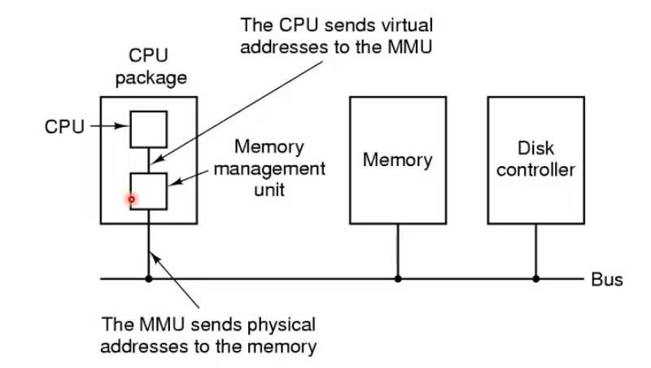
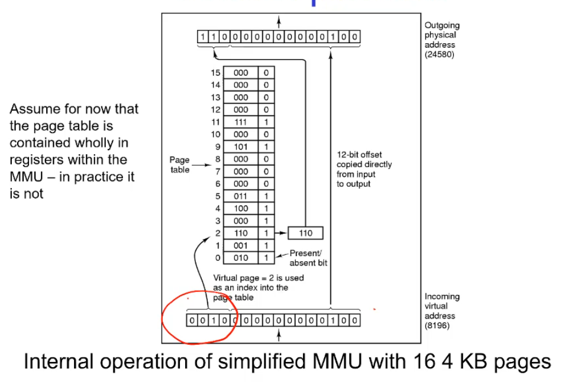
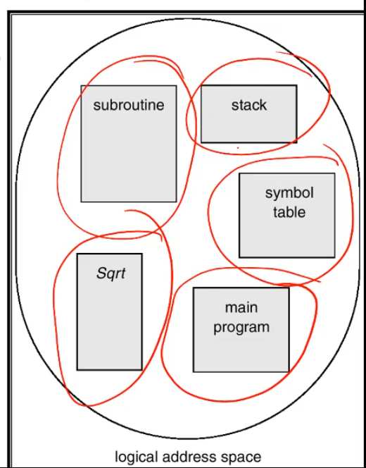
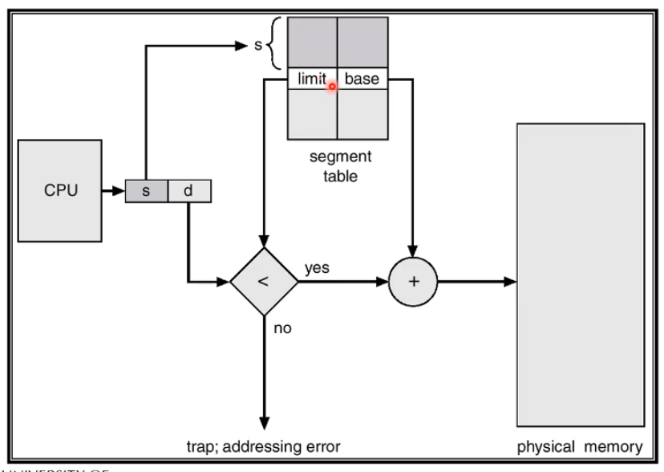
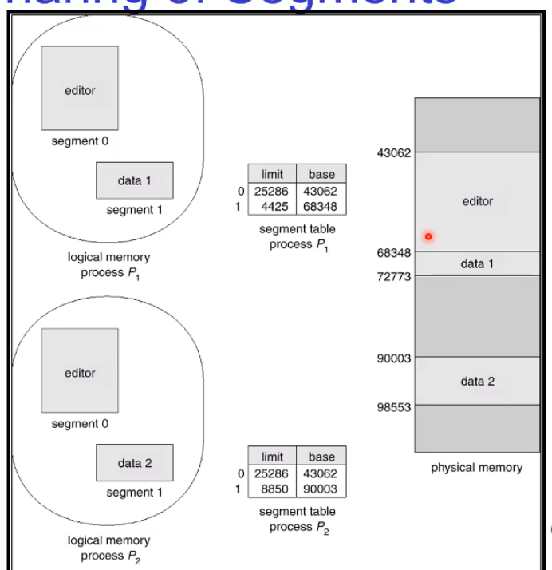
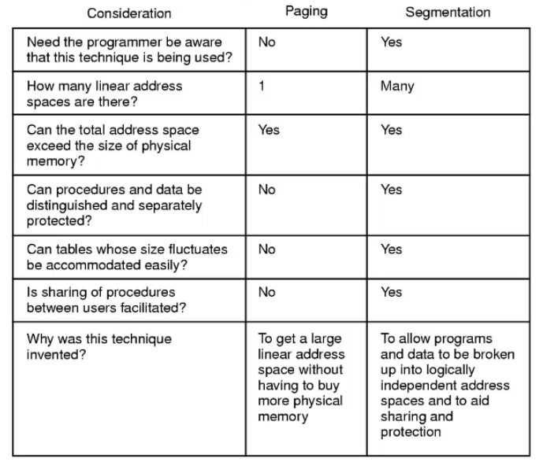
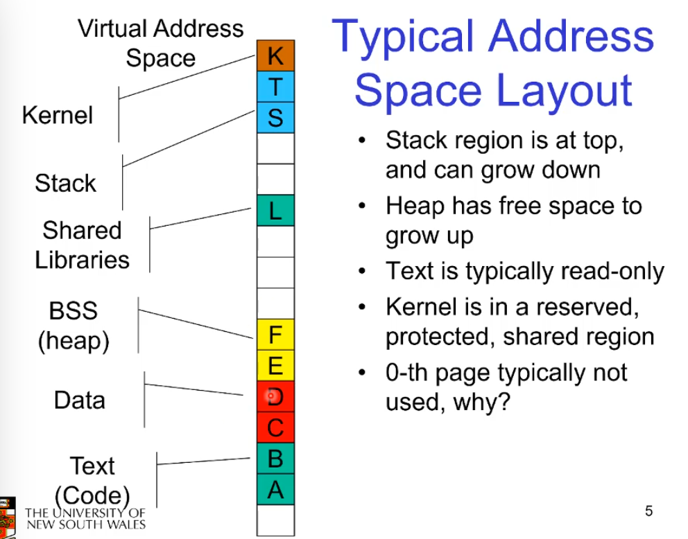

#### Memory Management Unit

Also called Translation Look-aside buffer - TLB

This is a bit of hardware to convert virtual memory into physical memory. This is because there is no way to do it in software as we need to know the physical hardware addresses. 

It works by taking in virtual addresses and converts it. 
The offset within the page (the lower 12 bits) goes right through. 
the first 4 bits which specify the page number is what is translated. 
Here these 4 bits are converted to 3 bits to have a 15 bit output. That's fine. 
The 4 bits specify the Virtual page number, this gets converted to a physical "
3 most significant bits" via the table and then pushed onto the offset. 

Note, 4 bits -> 16 virtual pages, 12 bits -> 4096 (i.e 4K page internal offset)

Note the present / absent bit which lets us know if a certain page was ever allocated. 

#### Segmentation

This wants to have a memory management scheme that supports a users view of memory. 

A program is a collection of segments, a segment is a locgical unit such as a main program, method, object, local variables, global variables. etc. 

Note that with this we have all the issues with external fragmentation due to each segment being a differently sized peice of memory. First find best find etc. are all relevent here

Logical addresses have two parts, the offset in a segment and the segement number. 

The segment number just refers to a netry in the segment table which maps a segment number to a base limit pair. 

the Segment-table base register (STBR) points to the segment tabels location in memory and the Segment table length register (STLR) does what you think. It is useful for checking that a segment number is legal as if it exceeds STLR it's invalid. 

we check for a valid segment and a valud offset. and if it works, add the offset and use physical memory thus allowing us to describe logical segments of memory. This is useful because every segment is now forbidden from doing a buffer overflow. Within the main logical segment you can't run off and hit a function's code because the moment you do you've left the segment and get a fault. 

With paging we don't split up user memory into logical sections like this so we are still prone to, and still do, buffer overflow all the time. 

This is also nicer because we can increase the segment relatively easily without having to create a new section of memory and copy over which is what page based memory does. This still might involve shuffling possibly but it's transparent to the programmer usually. 

note that each of the segment entries in the table can have assoicated read/write/execute privileges, i.e set the code to read only. 

Note that segmentation does let multiple processes access the same memory!

#### Segmentation vs Paging

Segmentation does require you to understand it for example programming on a segment machine had the concept of near and far pointers. near pointers are just offsets within the same segment whereas far pointers where offsets + segement numbers because they pointed to other segments. 

we can reuse memory so we can exceed physical memory with segmentation. 

note with paging you ~~can~~ share user functions but really you can share large blocks of code where segmentation actually lets you share speficic functions. 

# Virtual Memory - Detail

## Typical Address Space Layout and NULL Pointers
---

The 0th page (the bottom) is not used and actually set to fault if ever accedded because it is used to mark a `NULL POINTER`. If you ever dereference a NULL pointer you access this page and this page is always set to trigger a fault the moment something tried to access it. Thus segemntation fault! (the name comes from history, it's just a fault)

## Page Faults
---

#### Intro

A process may be only partially resident, that's fine, some virtual pages exist to the user but have no physical mapping. This allows the OS to save memory for infrequently used data and code by saving those ones on disk. 

If we try to access a virtual memory page that isn't on ram it triggers a `page fault` this triggers the OS to swoop in, it can see you are trying to get to a page in memory and will move B into physical memory, while it waits for I//O it'll switch into some other process to keep the CPU busy. When it comes back B is in physical memory and it returns to the application and the application is none the wiser. 

