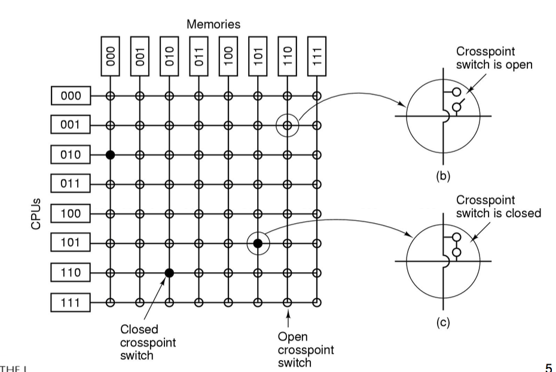
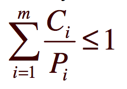
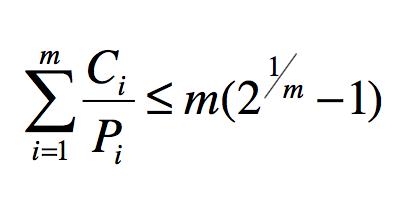

We also have to worry about Layering, We need general and specific handling fo multiple devices that layer ontop of one another, like swapping partitions and data on the same disk or having two mice. 

The concept of layering also allows to to set up priority where now we can priritise input coming from the keyboard, disk or network. 

#### Accessing I/O Controllers

There are 3 ways we can access I/O controllers

1. Seperate I/O and memory spaces, the I/O controller registers appear as I/O ports and can be accessed via special I/O instructions
2. Memmory-mapped I/O is where comtroller registers appear as normal memory we can access in normal ways
3. Hybrid, both of the above. (The AVR is a hybrid)

#### Bus Architectures

We can have a sinlgle bus where all accesses to the memory access it through 1 bus or we hcan have I/O have one bus to memory that's normal and have the CPU have anotehr direct connection that's faster with higher bandwidth. 

Interrupt Driven I/O Consumes a lot of processor time because every word read or written passes through the processor

Direct memory access lets you transfer from memory to device directly without the CPU mediating this. 

Done thorugh a DMA controller (Direct memory access controller). it does it automatically and then interrupts the cpu when it's done to let it know. THe processor just starts and handles the end of the transfer. This is great but do note that it can only copy contigious regions at a time although some hardware supports Scatter-gather. 

scatter/gather I/O, is a method of input and output by which a single procedure call sequentially reads data from multiple buffers and writes it to a single data stream

disk <-> DMA <-> MEMROY + CPU

## History of I/O
---

Processor -> device
Processor -> I/O module -> device (UART)
Processor -> I/O module -> device (interrupts back to processor)
Processor -> I/O module -> DMA -> device
I/O module now has a seperate processor. (SCSI controller executres SCSI program code out of main memory on it's own CPU. and interacts with the actual device. )
I/O Processor, now the I/o module has it's own local memory, internal bus etc. It's a mini computer such as Myrinet 10 gigabit NIC

Generally hardware is more specialised, and more functionality is being offloaded onto hardware to maximise CPU useage. Improved everage performance. 

# I/O Management Software

The I/O Software can be split into some layers

1. User-level
2. Device-independent OS software
3. Device Drivers  
4. INterrupt handlers
5. HArdware

## Interrupt Handler
---

Typically this handler runs in the context of the currently running process which is great cause no expencive context switch. 

Now usually what happens is once a program calls some I/O operation via a standard library a request is sent to the device and then the thread is put on sleep to let something else run untill the interrupt from the device is sent to let it be put back onto the "runnable" processes queue. Sometimes the cpu has to switch into the newly runnable process right away because the sceduling policy says so "this thread is high priority"

#### Sleeping in interrupts

So now we enforce that interrupts can't sleep or block. Obviouslt if i'm running process A and suddently a interrupt comes in and the CPU swtiches to run the interrupt handler, that could take ages if it's sleeping. This poor process A is not stopped from running because it happened to be there when ainterrupt happened. 

Also if a interrupt can block it usually can deadlock as well, the interrupt tries the grab a resources process A holds the lock to and bam dead lock. 

So we have some approaches to fix this. 

#### Top/Half Bottom Half

In this approach top half has the interrupts handles and those are super short they just handle it and end. 

The bottom half was supposed to deal with blocking operating / longer stuff etc. 

so a interrupt hits and the top half is run quickily, then if the bottom half was filled with some code it's run and then it finishes. the bottom half still runs "in the interrupt" but the bottom half can be interrupted itself by the top half if another interrupt comes in. Meaning that while one interrupt is being handled we don't just block forever, we can still handle more and add mroe stufff to do in the bottom half. 

NO BLOCKING!

#### Deffering Work on In-kernel Threads

Similar to Top/Half Bottom Half but we have a seperate worker thread to handle the bottom stuff, it's called the deferred work. can block!. 
The top half interrupt handler is still handled on the current process's stack. 

## Device Drivers
---

Device drivers job
– translate request through the device-independent standard interface (open, close, read, write) into appropriate sequence of commands (register manipulations) for the particular hardware
– Initialise the hardware at boot time, and shut it down cleanly at shutdown

once called the device can either complete and come back or asks the driver to block while it does something and interrupts the driver when it's done. 

Drivers are re-entrant (thread safe) as they can be called by another procss while handling another process, they handle mainly no global non constant data. 

## Device independent I/O Software
---

This is the stuff that is common between drivers of similar classes stuff like buffer or buffer-cache management, managing access to dedicated devices and erro reporting are all the same code so the os provides this. 

## Driver and kernel interface
---

We need a uniform device interface so device code can change as long as the interface is consistent and also means different devices can be used the same way and don't need the kernel to be re written to accomidate. 

We also need a uniform kernel interface that device interfaces can use so devices get access to kernel services like kmalloc, install IRQ handler etc and the kernel can change over time too. 

## Buffering
---

4 types
1. no buffer, device to user
    - every call can only grab 1 byte/word at a time and this this is slow and has a lot of overhead. each I/O is sent waited on to finish before contuing. 
    - Many shorr runs of a process is inefficient and it has poor CPU cache termoral locality
2. buffering in user space
    - pree nice, a buffer is filled up in 1 block. 
    - There is a isue with the biffer being paged out to disk and needing to be paged back in, in that time the device (possibly a network card) could drop packets. 
    - you can't lock a buffer in memory because now one process can lock all of their pages and a shared server is fucked. 
    - Plus now if your doing writes you want to send the write request then keep going in your code and let the write happen in the background. But remember the buffer is in user space so while that write is happening the user can't use the buffer! THis means now you have to manage this and the user has to keep track and wait for a interrupt and it's messy. 
3. single buffering in the kernel followed by copying to user space
    - This is nicely block oriented
    - a block can be copied into the user buffer and then the kernel buffer can be written in, allows us to read ahead and user can process one block of data while the next one is being read into the kernel. 
    - speed increase for a I/O request is (T+C)/(max(T,C)+M) where T is transfer time for a block from device, C is computation time to process incoming block and M is time to copy kernel buffer to user buffer. 
    - Here C is 0 cause no buffering cost and M is single buffer cost.
    - Do note that if the kernel buffer is full the uder buffer needs to be swapped out but if the application is slow to process previous buffer we lose info. 
4. Double buffering in kernel
    - Here a process can transfer data to or from one buffer while the operating system empties or fills the other buffer. 
    - DEVICE -> BUF 1 | Buf 2 <-> usr buff
    - once buf 2 is empty swap the two buffers roles. 
    - Computation and transfer can be done in paralell
    - (T+C)/max(T,C+M) usually M is much less then T giving us a favourable result. 
    - note we say C+M because the cost to process the buffer and then copy it into a kernel buffer are done by the same CPU in the kernel. You can just group them together into one funciton
5. Now dobule buffering is usally enough unelss we are doing super heavy stuff where long periods of computation kick in between each writes but there are still a lot of writes. this is when Circular buffers come in
    - More then 2 buffers are used, and each individual buffer is one unit in a circular buffer. 
    - all N of these buffers just keep filling and emptying like a water wheel. 

note these are all Bounded-Buffer Producer-Consumer
Problems

Note that buffering isn't always good, if M is larger then T+C then buffering sucks, it's quicker to make a request and get the data because of how quick the transfer is then to bother with the buffer overhead. 

Most network stuff does DMA which is better then buffering. So unix actually programmed a syscall which skips buffers and goes from user straight to the network controller. 

Buffering also can increase latency. (the time taken from the transfer to start)

# Multiprocessor Systems

We can use more then one CPu to improve performance because the increase in individual CPU speed is slow. Note this assumes workload can be parallelised and the workload is not I/O-bound or memory-bound as in these cases pumping up CPU speed means nothing. 

Amdahls law:
Given a proportion P of a program that can be made parallel, and the remaining serial(non paralell) portion (1-P), speedup by using N processors is given by:
1/((1 − P ) + (P/N))

That is to say that we get a a higher speed up the closer N is to infinity to a maximum of N = infinity, P/N = 0 1/(1-P) = 1/0.5 = 2
this assumes we can split up 50% of the workload to be parralell. 

## Types of multiprocessors
---

UMA: Uniform Memory Access : Access to all memory occurs at the same speed for all processors.
NUMA: individual processors can have different access speeds for different memorys

## UMA
---

Bus Based UMA is just multiple cpu's connected to the same bus that can access the same Memory + can also have their own private memory + a local cache.
Here we still have a bottleneck with the bus. 

note harware handles Cache Consistency where multiple CPU's need to have the same chache or if one CPU updates a certain peice of memory that memories copy in all the CPU's caches is cleared. I.e if CPU A grabs memory X and stores it and then CPU B updates it, CPU A may go on in it's code assuming that X is still the correct peice of memory. And we really like chaching, it's fast. 

Of course handling cache consistency also uses bus bandwidth whoops. 
Note the CPU private memory is good so private data is off the shared bus but doesn't solve the bus issue. also it complicates application development. We have to partition between private and shared variables. 

Note a multi-core processor has one connection to the bus but internally has multiple CPU Cores and Caches that interact with a Bus interface (and another level of caches that cores share) which lets the cores interact with the bus. Here the interface handles the issues. 

## UMA Crossbar Switch
---

this is trying to avoid using the bus heavily. 

Here each CPU has a individual bus to each memory section. we close the connection for cpu 5 to get to memory block 5 and now it has access then we switch it off and switch it to the next one. 
This handles bus a lot better BUT assumes that all cpu's arn't using the same bit of memory and there is a reasonable distrubtion. 

Also note this doesn't scale too well, 100CPU's need 1000^2 Switches. 

## OS Design with Multiprocessing
---

#### CPU local OS

This is one solution where each CPU statically gets a cut of main memory which it sues to run it's own OS. All these OS's can share peripherals but handles it's own system calls. 

These are similar to implement, avoids concurrency issues and scales as there are no shared serial sections. It's still around in a way as virtualisation in the cloud basicallt does a similar thing. 

Of course each processor has it's own sceduling queue so we can have one processor overloaded while the other chill. 
Each processor has it's own memory parition, again one can me thrashing and the others are chilling, we can't give memory to the struggling cpu it's statically given. 
Also what if they share a disk and have independent caches!?

this was shitty and mostly used to get multiprocessing up and running. 

#### Master Slave Multiprocessors.

Os mostly runs ona single fixed XPU, all OS tables, queues buffers etc. are manipulated here. 

SUer level apps run on other CPUs and CPU1 if there is spare CPUT time. 

All system calls are passed to CPU 1 for processing and CPU 1 translates the result back to the user programs. 

Takes very little synchronisiation as only 1 CPU accesses most of the kernel data and is simple to impement. THe master makes sure all processors are busy and the OS controls all memory and can make sure it's allocated as needed so small and large processes can run side by side. 

THis has the issue of the master CPU becoming a bottleneck and can't handle all the requests coming in because they are computation heavy 
and also Cross CPU traffic is slow. If one CPU 2 asks for memory X and CPU 1 the master caches it that's all G. But now when CPU 3 wants memory X it can't grab it from a local cache it needs to go to the OS first and then come back. 

#### Symmetric Multiprocessors (SMP)

OS kernels runs on all processors and the load and recourses are balanced between all of these including kernel execution. 

Now there is REAL concurrency in the kernel so we need heavy synchronisation everywhere.

We can use a single mutex that makes the entire keren a large critical section but this is basically the master salve thing with better chache locality. THe lock still becomes a bottleneck when in-kernel processing exceeds what can be done on a single CPU. 

Instead we idenify largely independent parts of the kernel and make each of them their own critical section and allows more parallelism. I.e CPU 2 can be doing some file system stuff while CPU 1 is handling a sceduling thing. 
This is very difficult and splitting up code into sections that don't interfere with each other is wild. 

If you have multiple critical regions and some kernel activity requires multiple then we start getting deadlocks easily. 

Early 1990’s, CSE wanted to run 80 X-Terminals off one or more server machines
too many students tried to access the VM and the VM had locks assoicated with it and CPU's ended up waiting for those locks to be released. THus adding more CPU's didn't help make the servers go any faster/work better. 

## Multiprocessor Synchronisation
---

How can we sync these processors now that disabling interrupts doesn't work. 
This recures hardware support. 
Remember the Test and Set. hardware enforced this would be atomic. 

Now this doesn't exactly work anymore because CPU 1 running a TSL command has to read a 0 from the memory, test it and then write a 1 back into memory to signal that it holds it. But the other cpu can interfere as TSL is atomic within the CPU but memory is still shared. (transactions on the bus are not atomic)

Here we used to use a lock on the bus itself. While the bus is locked though nobody else can use it! all CPU's slow down. 

Note test and set is a busy-wait thing a spinlock. it constantly spins being busy checking if the lock is free every now and then. If so, IT'S DOING A LOT OF TSL COMMANDS TO CHECK and everytime it does the bus locks. it can't read it and let anyone else edit it at the same time. 

caching doesn't help this, if one CPU is spinning checking the lock and we cache the current state of the lock so it's not doing a TSL that's fine. But if we have 3 cpu's spinning we don't copy this 1 to all 3 because it could have changed/that's difficult to maintain. We actually recheck each time and cache it in the most recent cpu that asked. so you see the issues 1 asks then 2 then 3 then 2 then 1 then 2 then 3. 

Caching only works if only one cpu asks , gets it cahched and then in the next check still is the only one so it can use it's cached version. If between those two checks another CPu asks it gets given the cached version and the previous one clears. 

#### Reducing Bus Contention 

We can read before we do the actual TSL. so we don't lock the bus each spinlock cycle. We can set it up so lock is shared read-only in all chaches until its released. no race conditions as acquisition still uses TSL. 

When a new CPU gets the lock it updates all the cache. This was alludated above but avoided at first for the complexity. This is faster though. 

Results in a study show that as the number of processors goes up we get issesu cause of test and sets locking of the bus. it begins by being all good and "YES MORE PROCESSORS MORE SPEED" but then it gets way worse to the point where using 13 processes is as good as using 1 cause of all the issues. 
So we use the read and test and set version (test and test and set) and that works way better but not ideal, it starts to lost any speed benift after 5 processors as well. this is the contention on lock that happens with CPUs notice a release and all attempt acquisition.
Also cirtical section performance degrades as a lock holder competes with CPU's that missed as they test and set causing the lock holder ot be slower which means the CPU's are spinning for longer etc. 

#### Other hardware provided SMP Sync Primitives

Atomic Add/Subtract for semaphores
Exchange -> atomic swap of two values from a local var and memory (test and list)
compare and exchange -> check the value in memory, if it matches what we want then replace it, if it doesn't set another variable to let me know. (lets us buidl linked list!)
Load linked; Store conditional -> two seperate instructions. one loads a value and then watches it, when you then store it checks that no interrupts happens (ccould be a context switch) and that no chache stuff happened. If the value has changed the store fails and you try again. 

#### MCS Locks (Mellor-Crummey-Scott)

Each CPU has it's own private lock variable and puts it into a queue and spins on it, no contention. 

On lock release the releaser unlocks the next lock in the queue. only the real lock has bus contention and there is no starvation, order of lock acqusion is defined by the list so everyone gets a turn. 

This requires compare and swap and exchange (also known as fetch and store) to build the linked list without fucking up. 

so if B C D all want lock 1, which A is holding A holds it and B C D has a fake lock it spins on. When A releases it updates B's fake lock so it grabs the now free lock and then this continues. We build a linked list of processes wanting the lock. 

Queue locks scale well but have higher overhead
Spin Locks have low overhead but don’t scale well

#### Do we Spin or do we Switch

if we block and switch to another process this takes time and then we have to swtich back once the lock is free but also spinning just wastes CPU time. 

There is a tradeoff, if the lock is held for a short amount of time it's more efficient to spin. So spinlocks expect critical sections to be short. If it's longer use blocks. 

note that preemption is when a process is about to release the lock but gets' switched out and stops being run which causes all other CPU's to wait. for this reason Spinlock implementations disable interrupts in addition to acquiring the lock to avoid lock-holder preemption. 

## Multiprocessor Scheduling
---

Given X processes/threads and Y CPUs how do we allocate. 

#### Single Shared Ready Queue
When a CPu goes idle it takes the highes tpriority process from the shared queue. it's simple and has automatic load balancing because as soon as a cpu it free it's given a new task. 

Lock contention on the ready queue can be a major bottleneck as many CPU's schedule a new process to this queue (which must be locked) and they can do this often. 

Furthermore not all CPUs are equal, the last CPU a process ran on is likely to have more releated entries on the cache so moving it to the first available CPU rather then the one it was running on before it blocked is better. 

#### Affinity Scheduling

try to have processes run on the CPU's they ran on last time. 

We can do this with Two Level Scheduling, each CPU has it's own ready queue. Top level algoruthm assigns processes to CPUs and defines their affinity and roughly balances the load. 

The bottom level scheduler is the frequently invoked one i.e for blocking on I/O or exausting a time slice the common reasons to bock. And this runs on each CPU and selects from it's own ready queue. ensures affinity. 
If nothing is available then it runs runs a program from anotehr CPU's ready queue. 

– No lock contention on per-CPU ready queues in the (hopefully) common case
– Load balancing to avoid idle queues
– Automatic affinity to a single CPU for more cache friendly behaviour

# Scheduling

The scheduler decides who to run next wheter it be between processes, jobs or users. 

It's not always important, simple PCs that only run a word processor, or Simple embedded Systems like a washing machine. having a good fair scehduling system isn't that important. 

It is important for multitasking. 

you wanna process an email which takes 2 seconds and you also just clicked on a button. 

running the button code first then the email code is way better then the other way around cause the button not responding for 2 seconds is WAY more noticable. 

#### Application Behavior

lets say we have two behaviors. One with long CPU bursts split up by I/O and another with short CPU burts and a lot of I/O. first one is CPU bound the second one is I/O bound. 

Choosing to run an I/O-bound process delays a CPU-bound process by very little
Choosing to run a CPU-bound process prior to an I/O-bound process delays the next I/O request significantly. 
Just think, we start a CPU bound process and it processes for 60 seconds before giving up. we start a I/O proces and it proceeses for like 2 seconds before sending off another I/O request and thus blocking. 

generally we favour I/O bound over CPU-Bound. 

#### When does the scheduler kick in

everytime a new process is created (run the parent or the child?)
a process exits (who runs next)
a processs blocks (if it is a lock block does the lock holder go next)
a interrupt occurs (do we switch to the process that got interrupted so it handl handle this first)

#### Non preemtive schedling

once running we let a process run until it blocks, ends or yeilds

#### Preemtpvie scheduling

thread can be pushed into the ready state after a timer interrupt. processes get time slices. Can also be interrupted because of a higher priority process that was waiting on a interrupt which just came in. 

Ensures fairer service as 1 thread can't monopolise the system but this requires a timer interrupt. 

#### Catagories

1. Batch systems: no users directly waiting, so we can optimise for overall machine performance
2. interactive systems: users directly waiting for their results so we optimise for users perceived performance
3. realtime systems: jobs have deadlines so jobs are scheduled to meet those deadlines

#### General goals

All algorithms should be fair, enforce the policy consistenty and balance the workload to keep all systems busy. 

#### Interactive

Here we want to minimise response time, and provide proportionality which is the user expectation that short jobs will have a short response time and longer jobs can have a longer one. Generally we can get away with sceduling longer processes later because this is expected whereas shorter jobs should be sceduled first. 

Round Robin is ever process gets a time slice. when one process reaches the end of it's time slice it gets put at the end of the queue. 
All it needs is a ready queue and a timer interrupt. 

now how long should this be though? a too short time slice means too much switching and overhead but too long and the system isn't responsive enough, 100ms timeslice means that 10 people can press enter but the 10th guy only sees it progress after a second. If the timeslice is longer the burst length we get first come first served. i.e if the timeslice is so long every program just ends before the time slices finishes, then all we are doing is running programs in order. lmao. 

To improve this we can added priorities which can be defined internally dependong on if the software is tagged as I/O or computer bounded or externally based on a priority the user sets. 

forms a triangle as it jumps from lower priority to higer ones untill the higest one is completed and then drops down finishing all the partially completed lower levels. we usuallt have multiple priority specific round robin queues. 
This does mean low priorities can starve, you need to adapt the priorities periodically and shove up the priority of aged processes. 

A tradtional UNIX Sceduler has two levels. High level sceduler schedules processes between memory and disk and the lower level one scedules CPU access. It's based on a multi level queue structure, priorities basically. Here Kernel processes are higher then any user ones. 

priorties are recalculated once per second. This penalises CPU bound threads btw, priority = CPU + nice + base. higher priorities mean you can picked later, i.e -4 is the first one to be picked. 
CPU is number of clock ticks a process has taken, everytime the priorities are recalcuated if a process is still running it gets a number added. This means I/O jobs that arn't running much get moved up while CPU bound ones get moved down. 
Of course this value does degrade over time so we don't permently starve these processes. 
Base is a set of hardwired negative values used to boost prirotiy of I/O bound system activites like swaper, disk I/O character I/O etc. 
nice is the value the user sets. 

#### Real Time

deadlines must be met, for example a aircraft control system has a deadline to apply brakes SO YOU CAN'T MISS THIS BRO. 
for this reason these algorithms provide predictability, for some appliactions like a DVD deoder we can miss sometimes aws long as generally the playback is smooth. 

Here we attempt to control events to react to events in the real world, these real world events happen in real time and processing must keep up. But this also means that processing must happen not too late OR too early. 

a real time system (RTS) accepts an activity A and guarantees it's requested timed behavior B if and only if the RTA finds a scedule that fits in. I.e finds a schedule that ensures all the behavior works in time with the already accepted scedules and can be enforced. 

Otherwise it rejects. basically if it can't ensure it'll run correctly it doesn't even attempt to. 

This is stuff like labratory experiments, robotics, air traffic control, controlling cars, trains, planes, telecommunications, medical support, multi media etc. 

Note that a plane will have a hard real time requirmenets where as some like multi media may have soft ones where some leeway is ok as long as it meet sthe deadline in 99.99% of cases. Hard stuff is jet engines reacting to side winds and a airbag system. soft stuff is multimedia where 100 frames can be dropped a day, car gps navigation can have 5 late announcements per week and a washing machine can run 20 sec over time every 10 runs or 50 seconds late every 100 runs. 

RTS systems are not necessarily fast they are just predictable. 

How does is scedule? it needs to now a priori (properties of the scedule)

This is earliest arrival time (when the task will arrive), maximum execution time and the deadline. 

Now we can do either periodic scheduling where each task is repeated at a regular interval and max executun time is the same as the period time. Arrival time is usually the start of the period and the deadline is the end. 
Simple. 

We can also do aperiodic, each task can arrive at any time and may have a minimum inter-arrival time. (time between arrivals)

Statis table driven scheiduling is we just have a list of tasks and their propeties and we precompute a schedule offline. used for periodic task sets but requires the entire schedule to be recomputed if we need to change the task set. 

Static priority driven scheduling is given a set of tasks and their properties each task is assigned a fixed priority.
A preemptive priority driven scheduler used in conjuction with the assigned priorites basically. Used for periodic sets. 

Dynamic scheduling is when a task arrived prior to execution and the sceduler determins whether the new task can be admitted. THis can handle boht periodic and aperiodic. 

for periodic systems given m periodic events, event i occurs within period Pi and requires Ci seconds. 

The load can only be handles if the sum off all time / the total period time doesn't exceed 1. I.e we don't have 40 secnds of work to do in 30 seconds of allowed time. 

We can use Rate monotonic Scheduling where priorites are assigned based on the period of each task, the shorter the period the higher the priority. 
Or we can use earliest deadline first scheduling where we pick the next deadline with the cloest deadline i.e the uni student doing assignments algorithm. 

note that RMS is only guaranteed to work if the CPU itilisation is not too high, for 3 rasks CPU itilisation must be less then 0.780 otherwise taking a bunch of shorter prioirty tasks and lining them up can still end up starting one too late to miss it's deadline. 

EDF (uni student algo) always works for any schedulable set of tasks up to 100% CPU itilisation. but RMS works just as good and is way easier to implement as long as CPU itilisation is low which it is a lot of the time as we have a saftey factor in estimatiinf execution times. 

